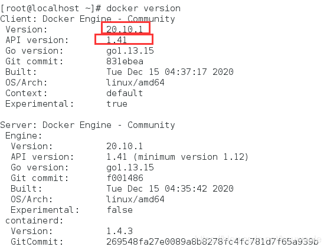

## 1. 环境
- linux版本：CentOS Linux release 7.3.1611 (Core)
- 网络畅通（能访问百度即可）

## 2. 卸载旧版本的docker
```bash
yum remove docker \
           docker-client \
           docker-client-latest \
           docker-common \
           docker-latest \
           docker-latest-logrotate \
           docker-logrotate \
           docker-engine
```

## 3. 安装gcc
```bash
# 查看gcc版本
gcc -v

# 安装gcc
yum -y install gcc
yum -y install gcc-c++
```

## 4. 安装yum-utils软件包
```bash
yum install -y yum-utils
```

## 5. 设置稳定的存储库
- 推荐使用阿里云的镜像库
```bash
yum-config-manager \
    --add-repo \
    https://mirrors.aliyun.com/docker-ce/linux/centos/docker-ce.repo
```

## 6. 更新yum软件包索引
```bash
yum makecache fast
```

## 7. 安装最新版本的Docker Engine和容器
```bash
yum -y install docker-ce docker-ce-cli containerd.io
```

## 8. 启动Docker
```bash
#启动Docker
systemctl start docker

#查看docker版本信息
docker version

#测试helloworld
docker run hello-world

#查看镜像
docker images
```
  

## 9. 配置镜像加速
```bash
mkdir -p /etc/docker
vim /etc/docker/daemon.json

#添加自己的镜像加速器地址(json)，注册一个阿里云账号即可拥有
{
  "registry-mirrors": ["https://自己的编码.mirror.aliyuncs.com"]
}

systemctl daemon-reload
systemctl restart docker

ps -ef | grep docker
```

## 10. 卸载docker
```bash
systemctl stop docker
yum -y docker-ce docker-ce-cli containerd.io
rm -rf /var/lib/docker
```


- docker官方文档：https://docs.docker.com/engine/install/centos/
- 阿里云官网：https://cn.aliyun.com/
