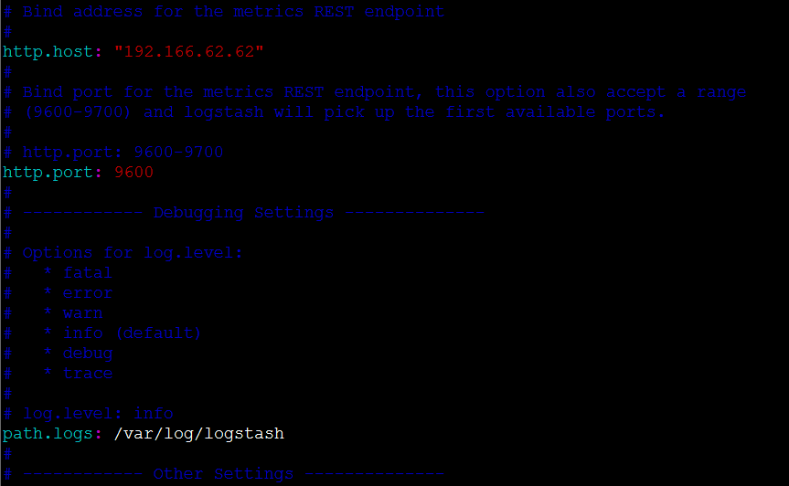
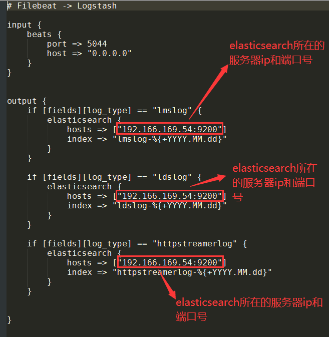
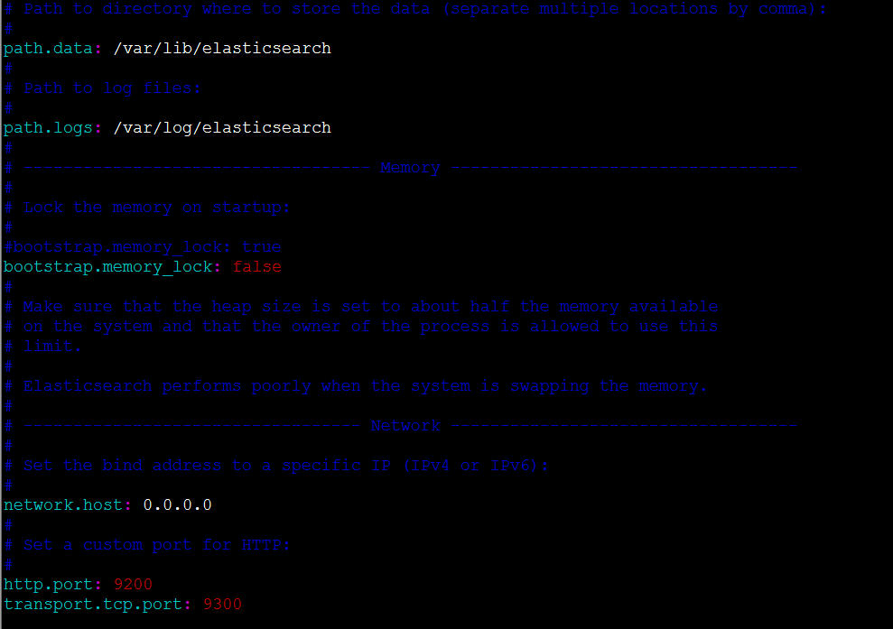
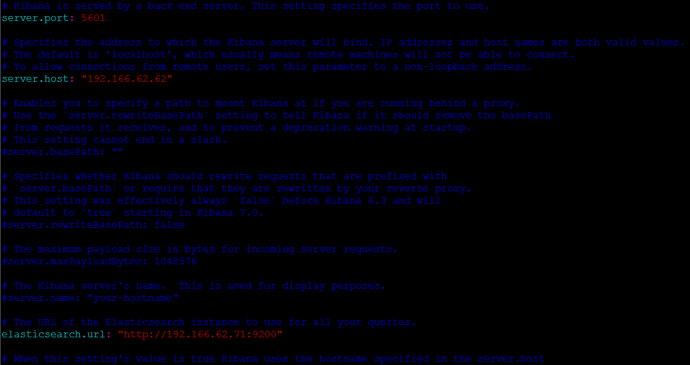
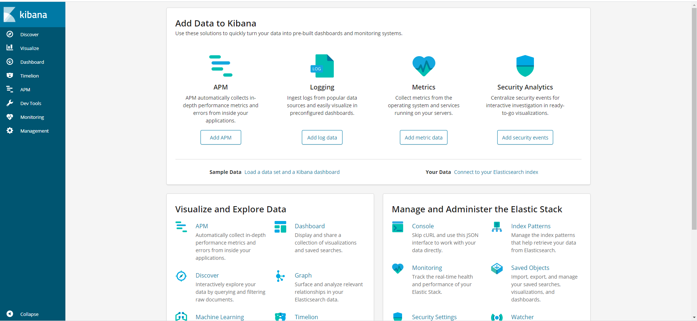
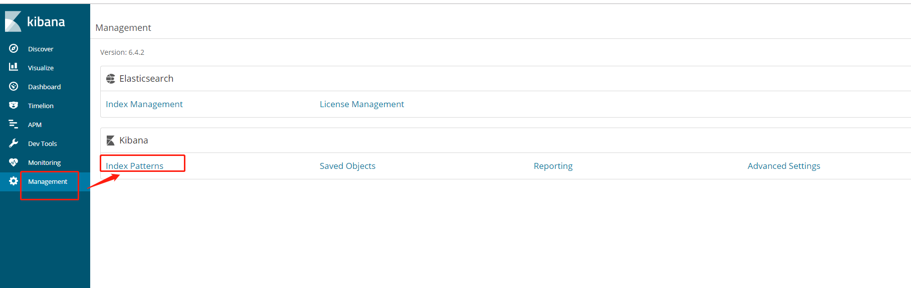
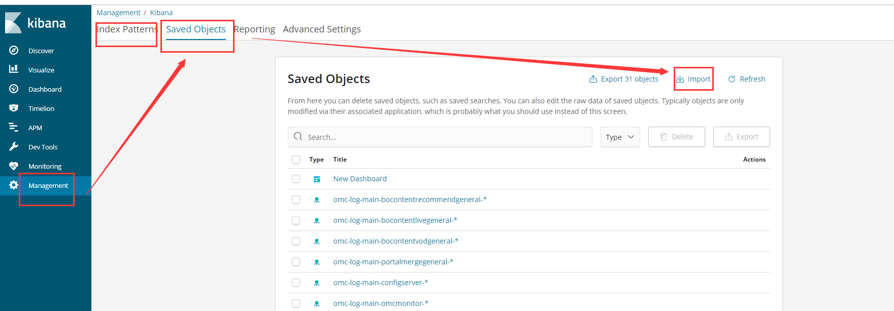
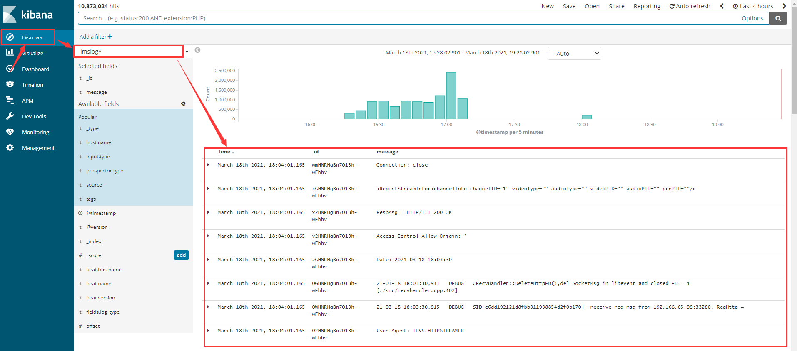

## ELK：CentOS7下部署ELK获取CDN日志

### 1.环境
名称 | 版本
--- | ---
JDK | jdk-8u144-linux-x64.tar.gz
Filebeat | filebeat-6.4.2-x86_64.rpm
Logstash | logstash-6.4.2.rpm
Elasticsearch | elasticsearch-6.4.2.rpm
Elasticsearch | elasticsearch-analysis-ik-6.4.2.zip
Elasticsearch | elasticsearch-analysis-pinyin-6.4.2.zip
Elasticsearch | elasticsearch-analysis-stconvert-6.4.2.zip
Kibana | kibana-6.4.2-x86_64.rpm


关闭防火墙
```bash
#查看防火墙状态
service firewalld status

#关闭防火墙
systemctl disable firewalld
```

### 2.安装JDK
- 查看是否已安装jdk
```bash
java -version
```

- 以root用户登录服务器
- 创建jdk安装目录
```bash
mkdir /usr/java
```

- 通过SSH或XFTP等工具将JDK安装包jdk-8u144-linux-x64.tar.gz上传至服务器的/usr/java目录下。
- 进入JDK安装包的目录
```bash
cd /usr/java
tar -zxvf jdk-8u144-linux-x64.tar.gz
vi /etc/profile
```

- 修改/etc/profile文件（按“i”进入编辑模式，编辑完成后按“ESC”退出编辑模式，按“:wq”保存）
在/etc/profile文件末尾添加以下内容：
```bash
#set java environment
JAVA_HOME=/usr/java/jdk1.8.0_144
JRE_HOME=/usr/java/jdk1.8.0_144/jre
CLASSPATH=$JAVA_HOME/jre/lib/ext:$JAVA_HOME/lib/tools.jar
PATH=$JAVA_HOME/bin:$PATH
export JAVA_HOME CLASSPATH PATH
```

- 重载使profile文件配置生效
```bash
source /etc/profile
```

- 验证JDK安装环境
```bash
java -version
```

### 3.安装Filebeat
**注意：Filebeat 需要安装在CDN对应模块所在的服务器上。**
- 以root用户登录linux服务器
- 通过xftp工具上传filebeat-6.4.2-x86_64.rpm到服务器，执行下列命令安装：
```bash
rpm -Uvh filebeat-6.4.2-x86_64.rpm
```

- 执行下列命令使得metricbeat开机自动启动
```bash
chkconfig filebeat on
```

- 编辑filebeat.yml文件，命令如下：

  ```yml
  filebeat inputs:
  #lmslog
  - type: log
    enabled: true
    paths:
      #CDN中LMS模块日志存放路径（注意最后的 *.log.*）
      - /usr/local/ipvs_huashu/lms/log/*.log.*
    fields:
      log_type: lmslog

  #ldslog
  - type: log
    enabled: true
    paths:
      #CDN中LDS模块日志存放的路径（注意最后的 *.log.*）
      - /usr/local/ipvs_huashu/lds/log/*.log.*
    fields:
      log_type: ldslog

  #httpstreamerlog
  - type: log
    enabled: true
    paths:
      - /usr/local/ipvs_huashu/httpstreamerlog

  output.logstash:
    #logstash所在服务器的ip地址
    hosts: ["192.166.169.54:5044"]
  ```

- 执行下列命令启动filebeat，命令如下：
```bash
service filebeat start
```

### 4. 安装Logstash
- 以root用户登录linux服务器
- 通过xftp工具上传logstash-6.4.2.rpm到服务器，执行下列命令安装
```bash
rpm -Uvh logstash-6.4.2.rpm
```

- 执行下列命令使得logstash开机自动启动
```bash
chkconfig logstash on
```

- 编辑logstash.yml文件，命令如下：
```bash
vi /etc/logstash/logstash.yml
```
- 内容如下：

  

- 编辑 filebeat-cdn-to-logstash.conf 文件，命令如下：
```bash
vi /etc/logstash/conf.d/filebeat-cdn-to-logstash.conf
```
- 内容如图所示：

  

- 执行下列命令启动logstash，命令如下：
```bash
service logstash start
```

### 5. 安装Elasticsearch
- 以root用户登录linux服务器
- 通过xftp工具上传elasticsearch-6.4.2.rpm到服务器，执行下列命令安装
```bash
rpm -Uvh elasticsearch-6.4.2.rpm
```
- 执行下列命令使得elasticsearch开机自动启动
```bash
chkconfig elasticsearch on
```

- 修改/etc/sysctl.conf文件，命令如下：
```bash
vi /etc/sysctl.conf
```
- 添加到文件末尾：
```bash
vm.max_map_count=655360
```
- 让修改立刻生效，命令如下：
```bash
sudo sysctl -p
```
- 修改/etc/security/limits.conf文件，命令如下：
```bash
vim /etc/security/limits.conf
```
- 添加到文件末尾：
```conf
* soft nofile 65536
* hard nofile 131072
* soft nproc 2048
* hard nproc 4096
```

- 编辑elasticsearch.yml文件，命令如下：
```bash
vi /etc/elasticsearch/elasticsearch.yml
```
- 内容如下：

  

- 执行下列命令启动elasticsearch，命令如下：
```bash
service elasticsearch start
```

- 重新新打开一个窗口，通过root用户访问“curl 'http://自己配置的IP地址:9200/'”;

- 安装相关插件
  - 在/usr/share/elasticsearch/plugins下分别创建目录ik，pinyin， stconvert，将zip格式的插件文件解压后放到相应的目录中：
    - elasticsearch-analysis-ik-6.4.2.zip的解压文件放在目录ik下
    ```bash
    #root用户登录服务器，然后执行
    cd /usr/share/elasticsearch/plugins
    mkdir pinyin
    unzip elasticsearch-analysis-pinyin-6.4.2.zip
    ```
    - elasticsearch-analysis-pinyin-6.4.2.zip的解压文件放在目录pinyin下
    - elasticsearch-analysis-stconvert-6.4.2.zip的解压文件放在目录stconvert下
  - 然后运行命令service elasticsearch restart来重启搜索引擎
  - 运行命令/usr/share/elasticsearch/bin/elasticsearch-plugin list可以查看已经安装的插件

如果出现找不到正确的java版本的相关错误信息时，则在/etc/sysconfig/elasticsearch文件中修改相关内容为：JAVA_HOME=/usr/java/jdk1.8.0_144

### 6. 安装Kibana
- 以root用户登录linux服务器
- 通过xftp工具上传kibana-6.4.2-x86_64.rpm到服务器，执行下列命令安装
```bash
rpm -Uvh kibana-6.4.2-x86_64.rpm
```
- 执行下列命令使得kibana开机自动启动
```bash
chkconfig kibana on
```
- 编辑kibana.yml文件，命令如下：
```bash
vi /etc/kibana/kibana.yml
```
- 内容如下所示：

  

- 执行下列命令启动kibana，命令如下：
```bash
service kibana start
```

- 在浏览器访问“http://自己配置的IP地址:5601/”

  

- 打开Management-->Index Patterns,如下图：

  

- 选择Management_Index_Patterns.json文件导入；如下图所示：
  

- Management_Index_Patterns.json 内容如下：
```json
[
  {
    "_id": "92aa6da0-87c2-11eb-a763-798307de3e3c",
    "_type": "index-pattern",
    "_source": {
      "title": "ldslog*",
      "timeFieldName": "@timestamp",
      "fields": "[{\"name\":\"@timestamp\",\"type\":\"date\",\"count\":0,\"scripted\":false,\"searchable\":true,\"aggregatable\":true,\"readFromDocValues\":true},{\"name\":\"@version\",\"type\":\"string\",\"count\":0,\"scripted\":false,\"searchable\":true,\"aggregatable\":false,\"readFromDocValues\":false},{\"name\":\"@version.keyword\",\"type\":\"string\",\"count\":0,\"scripted\":false,\"searchable\":true,\"aggregatable\":true,\"readFromDocValues\":true},{\"name\":\"_id\",\"type\":\"string\",\"count\":0,\"scripted\":false,\"searchable\":true,\"aggregatable\":true,\"readFromDocValues\":false},{\"name\":\"_index\",\"type\":\"string\",\"count\":0,\"scripted\":false,\"searchable\":true,\"aggregatable\":true,\"readFromDocValues\":false},{\"name\":\"_score\",\"type\":\"number\",\"count\":0,\"scripted\":false,\"searchable\":false,\"aggregatable\":false,\"readFromDocValues\":false},{\"name\":\"_source\",\"type\":\"_source\",\"count\":0,\"scripted\":false,\"searchable\":false,\"aggregatable\":false,\"readFromDocValues\":false},{\"name\":\"_type\",\"type\":\"string\",\"count\":0,\"scripted\":false,\"searchable\":true,\"aggregatable\":true,\"readFromDocValues\":false},{\"name\":\"beat.hostname\",\"type\":\"string\",\"count\":0,\"scripted\":false,\"searchable\":true,\"aggregatable\":false,\"readFromDocValues\":false},{\"name\":\"beat.hostname.keyword\",\"type\":\"string\",\"count\":0,\"scripted\":false,\"searchable\":true,\"aggregatable\":true,\"readFromDocValues\":true},{\"name\":\"beat.name\",\"type\":\"string\",\"count\":0,\"scripted\":false,\"searchable\":true,\"aggregatable\":false,\"readFromDocValues\":false},{\"name\":\"beat.name.keyword\",\"type\":\"string\",\"count\":0,\"scripted\":false,\"searchable\":true,\"aggregatable\":true,\"readFromDocValues\":true},{\"name\":\"beat.version\",\"type\":\"string\",\"count\":0,\"scripted\":false,\"searchable\":true,\"aggregatable\":false,\"readFromDocValues\":false},{\"name\":\"beat.version.keyword\",\"type\":\"string\",\"count\":0,\"scripted\":false,\"searchable\":true,\"aggregatable\":true,\"readFromDocValues\":true},{\"name\":\"fields.log_type\",\"type\":\"string\",\"count\":0,\"scripted\":false,\"searchable\":true,\"aggregatable\":false,\"readFromDocValues\":false},{\"name\":\"fields.log_type.keyword\",\"type\":\"string\",\"count\":0,\"scripted\":false,\"searchable\":true,\"aggregatable\":true,\"readFromDocValues\":true},{\"name\":\"host.name\",\"type\":\"string\",\"count\":0,\"scripted\":false,\"searchable\":true,\"aggregatable\":false,\"readFromDocValues\":false},{\"name\":\"host.name.keyword\",\"type\":\"string\",\"count\":0,\"scripted\":false,\"searchable\":true,\"aggregatable\":true,\"readFromDocValues\":true},{\"name\":\"input.type\",\"type\":\"string\",\"count\":0,\"scripted\":false,\"searchable\":true,\"aggregatable\":false,\"readFromDocValues\":false},{\"name\":\"input.type.keyword\",\"type\":\"string\",\"count\":0,\"scripted\":false,\"searchable\":true,\"aggregatable\":true,\"readFromDocValues\":true},{\"name\":\"message\",\"type\":\"string\",\"count\":0,\"scripted\":false,\"searchable\":true,\"aggregatable\":false,\"readFromDocValues\":false},{\"name\":\"message.keyword\",\"type\":\"string\",\"count\":0,\"scripted\":false,\"searchable\":true,\"aggregatable\":true,\"readFromDocValues\":true},{\"name\":\"offset\",\"type\":\"number\",\"count\":0,\"scripted\":false,\"searchable\":true,\"aggregatable\":true,\"readFromDocValues\":true},{\"name\":\"prospector.type\",\"type\":\"string\",\"count\":0,\"scripted\":false,\"searchable\":true,\"aggregatable\":false,\"readFromDocValues\":false},{\"name\":\"prospector.type.keyword\",\"type\":\"string\",\"count\":0,\"scripted\":false,\"searchable\":true,\"aggregatable\":true,\"readFromDocValues\":true},{\"name\":\"source\",\"type\":\"string\",\"count\":0,\"scripted\":false,\"searchable\":true,\"aggregatable\":false,\"readFromDocValues\":false},{\"name\":\"source.keyword\",\"type\":\"string\",\"count\":0,\"scripted\":false,\"searchable\":true,\"aggregatable\":true,\"readFromDocValues\":true},{\"name\":\"tags\",\"type\":\"string\",\"count\":0,\"scripted\":false,\"searchable\":true,\"aggregatable\":false,\"readFromDocValues\":false},{\"name\":\"tags.keyword\",\"type\":\"string\",\"count\":0,\"scripted\":false,\"searchable\":true,\"aggregatable\":true,\"readFromDocValues\":true}]"
    }
  },
  {
    "_id": "88d02680-87c2-11eb-a763-798307de3e3c",
    "_type": "index-pattern",
    "_source": {
      "title": "lmslog*",
      "timeFieldName": "@timestamp",
      "fields": "[{\"name\":\"@timestamp\",\"type\":\"date\",\"count\":0,\"scripted\":false,\"searchable\":true,\"aggregatable\":true,\"readFromDocValues\":true},{\"name\":\"@version\",\"type\":\"string\",\"count\":0,\"scripted\":false,\"searchable\":true,\"aggregatable\":false,\"readFromDocValues\":false},{\"name\":\"@version.keyword\",\"type\":\"string\",\"count\":0,\"scripted\":false,\"searchable\":true,\"aggregatable\":true,\"readFromDocValues\":true},{\"name\":\"_id\",\"type\":\"string\",\"count\":1,\"scripted\":false,\"searchable\":true,\"aggregatable\":true,\"readFromDocValues\":false},{\"name\":\"_index\",\"type\":\"string\",\"count\":0,\"scripted\":false,\"searchable\":true,\"aggregatable\":true,\"readFromDocValues\":false},{\"name\":\"_score\",\"type\":\"number\",\"count\":0,\"scripted\":false,\"searchable\":false,\"aggregatable\":false,\"readFromDocValues\":false},{\"name\":\"_source\",\"type\":\"_source\",\"count\":0,\"scripted\":false,\"searchable\":false,\"aggregatable\":false,\"readFromDocValues\":false},{\"name\":\"_type\",\"type\":\"string\",\"count\":2,\"scripted\":false,\"searchable\":true,\"aggregatable\":true,\"readFromDocValues\":false},{\"name\":\"beat.hostname\",\"type\":\"string\",\"count\":0,\"scripted\":false,\"searchable\":true,\"aggregatable\":false,\"readFromDocValues\":false},{\"name\":\"beat.hostname.keyword\",\"type\":\"string\",\"count\":0,\"scripted\":false,\"searchable\":true,\"aggregatable\":true,\"readFromDocValues\":true},{\"name\":\"beat.name\",\"type\":\"string\",\"count\":0,\"scripted\":false,\"searchable\":true,\"aggregatable\":false,\"readFromDocValues\":false},{\"name\":\"beat.name.keyword\",\"type\":\"string\",\"count\":0,\"scripted\":false,\"searchable\":true,\"aggregatable\":true,\"readFromDocValues\":true},{\"name\":\"beat.version\",\"type\":\"string\",\"count\":0,\"scripted\":false,\"searchable\":true,\"aggregatable\":false,\"readFromDocValues\":false},{\"name\":\"beat.version.keyword\",\"type\":\"string\",\"count\":0,\"scripted\":false,\"searchable\":true,\"aggregatable\":true,\"readFromDocValues\":true},{\"name\":\"fields.log_type\",\"type\":\"string\",\"count\":0,\"scripted\":false,\"searchable\":true,\"aggregatable\":false,\"readFromDocValues\":false},{\"name\":\"fields.log_type.keyword\",\"type\":\"string\",\"count\":0,\"scripted\":false,\"searchable\":true,\"aggregatable\":true,\"readFromDocValues\":true},{\"name\":\"host.name\",\"type\":\"string\",\"count\":2,\"scripted\":false,\"searchable\":true,\"aggregatable\":false,\"readFromDocValues\":false},{\"name\":\"host.name.keyword\",\"type\":\"string\",\"count\":0,\"scripted\":false,\"searchable\":true,\"aggregatable\":true,\"readFromDocValues\":true},{\"name\":\"input.type\",\"type\":\"string\",\"count\":2,\"scripted\":false,\"searchable\":true,\"aggregatable\":false,\"readFromDocValues\":false},{\"name\":\"input.type.keyword\",\"type\":\"string\",\"count\":0,\"scripted\":false,\"searchable\":true,\"aggregatable\":true,\"readFromDocValues\":true},{\"name\":\"message\",\"type\":\"string\",\"count\":1,\"scripted\":false,\"searchable\":true,\"aggregatable\":false,\"readFromDocValues\":false},{\"name\":\"message.keyword\",\"type\":\"string\",\"count\":0,\"scripted\":false,\"searchable\":true,\"aggregatable\":true,\"readFromDocValues\":true},{\"name\":\"offset\",\"type\":\"number\",\"count\":0,\"scripted\":false,\"searchable\":true,\"aggregatable\":true,\"readFromDocValues\":true},{\"name\":\"prospector.type\",\"type\":\"string\",\"count\":2,\"scripted\":false,\"searchable\":true,\"aggregatable\":false,\"readFromDocValues\":false},{\"name\":\"prospector.type.keyword\",\"type\":\"string\",\"count\":0,\"scripted\":false,\"searchable\":true,\"aggregatable\":true,\"readFromDocValues\":true},{\"name\":\"source\",\"type\":\"string\",\"count\":2,\"scripted\":false,\"searchable\":true,\"aggregatable\":false,\"readFromDocValues\":false},{\"name\":\"source.keyword\",\"type\":\"string\",\"count\":0,\"scripted\":false,\"searchable\":true,\"aggregatable\":true,\"readFromDocValues\":true},{\"name\":\"tags\",\"type\":\"string\",\"count\":1,\"scripted\":false,\"searchable\":true,\"aggregatable\":false,\"readFromDocValues\":false},{\"name\":\"tags.keyword\",\"type\":\"string\",\"count\":0,\"scripted\":false,\"searchable\":true,\"aggregatable\":true,\"readFromDocValues\":true}]"
    }
  },
  {
    "_id": "a36cbdf0-87c2-11eb-a763-798307de3e3c",
    "_type": "index-pattern",
    "_source": {
      "title": "httpstreamerlog*",
      "timeFieldName": "@timestamp",
      "fields": "[{\"name\":\"@timestamp\",\"type\":\"date\",\"count\":0,\"scripted\":false,\"searchable\":true,\"aggregatable\":true,\"readFromDocValues\":true},{\"name\":\"@version\",\"type\":\"string\",\"count\":0,\"scripted\":false,\"searchable\":true,\"aggregatable\":false,\"readFromDocValues\":false},{\"name\":\"@version.keyword\",\"type\":\"string\",\"count\":0,\"scripted\":false,\"searchable\":true,\"aggregatable\":true,\"readFromDocValues\":true},{\"name\":\"_id\",\"type\":\"string\",\"count\":0,\"scripted\":false,\"searchable\":true,\"aggregatable\":true,\"readFromDocValues\":false},{\"name\":\"_index\",\"type\":\"string\",\"count\":0,\"scripted\":false,\"searchable\":true,\"aggregatable\":true,\"readFromDocValues\":false},{\"name\":\"_score\",\"type\":\"number\",\"count\":0,\"scripted\":false,\"searchable\":false,\"aggregatable\":false,\"readFromDocValues\":false},{\"name\":\"_source\",\"type\":\"_source\",\"count\":0,\"scripted\":false,\"searchable\":false,\"aggregatable\":false,\"readFromDocValues\":false},{\"name\":\"_type\",\"type\":\"string\",\"count\":0,\"scripted\":false,\"searchable\":true,\"aggregatable\":true,\"readFromDocValues\":false},{\"name\":\"beat.hostname\",\"type\":\"string\",\"count\":0,\"scripted\":false,\"searchable\":true,\"aggregatable\":false,\"readFromDocValues\":false},{\"name\":\"beat.hostname.keyword\",\"type\":\"string\",\"count\":0,\"scripted\":false,\"searchable\":true,\"aggregatable\":true,\"readFromDocValues\":true},{\"name\":\"beat.name\",\"type\":\"string\",\"count\":0,\"scripted\":false,\"searchable\":true,\"aggregatable\":false,\"readFromDocValues\":false},{\"name\":\"beat.name.keyword\",\"type\":\"string\",\"count\":0,\"scripted\":false,\"searchable\":true,\"aggregatable\":true,\"readFromDocValues\":true},{\"name\":\"beat.version\",\"type\":\"string\",\"count\":0,\"scripted\":false,\"searchable\":true,\"aggregatable\":false,\"readFromDocValues\":false},{\"name\":\"beat.version.keyword\",\"type\":\"string\",\"count\":0,\"scripted\":false,\"searchable\":true,\"aggregatable\":true,\"readFromDocValues\":true},{\"name\":\"fields.log_type\",\"type\":\"string\",\"count\":0,\"scripted\":false,\"searchable\":true,\"aggregatable\":false,\"readFromDocValues\":false},{\"name\":\"fields.log_type.keyword\",\"type\":\"string\",\"count\":0,\"scripted\":false,\"searchable\":true,\"aggregatable\":true,\"readFromDocValues\":true},{\"name\":\"host.name\",\"type\":\"string\",\"count\":0,\"scripted\":false,\"searchable\":true,\"aggregatable\":false,\"readFromDocValues\":false},{\"name\":\"host.name.keyword\",\"type\":\"string\",\"count\":0,\"scripted\":false,\"searchable\":true,\"aggregatable\":true,\"readFromDocValues\":true},{\"name\":\"input.type\",\"type\":\"string\",\"count\":0,\"scripted\":false,\"searchable\":true,\"aggregatable\":false,\"readFromDocValues\":false},{\"name\":\"input.type.keyword\",\"type\":\"string\",\"count\":0,\"scripted\":false,\"searchable\":true,\"aggregatable\":true,\"readFromDocValues\":true},{\"name\":\"message\",\"type\":\"string\",\"count\":0,\"scripted\":false,\"searchable\":true,\"aggregatable\":false,\"readFromDocValues\":false},{\"name\":\"message.keyword\",\"type\":\"string\",\"count\":0,\"scripted\":false,\"searchable\":true,\"aggregatable\":true,\"readFromDocValues\":true},{\"name\":\"offset\",\"type\":\"number\",\"count\":0,\"scripted\":false,\"searchable\":true,\"aggregatable\":true,\"readFromDocValues\":true},{\"name\":\"prospector.type\",\"type\":\"string\",\"count\":0,\"scripted\":false,\"searchable\":true,\"aggregatable\":false,\"readFromDocValues\":false},{\"name\":\"prospector.type.keyword\",\"type\":\"string\",\"count\":0,\"scripted\":false,\"searchable\":true,\"aggregatable\":true,\"readFromDocValues\":true},{\"name\":\"source\",\"type\":\"string\",\"count\":0,\"scripted\":false,\"searchable\":true,\"aggregatable\":false,\"readFromDocValues\":false},{\"name\":\"source.keyword\",\"type\":\"string\",\"count\":0,\"scripted\":false,\"searchable\":true,\"aggregatable\":true,\"readFromDocValues\":true},{\"name\":\"tags\",\"type\":\"string\",\"count\":1,\"scripted\":false,\"searchable\":true,\"aggregatable\":false,\"readFromDocValues\":false},{\"name\":\"tags.keyword\",\"type\":\"string\",\"count\":0,\"scripted\":false,\"searchable\":true,\"aggregatable\":true,\"readFromDocValues\":true}]"
    }
  }
]
```

- 导入成功后，如下图所示:

  
