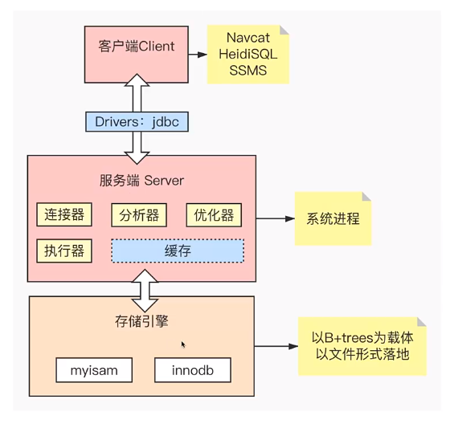

## ES（三）：Elasticsearch核心概念

### 1. 什么是搜索引擎？

#### 1.1 全文搜索引擎
自然语言处理（NLP）、爬虫、网页处理、大数据处理；如谷歌、百度、搜狗、必应等等。

#### 1.2 垂直搜索引擎
有明确搜索目的的搜索行为；各大电商网站、OA、站内搜索、视频网站等

### 2. 搜索引擎应该具备哪些要求？

#### 2.1 查询速度快
- 高效的压缩算法
- 快速的编码和解码速度

#### 2.2 结果准确
- BM25（ES7.0版本以后默认使用）
- TF-IDF（ES7.0版本之前默认使用）

#### 2.3 搜索结果丰富
- 召回率

### 3. 面向海量数据，如何达到“搜索引擎”级别的查询效率？

#### 3.1 索引
- 帮助快速检索
- 以数据结构为载体
- 以文件的形式落地

### 4. 数据库的组成结构

  

- MySQL、Oracle、SQL Server、PostgreSQL
- Redis、Memcached、MongoDB
- Elasticsearch、Solr、Splunk

### 1. Lucene简介

### 2. Elasticsearch概念

### 3. 集群、索引、分片和文档

### 4. 倒排索引深入解读
