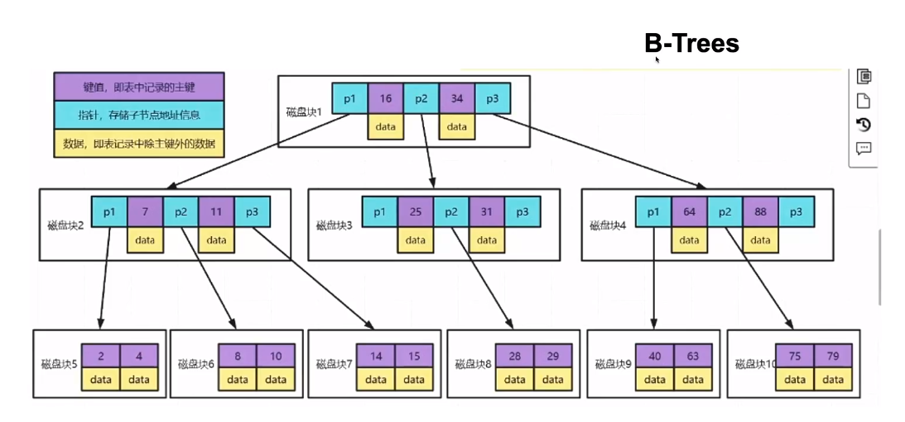
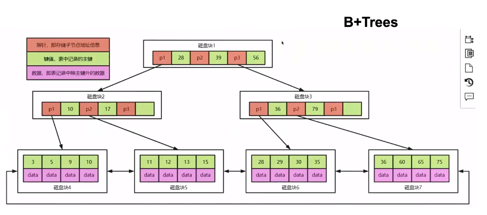
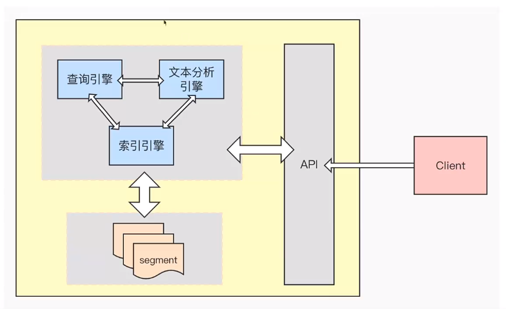

## ES（三）：Elasticsearch核心概念

### 1. 什么是搜索引擎？

#### 1.1 全文搜索引擎
自然语言处理（NLP）、爬虫、网页处理、大数据处理；如谷歌、百度、搜狗、必应等等。

#### 1.2 垂直搜索引擎
有明确搜索目的的搜索行为；各大电商网站、OA、站内搜索、视频网站等

### 2. 搜索引擎应该具备哪些要求？

#### 2.1 查询速度快
- 高效的压缩算法
- 快速的编码和解码速度

#### 2.2 结果准确
- BM25（ES7.0版本以后默认使用）
- TF-IDF（ES7.0版本之前默认使用）

#### 2.3 搜索结果丰富
- 召回率

### 3. 面向海量数据，如何达到“搜索引擎”级别的查询效率？

#### 3.1 索引
- 帮助快速检索
- 以数据结构为载体
- 以文件的形式落地

### 4. 数据库的组成结构

  

- MySQL、Oracle、SQL Server、PostgreSQL
- Redis、Memcached、MongoDB
- Elasticsearch、Solr、Splunk

#### 4.1 MySQL的索引结构

  

  

- 数据放在叶子结点（有序链表）

#### 4.2 MySQL索引能解决大数据检索的问题吗？
- 索引往往字段很长，如果使用 B+树，树可能很深，IO很可怕；
- 索引可能会失效；
- 精准度查；

### 5. Lucene简介
- Lucene是一个成熟的全文检索库，由Java语言编写，具有高性能、可伸缩的特点，并且开源、免费；
- Lucene的作者Doug Cutting是资深的全文检索专家，Lucene最开始发布在他本人的主页上，2001年10月贡献给Apache，称为Apache基金会的一个子项目；
- Lucene是一个IR库（Information Retrieval library），后来才由Shay Banon在其基础上开发了Elasticsearch；

#### 5.1 全文检索
- 全文检索：索引系统通过扫描文章中的每一个词，对其创建索引，指明在文章中出现的次数和位置，当用户查询时，索引系统就会根据事先建立的索引进行查找，并将查找的结果反馈给用户的检索方式；

  

### 2. Elasticsearch概念

### 3. 集群、索引、分片和文档

### 4. 倒排索引深入解读
