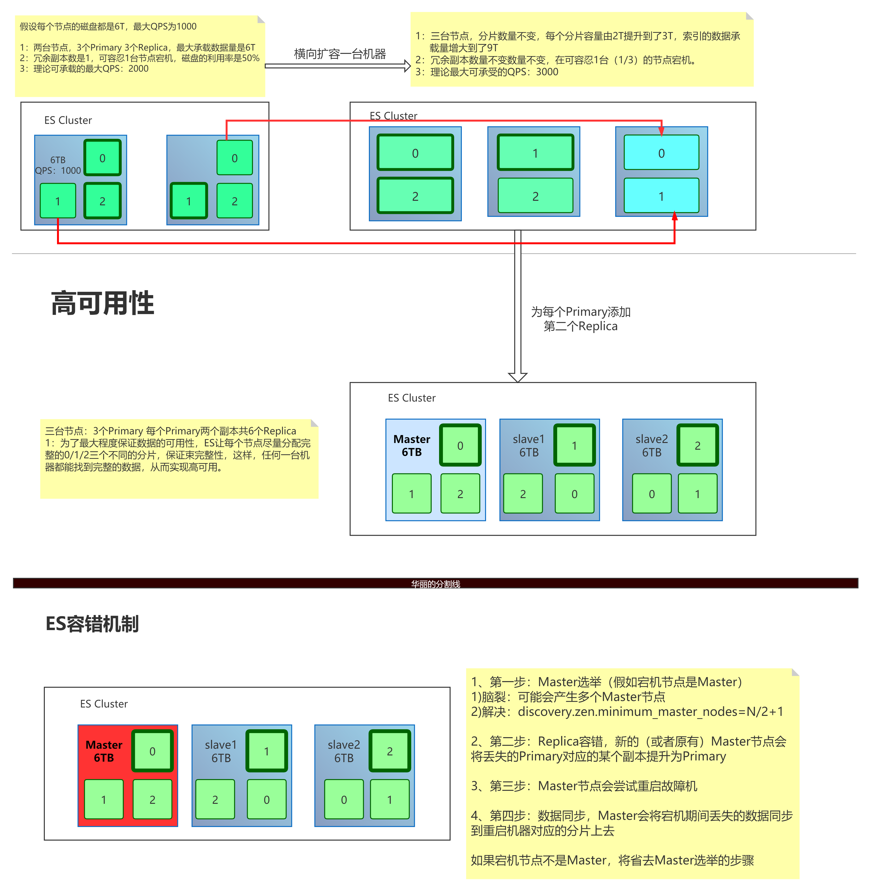

## ES（二）：环境安装、健康值检查以及CRUD

### 1. 安装环境

#### 1.1 安装ES
- 安装六字箴言
  - JDK -> 依赖
  - 下载 -> elastic.co
  - 启动 -> ./rlasticsearch -d
  - 验证 -> http://localhost:9200/
- 开发模式和生产模式
  - 开发模式：默认配置（未配置发现设置），用于学习阶段；
  - 生产模式：会触发ES的引导检查，学习阶段不建议修改集群相关的配置；

#### 1.2 安装Kibana
> 从版本6.0.0开始，kibana仅支持64位操作系统。

- 下载：http://elastic.co
- 启动：开箱即用
  - Linux：./kibana
  - Windows:.\kibana.bat
- 验证：localhost:5601

#### 1.3 安装head插件（选装）
- 介绍
  - 提供可视化的操作页面，对 Elasticsearch 搜索引擎进行各种设置和数据检索功能，可以很直观的查看集群的健康状况，索引分配情况，还可以管理索引和集群以及提供方便快捷的搜索功能等等。
- 下载：https://github.com/mobz/elasticsearch-head
- 安装：依赖于 node 和 grunt 管理工具
- 启动：npm run start
- 验证：http://localhost:9100/

### 2. 集群健康值
- 健康值检查
  - _cat/health
  - _cluster/health

    字段|释义
    ---|---
    cluster_name|集群名字
    status|集群健康状态
    timed_out|是否超时
    number_of_nodes|节点的总数量
    number_of_data_nodes|数据节点的数量
    active_primary_shards|活跃的主分片
    active_shards|活跃的分片数
    relocating_shards|迁移中的分片的数量
    initializing_shards|初始化的分片的数量
    unassigned_shards|未分配的分片的数量
    delayed_unassigned_shards|
    number_of_pending_tasks|
    number_of_in_flight_fetch|
    task_max_waiting_in_queue_millis|
    active_shards_percent_as_number|活跃的分片比例

    

- 健康值状态
  - Green：所有 Primary 和 Replica 均为 active，集群健康；
  - Yellow：至少一个 Replica 不可用，但是所有 Primary 均为 active，数据仍然是可以保证完整性的；
  - Red：至少有一个 Primary 为不可用状态，数据不完整，集群不可用；

### 3. 基于XX系统的 CRUD
-
