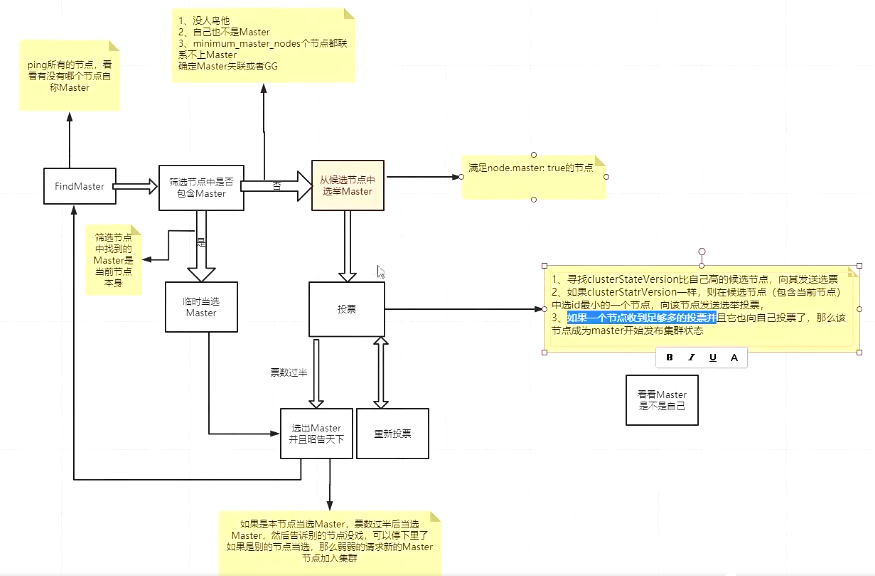

## ES（二）：环境安装、健康值检查以及CRUD

### 1. 安装环境

#### 1.1 安装ES
- 安装六字箴言
  - JDK -> 依赖
  - 下载 -> elastic.co
  - 启动 -> ./rlasticsearch -d
  - 验证 -> http://localhost:9200/
- 开发模式和生产模式
  - 开发模式：默认配置（未配置发现设置），用于学习阶段；
  - 生产模式：会触发ES的引导检查，学习阶段不建议修改集群相关的配置；

#### 1.2 安装Kibana
> 从版本6.0.0开始，kibana仅支持64位操作系统。

- 下载：http://elastic.co
- 启动：开箱即用
  - Linux：./kibana
  - Windows:.\kibana.bat
- 验证：localhost:5601

#### 1.3 安装head插件（选装）
- 介绍
  - 提供可视化的操作页面，对 Elasticsearch 搜索引擎进行各种设置和数据检索功能，可以很直观的查看集群的健康状况，索引分配情况，还可以管理索引和集群以及提供方便快捷的搜索功能等等。
- 下载：https://github.com/mobz/elasticsearch-head
- 安装：依赖于 node 和 grunt 管理工具
- 启动：npm run start
- 验证：http://localhost:9100/

### 2. 集群健康值
- 健康值检查
  - _cat/health
  - _cluster/health

    字段|释义
    ---|---
    cluster_name|集群名字
    status|集群健康状态
    timed_out|是否超时
    number_of_nodes|节点的总数量
    number_of_data_nodes|数据节点的数量
    active_primary_shards|活跃的主分片
    active_shards|活跃的分片数
    relocating_shards|迁移中的分片的数量
    initializing_shards|初始化的分片的数量
    unassigned_shards|未分配的分片的数量
    delayed_unassigned_shards|
    number_of_pending_tasks|
    number_of_in_flight_fetch|
    task_max_waiting_in_queue_millis|
    active_shards_percent_as_number|活跃的分片比例

    

- 健康值状态
  - Green：所有 Primary 和 Replica 均为 active，集群健康；
  - Yellow：至少一个 Replica 不可用，但是所有 Primary 均为 active，数据仍然是可以保证完整性的；
  - Red：至少有一个 Primary 为不可用状态，数据不完整，集群不可用；

### 3. 基于XX系统的 CRUD
- 创建索引：PUT /product?pretty
- 查询索引：GET _cat/indices?v
- 删除索引：DELETE /product?pretty
- 插入数据：

  ```
  PUT /index/_doc/id
  {
      Json数据
  }
  ```

- 更新数据
  - 全量更新
  - 指定字段更新
- 删除数据

  ```
  DELETE /index/type/id/
  ```

### 4. ES 分布式文档系统

#### 4.1 ES 如何实现高可用（生产环境均为一台机器一个节点）
- ES 在分配单个索引的分片时会将每个分片尽可能分配到更多的节点上。但是，实际情况取决于集群拥有的分片和索引的数量以及它们的大小，不一定总是均匀地分布。
- ES 不允许 Primary 和它的 Replica 放在同一个节点中，并且同一个节点不接受完全相同的两个 Replica。
- 同一个节点允许多个索引的分片同时存在。

#### 4.2 容错机制
- 容错：
  - 傻X的代码你能看懂，牛X的代码你能看懂；
  - 只能看懂自己的代码，容错性低；
  - PS：各种情况（支持的情况越多，容错性越好）下，都能保证work正常运行；
  - 换到 ES 上就是在局部出错异常的情况下，保证服务正常运行并且有自行恢复能力；
- ES-node
  - Master：主节点，每个集群都有且只有一个；
    - 尽量避免Master节点 node.data ＝ true；
  - voting：投票节点
    - Node.voting_only = true（仅投票节点，即使配置了 data.master = true，也不会参选，但是仍然可以作为数据节点）
  - coordinating：协调节点
    - 每一个节点都隐式的是一个协调节点，如果同时设置了 data.master = false 和 data.data = false，那么此节点将成为仅协调节点；
  - Master-eligible node（候选节点）
  - Data node（数据节点）
  - Ingest node
  - Machine learning node（机器学习节点）
- 两个配置：node.master 和 node.data
  - node.master = true  node.data = true：这是 ES 节点默认配置，既作为候选节点又作为数据节点，这样的节点一旦被选举为 Master 节点应该只承担较为轻量级的任务，比如创建删除索引，分片均衡等。
  - node.master = true node.data = false：只作为候选节点，不作为数据节点，可参选 Master 节点，当选后成为真正的 Master 节点；
  - node.master = false  node.data = false：既不当选节点，也不作为数据节点，那就是仅协调节点，负责负载均衡；
  - node.master = false  node.data = true：不作为候选节点，但是作为数据节点，这样的节点主要负责数据存储和查询服务。
- 图解容错机制

  

  - 第一步：Master 选举（假如宕机节点是master）
    - 脑裂：可能产生多个 Master 节点；
    - 解决：discovery.zen.minimum_master_nodes=N/2+1
  - 第二步：Replica容错，新的（或者原有）Master节点会将丢失的Primary对应的某个副本提升为Primary；
  - 第三步：Master 节点会尝试重启故障机；
  - 第四步：数据同步，Master 节点会将宕机期间丢失的数据同步到重启机器对应的分片上去；

#### 4.3 总结（如何让提高 ES 分布式系统的可用性以及性能最大化）
- 每台节点的 Shard 数量越少越好，每个 Shard 分配的 CPU、内存和 IO 资源越多，单个Shard的性能越好，当一台机器一个 Shard 时，单个 Shard 性能最好；
- 稳定的 Master 节点对于集群健康非常重要，理论上将，应该尽可能的减轻 Master 节点的压力，分片数量越多，Master 节点维护管理 shard 的任务越重，并且节点可能就要承担更多的数据转发任务，可增加“仅协调”节点来缓解 Master节点和 Data 节点的压力，但是在集群中添加过多的仅协调节点会增加整个集群的负担，因为选择的主节点必须等待每个节点的集群状态更新确认；
- 反过来说，如果相同资源分配相同的前提下，shard 数量越少，单个shard的体积越大，查询性能越低，速度越慢，这个取舍应根据实际集群状况和结合应用场景等因素综合考虑；
- 数据节点和 Master 节点一定要分开，集群规模越大，这样做的意义也就越大。
- 数据节点处理与数据相关的操作，例如CRUD，搜索和聚合。这些操作是 I/O，内存和CPU密集型的，所以他们需要更高配置的服务器以及更高的带宽，并且集群的性能冗余非常重要。
- 由于仅投票节点不参与 Master 竞选，所以和真正的 Master 节点相比，他需要的内存和CPU少。但是，所有候选节点以及仅投票节点都可能是数据节点，所以他们都需要快速稳定低延迟的网络；
- 高可用性（HA）群集至少需要三个主节点，其中至少两个不是仅投票节点。即使其中一个节点发生故障，这样的群集也将能够选举一个主节点。生产环境最好设置3台仅Master候选节点（node.master = true	 node.data = true）；
- 为确保群集仍然可用，集群不能同时停止投票配置中的一半或更多节点。只要有一半以上的投票节点可用，群集仍可以正常工作。这意味着，如果存在三个或四个主节点合格的节点，则群集可以容忍其中一个节点不可用。如果有两个或更少的主机资格节点，则它们必须都保持可用；
