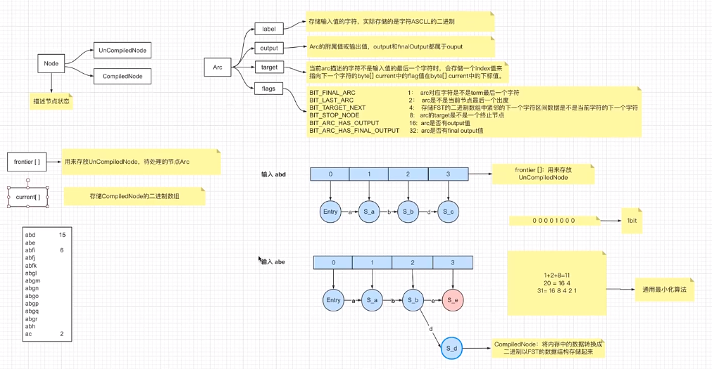

## ES（五）：FST在Lucene中的实现原理

### Mapping
#### 1. 概念
ES中的mapping有点类似于RDB中“表结构”的概念，在MySQL中，表结构里包含了字段名称、字段类型还有索引信息等。在Mapping里也包含了一些属性，比如字段名称、类型、字段使用的分词器、是否评分、是否创建索引等属性，并且在ES中一个字段可以有多个类型、分词器、评分。

#### 2. 查看 Mapping

##### 2.1 常见类型
- 1.数字类型：long、integer、short、byte、double、float、half_float、scaled_float、unsigned_long
- 2.Keywords
  - keyword：适用于索引结构化的字段，可以用于过滤、排序、聚合。keyword类型的字段只能通过精确值（exact value）搜索到。id应该用keyword；
  - constant_keyword：始终包含相同值的关键字字段；
  - wildcard：可针对类似grep的通配符查询优化日志行和类似的关键字值；关键字段通常用于排序、汇总和Term查询，例如term；
- 3.Dates（时间类型）：包括date和date_nanos
- 4.alias：为现有字段定义别名；
- 5.binary（二进制）：binary；
- 6.range（区间类型）：integer_range、float_range、long_range、double_range、date_range
- 7.当一个字段是要被全文搜索的，比如Email内容、产品描述，这些字段应该使用text类型，设置text类型以后，字段内容会被分析，在生成倒排索引以前，字符串会被分析器分成一个一个词项。text类型的字段不用于排序，很少用于聚合。（解释一下为啥不会为text创建索引：大量堆空间，尤其是在加载高基数text字段时。字段数据一旦加载到堆中，就在该段的生命周期内保持在那里。同样，加载字段数据是一个昂贵的过程，可能导致用户遇到延迟问题，这就是默认情况下禁用字段数据的原因）

##### 2.2 对象关系类型
- 1.object：用于单个JSON对象
- 2.nested：用于JSON对象数组
- 3.flattened：允许将整个JSON对象索引为单个字段

##### 2.3 结构化类型
- 1.geo-point：纬度/经度积分
- 2.geo-shape：用于多边形等复杂形状
- 3.point：笛卡尔坐标点
- 4.shape：笛卡尔任意几何图形

##### 2.4 特殊类型
- 1.IP地址：ip用于IPv4和IPv6地址
- 2.completion：提供自动完成建议
- 3.tocken_count：计算字符串中令牌的数量
- 4.murmur3：在索引时计算值的哈希并将其存储在索引中
- 
