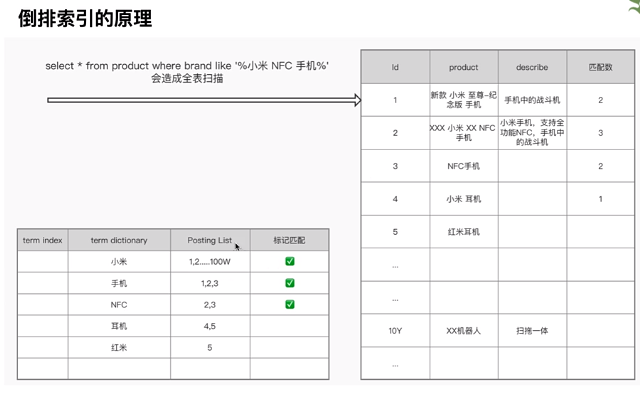
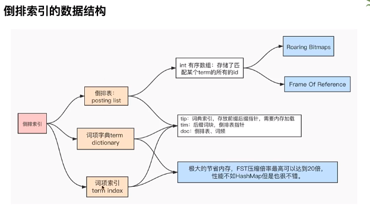
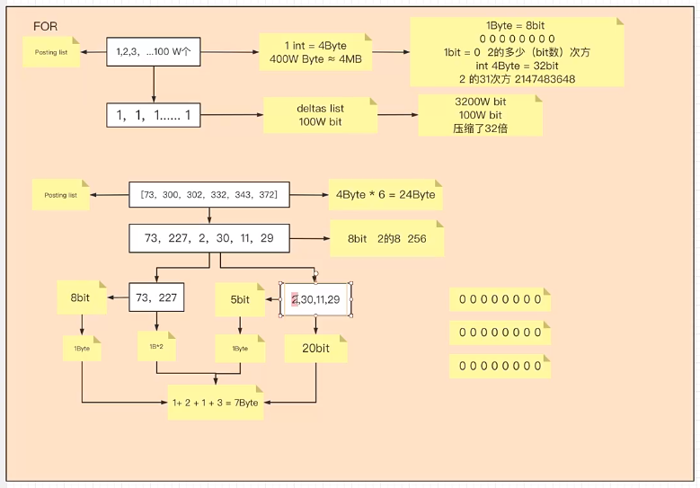
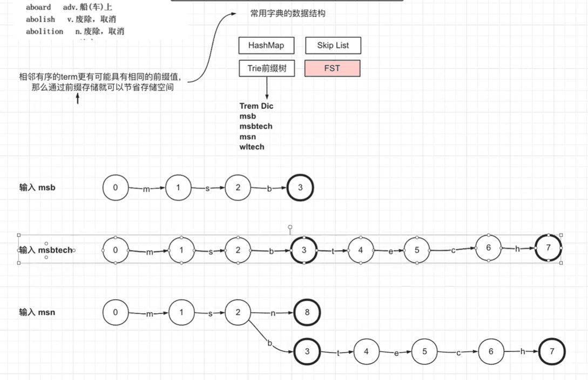
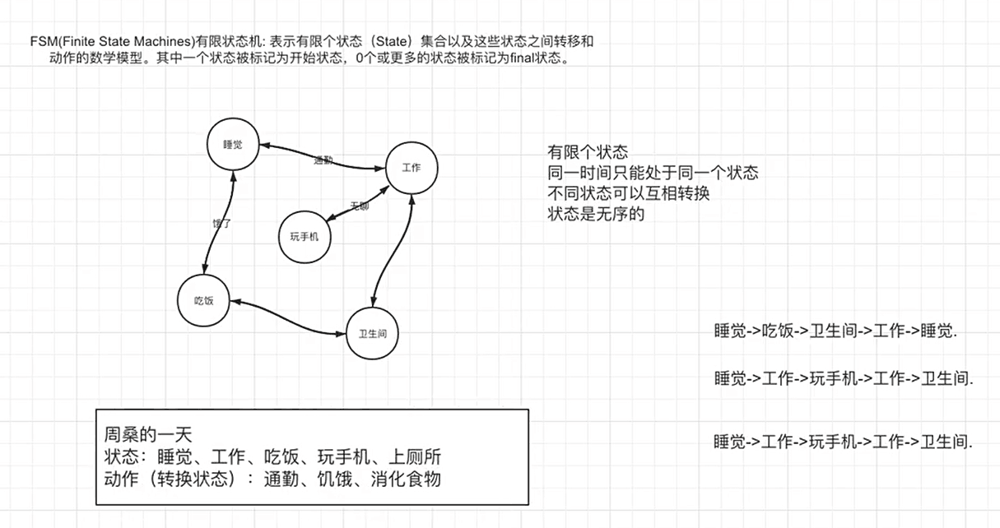
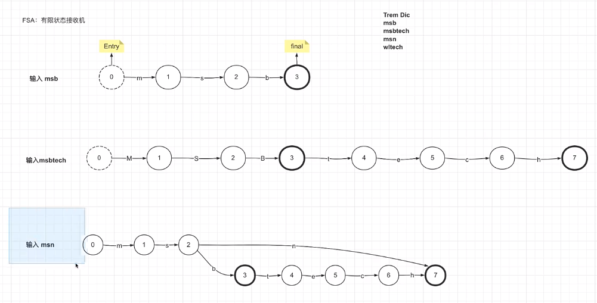
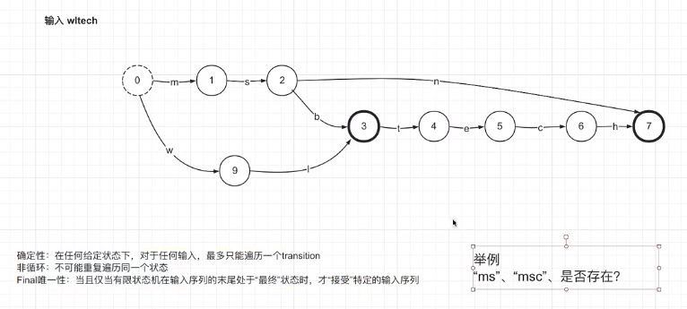
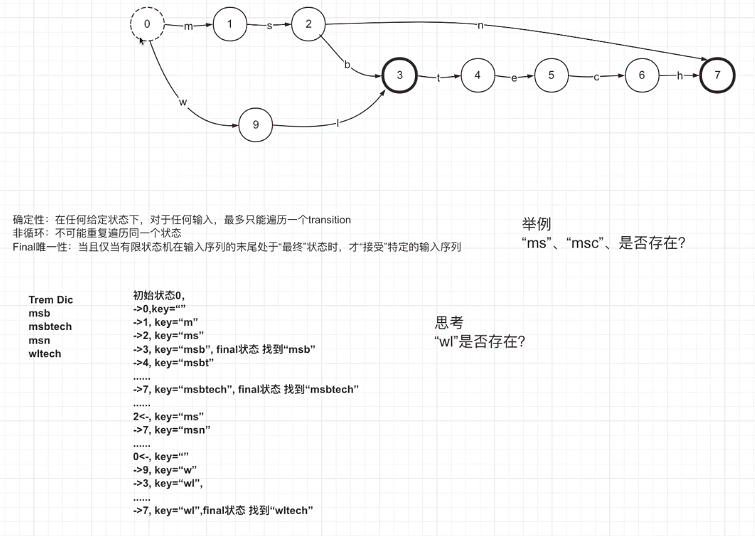
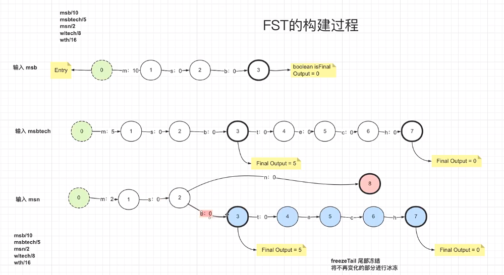
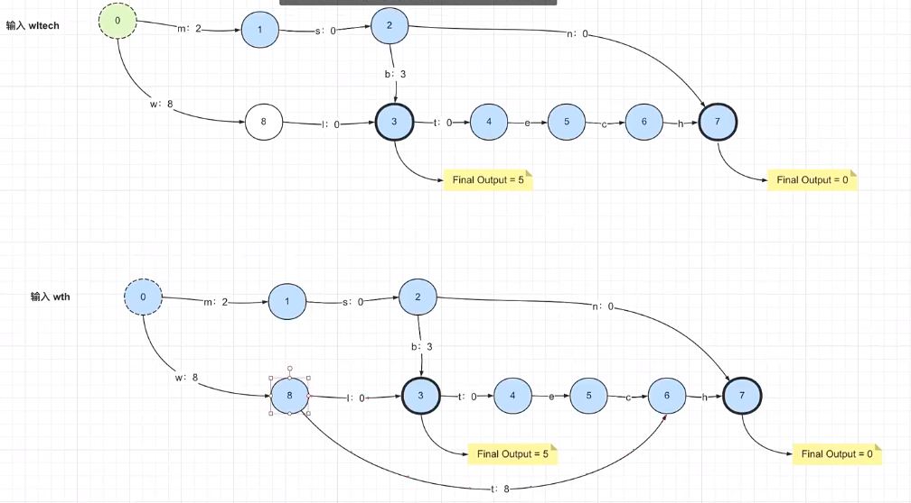

## ES（四）：倒排索引的核心原理

- 倒排表（posting list）
- 词项字典（term dictionary）
- 词项索引（term index）

### 1. 倒排索引的核心算法

#### 1.1 倒排表的压缩算法
- FOR：Frame Of Reference

  

- RBM：RoaringBitmap

#### 1.2 词项索引的检索原理

##### 1.2.1 Trie 前缀树原理
相邻有序的 term 更有可能具有相同的前缀值，那么通过前缀存储就可以节省存储空间。

  

##### 1.2.2 FSM 有限状态机
- FSM（Finite State Machines）有限状态机：表示有限个状态（State）集合以及这些状态之间转移和动作的数学模型。其中一个状态被标记为开始状态，0个或更多的状态被标记为final状态。

  

##### 1.2.3 FSA 有限状态接收机

  

  

  

##### 1.2.4 FST 有限状态机
> FST 最重要的功能是可以实现Key到value的映射，相当于HashMap<Key,Value>。FST的查询速度比HashMap要慢一点，但FST的内存消耗要比HashMap少很多，FST在Lucene中被大量使用，例如倒排索引的存储、同义词词典的存储、搜索关键字建议等。

  

  
