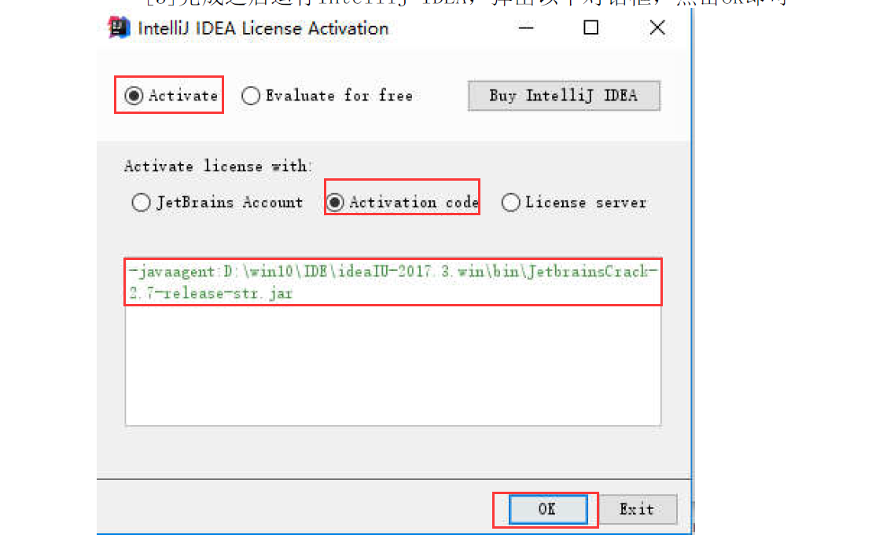

# IDEA：idea-2018.2版本破解教程
1. 下载 idea-2018.2 和 JetbrainsCrack-2.10-release-enc.jar

2. 将下载的 `JetbrainsCrack-2.10-release-enc.jar` 包放到 idea-2018.2 的安装目录下 `D:\Software\idea-2018.2\bin`

3. 修改 `D:\Software\idea-2018.2\bin` 目录下的 `idea.exe.vmoptions` 和 `idea64.exe.vmoptions` 文件，分别在 **两个文件的第一行** 添加如下内容：
  ```
  -javaagent:D:\Software\idea-2018.2\bin\JetbrainsCrack-2.10-release-enc.jar
  ```

4. 完成之后，启动 `IntelliJ IDEA`，在下面的对话框中，输入如下内容后，点击ok即可；
```
  -javaagent:D:\Software\idea-2018.2\bin\JetbrainsCrack-2.10-release-enc.jar
```

