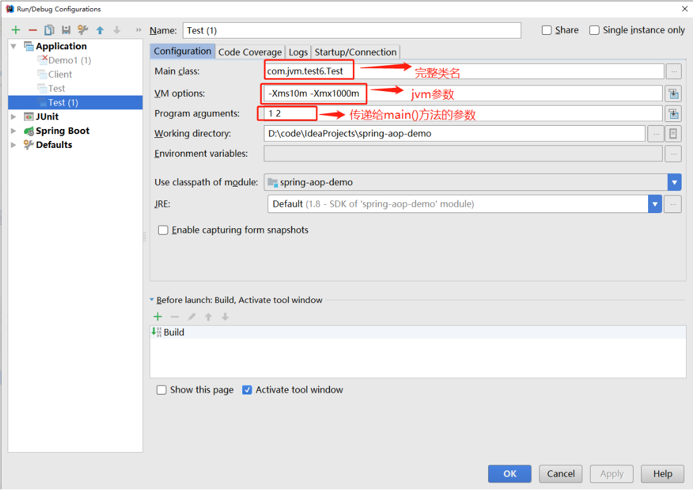

## JVM工具（一）：jps-虚拟机进程状态工具

### jps简介

jps(JVM Process Status Tool)：虚拟机进程状态工具，可以列出正在运行的虚拟机进程，并显示虚拟机执行主类（Main Class，main()函数所在的类）的名称，以及这些进程的本地虚拟机的唯一ID（LVMID,Local Vitual Machine Identifier）,它是使用频率最高的JDK命令行工具，因为其他JDK工具大多需要输入它查询到的LVMID来确定要监控的是哪一个虚拟机进程。  

对于本地虚拟机进程来说，LVMID与操作系统进程ID（PID，Process Identifier）是一致的。

如果同时启动了多个虚拟机进程，无法根据进程名称定位时，那就只能依靠jps命令显示主类的功能才能区分了。

### jps命令格式

jps [options] [hostid]

#### jps执行样例  

```bash
jps -l
18292
42132 sun.tools.jps.Jps
22616 com.jvm.test6.Test
32284 org.jetbrains.idea.maven.server.RemoteMavenServer
41228 org.jetbrains.jps.cmdline.Launcher
```

#### jps工具主要选项

选项 | 作用
--- | ---
-q | 只输出LVMID,省略主类的名称
-m | 输出虚拟机进程启动时传递给main()函数的参数
-l | 输出主类的全名，如果进程执行的是jar包，输出jar路径
-v | 输出虚拟机进程启动时JVM参数

### jps -q

> 只输出LVMID，省略主类的名称

```bash
jps -q
18292
41012
22616
32284
41228
```

### jps -m

> 输出虚拟机进程启动时传递给main()函数的参数

  

```bash
jps -m
22616 Test 1 2
```

### jps -l

> 输出主类的全名，如果进程执行的是jar包，输出jar路径。

```bash
jps -l
22616 com.jvm.test6.Test
```

> jar包的情况

```bash
[root@localhost ~]# jps -l
43248 ./code/p-parent/p-other/p-api/target/p-api-0.0.1-SNAPSHOT.jar
43249 ./code/p-parent/p-job/target/p-job-0.0.1-SNAPSHOT.jar
52786 sun.tools.jps.Jps
43250 ./code/p-parent/p-core/p-core-admin/target/p-core-admin-0.0.1-SNAPSHOT.jar
43240 ./code/p-parent/p-cloud/p-cloud-discovery/target/p-cloud-discovery-0.0.1-SNAPSHOT.jar
43241 ./code/p-parent/p-msg/broker/p-msg-service/target/p-msg-service-0.0.1-SNAPSHOT.jar
43242 ./code/p-parent/p-dts/service/p-dts-service/target/p-dts-service-0.0.1-SNAPSHOT.jar
43243 ./code/p-parent/p-notification/p-notification-service/target/p-notification-service-0.0.1-SNAPSHOT.jar
43244 ./code/p-parent/p-account/p-account-service/target/p-account-service-0.0.1-SNAPSHOT.jar
43245 ./code/p-parent/p-borrow/p-borrow-service/target/p-borrow-service-0.0.1-SNAPSHOT.jar
43246 ./code/p-parent/p-depository/p-depository-service/target/p-depository-service-0.0.1-SNAPSHOT.jar
43247 ./code/p-parent/p-invest/p-invest-service/target/p-invest-service-0.0.1-SNAPSHOT.jar
```

### jps -v

> 输出虚拟机进程启动时JVM参数

```bash
jps -v
22616 Test -Xms10m -Xmx1000m
```

