## JVM工具（七）：jconsole-java监视与管理控制台

### jconsole简介

JConsole（java monitoring and management console）是一款基于JMX的可视化监视和管理工具。

### 启动JConsole

- 点击JDK/bin 目录下面的“jconsole.exe”即可启动
- 然后会自动自动搜索本机运行的所有虚拟机进程
- 选择其中一个进程可开始进行监控

  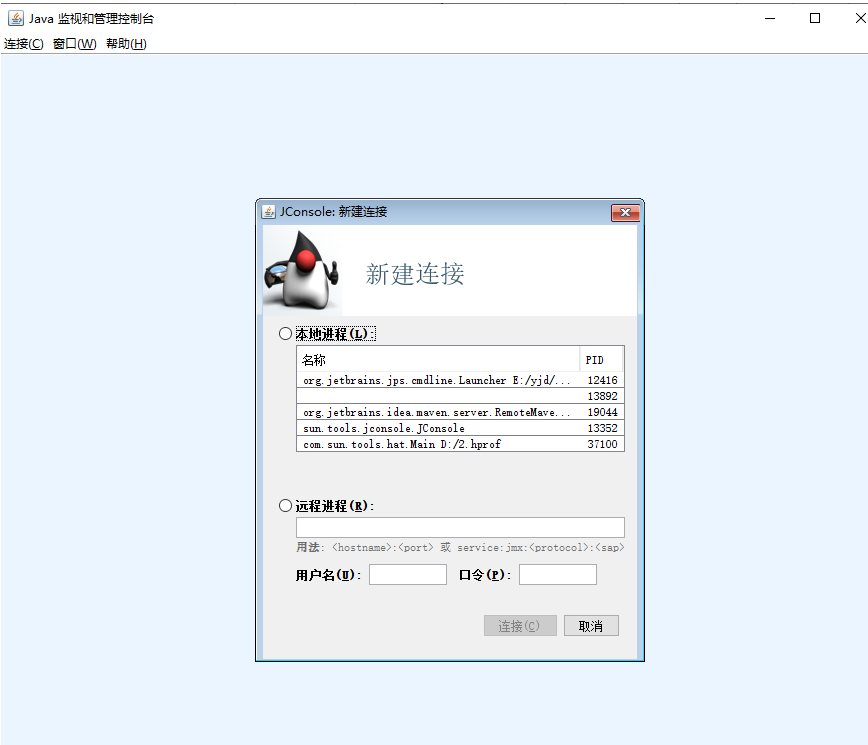

### JConsole基本介绍

JConsole 基本包括以下基本功能：概述、内存、线程、类、VM概要、MBean

运行下面的程序、然后使用JConsole进行监控;注意设置虚拟机参数

```java
package com.jvm.jconsole;
import java.util.ArrayList;
import java.util.List;
/**
 * 设置虚拟机参数：-Xms100M -Xms100m -XX:+UseSerialGC -XX:+PrintGCDetails
 */
public class Demo1 {
    static class OOMObject {
        public byte[] placeholder = new byte[64 * 1024];
    }
    public static void fillHeap(int num) throws InterruptedException {
        Thread.sleep(20000); //先运行程序，在执行监控
        List<OOMObject> list = new ArrayList<OOMObject>();
        for (int i = 0; i < num; i++) {
            // 稍作延时，令监视曲线的变化更加明显
            Thread.sleep(50);
            list.add(new OOMObject());
        }
        System.gc();
    }
    public static void main(String[] args) throws Exception {
        fillHeap(1000);
        while (true) {
            //让其一直运行着
        }
    }
}
```


- 打开JConsole查看上面程序

  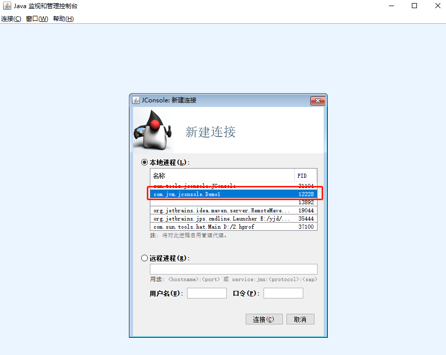

- 可以切换顶部的选项卡查看各种指标信息。

  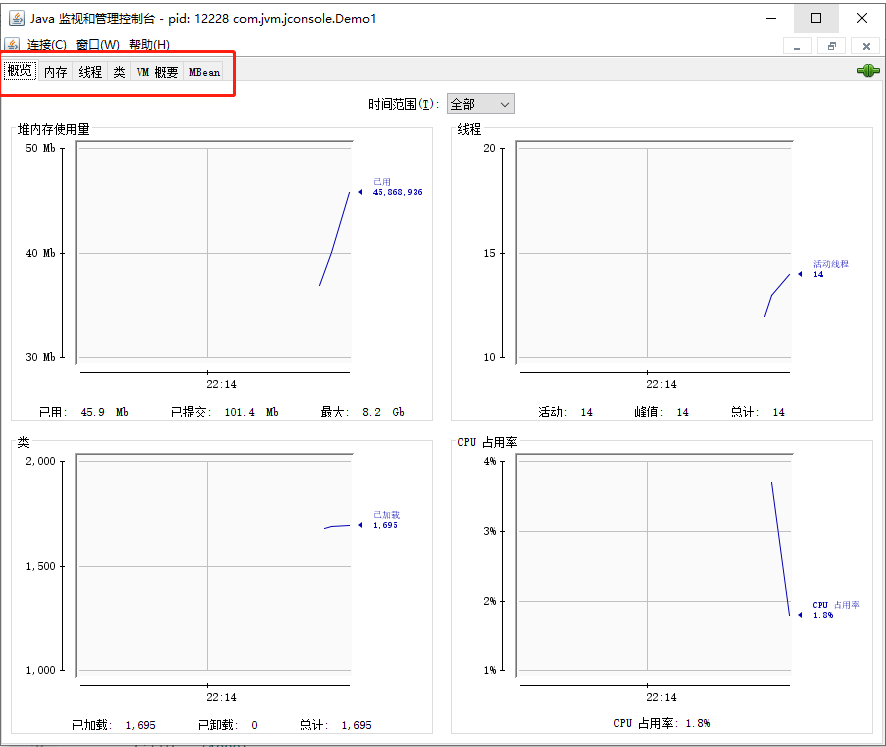

### 内存监控

“内存”页签相当于可视化的jstat 命令，用于监视受收集器管理的虚拟机内存的变换趋势。

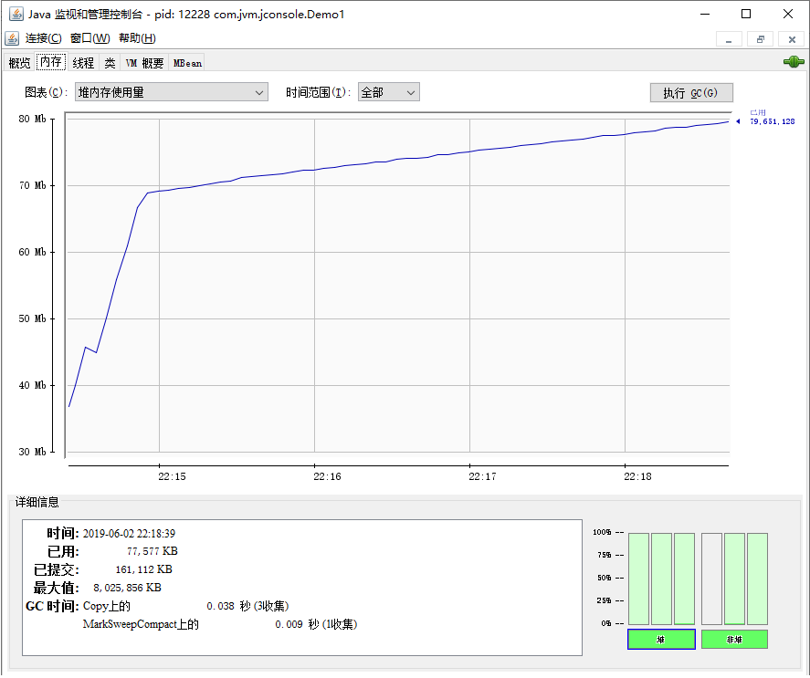

- 代码运行，控制台也会输出gc日志：

```
[GC (Allocation Failure) [DefNew: 27328K->3392K(30720K), 0.0112139 secs] 27328K->19901K(99008K), 0.0112664 secs] [Times: user=0.00 sys=0.01, real=0.01 secs] 
[GC (Allocation Failure) [DefNew: 30720K->3392K(30720K), 0.0133413 secs] 47229K->40117K(99008K), 0.0133708 secs] [Times: user=0.01 sys=0.00, real=0.01 secs] 
[GC (Allocation Failure) [DefNew: 30664K->3374K(30720K), 0.0140975 secs] 67389K->65091K(99008K), 0.0141239 secs] [Times: user=0.00 sys=0.02, real=0.01 secs] 
[Full GC (System.gc()) [Tenured: 61716K->66636K(68288K), 0.0098835 secs] 66919K->66636K(99008K), [Metaspace: 9482K->9482K(1058816K)], 0.0100578 secs] [Times: user=0.00 sys=0.00, real=0.01 secs]
```

### 线程监控

> 如果上面的“内存”页签相当于可视化的jstat命令的话，“线程”页签的功能相当于可视化的jstack命令，遇到线程停顿时可以使用这个页签进行监控分析。线程长时间停顿的主要原因主要有：等待外部资源（数据库连接、网络资源、设备资源等）、死循环、锁等待（活锁和死锁）

下面三个方法分别等待控制台输入、死循环演示、线程锁等待演示

- 第一步：运行如下代码：

```java
package com.jvm.jconsole;
import java.io.BufferedReader;
import java.io.IOException;
import java.io.InputStreamReader;

public class Demo2 {
    public static void main(String[] args) throws IOException {
        waitRerouceConnection();
        createBusyThread();
        createLockThread(new Object());
    }
    /**
     * 等待控制台输入
     *
     * @throws IOException
     */
    public static void waitRerouceConnection() throws IOException {
        Thread thread = new Thread(new Runnable() {
            @Override
            public void run() {
                BufferedReader br = new BufferedReader(new InputStreamReader(System.in));
                try {
                    br.readLine();
                } catch (IOException e) {
                    e.printStackTrace();
                }
            }
        }, "waitRerouceConnection");
        thread.start();
    }
    /**
     * 线程死循环演示
     */
    public static void createBusyThread() {
        Thread thread = new Thread(new Runnable() {
            @Override
            public void run() {
                while (true) {
                    ;
                }
            }
        }, "testBusyThread");
        thread.start();
    }
    /**
     * 线程锁等待演示
     */
    public static void createLockThread(final Object lock) {
        Thread thread = new Thread(new Runnable() {
            @Override
            public void run() {
                synchronized (lock) {
                    try {
                        lock.wait();
                    } catch (InterruptedException e) {
                        e.printStackTrace();
                    }
                }
            }
        }, "testLockThread");
        thread.start();
    }
}
```

- 第二步：打开jconsole中查看上面程序运行情况，可以查看到3个目标线程

  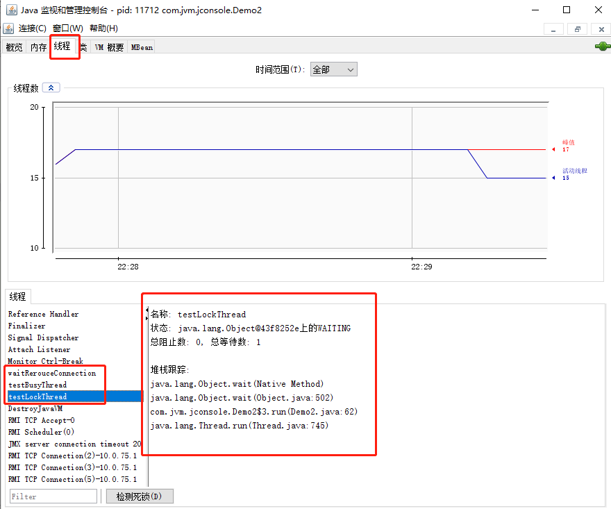

- 第三步：查看目标线程信息
  - waitRerouceConnection线程处于读取数据状态，如下图：

    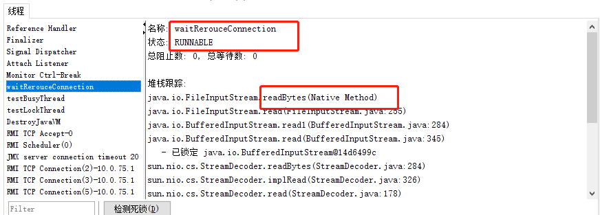

  - testBusyThread线程位于代码45行，处于运行状态，如下图：

    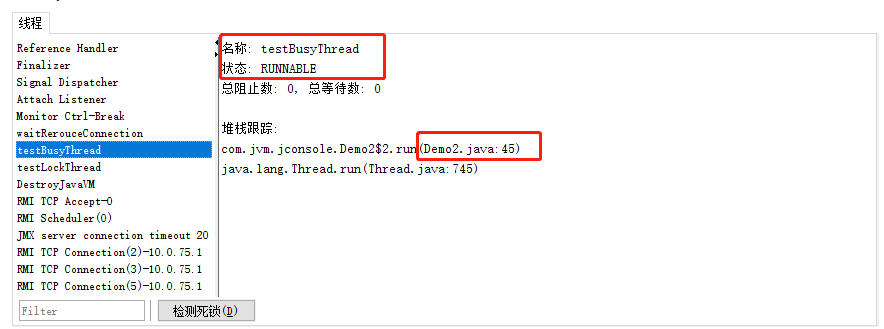

  - testLockThread处于活锁等待状态，如下图：

    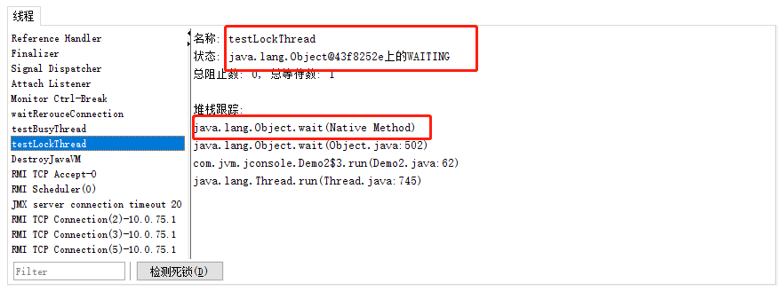

    只要lock对象的notify()或notifyAll()方法被调用，这个线程便可能激活以继续执行

通过“线程”这个窗口可以很方便查询虚拟机中的线程堆栈信息，对发现系统中的一些问题非常有帮助。

### 线程死锁演示

- 第一步：运行下面代码：

```java
package com.jvm.jconsole;

public class Demo3 {
    public static void main(String[] args) {
        User u1 = new User("u1");
        User u2 = new User("u2");
        Thread thread1 = new Thread(new SynAddRunalbe(u1, u2, 1, 2, true));
        thread1.setName("thread1");
        thread1.start();
        Thread thread2 = new Thread(new SynAddRunalbe(u1, u2, 2, 1, false));
        thread2.setName("thread2");
        thread2.start();
    }
    /**
     * 线程死锁等待演示
     */
    public static class SynAddRunalbe implements Runnable {
        User u1, u2;
        int a, b;
        boolean flag;
        public SynAddRunalbe(User u1, User u2, int a, int b, boolean flag) {
            this.u1 = u1;
            this.u2 = u2;
            this.a = a;
            this.b = b;
            this.flag = flag;
        }
        @Override
        public void run() {
            try {
                if (flag) {
                    synchronized (u1) {
                        Thread.sleep(100);
                        synchronized (u2) {
                            System.out.println(a + b);
                        }
                    }
                } else {
                    synchronized (u2) {
                        Thread.sleep(100);
                        synchronized (u1) {
                            System.out.println(a + b);
                        }
                    }
                }
            } catch (InterruptedException e) {
                e.printStackTrace();
            }
        }
    }
    public static class User {
        private String name;
        public String getName() {
            return name;
        }
        public void setName(String name) {
            this.name = name;
        }
        public User(String name) {
            this.name = name;
        }
        @Override
        public String toString() {
            return "User{" +
                    "name='" + name + '\'' +
                    '}';
        }
    }
}
```

thread1持有u1的锁，thread2持有u2的锁，thread1等待获取u2的锁，thread2等待获取u1的锁，相互需要获取的锁都被对方持有者，造成了死锁。程序中出现了死锁的情况，我们是比较难以发现的。需要依靠工具解决。刚好jconsole就是这个美妙的工具。

- 第二步：在jconsole中打开上面程序的监控信息：

  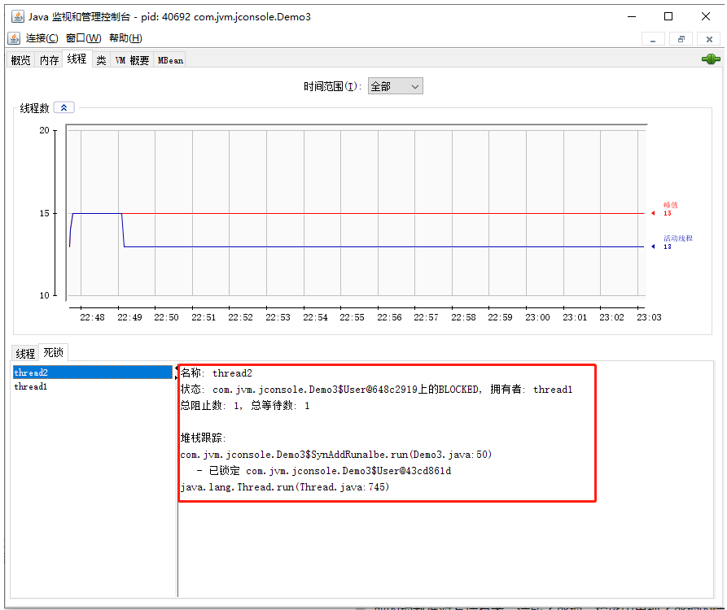
  
  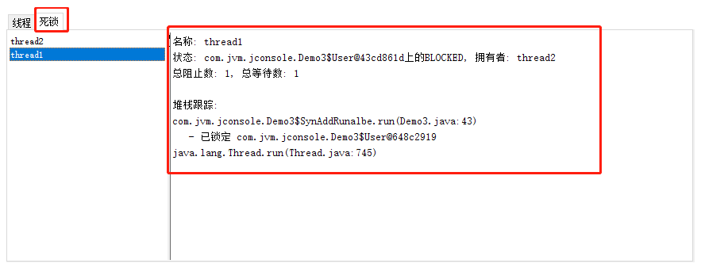

从上面可以看出代码43行和50行处导致了死锁。

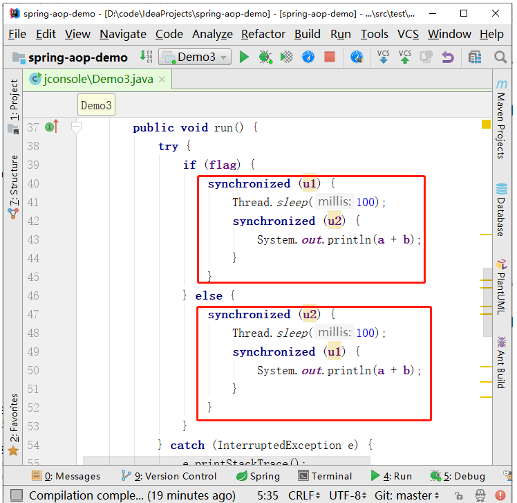

关于程序死锁的，我们还可以使用命令行工具jstack来查看java线程堆栈信息，也可以发现死锁。