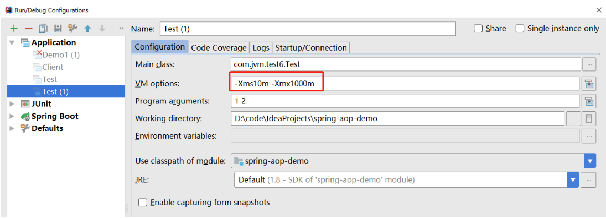

## JVM工具（三）：jinfo-jvm配置信息工具

### jinfo简介

jinfo（Configuration Info for Java）的作用是实时地查看和调整虚拟机的各项参数。

使用jps -v 可以查看虚拟机启动时显示指定的参数列表，但是如果想知道未被显示指定的参数的系统默认值，除了去找资料外，就只能使用jinfo的-flag选项进行查询了。

```bash
[root@localhost ~]# jinfo
Usage:
    jinfo [option] <pid>
        (to connect to running process)
    jinfo [option] <executable <core>
        (to connect to a core file)
    jinfo [option] [server_id@]<remote server IP or hostname>
        (to connect to remote debug server)
where <option> is one of:
    -flag <name>         to print the value of the named VM flag
    -flag [+|-]<name>    to enable or disable the named VM flag
    -flag <name>=<value> to set the named VM flag to the given value
    -flags               to print VM flags
    -sysprops            to print Java system properties
    <no option>          to print both of the above
    -h | -help           to print this help message
```

### 打印所有的JVM标志信息

> 命令：jinfo -flag pid



```bash
C:\Users\Think>jps -l
44748 com.jvm.test6.Test
C:\Users\Think>jinfo -flags 44748
Attaching to process ID 44748, please wait...
Debugger attached successfully.
Server compiler detected.
JVM version is 25.121-b13
Non-default VM flags: -XX:CICompilerCount=4 -XX:InitialHeapSize=10485760 -XX:MaxHeapSize=1048576000 -XX:MaxNewSize=349175808 -XX:MinHeapDeltaBytes=524288 -XX:NewSize=3145728 -XX:OldSize=7340032 -XX:+UseCompressedClassPointers -XX:+UseCompressedOops -XX:+UseFastUnorderedTimeStamps -XX:-UseLargePagesIndividualAllocation -XX:+UseParallelGC
Command line:  -agentlib:jdwp=transport=dt_socket,address=127.0.0.1:64223,suspend=y,server=n -Xms10m -Xmx1000m -Dfile.encoding=UTF-8
```

- Non-default VM flags: 非默认VM标志
- Command line: 命令行中指定的jvm参数

### 打印指定的JVM参数信息

> 命令：jinfo -flag name pid

```bash
[root@localhost ~]# jinfo -flag InitialHeapSize 113595
-XX:InitialHeapSize=522190848
```

### 启用或禁用指定的JVM参数

> 命令：jinfo -flag [+|-] name pid

我们运行一段程序，下面这段程序vm参数设置为:-Xms5m -Xmx5m,运行过程中会参数OOM，在运行过程中，我们添加vm参数：+HeapDumpOnOutOfMemoryError：发生OOM的时候，让程序打印堆dump文件。

```java
public class Test7 {
    private static final int _1M = 1024 * 1024;
    public static void main(String[] args) throws InterruptedException {
        List<Object> list = new ArrayList<>();
        for (int i = 0; i < 10; i++) {
            TimeUnit.SECONDS.sleep(3);
            list.add(new byte[_1M]);
        }
    }
}
```

运行过程中添加参数

```bash
C:\Users\Think>jps -l
44520 com.jvm.test7.Test7
C:\Users\Think>jinfo -flag +HeapDumpOnOutOfMemoryError 44520
C:\Users\Think>jinfo -flags 44520
Attaching to process ID 44520, please wait...
Debugger attached successfully.
Server compiler detected.
JVM version is 25.121-b13
Non-default VM flags: -XX:CICompilerCount=4 -XX:+HeapDumpOnOutOfMemoryError -XX:InitialHeapSize=6291456 -XX:MaxHeapSize=6291456 -XX:MaxNewSize=2097152 -XX:MinHeapDeltaBytes=524288 -XX:NewSize=2097152 -XX:OldSize=4194304 -XX:+UseCompressedClassPointers -XX:+UseCompressedOops -XX:+UseFastUnorderedTimeStamps -XX:-UseLargePagesIndividualAllocation -XX:+UseParallelGC
Command line:  -agentlib:jdwp=transport=dt_socket,address=127.0.0.1:53193,suspend=y,server=n -Xms5m -Xmx5m -Dfile.encoding=UTF-8
```

程序运行结果：

```bash
Connected to the target VM, address: '127.0.0.1:53193', transport: 'socket'
java.lang.OutOfMemoryError: Java heap space
Dumping heap to java_pid44520.hprof ...
Disconnected from the target VM, address: '127.0.0.1:53193', transport: 'socket'
Heap dump file created [4535342 bytes in 0.009 secs]
Exception in thread "main" java.lang.OutOfMemoryError: Java heap space
    at com.jvm.test7.Test7.main(Test7.java:18)
```

### 给指定的JVM参数设置值

> 命令：jinfo -flag name=value pid

### 打印系统参数信息

> 命令：jinfo -sysprops pid

打印的信息和System.getProperties()一样。

```bash
C:\Users\Think>jinfo -sysprops 44748
Attaching to process ID 44748, please wait...
Debugger attached successfully.
Server compiler detected.
JVM version is 25.121-b13
java.runtime.name = Java(TM) SE Runtime Environment
java.vm.version = 25.121-b13
sun.boot.library.path = D:\installsoft\Java\jdk1.8.0_121\jre\bin
java.vendor.url = http://java.oracle.com/
java.vm.vendor = Oracle Corporation
path.separator = ;
file.encoding.pkg = sun.io
java.vm.name = Java HotSpot(TM) 64-Bit Server VM
sun.os.patch.level =
sun.java.launcher = SUN_STANDARD
user.script =
user.country = CN
user.dir = D:\code\IdeaProjects\spring-aop-demo
java.vm.specification.name = Java Virtual Machine Specification
java.runtime.version = 1.8.0_121-b13
java.awt.graphicsenv = sun.awt.Win32GraphicsEnvironment
os.arch = amd64
java.endorsed.dirs = D:\installsoft\Java\jdk1.8.0_121\jre\lib\endorsed
line.separator =
java.io.tmpdir = C:\Users\Think\AppData\Local\Temp\
java.vm.specification.vendor = Oracle Corporation
user.variant =
os.name = Windows 10
sun.jnu.encoding = GBK
java.library.path = D:\installsoft\Java\jdk1.8.0_121\bin;C:\Windows\Sun\Java\bin;C:\Windows\system32;C:\Windows;C:\ProgramData\DockerDesktop\version-bin;C:\Program Files\Docker\Docker\Resources\bin;D:\installsoft\maven\apache-maven-3.3.9\bin;D:\installsoft\Java\jdk1.8.0_121\bin;D:\installsoft\Java\jdk1.8.0_121\jre\bin;C:\ProgramData\Oracle\Java\javapath;C:\Program Files (x86)\Intel\Intel(R) Management Engine Components\iCLS\;C:\Program Files\Intel\Intel(R) Management Engine Components\iCLS\;C:\Windows\system32;C:\Windows;C:\Windows\System32\Wbem;C:\Windows\System32\WindowsPowerShell\v1.0\;C:\Windows\System32\OpenSSH\;C:\Program Files\Intel\WiFi\bin\;C:\Program Files\Common Files\Intel\WirelessCommon\;C:\Program Files (x86)\Intel\Intel(R) Management Engine Components\DAL;C:\Program Files\Intel\Intel(R) Management Engine Components\DAL;D:\installsoft\TortoiseSVN\bin;C:\Program Files (x86)\Common Files\Thunder Network\KanKan\Codecs;D:\ady\ffmpeg\ffmpeg\bin;D:\installsoft\MySQL\mysql-5.7.25-winx64\bin;D:\installsoft\Git\cmd;D:\installsoft\Go\bin;C:\Users\Think\AppData\Local\Microsoft\WindowsApps;;D:\installsoft\SSH Communications Security\SSH Secure Shell;D:\installsoft\Docker Toolbox;D:\installsoft\Docker Toolbox;C:\Users\Think\go\bin;.
java.specification.name = Java Platform API Specification
java.class.version = 52.0
sun.management.compiler = HotSpot 64-Bit Tiered Compilers
os.version = 10.0
user.home = C:\Users\Think
user.timezone =
java.awt.printerjob = sun.awt.windows.WPrinterJob
file.encoding = UTF-8
java.specification.version = 1.8
user.name = Think
java.class.path = D:\installsoft\Java\jdk1.8.0_121\jre\lib\charsets.jar;D:\installsoft\Java\jdk1.8.0_121\jre\lib\deploy.jar;D:\installsoft\Java\jdk1.8.0_121\jre\lib\ext\access-bridge-64.jar;D:\installsoft\Java\jdk1.8.0_121\jre\lib\ext\cldrdata.jar;D:\installsoft\Java\jdk1.8.0_121\jre\lib\ext\dnsns.jar;D:\installsoft\Java\jdk1.8.0_121\jre\lib\ext\jaccess.jar;D:\installsoft\Java\jdk1.8.0_121\jre\lib\ext\jfxrt.jar;D:\installsoft\Java\jdk1.8.0_121\jre\lib\ext\localedata.jar;D:\installsoft\Java\jdk1.8.0_121\jre\lib\ext\nashorn.jar;D:\installsoft\Java\jdk1.8.0_121\jre\lib\ext\sunec.jar;D:\installsoft\Java\jdk1.8.0_121\jre\lib\ext\sunjce_provider.jar;D:\installsoft\Java\jdk1.8.0_121\jre\lib\ext\sunmscapi.jar;D:\installsoft\Java\jdk1.8.0_121\jre\lib\ext\sunpkcs11.jar;D:\installsoft\Java\jdk1.8.0_121\jre\lib\ext\zipfs.jar;D:\installsoft\Java\jdk1.8.0_121\jre\lib\javaws.jar;D:\installsoft\Java\jdk1.8.0_121\jre\lib\jce.jar;D:\installsoft\Java\jdk1.8.0_121\jre\lib\jfr.jar;D:\installsoft\Java\jdk1.8.0_121\jre\lib\jfxswt.jar;D:\installsoft\Java\jdk1.8.0_121\jre\lib\jsse.jar;D:\installsoft\Java\jdk1.8.0_121\jre\lib\management-agent.jar;D:\installsoft\Java\jdk1.8.0_121\jre\lib\plugin.jar;D:\installsoft\Java\jdk1.8.0_121\jre\lib\resources.jar;D:\installsoft\Java\jdk1.8.0_121\jre\lib\rt.jar;D:\code\IdeaProjects\spring-aop-demo\target\test-classes;D:\code\IdeaProjects\spring-aop-demo\target\classes;D:\installsoft\maven\.m2\repository3.3.9_0\org\springframework\boot\spring-boot-starter-aop\2.1.4.RELEASE\spring-boot-starter-aop-2.1.4.RELEASE.jar;D:\installsoft\maven\.m2\repository3.3.9_0\org\springframework\boot\spring-boot-starter\2.1.4.RELEASE\spring-boot-starter-2.1.4.RELEASE.jar;D:\installsoft\maven\.m2\repository3.3.9_0\org\springframework\boot\spring-boot\2.1.4.RELEASE\spring-boot-2.1.4.RELEASE.jar;D:\installsoft\maven\.m2\repository3.3.9_0\org\springframework\spring-context\5.1.6.RELEASE\spring-context-5.1.6.RELEASE.jar;D:\installsoft\maven\.m2\repository3.3.9_0\org\springframework\spring-expression\5.1.6.RELEASE\spring-expression-5.1.6.RELEASE.jar;D:\installsoft\maven\.m2\repository3.3.9_0\org\springframework\boot\spring-boot-autoconfigure\2.1.4.RELEASE\spring-boot-autoconfigure-2.1.4.RELEASE.jar;D:\installsoft\maven\.m2\repository3.3.9_0\org\springframework\boot\spring-boot-starter-logging\2.1.4.RELEASE\spring-boot-starter-logging-2.1.4.RELEASE.jar;D:\installsoft\maven\.m2\repository3.3.9_0\ch\qos\logback\logback-classic\1.2.3\logback-classic-1.2.3.jar;D:\installsoft\maven\.m2\repository3.3.9_0\ch\qos\logback\logback-core\1.2.3\logback-core-1.2.3.jar;D:\installsoft\maven\.m2\repository3.3.9_0\org\slf4j\slf4j-api\1.7.26\slf4j-api-1.7.26.jar;D:\installsoft\maven\.m2\repository3.3.9_0\org\apache\logging\log4j\log4j-to-slf4j\2.11.2\log4j-to-slf4j-2.11.2.jar;D:\installsoft\maven\.m2\repository3.3.9_0\org\apache\logging\log4j\log4j-api\2.11.2\log4j-api-2.11.2.jar;D:\installsoft\maven\.m2\repository3.3.9_0\org\slf4j\jul-to-slf4j\1.7.26\jul-to-slf4j-1.7.26.jar;D:\installsoft\maven\.m2\repository3.3.9_0\javax\annotation\javax.annotation-api\1.3.2\javax.annotation-api-1.3.2.jar;D:\installsoft\maven\.m2\repository3.3.9_0\org\yaml\snakeyaml\1.23\snakeyaml-1.23.jar;D:\installsoft\maven\.m2\repository3.3.9_0\org\springframework\spring-aop\5.1.6.RELEASE\spring-aop-5.1.6.RELEASE.jar;D:\installsoft\maven\.m2\repository3.3.9_0\org\springframework\spring-beans\5.1.6.RELEASE\spring-beans-5.1.6.RELEASE.jar;D:\installsoft\maven\.m2\repository3.3.9_0\org\aspectj\aspectjweaver\1.9.2\aspectjweaver-1.9.2.jar;D:\installsoft\maven\.m2\repository3.3.9_0\org\projectlombok\lombok\1.18.6\lombok-1.18.6.jar;D:\installsoft\maven\.m2\repository3.3.9_0\org\springframework\boot\spring-boot-starter-test\2.1.4.RELEASE\spring-boot-starter-test-2.1.4.RELEASE.jar;D:\installsoft\maven\.m2\repository3.3.9_0\org\springframework\boot\spring-boot-test\2.1.4.RELEASE\spring-boot-test-2.1.4.RELEASE.jar;D:\installsoft\maven\.m2\repository3.3.9_0\org\springframework\boot\spring-boot-test-autoconfigure\2.1.4.RELEASE\spring-boot-test-autoconfigure-2.1.4.RELEASE.jar;D:\installsoft\maven\.m2\repository3.3.9_0\com\jayway\jsonpath\json-path\2.4.0\json-path-2.4.0.jar;D:\installsoft\maven\.m2\repository3.3.9_0\junit\junit\4.12\junit-4.12.jar;D:\installsoft\maven\.m2\repository3.3.9_0\org\assertj\assertj-core\3.11.1\assertj-core-3.11.1.jar;D:\installsoft\maven\.m2\repository3.3.9_0\org\mockito\mockito-core\2.23.4\mockito-core-2.23.4.jar;D:\installsoft\maven\.m2\repository3.3.9_0\net\bytebuddy\byte-buddy\1.9.12\byte-buddy-1.9.12.jar;D:\installsoft\maven\.m2\repository3.3.9_0\net\bytebuddy\byte-buddy-agent\1.9.12\byte-buddy-agent-1.9.12.jar;D:\installsoft\maven\.m2\repository3.3.9_0\org\objenesis\objenesis\2.6\objenesis-2.6.jar;D:\installsoft\maven\.m2\repository3.3.9_0\org\hamcrest\hamcrest-core\1.3\hamcrest-core-1.3.jar;D:\installsoft\maven\.m2\repository3.3.9_0\org\hamcrest\hamcrest-library\1.3\hamcrest-library-1.3.jar;D:\installsoft\maven\.m2\repository3.3.9_0\org\skyscreamer\jsonassert\1.5.0\jsonassert-1.5.0.jar;D:\installsoft\maven\.m2\repository3.3.9_0\com\vaadin\external\google\android-json\0.0.20131108.vaadin1\android-json-0.0.20131108.vaadin1.jar;D:\installsoft\maven\.m2\repository3.3.9_0\org\springframework\spring-core\5.1.6.RELEASE\spring-core-5.1.6.RELEASE.jar;D:\installsoft\maven\.m2\repository3.3.9_0\org\springframework\spring-jcl\5.1.6.RELEASE\spring-jcl-5.1.6.RELEASE.jar;D:\installsoft\maven\.m2\repository3.3.9_0\org\springframework\spring-test\5.1.6.RELEASE\spring-test-5.1.6.RELEASE.jar;D:\installsoft\maven\.m2\repository3.3.9_0\org\xmlunit\xmlunit-core\2.6.2\xmlunit-core-2.6.2.jar;D:\installsoft\Java\jdk1.8.0_121\lib\tools.jar;E:\yjd\软 件\Intellij IDEA\ideaIU-2017.1.5.win\lib\idea_rt.jar
java.vm.specification.version = 1.8
sun.arch.data.model = 64
sun.java.command = com.jvm.test6.Test 1 2
java.home = D:\installsoft\Java\jdk1.8.0_121\jre
user.language = zh
java.specification.vendor = Oracle Corporation
awt.toolkit = sun.awt.windows.WToolkit
java.vm.info = mixed mode
java.version = 1.8.0_121
java.ext.dirs = D:\installsoft\Java\jdk1.8.0_121\jre\lib\ext;C:\Windows\Sun\Java\lib\ext
sun.boot.class.path = D:\installsoft\Java\jdk1.8.0_121\jre\lib\resources.jar;D:\installsoft\Java\jdk1.8.0_121\jre\lib\rt.jar;D:\installsoft\Java\jdk1.8.0_121\jre\lib\sunrsasign.jar;D:\installsoft\Java\jdk1.8.0_121\jre\lib\jsse.jar;D:\installsoft\Java\jdk1.8.0_121\jre\lib\jce.jar;D:\installsoft\Java\jdk1.8.0_121\jre\lib\charsets.jar;D:\installsoft\Java\jdk1.8.0_121\jre\lib\jfr.jar;D:\installsoft\Java\jdk1.8.0_121\jre\classes
java.vendor = Oracle Corporation
file.separator = \
java.vendor.url.bug = http://bugreport.sun.com/bugreport/
sun.io.unicode.encoding = UnicodeLittle
sun.cpu.endian = little
sun.desktop = windows
sun.cpu.isalist = amd64
```

### 打印以上所有配置信息

> 命令：jinfo pid

```bash
C:\Users\Think>jinfo 44748
Attaching to process ID 44748, please wait...
Debugger attached successfully.
Server compiler detected.
JVM version is 25.121-b13
Java System Properties:
java.runtime.name = Java(TM) SE Runtime Environment
java.vm.version = 25.121-b13
sun.boot.library.path = D:\installsoft\Java\jdk1.8.0_121\jre\bin
java.vendor.url = http://java.oracle.com/
java.vm.vendor = Oracle Corporation
path.separator = ;
file.encoding.pkg = sun.io
java.vm.name = Java HotSpot(TM) 64-Bit Server VM
sun.os.patch.level =
sun.java.launcher = SUN_STANDARD
user.script =
user.country = CN
user.dir = D:\code\IdeaProjects\spring-aop-demo
java.vm.specification.name = Java Virtual Machine Specification
java.runtime.version = 1.8.0_121-b13
java.awt.graphicsenv = sun.awt.Win32GraphicsEnvironment
os.arch = amd64
java.endorsed.dirs = D:\installsoft\Java\jdk1.8.0_121\jre\lib\endorsed
line.separator =
java.io.tmpdir = C:\Users\Think\AppData\Local\Temp\
java.vm.specification.vendor = Oracle Corporation
user.variant =
os.name = Windows 10
sun.jnu.encoding = GBK
java.library.path = D:\installsoft\Java\jdk1.8.0_121\bin;C:\Windows\Sun\Java\bin;C:\Windows\system32;C:\Windows;C:\ProgramData\DockerDesktop\version-bin;C:\Program Files\Docker\Docker\Resources\bin;D:\installsoft\maven\apache-maven-3.3.9\bin;D:\installsoft\Java\jdk1.8.0_121\bin;D:\installsoft\Java\jdk1.8.0_121\jre\bin;C:\ProgramData\Oracle\Java\javapath;C:\Program Files (x86)\Intel\Intel(R) Management Engine Components\iCLS\;C:\Program Files\Intel\Intel(R) Management Engine Components\iCLS\;C:\Windows\system32;C:\Windows;C:\Windows\System32\Wbem;C:\Windows\System32\WindowsPowerShell\v1.0\;C:\Windows\System32\OpenSSH\;C:\Program Files\Intel\WiFi\bin\;C:\Program Files\Common Files\Intel\WirelessCommon\;C:\Program Files (x86)\Intel\Intel(R) Management Engine Components\DAL;C:\Program Files\Intel\Intel(R) Management Engine Components\DAL;D:\installsoft\TortoiseSVN\bin;C:\Program Files (x86)\Common Files\Thunder Network\KanKan\Codecs;D:\ady\ffmpeg\ffmpeg\bin;D:\installsoft\MySQL\mysql-5.7.25-winx64\bin;D:\installsoft\Git\cmd;D:\installsoft\Go\bin;C:\Users\Think\AppData\Local\Microsoft\WindowsApps;;D:\installsoft\SSH Communications Security\SSH Secure Shell;D:\installsoft\Docker Toolbox;D:\installsoft\Docker Toolbox;C:\Users\Think\go\bin;.
java.specification.name = Java Platform API Specification
java.class.version = 52.0
sun.management.compiler = HotSpot 64-Bit Tiered Compilers
os.version = 10.0
user.home = C:\Users\Think
user.timezone =
java.awt.printerjob = sun.awt.windows.WPrinterJob
file.encoding = UTF-8
java.specification.version = 1.8
user.name = Think
java.class.path = D:\installsoft\Java\jdk1.8.0_121\jre\lib\charsets.jar;D:\installsoft\Java\jdk1.8.0_121\jre\lib\deploy.jar;D:\installsoft\Java\jdk1.8.0_121\jre\lib\ext\access-bridge-64.jar;D:\installsoft\Java\jdk1.8.0_121\jre\lib\ext\cldrdata.jar;D:\installsoft\Java\jdk1.8.0_121\jre\lib\ext\dnsns.jar;D:\installsoft\Java\jdk1.8.0_121\jre\lib\ext\jaccess.jar;D:\installsoft\Java\jdk1.8.0_121\jre\lib\ext\jfxrt.jar;D:\installsoft\Java\jdk1.8.0_121\jre\lib\ext\localedata.jar;D:\installsoft\Java\jdk1.8.0_121\jre\lib\ext\nashorn.jar;D:\installsoft\Java\jdk1.8.0_121\jre\lib\ext\sunec.jar;D:\installsoft\Java\jdk1.8.0_121\jre\lib\ext\sunjce_provider.jar;D:\installsoft\Java\jdk1.8.0_121\jre\lib\ext\sunmscapi.jar;D:\installsoft\Java\jdk1.8.0_121\jre\lib\ext\sunpkcs11.jar;D:\installsoft\Java\jdk1.8.0_121\jre\lib\ext\zipfs.jar;D:\installsoft\Java\jdk1.8.0_121\jre\lib\javaws.jar;D:\installsoft\Java\jdk1.8.0_121\jre\lib\jce.jar;D:\installsoft\Java\jdk1.8.0_121\jre\lib\jfr.jar;D:\installsoft\Java\jdk1.8.0_121\jre\lib\jfxswt.jar;D:\installsoft\Java\jdk1.8.0_121\jre\lib\jsse.jar;D:\installsoft\Java\jdk1.8.0_121\jre\lib\management-agent.jar;D:\installsoft\Java\jdk1.8.0_121\jre\lib\plugin.jar;D:\installsoft\Java\jdk1.8.0_121\jre\lib\resources.jar;D:\installsoft\Java\jdk1.8.0_121\jre\lib\rt.jar;D:\code\IdeaProjects\spring-aop-demo\target\test-classes;D:\code\IdeaProjects\spring-aop-demo\target\classes;D:\installsoft\maven\.m2\repository3.3.9_0\org\springframework\boot\spring-boot-starter-aop\2.1.4.RELEASE\spring-boot-starter-aop-2.1.4.RELEASE.jar;D:\installsoft\maven\.m2\repository3.3.9_0\org\springframework\boot\spring-boot-starter\2.1.4.RELEASE\spring-boot-starter-2.1.4.RELEASE.jar;D:\installsoft\maven\.m2\repository3.3.9_0\org\springframework\boot\spring-boot\2.1.4.RELEASE\spring-boot-2.1.4.RELEASE.jar;D:\installsoft\maven\.m2\repository3.3.9_0\org\springframework\spring-context\5.1.6.RELEASE\spring-context-5.1.6.RELEASE.jar;D:\installsoft\maven\.m2\repository3.3.9_0\org\springframework\spring-expression\5.1.6.RELEASE\spring-expression-5.1.6.RELEASE.jar;D:\installsoft\maven\.m2\repository3.3.9_0\org\springframework\boot\spring-boot-autoconfigure\2.1.4.RELEASE\spring-boot-autoconfigure-2.1.4.RELEASE.jar;D:\installsoft\maven\.m2\repository3.3.9_0\org\springframework\boot\spring-boot-starter-logging\2.1.4.RELEASE\spring-boot-starter-logging-2.1.4.RELEASE.jar;D:\installsoft\maven\.m2\repository3.3.9_0\ch\qos\logback\logback-classic\1.2.3\logback-classic-1.2.3.jar;D:\installsoft\maven\.m2\repository3.3.9_0\ch\qos\logback\logback-core\1.2.3\logback-core-1.2.3.jar;D:\installsoft\maven\.m2\repository3.3.9_0\org\slf4j\slf4j-api\1.7.26\slf4j-api-1.7.26.jar;D:\installsoft\maven\.m2\repository3.3.9_0\org\apache\logging\log4j\log4j-to-slf4j\2.11.2\log4j-to-slf4j-2.11.2.jar;D:\installsoft\maven\.m2\repository3.3.9_0\org\apache\logging\log4j\log4j-api\2.11.2\log4j-api-2.11.2.jar;D:\installsoft\maven\.m2\repository3.3.9_0\org\slf4j\jul-to-slf4j\1.7.26\jul-to-slf4j-1.7.26.jar;D:\installsoft\maven\.m2\repository3.3.9_0\javax\annotation\javax.annotation-api\1.3.2\javax.annotation-api-1.3.2.jar;D:\installsoft\maven\.m2\repository3.3.9_0\org\yaml\snakeyaml\1.23\snakeyaml-1.23.jar;D:\installsoft\maven\.m2\repository3.3.9_0\org\springframework\spring-aop\5.1.6.RELEASE\spring-aop-5.1.6.RELEASE.jar;D:\installsoft\maven\.m2\repository3.3.9_0\org\springframework\spring-beans\5.1.6.RELEASE\spring-beans-5.1.6.RELEASE.jar;D:\installsoft\maven\.m2\repository3.3.9_0\org\aspectj\aspectjweaver\1.9.2\aspectjweaver-1.9.2.jar;D:\installsoft\maven\.m2\repository3.3.9_0\org\projectlombok\lombok\1.18.6\lombok-1.18.6.jar;D:\installsoft\maven\.m2\repository3.3.9_0\org\springframework\boot\spring-boot-starter-test\2.1.4.RELEASE\spring-boot-starter-test-2.1.4.RELEASE.jar;D:\installsoft\maven\.m2\repository3.3.9_0\org\springframework\boot\spring-boot-test\2.1.4.RELEASE\spring-boot-test-2.1.4.RELEASE.jar;D:\installsoft\maven\.m2\repository3.3.9_0\org\springframework\boot\spring-boot-test-autoconfigure\2.1.4.RELEASE\spring-boot-test-autoconfigure-2.1.4.RELEASE.jar;D:\installsoft\maven\.m2\repository3.3.9_0\com\jayway\jsonpath\json-path\2.4.0\json-path-2.4.0.jar;D:\installsoft\maven\.m2\repository3.3.9_0\junit\junit\4.12\junit-4.12.jar;D:\installsoft\maven\.m2\repository3.3.9_0\org\assertj\assertj-core\3.11.1\assertj-core-3.11.1.jar;D:\installsoft\maven\.m2\repository3.3.9_0\org\mockito\mockito-core\2.23.4\mockito-core-2.23.4.jar;D:\installsoft\maven\.m2\repository3.3.9_0\net\bytebuddy\byte-buddy\1.9.12\byte-buddy-1.9.12.jar;D:\installsoft\maven\.m2\repository3.3.9_0\net\bytebuddy\byte-buddy-agent\1.9.12\byte-buddy-agent-1.9.12.jar;D:\installsoft\maven\.m2\repository3.3.9_0\org\objenesis\objenesis\2.6\objenesis-2.6.jar;D:\installsoft\maven\.m2\repository3.3.9_0\org\hamcrest\hamcrest-core\1.3\hamcrest-core-1.3.jar;D:\installsoft\maven\.m2\repository3.3.9_0\org\hamcrest\hamcrest-library\1.3\hamcrest-library-1.3.jar;D:\installsoft\maven\.m2\repository3.3.9_0\org\skyscreamer\jsonassert\1.5.0\jsonassert-1.5.0.jar;D:\installsoft\maven\.m2\repository3.3.9_0\com\vaadin\external\google\android-json\0.0.20131108.vaadin1\android-json-0.0.20131108.vaadin1.jar;D:\installsoft\maven\.m2\repository3.3.9_0\org\springframework\spring-core\5.1.6.RELEASE\spring-core-5.1.6.RELEASE.jar;D:\installsoft\maven\.m2\repository3.3.9_0\org\springframework\spring-jcl\5.1.6.RELEASE\spring-jcl-5.1.6.RELEASE.jar;D:\installsoft\maven\.m2\repository3.3.9_0\org\springframework\spring-test\5.1.6.RELEASE\spring-test-5.1.6.RELEASE.jar;D:\installsoft\maven\.m2\repository3.3.9_0\org\xmlunit\xmlunit-core\2.6.2\xmlunit-core-2.6.2.jar;D:\installsoft\Java\jdk1.8.0_121\lib\tools.jar;E:\yjd\软 件\Intellij IDEA\ideaIU-2017.1.5.win\lib\idea_rt.jar
java.vm.specification.version = 1.8
sun.arch.data.model = 64
sun.java.command = com.jvm.test6.Test 1 2
java.home = D:\installsoft\Java\jdk1.8.0_121\jre
user.language = zh
java.specification.vendor = Oracle Corporation
awt.toolkit = sun.awt.windows.WToolkit
java.vm.info = mixed mode
java.version = 1.8.0_121
java.ext.dirs = D:\installsoft\Java\jdk1.8.0_121\jre\lib\ext;C:\Windows\Sun\Java\lib\ext
sun.boot.class.path = D:\installsoft\Java\jdk1.8.0_121\jre\lib\resources.jar;D:\installsoft\Java\jdk1.8.0_121\jre\lib\rt.jar;D:\installsoft\Java\jdk1.8.0_121\jre\lib\sunrsasign.jar;D:\installsoft\Java\jdk1.8.0_121\jre\lib\jsse.jar;D:\installsoft\Java\jdk1.8.0_121\jre\lib\jce.jar;D:\installsoft\Java\jdk1.8.0_121\jre\lib\charsets.jar;D:\installsoft\Java\jdk1.8.0_121\jre\lib\jfr.jar;D:\installsoft\Java\jdk1.8.0_121\jre\classes
java.vendor = Oracle Corporation
file.separator = \
java.vendor.url.bug = http://bugreport.sun.com/bugreport/
sun.io.unicode.encoding = UnicodeLittle
sun.cpu.endian = little
sun.desktop = windows
sun.cpu.isalist = amd64
VM Flags:
Non-default VM flags: -XX:CICompilerCount=4 -XX:InitialHeapSize=10485760 -XX:MaxHeapSize=1048576000 -XX:MaxNewSize=349175808 -XX:MinHeapDeltaBytes=524288 -XX:NewSize=3145728 -XX:OldSize=7340032 -XX:+UseCompressedClassPointers -XX:+UseCompressedOops -XX:+UseFastUnorderedTimeStamps -XX:-UseLargePagesIndividualAllocation -XX:+UseParallelGC
Command line:  -agentlib:jdwp=transport=dt_socket,address=127.0.0.1:64223,suspend=y,server=n -Xms10m -Xmx1000m -Dfile.encoding=UTF-8
```


