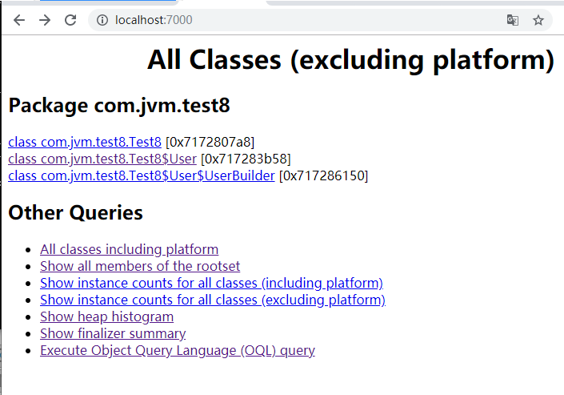

## JVM工具（五）：jhat-虚拟机堆转储快照分析工具

### jhat简介

jhat也是jdk内置的工具之一。主要是用来分析java堆的命令，可以将堆中的对象以html的形式显示出来，包括对象的数量，大小等等，并支持对象查询语言。

使用jmap等方法生成java的堆文件后，使用其进行分析。

> 示例：

- 运行代码

```java
package com.jvm.test8;
import lombok.*;
import java.util.ArrayList;
import java.util.List;
import java.util.UUID;
import java.util.concurrent.TimeUnit;
public class Test8 {
    @Getter
    @Setter
    @ToString
    @Builder
    @NoArgsConstructor
    @AllArgsConstructor
    public static class User {
        private String name;
    }
    public static void main(String[] args) throws InterruptedException {
        List<User> list = new ArrayList<>();
        for (int i = 0; i < 3000; i++) {
            for (int j = 0; j < 1000; j++) {
                list.add(User.builder().name(UUID.randomUUID().toString()).build());
            }
            TimeUnit.SECONDS.sleep(1);
        }
    }
}
```

- 导出程序执行的堆信息

```bash
C:\Users\Think>jps -l
13120 com.jvm.test8.Test8
13892
19044 org.jetbrains.idea.maven.server.RemoteMavenServer
9844 org.jetbrains.jps.cmdline.Launcher
19564 sun.tools.jps.Jps
C:\Users\Think>jmap -dump:format=b,file=D:/1.hprof 13120
Dumping heap to D:\1.hprof ...
File exists
C:\Users\Think>jmap -dump:format=b,file=D:/1.hprof 13120
Dumping heap to D:\1.hprof ...
Heap dump file created
```

- 使用jhat分析堆文件

```bash
C:\Users\Think>jhat D:/1.hprof
Reading from D:/1.hprof...
Dump file created Sun Jun 02 13:01:44 CST 2019
Snapshot read, resolving...
Resolving 2101210 objects...
Chasing references, expect 420 dots....................................................................................................................................................................................................................................................................................................................................................................................................................................
Eliminating duplicate references....................................................................................................................................................................................................................................................................................................................................................................................................................................
Snapshot resolved.
Started HTTP server on port 7000
Server is ready.
```

- 查看html
  - 访问：```http://localhost:7000/```

  

分析内存泄露问题主要会用到“Show heap histogram”“”和“OQL”，前者可以找到内存中总容量最大的对象，后者是标准的对象查询语言，使用类似于SQL的语法对内存对象进行查询统计。

选项 | 说明
---|---
All classes including platform | 显示出堆中所包含的所有的类
Show all members of the rootset | 从根集能引用到的对象
Show instance counts for all classes (including platform) | 显示所有类（包括平台）的实例计数
Show heap histogram | 堆实例的分布表
Execute Object Query Language (OQL) query | 执行对象查询语句

输入内容如：  
查询长度大于100的字符串
select s from java.lang.String s where s.count > 100

```bash
jhat中的OQL（对象查询语言）,相关文档可查看：
http://localhost:7000/oqlhelp/

如果需要根据某些条件来过滤或查询堆的对象，这是可能的，可以在jhat的html页面中执行OQL，来查询符合条件的对象

基本语法： 
select <javascript expression to select>
[from [instanceof] <class name> <identifier>]
[where <javascript boolean expression to filter>]

解释： 
(1)class name是java类的完全限定名，如：java.lang.String, java.util.ArrayList, [C是char数组, [Ljava.io.File是java.io.File[]
(2)类的完全限定名不足以唯一的辨识一个类，因为不同的ClassLoader载入的相同的类，它们在jvm中是不同类型的
(3)instanceof表示也查询某一个类的子类，如果不明确instanceof，则只精确查询class name指定的类
(4)from和where子句都是可选的
(5)java域表示：obj.field_name；java数组表示：array[index]

举例： 
(1)查询长度大于100的字符串
select s from java.lang.String s where s.count > 100
(2)查询长度大于256的数组
select a from [I a where a.length > 256
(3)显示匹配某一正则表达式的字符串
select a.value.toString() from java.lang.String s where /java/(s.value.toString())
(4)显示所有文件对象的文件路径
select file.path.value.toString() from java.io.File file
(5)显示所有ClassLoader的类名
select classof(cl).name from instanceof java.lang.ClassLoader cl
(6)通过引用查询对象
select o from instanceof 0xd404d404 o

built-in对象 -- heap 
(1)heap.findClass(class name) -- 找到类
select heap.findClass("java.lang.String").superclass
(2)heap.findObject(object id) -- 找到对象
select heap.findObject("0xd404d404")
(3)heap.classes -- 所有类的枚举
select heap.classes
(4)heap.objects -- 所有对象的枚举
select heap.objects("java.lang.String")
(5)heap.finalizables -- 等待垃圾收集的java对象的枚举
(6)heap.livepaths -- 某一对象存活路径
select heaplivepaths(s) from java.lang.String s
(7)heap.roots -- 堆根集的枚举

辨识对象的函数 
(1)classof(class name) -- 返回java对象的类对象
select classof(cl).name from instanceof java.lang.ClassLoader cl
(2)identical(object1,object2) -- 返回是否两个对象是同一个实例
select identical(heap.findClass("java.lang.String").name, heap.findClass("java.lang.String").name)
(3)objectid(object) -- 返回对象的id
select objectid(s) from java.lang.String s
(4)reachables -- 返回可从对象可到达的对象
select reachables(p) from java.util.Properties p -- 查询从Properties对象可到达的对象
select reachables(u, "java.net.URL.handler") from java.net.URL u -- 查询从URL对象可到达的对象，但不包括从URL.handler可到达的对象
(5)referrers(object) -- 返回引用某一对象的对象
select referrers(s) from java.lang.String s where s.count > 100
(6)referees(object) -- 返回某一对象引用的对象
select referees(s) from java.lang.String s where s.count > 100
(7)refers(object1,object2) -- 返回是否第一个对象引用第二个对象
select refers(heap.findObject("0xd4d4d4d4"),heap.findObject("0xe4e4e4e4"))
(8)root(object) -- 返回是否对象是根集的成员
select root(heap.findObject("0xd4d4d4d4")) 
(9)sizeof(object) -- 返回对象的大小
select sizeof(o) from [I o
(10)toHtml(object) -- 返回对象的html格式
select "<b>" + toHtml(o) + "</b>" from java.lang.Object o
(11)选择多值
select {name:t.name?t.name.toString():"null",thread:t} from instanceof java.lang.Thread t

数组、迭代器等函数 
(1)concat(enumeration1,enumeration2) -- 将数组或枚举进行连接
select concat(referrers(p),referrers(p)) from java.util.Properties p
(2)contains(array, expression) -- 数组中元素是否满足某表达式
select p from java.util.Properties where contains(referres(p), "classof(it).name == 'java.lang.Class'")
返回由java.lang.Class引用的java.util.Properties对象
built-in变量
it -- 当前的迭代元素
index -- 当前迭代元素的索引
array -- 被迭代的数组
(3)count(array, expression) -- 满足某一条件的元素的数量
select count(heap.classes(), "/java.io./(it.name)")
(4)filter(array, expression) -- 过滤出满足某一条件的元素
select filter(heap.classes(), "/java.io./(it.name)")
(5)length(array) -- 返回数组长度
select length(heap.classes())
(6)map(array,expression) -- 根据表达式对数组中的元素进行转换映射
select map(heap.classes(),"index + '-->' + toHtml(it)")
(7)max(array,expression) -- 最大值, min(array,expression)
select max(heap.objects("java.lang.String"),"lhs.count>rhs.count")
built-in变量
lhs -- 左边元素
rhs -- 右边元素
(8)sort(array,expression) -- 排序
select sort(heap.objects('[C'),'sizeof(lhs)-sizeof(rhs)')
(9)sum(array,expression) -- 求和
select sum(heap.objects('[C'),'sizeof(it)')
(10)toArray(array) -- 返回数组
(11)unique(array) -- 唯一化数组
```

