## JVM工具（八）：jvisualvm-多合一故障处理工具

### VisualVM介绍

VisualVM 是一款免费的，集成了多个 JDK 命令行工具的可视化工具，它能为您提供强大的分析能力，对 Java 应用程序做性能分析和调优。这些功能包括生成和分析海量数据、跟踪内存泄漏、监控垃圾回收器、执行内存和 CPU 分析，同时它还支持在 MBeans 上进行浏览和操作。本文主要介绍如何使用 VisualVM 进行性能分析及调优。

VisualVM位于{JAVA_HOME}/bin目录中。

点击运行，效果如下：

  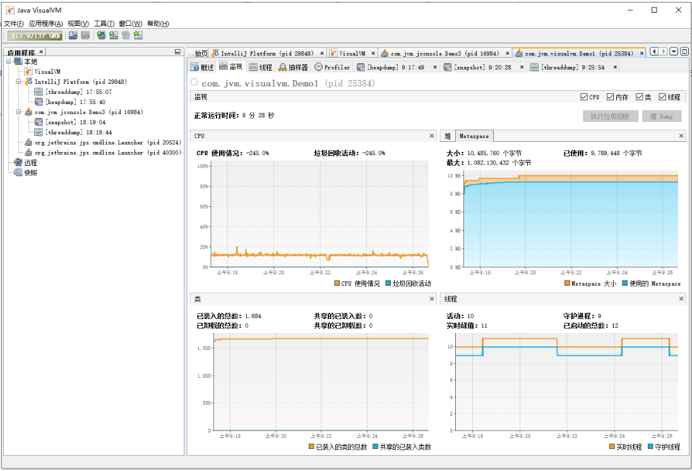

### 查看jvm配置信息

- 第一步：点击左边窗口显示正在运行的java进程

  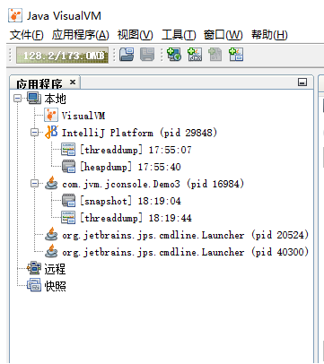

- 第二步：点击右侧窗口“概述”，可以查看各种配置信息

  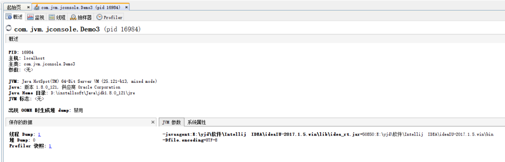

  通过jdk提供的jinfo命令工具也可以查看上面的信息。

### 查看cpu、内存、类、线程监控信息

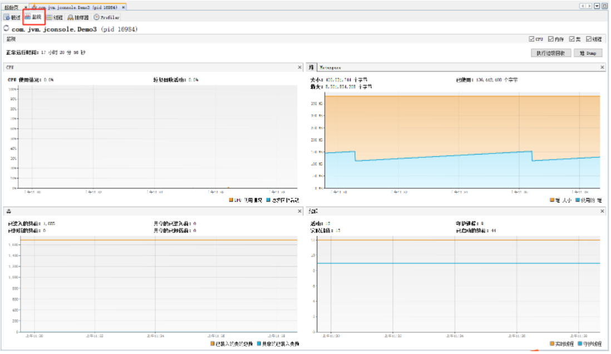

### 查看堆的变化

- 步骤一：运行下面的代码
  > 每隔3秒，堆内存使用新增100M

  ```java
  package com.jvm.visualvm;
  import java.util.ArrayList;
  import java.util.List;
  import java.util.UUID;
  import java.util.concurrent.TimeUnit;
  
  public class Demo1 {
      public static final int _1M = 1024 * 1024;
      public static void main(String[] args) throws InterruptedException {
          List<Object> list = new ArrayList<>();
          for (int i = 0; i < 1000; i++) {
              list.add(new byte[100 * _1M]);
              TimeUnit.SECONDS.sleep(3);
              System.out.println(i);
          }
      }
  }
  ```

- 步骤二：在VisualVM可以很清晰的看到堆内存变化信息。

  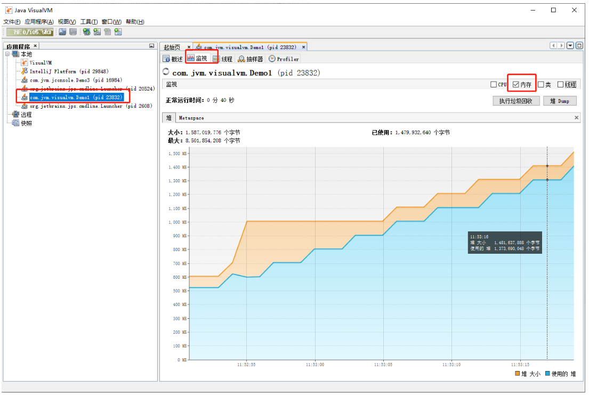

### 查看堆快照

- 步骤一：点击“监视”->”堆(dump)”可以生产堆快照信息.

  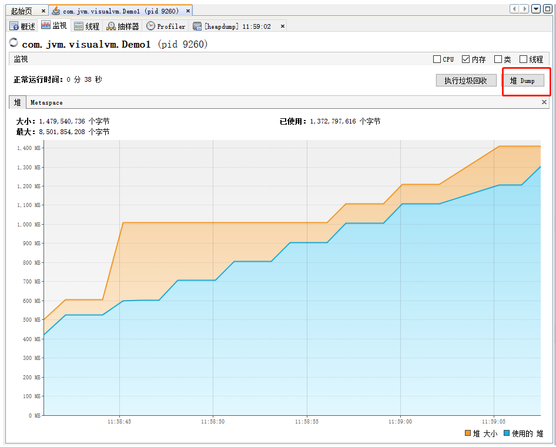

  生成了以heapdump开头的一个选项卡，内容如下：

  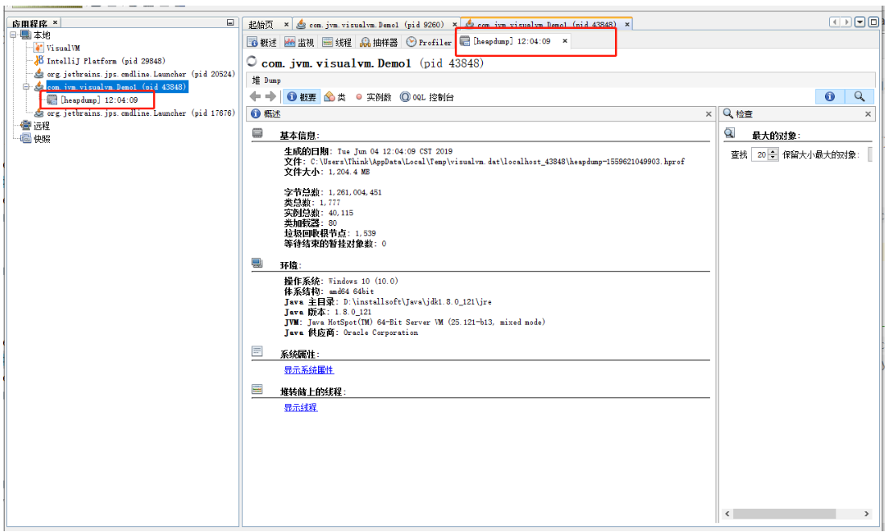

  对于“堆 dump”来说，在远程监控jvm的时候，VisualVM是没有这个功能的，只有本地监控的时候才有。

### 导出堆快照文件

- 步骤一：查看堆快照，此步骤可以参考上面的“查看堆快照”功能
- 步骤二：右键点击另存为，即可导出hprof堆快照文件，可以发给其他同事分析使用

  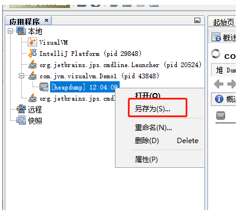

  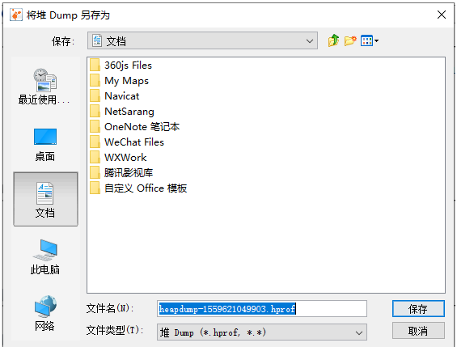

### 查看class对象加载信息
其次来看下永久保留区域PermGen使用情况

- 步骤一：运行一段类加载的程序，代码如下：

  ```java
  package com.jvm.visualvm;
  import java.io.File;
  import java.lang.reflect.Method;
  import java.net.MalformedURLException;
  import java.net.URL;
  import java.net.URLClassLoader;
  import java.util.ArrayList;
  import java.util.List;
  import java.util.concurrent.TimeUnit;

  public class Demo2 {
      private static List<Object> insList = new ArrayList<Object>();
      public static void main(String[] args) throws Exception {
          permLeak();
      }
      private static void permLeak() throws Exception {
          for (int i = 0; i < 2000; i++) {
              URL[] urls = getURLS();
              URLClassLoader urlClassloader = new URLClassLoader(urls, null);
              Class<?> logfClass = Class.forName("org.apache.commons.logging.LogFactory", true, urlClassloader);
              Method getLog = logfClass.getMethod("getLog", String.class);
              Object result = getLog.invoke(logfClass, "TestPermGen");
              insList.add(result);
              System.out.println(i + ": " + result);
              if (i % 100 == 0) {
                  TimeUnit.SECONDS.sleep(1);
              }
          }
      }
      private static URL[] getURLS() throws MalformedURLException {
          File libDir = new File("D:\\installsoft\\maven\\.m2\\repository3.3.9_0\\commons-logging\\commons-logging\\1.1.1");
          File[] subFiles = libDir.listFiles();
          int count = subFiles.length;
          URL[] urls = new URL[count];
          for (int i = 0; i < count; i++) {
              urls[i] = subFiles[i].toURI().toURL();
          }
          return urls;
      }
  }
  ```

- 步骤二：打开visualvm查看,metaspace

  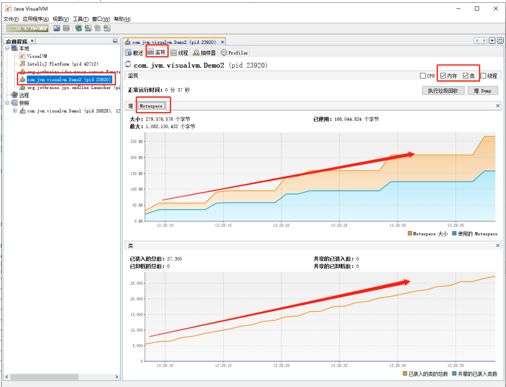

### CPU分析：发现cpu使用率最高的方法

CPU 性能分析的主要目的是统计函数的调用情况及执行时间，或者更简单的情况就是统计应用程序的 CPU 使用情况。

没有程序运行时的 CPU 使用情况如下图：

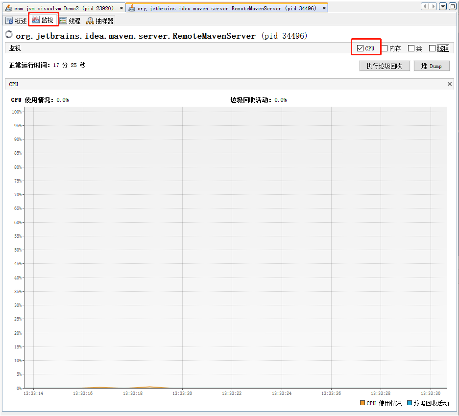

- 步骤一：运行下列程序：

  ```java
  package com.jvm.visualvm;

  public class Demo3 {
      public static void main(String[] args) throws InterruptedException {
          cpuFix();
      }
      /**
      * cpu 运行固定百分比
      *
      * @throws InterruptedException
      */
      public static void cpuFix() throws InterruptedException {
          // 80%的占有率
          int busyTime = 8;
          // 20%的占有率
          int idelTime = 2;
          // 开始时间
          long startTime = 0;
          while (true) {
              // 开始时间
              startTime = System.currentTimeMillis();
              /*
              * 运行时间
              */
              while (System.currentTimeMillis() - startTime < busyTime) {
                  ;
              }
              // 休息时间
              Thread.sleep(idelTime);
          }
      }
  }
  ```

- 步骤二：打开visualvm查看cpu使用情况，我的电脑是8核的，如下图：

  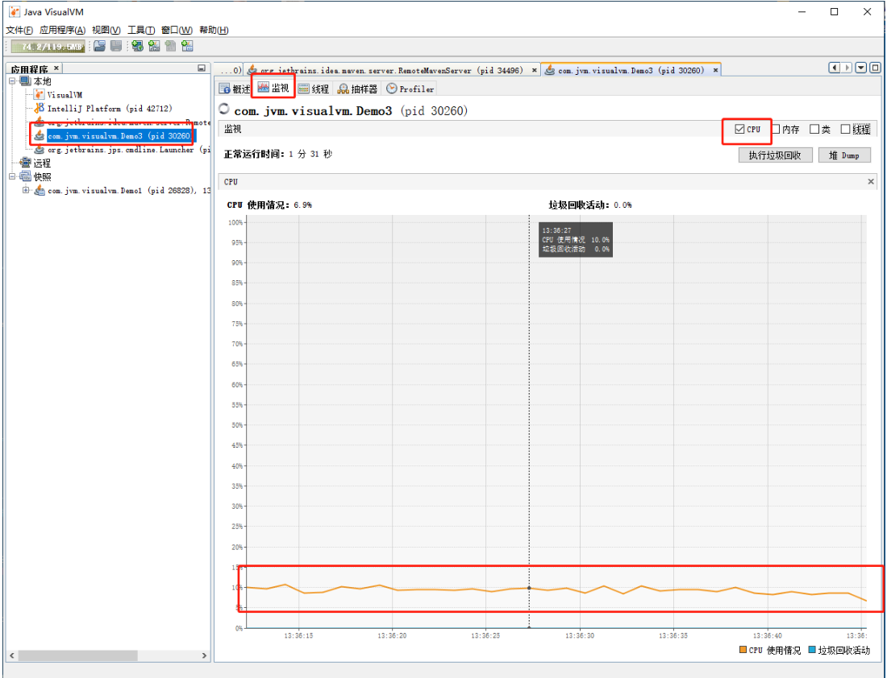

  过高的 CPU 使用率可能是我们的程序代码性能有问题导致的。可以切换到“抽样器”对cpu进行采样，可以擦看到那个方法占用的cpu最高，然后进行优化。

  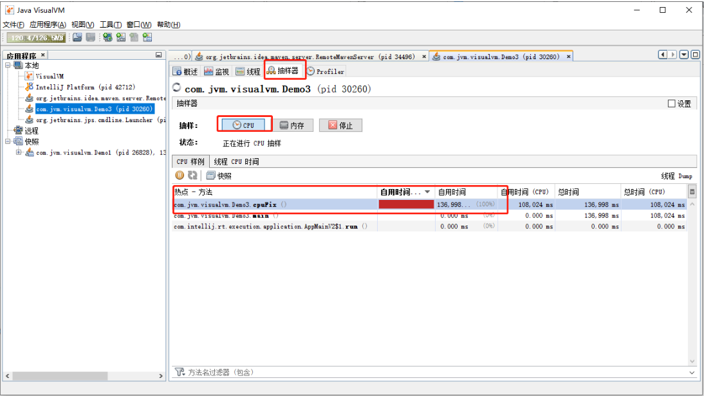

  从图中可以看出cpuFix方法使用cpu最多，然后就可以进行响应的优化了。

### 查看线程快照：发现死锁问题

Java 语言能够很好的实现多线程应用程序。当我们对一个多线程应用程序进行调试或者开发后期做性能调优的时候，往往需要了解当前程序中所有线程的运行状态，是否有死锁、热锁等情况的发生，从而分析系统可能存在的问题。

在 VisualVM 的监视标签内，我们可以查看当前应用程序中所有活动线程（Live threads）和守护线程（Daemon threads）的数量等实时信息。

可以查看线程快照，发现系统的死锁问题。

- 步骤一：运行下面的代码：

  ```java
  package com.jvm.visualvm;

  public class Demo4 {
      public static void main(String[] args) {
          Obj1 obj1 = new Obj1();
          Obj2 obj2 = new Obj2();
          Thread thread1 = new Thread(new SynAddRunalbe(obj1, obj2, 1, 2, true));
          thread1.setName("thread1");
          thread1.start();
          Thread thread2 = new Thread(new SynAddRunalbe(obj1, obj2, 2, 1, false));
          thread2.setName("thread2");
          thread2.start();
      }
      /**
      * 线程死锁等待演示
      */
      public static class SynAddRunalbe implements Runnable {
          Obj1 obj1;
          Obj2 obj2;
          int a, b;
          boolean flag;
          public SynAddRunalbe(Obj1 obj1, Obj2 obj2, int a, int b, boolean flag) {
              this.obj1 = obj1;
              this.obj2 = obj2;
              this.a = a;
              this.b = b;
              this.flag = flag;
          }
          @Override
          public void run() {
              try {
                  if (flag) {
                      synchronized (obj1) {
                          Thread.sleep(100);
                          synchronized (obj2) {
                              System.out.println(a + b);
                          }
                      }
                  } else {
                      synchronized (obj2) {
                          Thread.sleep(100);
                          synchronized (obj1) {
                              System.out.println(a + b);
                          }
                      }
                  }
              } catch (InterruptedException e) {
                  e.printStackTrace();
              }
          }
      }
      public static class Obj1 {
      }
      public static class Obj2 {
      }
  }
  ```

  程序中：thread1持有obj1的锁，thread2持有obj2的锁，thread1等待获取obj2的锁，thread2等待获取obj1的锁，相互需要获取的锁都被对方持有者，造成了死锁。程序中出现了死锁的情况，我们是比较难以发现的。需要依靠工具解决。

- 步骤二：打开visualvm查看堆栈信息：

  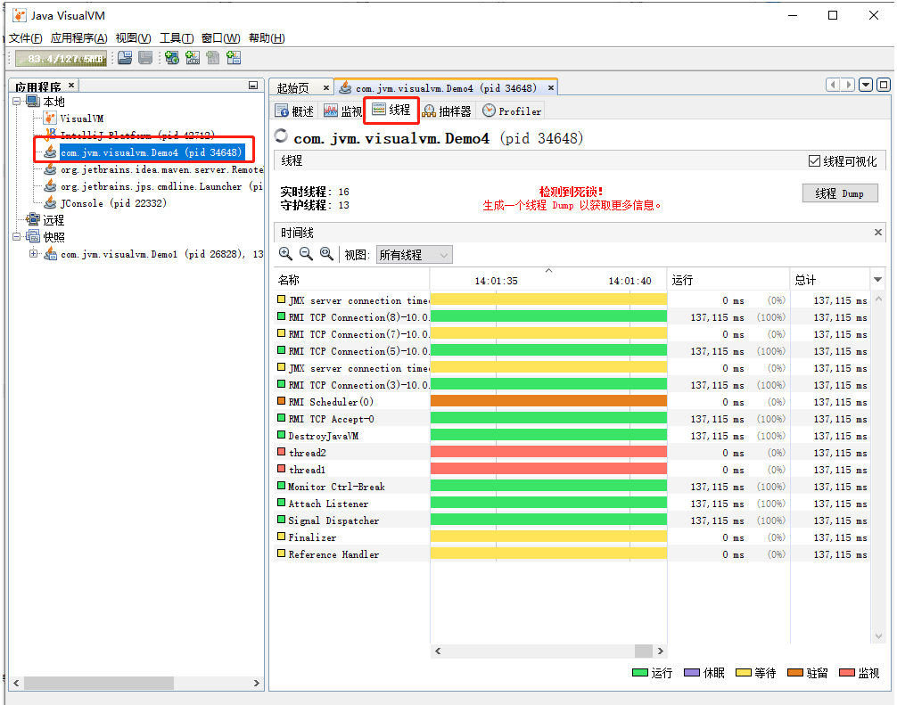

  点击dump，生成线程堆栈信息：

  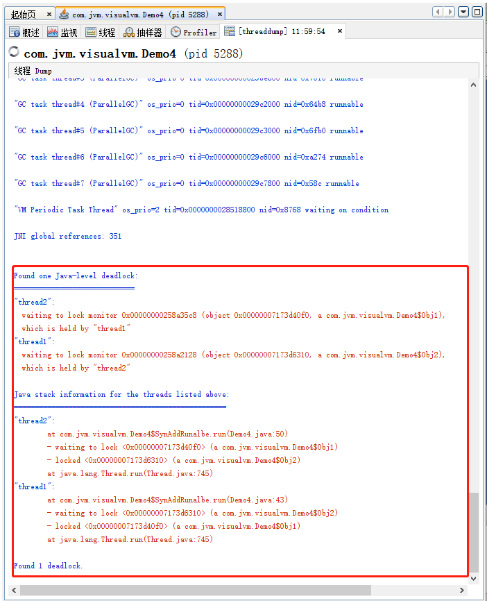

  可以看到“Found one Java-level deadlock”，包含了导致死锁的代码。
  
  ```
  "thread2":
      at com.jvm.visualvm.Demo4$SynAddRunalbe.run(Demo4.java:50)
      - waiting to lock <0x00000007173d40f0> (a com.jvm.visualvm.Demo4$Obj1)
      - locked <0x00000007173d6310> (a com.jvm.visualvm.Demo4$Obj2)
      at java.lang.Thread.run(Thread.java:745)
  "thread1":
      at com.jvm.visualvm.Demo4$SynAddRunalbe.run(Demo4.java:43)
      - waiting to lock <0x00000007173d6310> (a com.jvm.visualvm.Demo4$Obj2)
      - locked <0x00000007173d40f0> (a com.jvm.visualvm.Demo4$Obj1)
      at java.lang.Thread.run(Thread.java:745)
  ```

  上面这段信息可以看出，thread1持有Obj1对象的锁，等待获取Obj2的锁，thread2持有Obj2的锁，等待获取Obj1的锁，导致了死锁。

### 总结

本文介绍了jdk提供的一款非常强大的分析问题的一个工具VisualVM，通过他，我们可以做一下事情：
- 查看应用jvm配置信息
- 查看cpu、内存、类、线程监控信息
- 查看堆的变化
- 查看堆快照
- 导出堆快照文件
- 查看class对象加载信息
- CPU分析：发现cpu使用率最高的方法
- 分析死锁问题，找到死锁的代码

