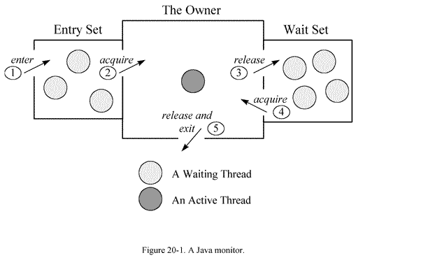
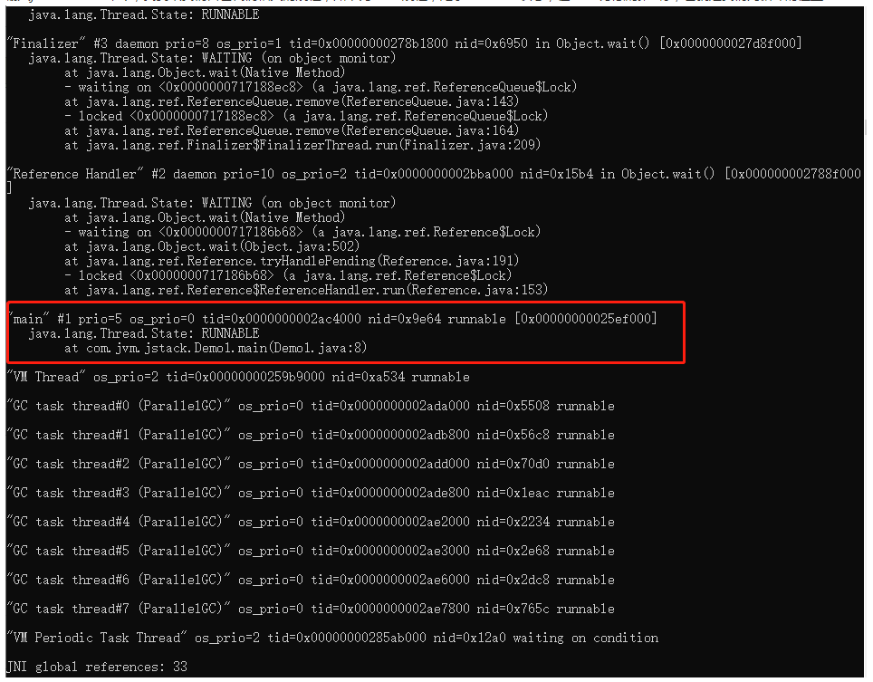
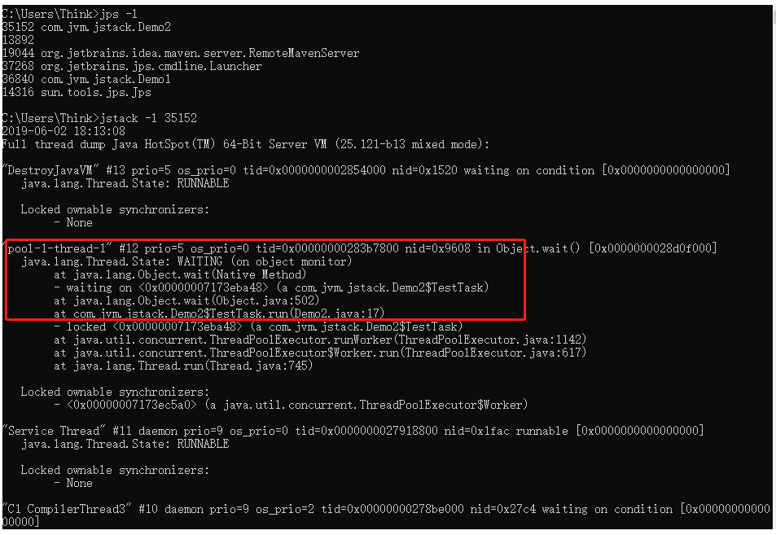
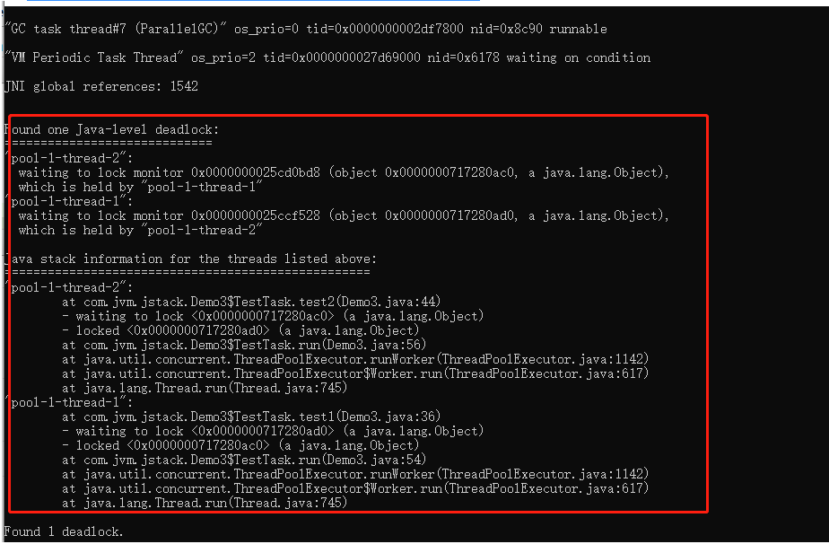
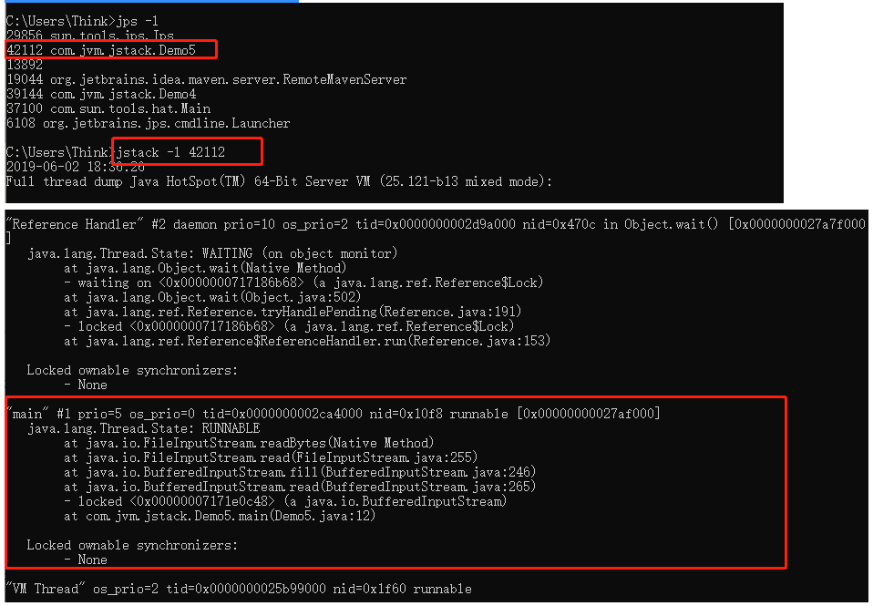

## JVM工具（六）：jstack-java堆栈跟踪工具

### jstack简介

jstack（stack trace for java）是java虚拟机自带的一种堆栈跟踪工具。jstack用于打印出给定的java进程ID或core file或远程调试服务的Java堆栈信息，如果是在64位机器上，需要指定选项”-J-d64”，Windows的jstack使用方式只支持以下的这种方式：```jstack [-l] pid```

主要分为两个功能：
- 针对活着的进程做本地的或远程的线程dump
- 针对core文件做线程dump

jstack用于生成java虚拟机当前时刻的线程快照。

线程快照是当前java虚拟机内每一条线程正在执行的方法堆栈的集合，生成线程快照的主要目的是定位线程出现长时间停顿的原因，如线程间死锁、死循环、请求外部资源导致的长时间等待等。

线程出现停顿的时候通过jstack来查看各个线程的调用堆栈，就可以知道没有响应的线程到底在后台做什么事情，或者等待什么资源。

如果java程序崩溃生成core文件，jstack工具可以用来获得core文件的java stack和native stack的信息，从而可以轻松地知道java程序是如何崩溃和在程序何处发生问题。

另外，jstack工具还可以附属到正在运行的java程序中，看到当时运行的java程序的java stack和native stack的信息, 如果现在运行的java程序呈现hung的状态，jstack是非常有用的。

> So，jstack命令主要用来查看Java线程的调用堆栈的，可以用来分析线程问题（如死锁）。

#### 线程状态

想要通过jstack命令来分析线程的情况的话，首先要知道线程都有哪些状态，下面这些状态是我们使用jstack命令查看线程堆栈信息时可能会看到的线程的几种状态：

- NEW：未启动的。不会出现在Dump中。
- RUNNABLE：在虚拟机内执行的。运行中状态，可能里面还能看到locked字样，表明它获得了某把锁。
- BLOCKED：受阻塞并等待监视器锁。被某个锁(synchronizers)給block住了。
- WATING：无限期等待另一个线程执行特定操作。等待某个condition或monitor发生，一般停留在park(), wait(),sleep(),join() 等语句里。
- TIMED_WATING：有时限的等待另一个线程的特定操作。和WAITING的区别是wait() 等语句加上了时间限制 wait(timeout)。
- TERMINATED：已退出的。

关于线程状态，具体也可以查看：java.lang.Thread.State类。

#### Monitor（监视器）

在多线程的 JAVA程序中，实现线程之间的同步，就要说说 Monitor。 Monitor是 Java中用以实现线程之间的互斥与协作的主要手段，它可以看成是对象或者 Class的锁。每一个对象都有，也仅有一个 monitor。下 面这个图，描述了线程和 Monitor之间关系，以 及线程的状态转换图：

  

  - 进入区(Entrt Set)：表示线程通过synchronized要求获取对象的锁。如果对象未被锁住，则迚入拥有者；否则则在进入区等待。一旦对象锁被其他线程释放，立即参与竞争。
  - 拥有者(The Owner)：表示某一线程成功竞争到对象锁。
  - 等待区(Wait Set)：表示线程通过对象的wait方法,释放对象的锁,并在等待区等待被唤醒。

从图中可以看出，一个 Monitor在某个时刻，只能被一个线程拥有，该线程就是 “Active Thread”，而其它线程都是 “Waiting Thread”，分别在两个队列 “ Entry Set”和 “Wait Set”里面等候。在 “Entry Set”中等待的线程状态是 “Waiting for monitor entry”，而在“Wait Set”中等待的线程状态是 “in Object.wait()”。 先看 “Entry Set”里面的线程。我们称被 synchronized保护起来的代码段为临界区。当一个线程申请进入临界区时，它就进入了 “Entry Set”队列。对应的 code就像：

```java
synchronized(obj) {
    //.........
}
```

#### 调用修饰

表示线程在方法调用时,额外的重要的操作。线程Dump分析的重要信息。修饰上方的方法调用。

> locked <地址> 目标：使用synchronized申请对象锁成功,监视器的拥有者。

> waiting to lock <地址> 目标：使用synchronized申请对象锁未成功,在迚入区等待。

> waiting on <地址> 目标：使用synchronized申请对象锁成功后,释放锁幵在等待区等待。

> parking to wait for <地址> 目标

**locked**

```
at oracle.jdbc.driver.PhysicalConnection.prepareStatement
- locked <0x00002aab63bf7f58> (a oracle.jdbc.driver.T4CConnection)
at oracle.jdbc.driver.PhysicalConnection.prepareStatement
- locked <0x00002aab63bf7f58> (a oracle.jdbc.driver.T4CConnection)
at com.jiuqi.dna.core.internal.db.datasource.PooledConnection.prepareStatement
```

通过synchronized关键字，成功获取到了对象的锁，成为监视器的拥有者，在临界区内操作。对象锁是可以线程重入的。

---

**waiting to lock**

```
at com.jiuqi.dna.core.impl.CacheHolder.isVisibleIn(CacheHolder.java:165)
- waiting to lock <0x0000000097ba9aa8> (a CacheHolder)
at com.jiuqi.dna.core.impl.CacheGroup$Index.findHolder
at com.jiuqi.dna.core.impl.ContextImpl.find
at com.jiuqi.dna.bap.basedata.common.util.BaseDataCenter.findInfo
```

通过synchronized关键字，没有获取到了对象的锁，线程在监视器的进入区等待。在调用栈顶出现，线程状态为Blocked。

---

**waiting on**

```
at java.lang.Object.wait(Native Method)
- waiting on <0x00000000da2defb0> (a WorkingThread)
at com.jiuqi.dna.core.impl.WorkingManager.getWorkToDo
- locked <0x00000000da2defb0> (a WorkingThread)
at com.jiuqi.dna.core.impl.WorkingThread.run
```

通过synchronized关键字,成功获取到了对象的锁后,调用了wait方法,进入对象的等待区等待。在调用栈顶出现,线程状态为WAITING或TIMED_WATING。

---

**parking to wait for**

park是基本的线程阻塞原语，不通过监视器在对象上阻塞。随concurrent包会出现的新的机制，与synchronized体系不同。

---

#### 线程动作

线程状态产生的原因：
- runnable：状态一般为RUNNABLE。
- in Object.wait()：等待区等待，状态为WAITING或TIMED_WAITING。
- waiting for monitor entry：进入区等待，状态为BLOCKED。
- waiting on condition：等待区等待、被park。
- sleeping：休眠的线程，调用了Thread.sleep()。

Wait on condition 该状态出现在线程等待某个条件的发生。具体是什么原因，可以结合 stacktrace来分析。 最常见的情况就是线程处于sleep状态，等待被唤醒。 常见的情况还有等待网络IO：在java引入nio之前，对于每个网络连接，都有一个对应的线程来处理网络的读写操作，即使没有可读写的数据，线程仍然阻塞在读写操作上，这样有可能造成资源浪费，而且给操作系统的线程调度也带来压力。在 NewIO里采用了新的机制，编写的服务器程序的性能和可扩展性都得到提高。 正等待网络读写，这可能是一个网络瓶颈的征兆。因为网络阻塞导致线程无法执行。一种情况是网络非常忙，几 乎消耗了所有的带宽，仍然有大量数据等待网络读 写；另一种情况也可能是网络空闲，但由于路由等问题，导致包无法正常的到达。所以要结合系统的一些性能观察工具来综合分析，比如 netstat统计单位时间的发送包的数目，如果很明显超过了所在网络带宽的限制 ; 观察 cpu的利用率，如果系统态的 CPU时间，相对于用户态的 CPU时间比例较高；如果程序运行在 Solaris 10平台上，可以用 dtrace工具看系统调用的情况，如果观察到 read/write的系统调用的次数或者运行时间遥遥领先；这些都指向由于网络带宽所限导致的网络瓶颈。

### jstack命令格式

```
jstack [ option ] pid
jstack [ option ] executable core
jstack [ option ] [server-id@]remote-hostname-or-IP
```

常用参数说明

1）options：  
executable Java executable from which the core dump was produced.(可能是产生core dump的java可执行程序)  
core 将被打印信息的core dump文件  
remote-hostname-or-IP 远程debug服务的主机名或ip  
server-id 唯一id,假如一台主机上多个远程debug服务  

2）基本参数：  
- -F 当’jstack [-l] pid’没有响应的时候，强制打印线程堆栈信息，一般情况不需要使用
- -l 长列表. 打印关于锁的附加信息，例如属于java.util.concurrent的ownable synchronizers列表，会使得JVM停顿得长久得多（可能会差很多倍，比如普通的jstack可能几毫秒和一次GC没区别，加了-l 就是近一秒的时间），-l 建议不要用，一般情况不需要使用
- -m 打印java和native c/c++框架的所有栈信息.可以打印JVM的堆栈，显示上Native的栈帧，一般应用排查不需要使用
- -h | -help打印帮助信息
- pid 需要被打印配置信息的java进程id，可以用jps查询

### 使用示例

#### jstack pid

```
~$ jps -ml
org.apache.catalina.startup.Bootstrap 
~$ jstack 5661
2013-04-16 21:09:27
Full thread dump Java HotSpot(TM) Server VM (20.10-b01 mixed mode):
"Attach Listener" daemon prio=10 tid=0x70e95400 nid=0x2265 waiting on condition [0x00000000]
   java.lang.Thread.State: RUNNABLE
"http-bio-8080-exec-20" daemon prio=10 tid=0x08a35800 nid=0x1d42 waiting on condition [0x70997000]
   java.lang.Thread.State: WAITING (parking)
    at sun.misc.Unsafe.park(Native Method)
    - parking to wait for  <0x766a27b8> (a java.util.concurrent.locks.AbstractQueuedSynchronizer$ConditionObject)
    at java.util.concurrent.locks.LockSupport.park(LockSupport.java:156)
    at java.util.concurrent.locks.AbstractQueuedSynchronizer$ConditionObject.await(AbstractQueuedSynchronizer.java:1987)
    at java.util.concurrent.LinkedBlockingQueue.take(LinkedBlockingQueue.java:399)
    at org.apache.tomcat.util.threads.TaskQueue.take(TaskQueue.java:104)
    at org.apache.tomcat.util.threads.TaskQueue.take(TaskQueue.java:32)
    at java.util.concurrent.ThreadPoolExecutor.getTask(ThreadPoolExecutor.java:947)
    at java.util.concurrent.ThreadPoolExecutor$Worker.run(ThreadPoolExecutor.java:907)
    at java.lang.Thread.run(Thread.java:662)
........
```

#### 死循环

- 写个死循环代码

```java
package com.jvm.jstack;

 public class Demo1 {
     public static void main(String[] args) {
         while (true) {
         }
     }
 }
```

- 运行代码
- cmd中执行jps查看程序进程id

```
C:\Users\Think>jps -l
35600 com.jvm.jstack.Demo1
```

进程id为 35600

- 输入jstack 35600命令，找到跟我们自己代码相关的线程，如下为main线程，处于runnable状态，在main方法的第8行，也就是我们死循环的位置

  

#### Object.wait()情况

执行下列代码：

```java
package com.jvm.jstack;
import java.util.concurrent.ExecutorService;
import java.util.concurrent.Executors;

public class Demo2 {
    static class TestTask implements Runnable {
        @Override
        public void run() {
            synchronized (this) {
                try {
                    //等待被唤醒
                    wait();
                } catch (InterruptedException e) {
                    e.printStackTrace();
                }
            }
        }
    }
    public static void main(String[] args) {
        ExecutorService ex = Executors.newFixedThreadPool(1);
        ex.execute(new TestTask());
    }
}
```



#### 死锁情况

写个死锁的例子

```java
 package com.jvm.jstack;
 import java.util.concurrent.ExecutorService;
 import java.util.concurrent.Executors;
 
 public class Demo3 {
     public static void main(String[] args) {
         Object obj1 = new Object();
         Object obj2 = new Object();
         ExecutorService ex = Executors.newFixedThreadPool(2);
         // 起10个线程
         for (int i = 0; i < 10; i++) {
             int order = i % 2 == 0 ? 1 : 0;
             ex.execute(new TestTask(order, obj1, obj2));
         }
     }
     static class TestTask implements Runnable {
         private Object obj1;
         private Object obj2;
         private int order;
         public TestTask(int order, Object obj1, Object obj2) {
             this.order = order;
             this.obj1 = obj1;
             this.obj2 = obj2;
         }
         public void test1() throws InterruptedException {
             synchronized (obj1) {
                 synchronized (obj2) {
                     System.out.println("test。。。");
                 }
             }
         }
         public void test2() throws InterruptedException {
             synchronized (obj2) {
                 synchronized (obj1) {
                     System.out.println("test。。。");
                 }
             }
         }
         @Override
         public void run() {
             while (true) {
                 try {
                     if (this.order == 1) {
                         this.test1();
                     } else {
                         this.test2();
                     }
                 } catch (InterruptedException e) {
                     e.printStackTrace();
                 }
             }
         }
     }
 }
```

运行上面代码产生死锁

先通过jsp查找到程序的进程，然后通过jstack查看线程堆栈，很快就可以发现死锁



#### 等待io

- 运行代码

```java
 package com.jvm.jstack;
 import java.io.IOException;
 import java.io.InputStream;
 
 public class Demo5 {
     public static void main(String[] args) throws IOException {
         InputStream is = System.in;
         int i = is.read();
         System.out.println("exit。");
     }
 }
```

- 和上面一样，jps获取进程，jstack获取线程堆栈信息

