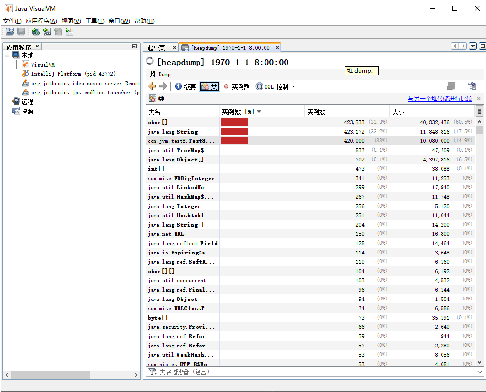

## JVM工具（四）：jmap-java内存映射工具

### jmap简介

jdk安装后会自带一些小工具，jmap命令(Memory Map for Java)是其中之一。主要用于打印指定Java进程(或核心文件、远程调试服务器)的共享对象内存映射或堆内存细节。

jmap命令可以获得运行中的jvm的堆的快照，从而可以离线分析堆，以检查内存泄漏，检查一些严重影响性能的大对象的创建，检查系统中什么对象最多，各种对象所占内存的大小等等。可以使用jmap生成Heap Dump。

如果不想使用jmap命令，要想获取Java堆转储快照还有一些比较“暴力”的手段：譬如在前面用过的 -XX:+HeapDumpOnOutOfMemoryError参数，可以让虚拟机在OOM异常出现之后自动生成dump文件，通过-XX:+HeapDumpOnCtrlBreak参数可以使用[ctrl]+[Break]键让虚拟机生成dump文件，又或者在Linux系统下通过Kill -3 命令发送进程退出信息“恐吓”一下虚拟机，也能拿到dump文件。

jmap的作用并不仅仅是为了获取dump文件，他还可以查询finalize执行队列，java堆和永久代的详细信息，如空间使用率、当前用的是哪种收集器等。

### jmap命令格式

```bash
[root@ady01 ~]# jmap
Usage:
    jmap [option] <pid>
        (to connect to running process)
    jmap [option] <executable <core>
        (to connect to a core file)
    jmap [option] [server_id@]<remote server IP or hostname>
        (to connect to remote debug server)
where <option> is one of:
    <none>               to print same info as Solaris pmap
    -heap                to print java heap summary
    -histo[:live]        to print histogram of java object heap; if the "live"
                         suboption is specified, only count live objects
    -clstats             to print class loader statistics
    -finalizerinfo       to print information on objects awaiting finalization
    -dump:<dump-options> to dump java heap in hprof binary format
                         dump-options:
                           live         dump only live objects; if not specified,
                                        all objects in the heap are dumped.
                           format=b     binary format
                           file=<file>  dump heap to <file>
                         Example: jmap -dump:live,format=b,file=heap.bin <pid>
    -F                   force. Use with -dump:<dump-options> <pid> or -histo
                         to force a heap dump or histogram when <pid> does not
                         respond. The "live" suboption is not supported
                         in this mode.
    -h | -help           to print this help message
    -J<flag>             to pass <flag> directly to the runtime system
```

主要选项：

选项 | 作用
---|---
-dump | 生成java堆转储快照，格式为：-dump:[live,]format=b,file=<filename>,其中live子参数说明是否只dump出存活对象
-finalizerinfo | 显示在F-Queue中等待Finalizer线程执行finalize方法的对象，只在linux/solaris平台下有效
-heap | 显示堆详细信息，如使用哪种回收期、参数配置、分带状况等，只在linux/solaris平台下有效
-histo | 显示堆中对象统计信息，包括类、实例数量和合计容量
-permstat | 以ClassLoader为统计口径显示永久代内存状况，只在linux/solaris平台下有效
-F | 当虚拟机进程对-dump选项没有响应时，可以使用这个选项强制生成dump快照，只在linux/solaris平台下有效

### jmap -dump：生成java堆转储快照

生成java对转存快照，格式：jmap -dump:[live,]format=b,file=文件名 <pid>

```bash
C:\Users\Think>jmap -dump:live,format=b,file=D:/1.hprof 24956
Dumping heap to D:\1.hprof ...
Heap dump file created
```

可以使用jdk提供的jvisualvm.exe查看hprof文件




### jmap -heap：显示堆详细信息

> 命令格式：jmap -heap pid

```bash
[root@ady01 ~]# jmap -heap 25867
Attaching to process ID 25867, please wait...
Debugger attached successfully.
Server compiler detected.
JVM version is 25.181-b13
using thread-local object allocation.
Parallel GC with 2 thread(s)
Heap Configuration:
   MinHeapFreeRatio         = 0
   MaxHeapFreeRatio         = 100
   MaxHeapSize              = 4164943872 (3972.0MB)
   NewSize                  = 87031808 (83.0MB)
   MaxNewSize               = 1388314624 (1324.0MB)
   OldSize                  = 175112192 (167.0MB)
   NewRatio                 = 2
   SurvivorRatio            = 8
   MetaspaceSize            = 21807104 (20.796875MB)
   CompressedClassSpaceSize = 1073741824 (1024.0MB)
   MaxMetaspaceSize         = 17592186044415 MB
   G1HeapRegionSize         = 0 (0.0MB)
Heap Usage:
PS Young Generation
Eden Space:
   capacity = 47710208 (45.5MB)
   used     = 2632072 (2.5101394653320312MB)
   free     = 45078136 (42.98986053466797MB)
   5.516790033696772% used
From Space:
   capacity = 1048576 (1.0MB)
   used     = 770128 (0.7344512939453125MB)
   free     = 278448 (0.2655487060546875MB)
   73.44512939453125% used
To Space:
   capacity = 524288 (0.5MB)
   used     = 0 (0.0MB)
   free     = 524288 (0.5MB)
   0.0% used
PS Old Generation
   capacity = 220200960 (210.0MB)
   used     = 98595728 (94.02821350097656MB)
   free     = 121605232 (115.97178649902344MB)
   44.77533976236979% used
38803 interned Strings occupying 4463232 bytes.
```

### jmap -histo：显示堆中对象统计信息

> 显示堆中对象统计信息，包括类、实例数量和合计容量

> 命令格式：jmap -histo[:live] pid

```bash
C:\Users\Think>jmap -histo 28252
 num     #instances         #bytes  class name
----------------------------------------------
   1:        309006       16963968  [C
   2:          1081        7275840  [I
   3:         41164        3156952  [B
   4:         90125        2163000  java.lang.String
   5:         21000         672000  java.util.UUID
   6:         21000         336000  com.jvm.test8.Test8$User
   7:         21000         336000  com.jvm.test8.Test8$User$UserBuilder
   8:           799         300072  [Ljava.lang.Object;
   9:          7557         181368  java.lang.StringBuilder
  10:           772          87704  java.lang.Class
  11:          1026          65664  sun.nio.fs.WindowsFileAttributes
  12:          1026          49248  sun.nio.fs.WindowsPath$WindowsPathWithAttributes
  13:           837          33480  java.util.TreeMap$Entry
  14:          1032          33024  java.lang.ref.WeakReference
  15:           775          31000  sun.nio.fs.WindowsPath
  16:          1028          24672  sun.nio.fs.WindowsPathParser$Result
  17:           424          13568  java.io.File
  18:           168          12096  java.lang.reflect.Field
  19:           299          11960  java.util.LinkedHashMap$Entry
  20:           323          11200  [Ljava.lang.String;
  21:           173          11072  java.net.URL
  22:           341          10912  sun.misc.FDBigInteger
  23:           312           9984  java.util.Hashtable$Entry
  24:            66           8992  [Ljava.util.HashMap$Node;
  25:           267           8544  java.util.HashMap$Node
  26:           195           7800  java.lang.ref.Finalizer
  27:           264           6336  java.lang.StringBuffer
  28:           121           4840  java.lang.ref.SoftReference
  29:            29           4816  [Ljava.util.Hashtable$Entry;
  30:            50           4800  java.util.jar.JarFile$JarFileEntry
  31:           105           4552  [[C
  32:            53           4240  [Ljava.util.WeakHashMap$Entry;
  33:            74           4144  sun.misc.URLClassPath$JarLoader
  34:           258           4128  java.lang.Integer
  35:            50           4000  java.util.zip.ZipEntry
  36:            79           3792  java.net.NetworkInterface
  37:           150           3600  java.net.Parts
  38:           111           3552  java.util.concurrent.ConcurrentHashMap$Node
  39:           134           3216  java.security.Provider$ServiceKey
  40:            50           3200  java.util.jar.JarFile
  41:            55           3080  sun.nio.cs.UTF_8$Encoder
  42:             8           3008  java.lang.Thread
  43:            62           2976  java.util.HashMap
  44:            51           2856  java.util.zip.ZipFile$ZipFileInputStream
  45:           114           2736  java.io.ExpiringCache$Entry
  46:            53           2544  java.util.WeakHashMap
  47:            30           2400  java.lang.reflect.Constructor
  48:            56           2240  java.util.WeakHashMap$Entry
  49:            39           2184  java.util.zip.ZipFile$ZipFileInflaterInputStream
```