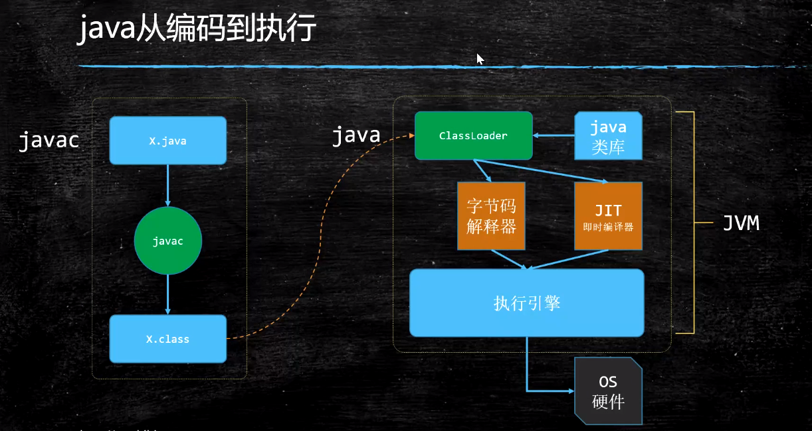
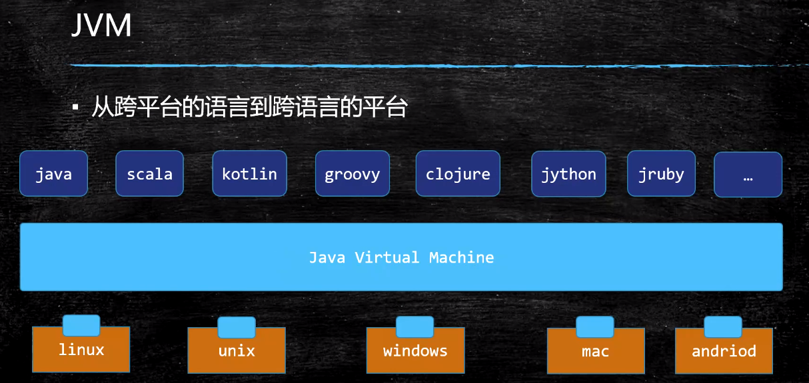
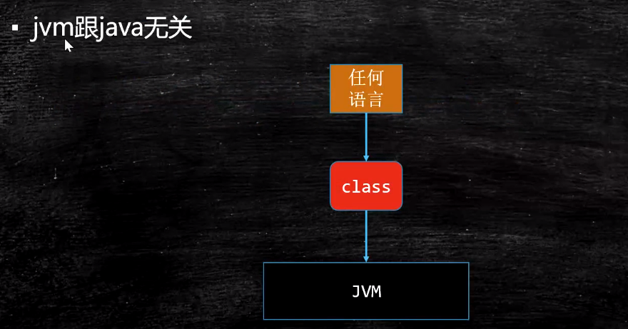
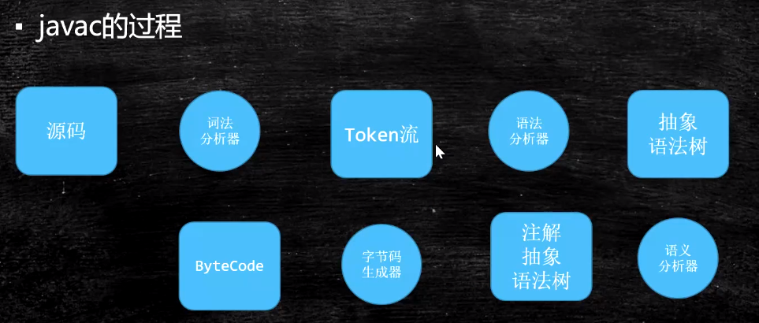
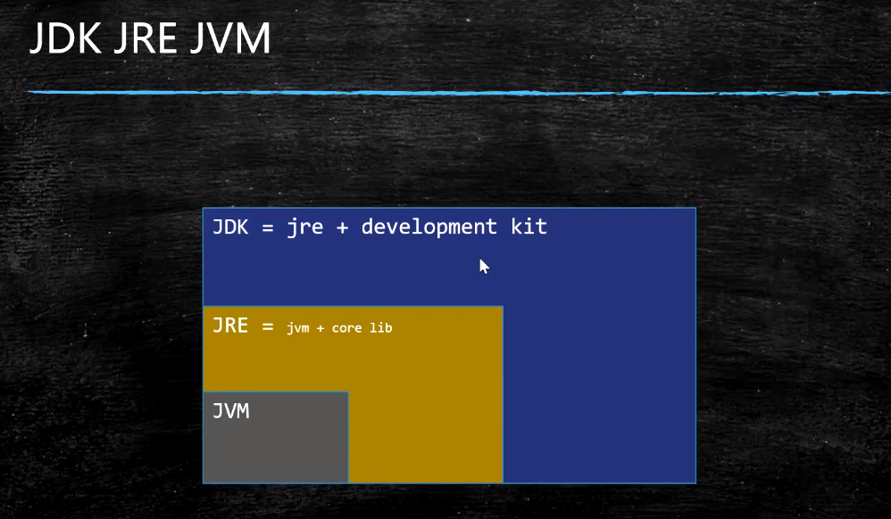

## JVM（一）：JVM入门

### 1.JVM基础知识

  

Java的解释和编译是可以混合的。

  

100多种语言可以直接运行在JVM虚拟机上

  

- JVM是一种规范
  - java virtual machine specifications
  - https://docs.oracle.com/en/java/javase/13/
  - https://docs.oracle.com/javase/specs/index.html
- JVM是虚构出来的一台计算机
  - 字节码指令集（汇编语言）
  - 内存管理：栈 堆 方法区等

### 2.javac的过程

  

### 3.常见的JVM实现
- Hotspot
  - oracle官方，我们做实验用的JVM
  - java -version
- Jrockit
  - BEA，曾经号称世界上最快的JVM
  - 被Oracle收购，合并与hotspot
- J9-IBM
- Microsoft VM
- TaobaoVM
  - hotspot深度定制版
- LiquidVM
  - 直接针对硬件
- azul zing
  - 最新垃圾回收的业界标杆
  - www.azul.com

### 4.JVM/JRE/JDK

  
