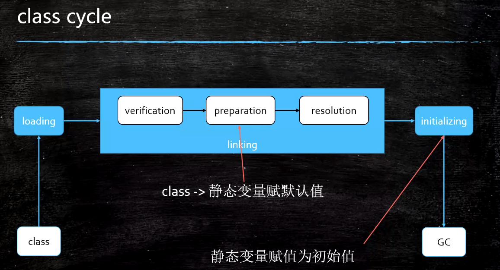
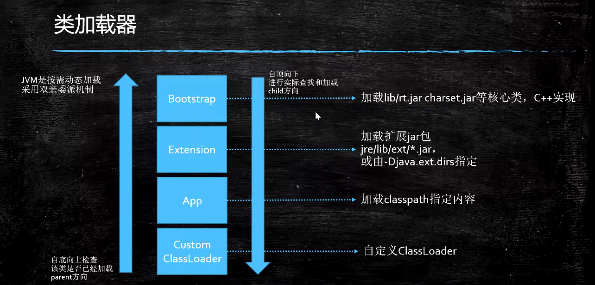
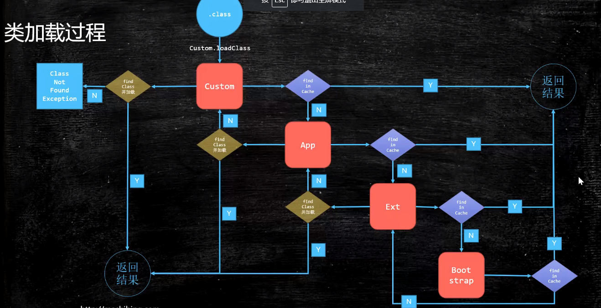
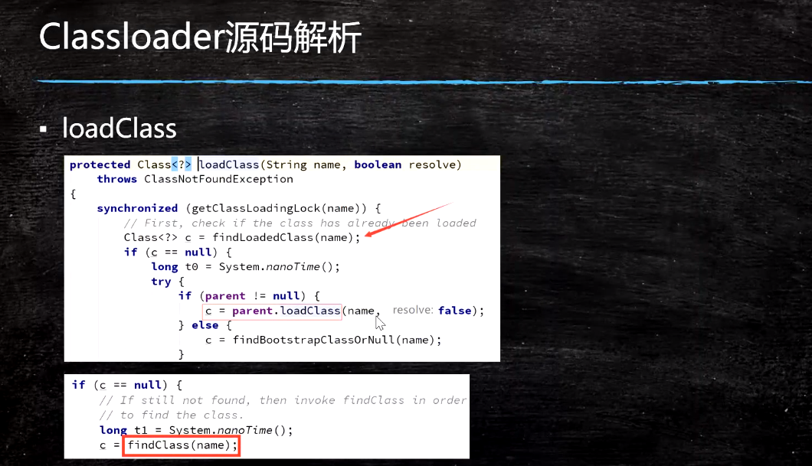

## JVM（三）：ClassLoadingLinkingInitializing



- 类加载过程
  - Loading：将Class文件加载到内存中
    - 类加载器

      

    - 类加载器中的类加载过程

      

    - 类加载器范围
      - （来自Launcher源码）
        - sun.boot.class.path
          - Bootstrap ClassLoader加载路径
        - java.ext.dirs
          - ExtensionClassLoader加载路径
        - java.class.path
          - AppClassLoader加载路径

      - 测试代码

        ```java
        package com.lele.jvm.classloader;

        /**
         * @author: lele
         * @date: 2021/5/3 20:30
         * @description:
         */
        public class T003_ClassLoaderScope {
            public static void main(String[] args) {
                String pathBoot = System.getProperty("sun.boot.class.path");
                System.out.println(pathBoot.replaceAll(";",System.lineSeparator()));

                System.out.println("------------------------");
                String pathExt = System.getProperty("java.ext.dirs");
                System.out.println(pathExt.replaceAll(";",System.lineSeparator()));

                System.out.println("------------------------");
                String pathApp = System.getProperty("java.class.path");
                System.out.println(pathApp.replaceAll(";",System.lineSeparator()));

            }
        }
        ```
    - 双亲委派，主要出于安全来考虑（为什么要搞双亲委派）
      - 父加载器不是“类加载器的加载器”，也不是“类加载器的父类加载器”
      - 双亲委派是一个孩子向父亲方向，然后父亲向孩子方向的双亲委派过程。
    - lazyloading（lazyInitializing）必须初始化的五种情况：
      - new getstatic putstatic invokestatic指令，访问final变量除外
      - java.lang.reflect对类进行反射调用时
      - 初始化子类的时候，父类首先初始化
      - 虚拟机启动时，被执行的主类必须初始化
      - 动态语言支持java.lang.invoke.MethodHandle解析的结果为REF_getstatic REF_putstatic REF_invokestatic的方法句柄时，该类必须初始化；
    - ClassLoader的源码
      - findInCache -> parent.loadClass -> findClass()

      

      - 如果是AppClassLoader首先会执行URLClassLoader的findClass方法
      - ClassLoader源码中用到了 模板方法 设计模式
    - 自定义类加载器
      - extends ClassLoader（继承ClassLoader）
      - overwrite findClass() -> defineClass(byte[] -> Class clazz)（重写模板方法findClass，调用defineClass）
      - 加密（自定义加载器加载自加密的class，防止反编译，防止篡改）
      - parent是用super(parent)指定；
      - 双亲委派的打破
        - 重写loadClass()可以打破双亲委派
        - 何时打破过？
          - jdk1.2之前，自定义ClassLoader都必须重写loadClass()
          - ThreadContextClassLoader可以实现基础类调用实现类代码，通过thread.setContextClassLoader指定；
          - 热启动，热部署
            - osgi tomcat 都有自己的模块指定classloader（可以加载同一类库的不同版本）
    - 混合执行 编译执行 解释执行
      - 解释器（bytecode intepreter）
      - JIT（Just In-Time compiler）
      - 混合模式
        - 混合使用解释器+热点代码编译
        - 起始阶段采用解释执行
        - 热点代码检测
          - 多次被调用的方法（方法计数器：检测方法执行效率）
          - 多次被调用的循环（循环计数器：检测循环执行效率）
          - 进行编译
      - -Xmixed 默认为混合模式，开始解释执行，启动速度较快对热点代码实行检测和编译
      - -Xint 使用纯解释模式，启动很快，执行较慢
      - -Xcomp 使用纯编译模式，执行很快，启动很慢（很多类的时候）
      - -XX:CompileThreshold=10000 检测热点代码
  - Linking
    - Verification（校验）：验证文件是否符合JVM规定
    - Preparation：静态成员变量赋默认值
    - Resolution（解析）：将类、方法、属性等符号引用解析为直接引用；常量池中的各种符号引用解析为指针、偏移量等内存地址的直接引用
      - 符号引用（虚拟机未给变量分配内存空间，只是一个符号）：以一组符号来描述所引用的目标，符号可以是任何形式的字面量，只要使用时能够无歧义的定位到目标即可，使用符号引用时，被引用的目标不一定已经加载到内存中。
      - 直接引用（虚拟机已经给变量分配了内存空间，有真实的指针指向）：可以是直接指向目标的指针，相对偏移量，一个能间接定位到目标的句柄，使用直接引用时，引用的目标必定已经存在于虚拟机的内存中了。
      - 为什么在解析阶段要符号引用转直接引用？
        - 如果使用符号引用，虚拟机其实也不知道具体引用的类的内存地址，那么也就无法真正的调用到该类，所以要把符号引用转为直接引用，这样就能够真正定位到类在内存中的地址，如果符号引用转直接引用失败，就说明类还没有被加载到内存中，就会报错。
  - Initializing：调用类初始化代码<clinit>，给静态成员变量赋初始值；
- 小总结：
  - load - 默认值 - 初始值
  - new - 申请内存 - 默认值 - 初始值
