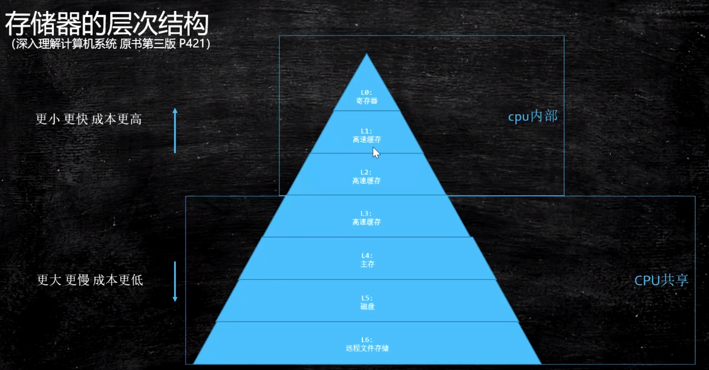
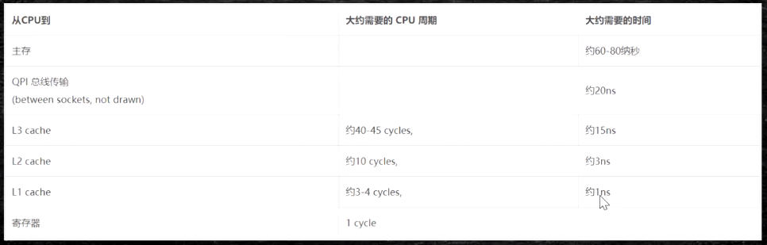
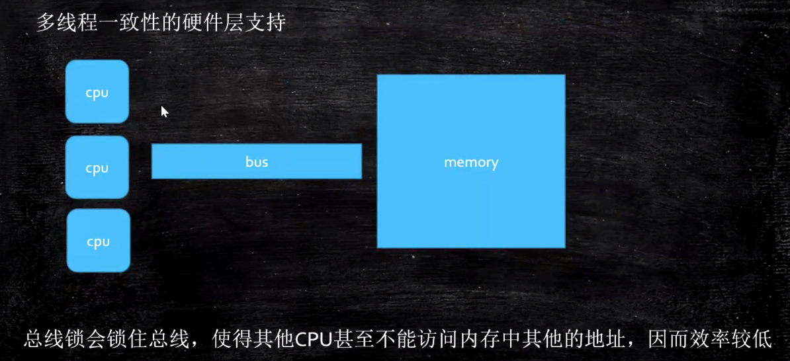
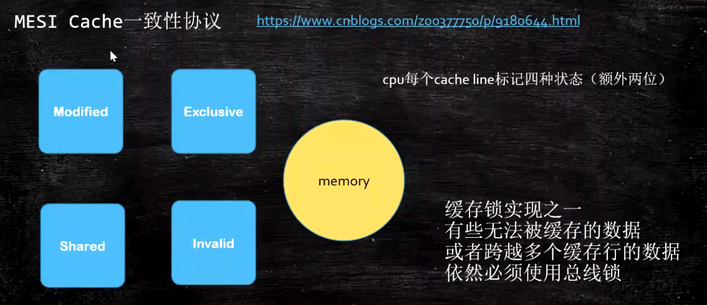
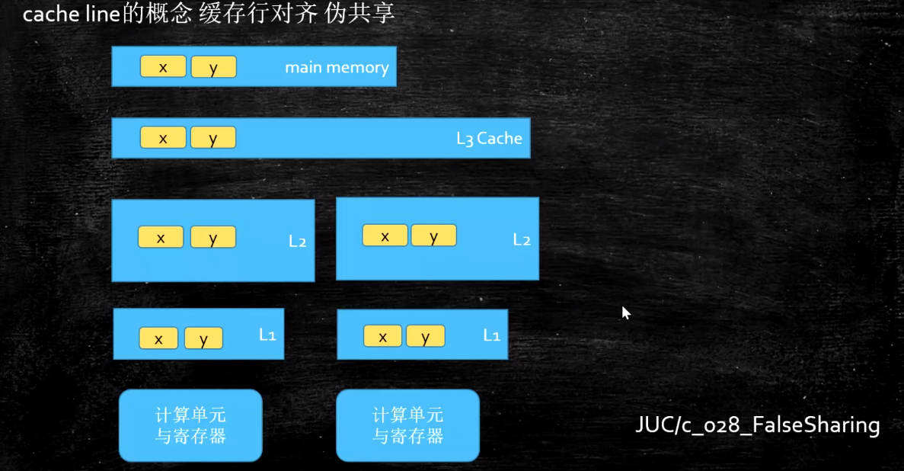
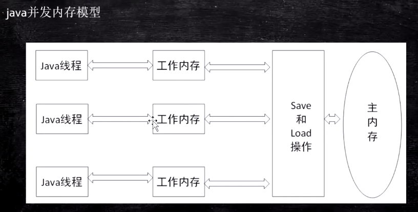
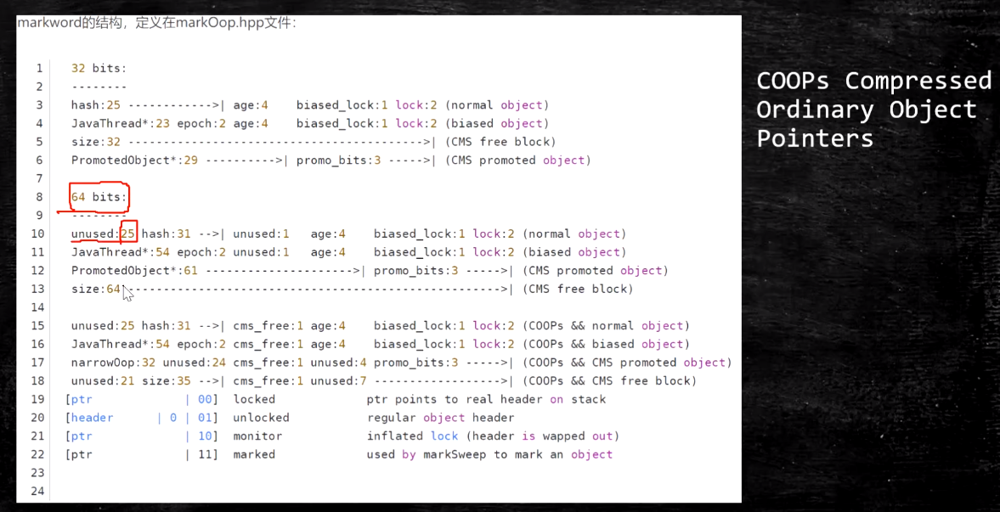
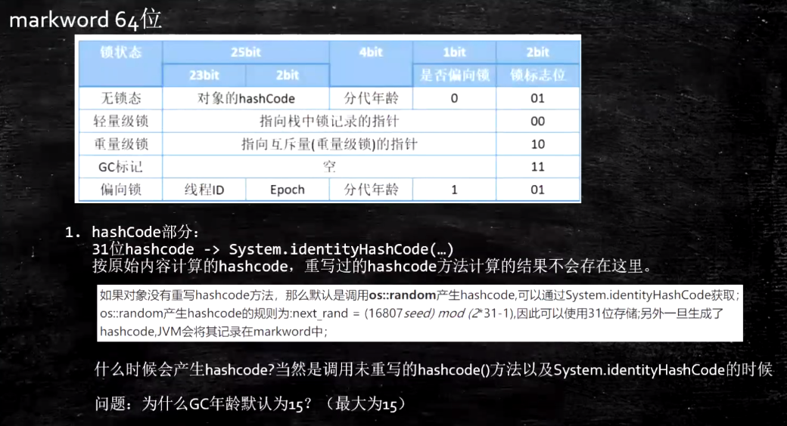
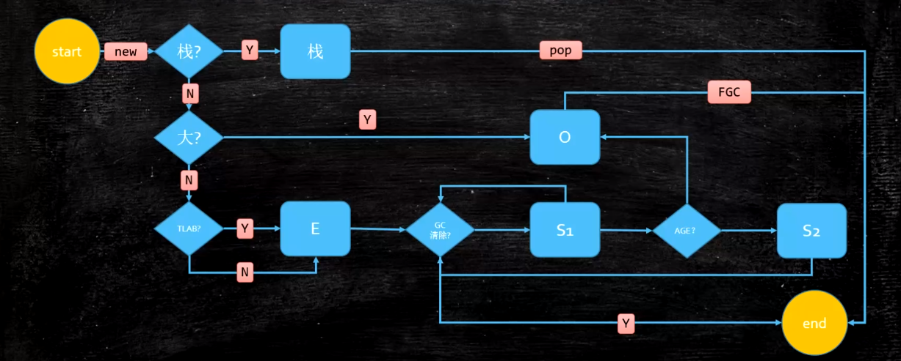

## JVM（四）：Java内存模型（JMM）

### 硬件层的并发优化基础知识
- 存储器的层次结构

  

- 从CPU到各层所需要的时间

  

#### 硬件层数据一致性协议
- 多线程一致性的硬件层支持(老的CPU使用的)

  

- Intel中的MESI-Cache一致性协议

  

- 协议很多，Intel采用MESI（https://www.cnblogs.com/z00377750/p/9180644.html）
- 现代CPU数据一致性实现 = 缓存锁（MESI...） + 总线锁
- 读取缓存以cache line为基本单位，目前64bytes；
- 伪共享：位于同一缓存行的两个不同数据，被两个不同CPU锁定，产生互相影响的伪共享问题；
  - 使用缓存行的对齐能够提高效率
  - 伪共享问题：JUC/c_028_FalseSharing
  - cache line的概念-缓存行对齐-伪共享

  

    - 验证示例代码

    ```java
    package com.lele.juc.c_028_FalseSharing;
    import java.util.Random;

    public class T01_CacheLinePadding {
        private static class T {
            public volatile long x = 0L;
        }

        public static T[] arr = new T[2];

        static {
            arr[0] = new T();
            arr[1] = new T();
        }

        public static void main(String[] args) throws Exception {
            Thread t1 = new Thread(()->{
                for (long i = 0; i < 1000_0000L; i++) {
                    arr[0].x = i;
                }
            });

            Thread t2 = new Thread(()->{
                for (long i = 0; i < 1000_0000L; i++) {
                    arr[1].x = i;
                }
            });

            final long start = System.nanoTime();
            t1.start();
            t2.start();
            t1.join();
            t2.join();
            System.out.println((System.nanoTime() - start)/100_0000);
        }
    }
    ```
    ```java
    package com.lele.juc.c_028_FalseSharing;

    public class T02_CacheLinePadding {
        private static class Padding {
            public volatile long p1, p2, p3, p4, p5, p6, p7;
        }

        private static class T extends Padding {
            public volatile long x = 0L;
        }

        public static T[] arr = new T[2];

        static {
            arr[0] = new T();
            arr[1] = new T();
        }

        public static void main(String[] args) throws Exception {
            Thread t1 = new Thread(()->{
                for (long i = 0; i < 1000_0000L; i++) {
                    arr[0].x = i;
                }
            });

            Thread t2 = new Thread(()->{
                for (long i = 0; i < 1000_0000L; i++) {
                    arr[1].x = i;
                }
            });

            final long start = System.nanoTime();
            t1.start();
            t2.start();
            t1.join();
            t2.join();
            System.out.println((System.nanoTime() - start)/100_0000);
        }
    }
    ```

#### 乱序问题
- 乱序问题

  

- CPU为了提高指令执行效率，会在一条指令执行过程中（比如：去内存读数据（慢100倍）），去同时执行另一条指令，前提是两条指令没有依赖关系（https://www.cnblogs.com/liushaodong/p/4777308.html）；
- CPU的写操作也可以合并（https://www.cnblogs.com/liushaodong/p/4777308.html）；
- WCBuffer只有4个位置，如果合并写的时候大于4个位置，则会分两次（比如：合并写6个，一次写6个比两次（每次写3个）效率低）；
- JUC/029_WriteCombining
  - 示例验证代码

    ```java
    package com.lele.juc.c_029_WriteCombining;

    public final class WriteCombining {

        private static final int ITERATIONS = Integer.MAX_VALUE;
        private static final int ITEMS = 1 << 24;
        private static final int MASK = ITEMS - 1;

        private static final byte[] arrayA = new byte[ITEMS];
        private static final byte[] arrayB = new byte[ITEMS];
        private static final byte[] arrayC = new byte[ITEMS];
        private static final byte[] arrayD = new byte[ITEMS];
        private static final byte[] arrayE = new byte[ITEMS];
        private static final byte[] arrayF = new byte[ITEMS];

        public static void main(final String[] args) {

            for (int i = 1; i <= 3; i++) {
                System.out.println(i + " SingleLoop duration (ns) = " + runCaseOne());
                System.out.println(i + " SplitLoop  duration (ns) = " + runCaseTwo());
            }
        }

        public static long runCaseOne() {
            long start = System.nanoTime();
            int i = ITERATIONS;

            while (--i != 0) {
                int slot = i & MASK;
                byte b = (byte) i;
                arrayA[slot] = b;
                arrayB[slot] = b;
                arrayC[slot] = b;
                arrayD[slot] = b;
                arrayE[slot] = b;
                arrayF[slot] = b;
            }
            return System.nanoTime() - start;
        }

        public static long runCaseTwo() {
            long start = System.nanoTime();
            int i = ITERATIONS;
            while (--i != 0) {
                int slot = i & MASK;
                byte b = (byte) i;
                arrayA[slot] = b;
                arrayB[slot] = b;
                arrayC[slot] = b;
            }
            i = ITERATIONS;
            while (--i != 0) {
                int slot = i & MASK;
                byte b = (byte) i;
                arrayD[slot] = b;
                arrayE[slot] = b;
                arrayF[slot] = b;
            }
            return System.nanoTime() - start;
        }
    }
    ```
- 乱序执行的证明：JVM/jmm/Disorder
  - 示例验证代码

    ```java
    package com.mashibing.jvm.c3_jmm;

    public class T04_Disorder {
        private static int x = 0, y = 0;
        private static int a = 0, b =0;

        public static void main(String[] args) throws InterruptedException {
            int i = 0;
            for(;;) {
                i++;
                x = 0; y = 0;
                a = 0; b = 0;
                Thread one = new Thread(new Runnable() {
                    public void run() {
                        //由于线程one先启动，下面这句话让它等一等线程two. 读着可根据自己电脑的实际性能适当调整等待时间.
                        //shortWait(100000);
                        a = 1;
                        x = b;
                    }
                });

                Thread other = new Thread(new Runnable() {
                    public void run() {
                        b = 1;
                        y = a;
                    }
                });
                one.start();other.start();
                one.join();other.join();
                String result = "第" + i + "次 (" + x + "," + y + "）";
                if(x == 0 && y == 0) {
                    System.err.println(result);
                    break;
                } else {
                    //System.out.println(result);
                }
            }
        }

        public static void shortWait(long interval){
            long start = System.nanoTime();
            long end;
            do{
                end = System.nanoTime();
            }while(start + interval >= end);
        }
    }
    ```

##### 如何保证特定情况下不乱序
- 硬件内存保障（X86）
  - sfence（save fence）：在sfence指令前的写操作当必须在sfence指令后的写操作前完成；
  - lfence（load fence）：在lfence值指令前的读操作当必须在lfence指令后的读操作前完成；
  - mfence（modify/mix fence）：在mfence指令前的读写操作当作必须在mfence指令后的读写操作前完成；
  > 原子指令，如X86上的“lock...”指令是一个Full Barrier，执行时会锁住内存子系统来确保执行顺序，甚至跨多个CPU。Software Locks通常使用了内存屏障或原子指令来实现变量可见性和保持程序顺序。
- JVM级别如何规范（JSR133）
  1. LoadLoad屏障：
    对于这样的语句Load1;LoadLoad;Load2,在Load2及后续读取操作要读取的数据被访问前，保证Load1要读取的数据被读取完毕。
  2. StoreStore屏障：对于这样的语句Store1;StoreStore;Store2，在Store2及后续写入操作前，保证Store1的写入操作对其他处理器可见。
  3. LoadStore屏障：对于这样的语句Load1; LoadStore; Store2，在Store2及后续写入操作被刷出前，保证Load1要读取的数据被读取完毕。
  4. StoreLoad屏障：对于这样的语句Store1; StoreLoad; Load2，在Load2及后续所有读取操作执行前，保证Store1的写入对所有处理器可见。

- volatile的实现细节
  1. 字节码层面 ACC_VOLATILE
  2. JVM层面 volatile内存区的读写 都加屏障
      > StoreStoreBarrier
      >
      > volatile 写操作
      >
      > StoreLoadBarrier

      > LoadLoadBarrier
      >
      > volatile 读操作
      >
      > LoadStoreBarrier
  3. OS和硬件层面
      - https://blog.csdn.net/qq_26222859/article/details/52235930
      - hsdis - HotSpot Dis Assembler
      - windows lock 指令实现 | MESI实现

- synchronized实现细节
  1. 字节码层面
      - ACC_SYNCHRONIZED
      - monitorenter monitorexit
  2. JVM层面
      - C C++ 调用了操作系统提供的同步机制
  3. OS和硬件层面
      - X86 : lock cmpxchg / xxx
      - https://blog.csdn.net/21aspnet/article/details/88571740

### java8大原子操作（虚拟机规范）
> 已弃用，了解即可

**最新的JSR-133已经放弃这种描述，但JMM没有变化。《深入理解Java虚拟机》P364**

  

- lock：主内存，标识变量为线程独占；
- unlock：主内存，解锁线程独占变量；
- read：主内存，读取内容到工作内存；
- load：工作内存，read后的值放入线程本地变量副本；
- use：工作内存，传值给执行引擎；
- assign：工作内存，执行引擎结果赋值给线程本地变量；
- store：工作内存，存值到主内存给write备用
- write：主内存，写变量值；

### happens-before原则（JVM规定重排序必须遵守的规则）
> JLS17.4.5

- 程序次序规则：同一个线程内，按照代码出现的顺序，前面的代码先行于后面的代码，准确的说是控制流顺序，因为要考虑到分支和循环结构；
- 管程锁定规则：一个unlock操作先行发生于后面（时间上）对同一个锁的lock操作；
- volatile变量规则：对一个volatile变量的写操作先行发生于后面（时间上）对这个变量的读操作；
- 线程启动规则：Thread的start()方法先行发生于这个线程的每一个操作；
- 线程终止规则：线程的所有操作都先行于此线程的终止检测。可以通过Thread.join()方法结束、Thread.isAlive()的返回值等手段检测线程的终止。
- 线程中断规则：对线程interrupt()方法的调用先行发生于被中断线程的代码检测到中断事件的发生，可以通过Thread.interrupt()方法检测线程是否中断。
- 对象终结规则：一个对象的初始化完成先行于发生它的finalize()方法的开始；
- 传递性：如果操作A先行于操作B，操作B先行于操作C，那么操作A先行于操作C；

> as if serial
>
> 不管如何重排序，单线程执行结果不会改变。

### 对象的内存布局

#### 对象的创建过程
1. class loading
2. class linking(verification, preparation, resolution)
3. class initializing
4. 申请对象内存
5. 成员变量赋默认值
6. 调用构造方法<init>
    - 成员变量顺序赋初始值
    - 执行构造方法语句

#### 使用JavaAgent测试Object的大小
##### 对象大小（64位机）
###### 观察虚拟机配置
```
java -XX:+PrintCommandLineFlags -version
```

###### 普通对象
1. 对象头：markword  8个字节
2. ClassPointer指针：-XX:+UseCompressedClassPointers 为4字节 不开启为8字节
3. 实例数据
  引用类型：-XX:+UseCompressedOops 为4字节 不开启为8字节
Oops Ordinary Object Pointers
4. Padding对齐，8的倍数，4个字节；

###### 数组对象
1. 对象头：markword 8个字节
2. ClassPointer指针同上
3. 数组长度：4字节
4. 数组数据
5. Padding对齐 8的倍数，4个字节

##### 实验
- 新建项目ObjectSize （1.8）
- 创建文件ObjectSizeAgent
  ```java
  package com.lele.jvm.agent;

  import java.lang.instrument.Instrumentation;

  public class ObjectSizeAgent {
      private static Instrumentation inst;

      public static void premain(String agentArgs, Instrumentation _inst) {
          inst = _inst;
      }

      public static long sizeOf(Object o) {
          return inst.getObjectSize(o);
      }
  }
  ```
- src目录下创建META-INF/MANIFEST.MF
  ```
  Manifest-Version: 1.0
  Created-By: lele.com
  Premain-Class: com.lele.jvm.agent.ObjectSizeAgent
  ```
  注意Premain-Class这行必须是新的一行（回车 + 换行），确认idea不能有任何错误提示

- 打包jar文件
- 在需要使用该Agent Jar的项目中引入该Jar包
project structure - project settings - library 添加该jar包
- 运行时需要该Agent Jar的类，加入参数：
```
  -javaagent:C:\work\ijprojects\ObjectSize\out\artifacts\ObjectSize_jar\ObjectSize.jar
```

- 如何使用该类：

  ```java
  package com.lele.jvm.c3_jmm;

  import com.mashibing.jvm.agent.ObjectSizeAgent;

  public class T03_SizeOfAnObject {
     public static void main(String[] args) {
         System.out.println(ObjectSizeAgent.sizeOf(new Object()));
         System.out.println(ObjectSizeAgent.sizeOf(new int[] {}));
         System.out.println(ObjectSizeAgent.sizeOf(new P()));
     }

     private static class P {
                         //8 _markword
                         //4 _oop指针
         int id;         //4
         String name;    //4
         int age;        //4

         byte b1;        //1
         byte b2;        //1

         Object o;       //4
         byte b3;        //1
     }
  }
  ```

- markword 64位

  

  


##### Hotspot开启内存压缩的规则（64位机）
- 4G以下，直接砍掉高32位
- 4G - 32G，默认开启内存压缩 ClassPointers Oops
- 32G，压缩无效，使用64位
- 内存并不是越大越好（^-^）

##### IdentityHashCode的问题
回答白马非马的问题：
当一个对象计算过identityHashCode之后，不能进入偏向锁状态

https://cloud.tencent.com/developer/article/1480590

https://cloud.tencent.com/developer/article/1484167 

https://cloud.tencent.com/developer/article/1485795 

https://cloud.tencent.com/developer/article/1482500

##### 对象定位
https://blog.csdn.net/clover_lily/article/details/80095580
- 句柄池(垃圾回收效率高)
- 直接指针(HotSpot使用)

##### 对象的分配

  
