# JVM：GC和GC-Tuning

### GC的基础知识

#### 1.什么是垃圾
> C语言申请内存：malloc free
>
> C++： new delete
>
> Java: new ？
>
> 自动内存回收，编程上简单，系统不容易出错，手动释放内存，容易出两种类型的问题：
>
> 1. 忘记回收
> 2. 多次回收

没有任何引用指向的一个对象或者多个对象（循环引用）

#### 2.如何定位垃圾
- 引用计数（Reference Count）
  > 不能解决循环引用的问题

  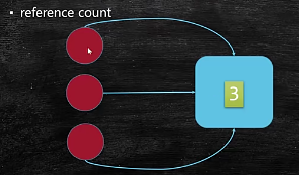

  对象的引用数变为0了，那么该对象就成为垃圾了。

  

- 根可达算法（Root Searching）
  - 从根对象开始搜索
  - 根对象：从程序运行起来后，马上需要的的对象；
  - 根对象包含：
    - JVM stack
    - native method stack
    - run-time constant pool
    - static references in method area
    - Clazz

  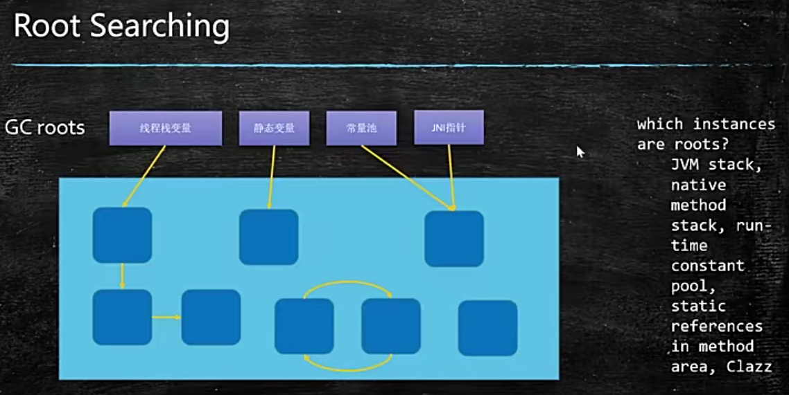

#### 3.常见的垃圾回收算法
- 标记清除（Mark-Sweep）
  - 首先找到有用的对象，然后将没有用的标记出来，然后清除；
  - 算法相对简单，存活对象比较多的情况下效率较高；
  - 两遍扫描（第一次找有用的，第二次找没有用的），效率偏低；
  - 位不连续，容易产生碎片；
- 拷贝算法（Copying）----适合Eden区YGC
  - 将内存一分为二，将存活对象拷贝到未使用区域，然后清除；
  - 适用于存活对象较少的情况；
  - 只扫描一次，效率提高；
  - 没有碎片，但浪费空间；
  - 移动复制对象，需要调整对象引用；
- 标记压缩（Mark-Compact）----适合FGC
  - 将所有整理、清理的过程都压缩到头上去（有用的对象往头上挪）
  - 不会产生内存减半；
  - 不会产生碎片，方便对象分配；
  - 扫描两次，需要移动对象，效率偏低；

- 标记清除

  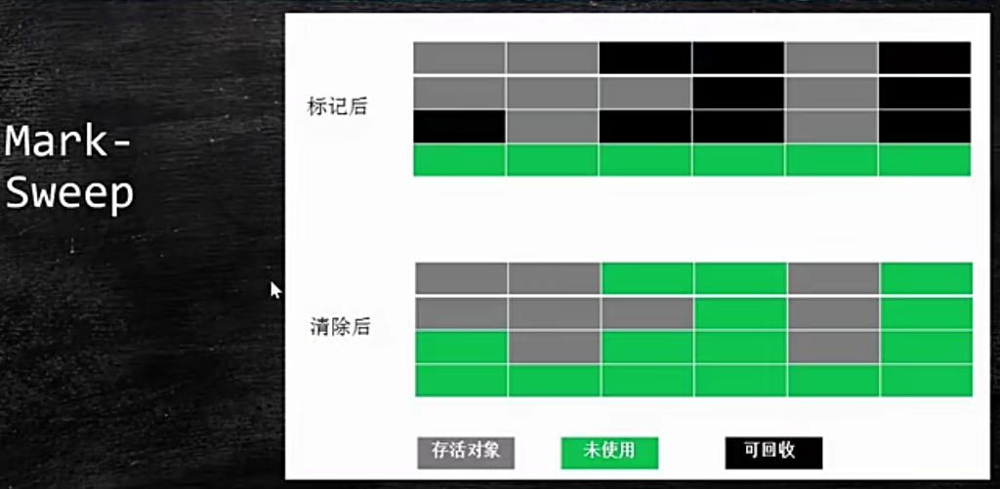

- 拷贝算法

  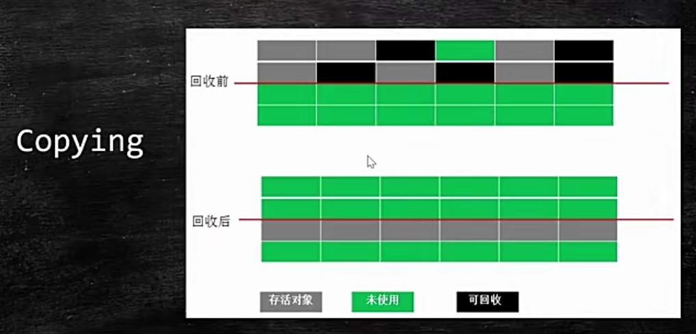

- 标记压缩

  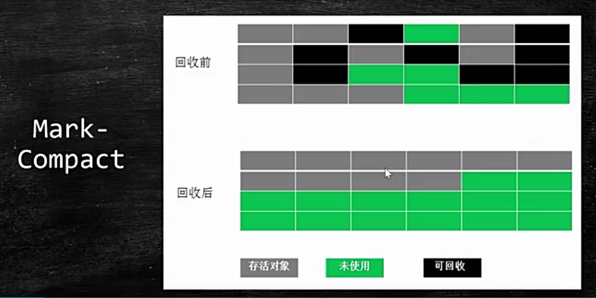

#### 4.JVM内存分代模型（用于分代垃圾回收算法）
**新生代：老年代 = 1:2**
1. 部分垃圾回收器使用的模型
    - 除Epslion、ZGC、Shenandoah之外的GC都是使用逻辑分代模型；
    - G1是逻辑分代，物理不分代；
    - 除此之外不仅逻辑分代，而且物理分代；
2. 新生代 + 老年代 + 永久代（jdk1.7）Perm Generation/ 元数据区(jdk1.8) Metaspace
   1. 永久代/元数据：装Class对象
   2. 永久代必须指定大小限制；元数据可以设置，也可以不设置，无上限（受限于物理内存）
   3. 字符串常量存放： 1.7 - 永久代；1.8 - 堆
   4. MethodArea逻辑概念 - 永久代、元数据
3. 新生代 = Eden（伊甸） + 2个suvivor区

    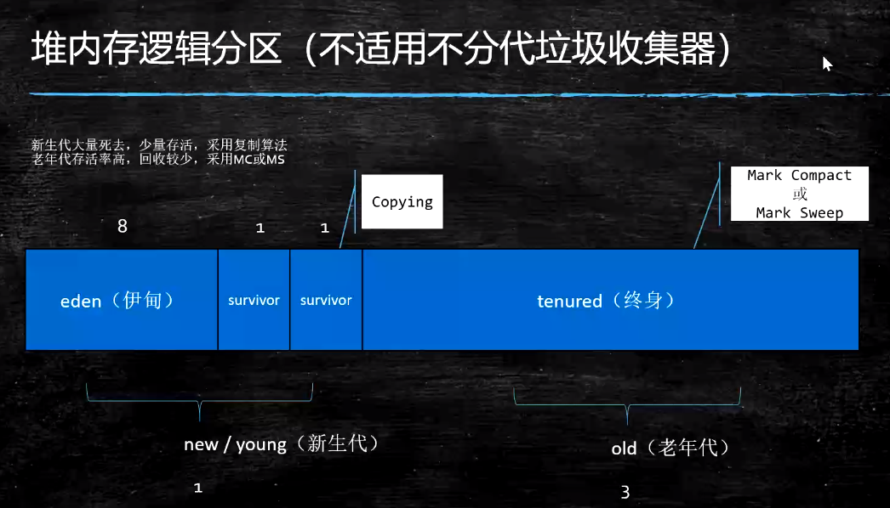

   1. YGC（young GC）回收之后，大多数的对象会被回收，活着的进入s0
   2. 再次YGC，活着的对象eden + s0 -> s1
   3. 再次YGC，eden + s1 -> s0
   4. 年龄足够 -> 老年代 （15 CMS 6）
   5. s区装不下 -> 老年代
4. 老年代
   1. 顽固分子
   2. 老年代满了，会触发FGC（Full GC）
5. GC Tuning (Generation)
   1. 尽量减少FGC（FGC会停止用户所有线程，效率比较慢，会出现卡顿现象）
   2. MinorGC = YGC：年轻代空间耗尽时触发；
   3. MajorGC = FGC：在老年代无法继续分配空间时触发，新生代老年代同时进行回收；


> 对象分配详解
- 栈上分配
  - 线程私有小对象
  - 无逃逸：就在某一段代码使用
  - 支持标量替换：普通的变量来代替整个对象
  - 无需调整（调优）
- 线程本地分配TLAB（Thread Local Allocation Buffer）
  - 占用eden，默认1%（每个线程独有，效率提高）
  - 多线程的时候不用竞争eden就可以申请空间，提高效率
  - 小对象
  - 无需调整（调优）
- 老年代
  - 大对象
- eden

> 对象何时进入老年代
- 超过 XX:MaxTenuringThreshold 指定次数（YGC）
  - Parallel Scavenge 15
  - CMS 6
  - G1 15
- 动态年龄（不重要）
  - Eden + s0 -> s1 ： 超过s1的50%，把年龄最大的对象放入老年代；
- 分配担保（不重要）：YGC期间，survivor区空间不够了，空间担保直接进入老年代

> 对象的分配过程图

  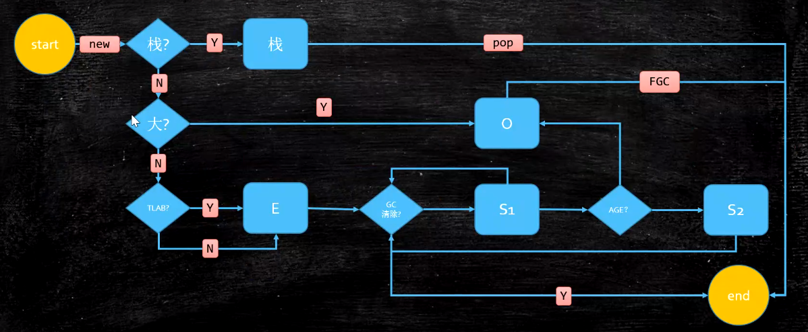


#### 5.常见的垃圾回收器
> JDk 诞生 Serial追随，提高效率，诞生了PS，为了配合CMS，诞生了PN，CMS是1.4版本后期引入，CMS是里程碑式的GC，它开启了并发回收的过程，但是CMS毛病较多，因此目前没有任何一个JDK默认GC是CMS。

> 并发垃圾回收是因为无法忍受STW


> 图中连在一起的，都可以组合

  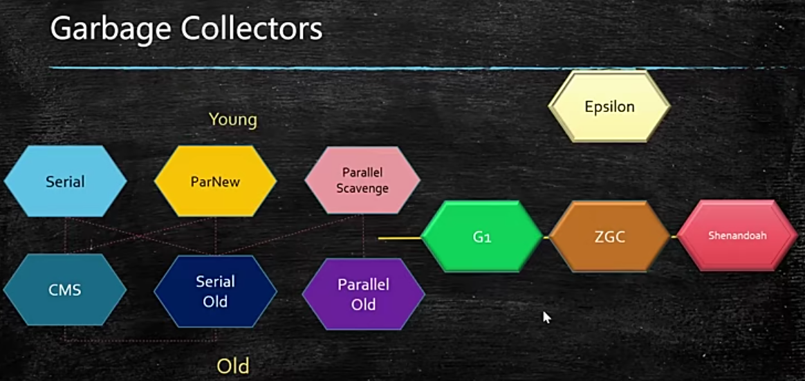

> 常见的垃圾回收器的组合
- Serial 和 Serial Old
- Parallel Scavenge 和 Parallel Old
- ParNew 和 CMS


> 常见的十种垃圾回收器

- Serial（单线程）：干活的时候，所有的工作线程都停止了；
  - STW（stop-the-world，停顿时间），然后清理垃圾
  - safe point：线程停止，不是立马停止，需要找到安全点才能停止；
  - 年轻代 串行回收
  - 现在用的很少

  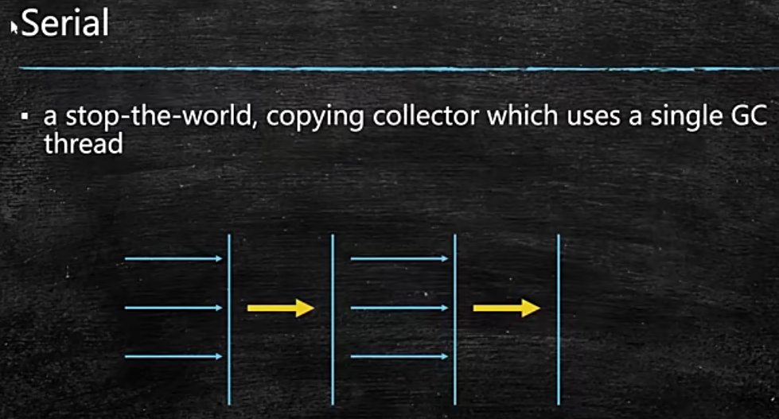

- Parallel Scavenge（多线程）
  - STW（stop-the-world，停顿时间），然后清理垃圾
  - 年轻代 并行回收

  

- Parallel New
  - STW（stop-the-world，停顿时间），然后清理垃圾
  - 年轻代；
  - 配合CMS的并行回收

  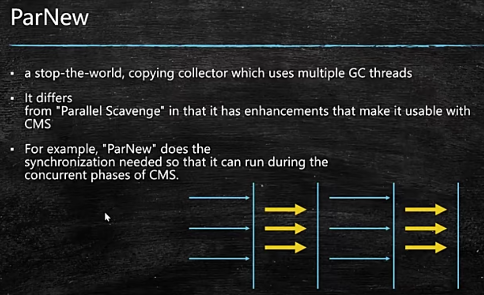

- SerialOld 老年代
- ParallelOld 老年代
- ConcurrentMarkSweep（CMS使用的是 三色标记+Incremental Update算法）：老年代 并发的， 垃圾回收和应用程序同时运行，降低STW的时间(200ms)
  - 初始标记（多线程）：STW，只标记GC root上的不可回收的，垃圾不多，短时间能完成；
  - 并发标记：一边标记，一边清理，最浪费时间；
  - 重新标记（多线程）：STW，并发标记中产生的新垃圾需要重新标记，垃圾不多，短时间完成；
  - 并发清理：会产生新的垃圾（浮动垃圾需等下一次CMS来清掉）

  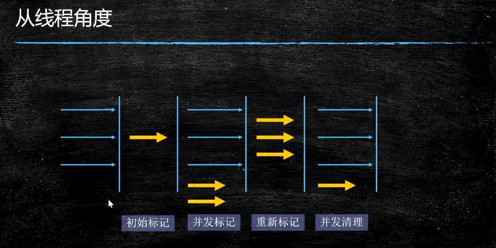

  - CMS的问题
    - Memory Fragmentation（内存碎片化）：新的对象不能往老年代装的时候，CMS会变成SerialOld，单线程清理；
       - -XX:+UseCMSCompactAtFullCollection
       - -XX:CMSFullGCsBeforeCompaction 默认为0，指的是经过多少次FGC才进行压缩
    - Floating Garbage（浮动垃圾）：
      - Concurrent Mode Failure：老年代满了，同时浮动垃圾没有清理完，这时会用SerialOld
      - 解决方案：降低触发CMS的阈值
    - PromotionFailed
      - 解决方案：保持老年代有足够的空间
        - -XX:CMSInitiatingOccupancyFraction 92%：92%的时候会产生FGC，可以降低这个值，让CMS保持老年代足够的空间
- G1(10ms；jdk1.7才有，使用的是 三色标记+SATB算法)
- ZGC (1ms，使用的是 ColoredPointers + 写屏障 算法) PK C++
- Shenandoah
- Eplison（使用的是 ColoredPointers + 读屏障 算法）

jdk1.8 默认的垃圾回收：PS + ParallelOld

> Parallel New Vs Parallel Scavenge
- Parallel New 响应时间优先，配合CMS；
- Parallel Scavenge 吞吐量优先；


> 垃圾收集器与内存大小的关系
- Serial --- 几十兆
- PS --- 上百兆、几个G
- CMS --- 20G
- G1 --- 上百G
- ZGC --- 4T~16T(jdk13文档提到支持16T)

> 常见垃圾回收器组合参数设定（1.8）
- -XX:+UseSerialGC = Serial New(DefNew) + Serial Old
  - 小型程序。默认情况下不会是这种选项，HotSpot会根据计算及配置和JDK版本自动选择收集器
- -XX:+UseParNewGC = ParNew + Serial Old
  - 这个组合已经很少用（在某些版本中已经废弃）
  - https://stackoverflow.com/questions/34962257/why-remove-support-for-parnewserialold-anddefnewcms-in-the-future
- -XX:+UseConc(urrent)MarkSweepGC = ParNew + CMS + Serial Old
- -XX:+UseParallelGC = Parallel Scavenge + Parallel Old (1.8默认) 【PS + SerialOld】
- -XX:+UseParallelOldGC = Parallel Scavenge + Parallel Old
- -XX:+UseG1GC = G1
- Linux中没找到默认GC的查看方法，而windows中会打印UseParallelGC
  - java -XX:+PrintCommandLineFlags -version
  - 通过GC的日志来分辨
- Linux下1.8版本默认的垃圾回收器到底是什么？
  - 1.8.0_181 默认（看不出来）Copy MarkCompact
  - 1.8.0_222 默认 PS + PO

#### 6.JVM调优第一步，了解生产环境下的垃圾回收器组合

* JVM的命令行参数参考：https://docs.oracle.com/javase/8/docs/technotes/tools/unix/java.html

* JVM参数分类

  > 标准： - 开头，所有的HotSpot都支持
  >
  > 非标准：-X 开头，特定版本HotSpot支持特定命令
  >
  > 不稳定：-XX 开头，下个版本可能取消

  -XX:+PrintCommandLineFlags 查看当前设置了哪些参数

  -XX:+PrintFlagsFinal 最终参数值

  -XX:+PrintFlagsInitial 默认参数值

java -version

java -X

实验程序：

```java
import java.util.List;
import java.util.LinkedList;

public class HelloGC {
  public static void main(String[] args) {
    System.out.println("HelloGC!");
    List list = new LinkedList();
    for(;;) {
      byte[] b = new byte[1024*1024];
      list.add(b);
    }
  }
}
```

- 区分概念：内存泄漏memory leak，内存溢出out of memory
  - 内存泄漏：分配内存空间后，其他的的占不了，被废了的对象占用，不回收；
  - 内存溢出：不断产生对象，内存不够用；
  - 内存泄漏不会产生内存溢出；
- java -XX:+PrintCommandLineFlags HelloGC
  - HelloGC程序的默认参数；
  - -XX:InitialHeapSize、-XX:MaxHeapSize、-XX:+PrintCommandLineFlags、-XX:UseCompressedClassPointers、-XX:+UseCompressedOops
- java -Xmn10M -Xms40M -Xmx60M -XX:+PrintCommandLineFlags -XX:+PrintGC  HelloGC
  - -Xmn：新生代大小
  - -Xms、-Xmx 一般会设置成一样的，避免堆产生弹性的压缩（浪费系统的计算资源）
  - -XX:+PrintGC：打印GC的回收信息
  - PrintGCDetails：打印GC详细信息
  - PrintGCTimeStamp：打印GC相应的时间
  - PrintGCCauses：打印GC出现的原因
- java -XX:+UseConcMarkSweepGC -XX:+PrintCommandLineFlags HelloGC
  - 查看CMS的GC相关参数
- java -XX:+PrintFlagsInitial 默认参数值
- java -XX:+PrintFlagsFinal 最终参数值
- java -XX:+PrintFlagsFinal | grep xxx 找到对应的参数
- java -XX:+PrintFlagsFinal -version |grep GC

> PS GC日志详解
- 每种垃圾回收器的日志格式是不同的！
- PS日志格式

  

- heap dump部分
  - eden space 5632K, 94% used [0x00000000ff980000,0x0000000ffeb3e28,0x00000000ff00000]  后面的内存地址指的是：起始地址、使用空间结束地址、整体空间地址

  

  - total = eden + 1个survivor

#### 7. 调优前的基础概念
- 吞吐量：用户代码时间 /（用户代码执行时间 + 垃圾回收时间）
- 响应时间：STW越短，响应时间越好

所谓调优，首先确定，追求啥？吞吐量优先，还是响应时间优先？还是在满足一定的响应时间的情况下，要求达到多大的吞吐量...

1. 吞吐量优先（CPU计算所用的大部分时间用在了用户线程上；PS+PO）：科学计算、数据挖掘；
2. 响应时间优先（jdk9默认垃圾回收器 G1）：网站 GUI API

#### 8. 什么是调优
- 根据需求进行JVM规划和预调优
- 优化运行JVM运行环境（慢，卡顿）
- 解决JVM运行过程中出现的各种问题(OOM)

##### 8.1 调优，从规划开始
- 调优，从业务场景开始，没有业务场景的调优都是耍流氓
- 无监控（压力测试，能看到结果），不调优
- 步骤：
  - 熟悉业务场景（没有最好的垃圾回收器，只有最合适的垃圾回收器）
    - 响应时间、停顿时间 [CMS G1 ZGC] （需要给用户作响应）
    - 吞吐量 = 用户时间 /( 用户时间 + GC时间) [PS]
  - 选择回收器组合
  - 计算内存需求（经验值 1.5G 16G）
  - 选定CPU（越高越好）
  - 设定年代大小、升级年龄
  - 设定日志参数
    - -Xloggc:/opt/xxx/logs/xxx-xxx-gc-%t.log -XX:+UseGCLogFileRotation -XX:NumberOfGCLogFiles=5 -XX:GCLogFileSize=20M -XX:+PrintGCDetails -XX:+PrintGCDateStamps -XX:+PrintGCCause
    - 或者每天产生一个日志文件
  - 观察日志情况
- 案例1：垂直电商，最高每日百万订单，处理订单系统需要什么样的服务器配置？
  ```
  这个问题比较业余，因为很多不同的服务器配置都能支撑(1.5G 16G)
  1小时360000集中时间段， 100个订单/秒，（找一小时内的高峰期，1000订单/秒）
  经验值，
  非要计算：一个订单产生需要多少内存？512K * 1000 500M内存
  专业一点儿问法：要求响应时间100ms
  压测！
  ```

- 案例2：12306遭遇春节大规模抢票应该如何支撑？
  ```
  12306应该是中国并发量最大的秒杀网站：
  号称并发量100W最高
  CDN -> LVS -> NGINX -> 业务系统 -> 每台机器1W并发（10K问题） 100台机器
  普通电商订单 -> 下单 ->订单系统（IO）减库存 ->等待用户付款
  12306的一种可能的模型： 下单 -> 减库存 和 订单(redis kafka) 同时异步进行 ->等付款
  减库存最后还会把压力压到一台服务器
  可以做分布式本地库存 + 单独服务器做库存均衡
  大流量的处理方法：分而治之
  ```

- 怎么得到一个事务会消耗多少内存？
  ```
  弄台机器，看能承受多少TPS？是不是达到目标？扩容或调优，让它达到
  用压测来确定
  ```

##### 8.2 优化环境
1. 有一个50万PV的资料类网站（从磁盘提取文档到内存）原服务器32位，1.5G
的堆，用户反馈网站比较缓慢，因此公司决定升级，新的服务器为64位，16G
的堆内存，结果用户反馈卡顿十分严重，反而比以前效率更低了.
    - 为什么原网站慢?
  很多用户浏览数据，很多数据load到内存，内存不足，频繁GC，STW长，响应时间变慢;
    - 为什么会更卡顿？
  内存越大，FGC时间越长
    - 咋办？：PS +PO -> PN + CMS  或者 G1


2. 系统CPU经常100%，如何调优？(面试高频)
  - CPU100%那么一定有线程在占用系统资源
    - 找出哪个进程cpu高（top）
    - 该进程中的哪个线程cpu高（top -Hp）
    - 导出该线程的堆栈 (jstack)
    - 查找哪个方法（栈帧）消耗时间 (jstack)
    - 工作线程占比高 | 垃圾回收线程占比高


3. 系统内存飙高，如何查找问题？（面试高频）
  - 堆栈比较多 -> 导出堆内存 (jmap)
  - 分析 (jhat jvisualvm mat jprofiler ... )


4. 如何监控JVM
  - jstat jvisualvm jprofiler arthas top...


##### 8.3 解决JVM中运行中的问题
###### 一个案例理解常用工具

1. 测试代码

  ```java
  package com.mashibing.jvm.gc;

  import java.math.BigDecimal;
  import java.util.ArrayList;
  import java.util.Date;
  import java.util.List;
  import java.util.concurrent.ScheduledThreadPoolExecutor;
  import java.util.concurrent.ThreadPoolExecutor;
  import java.util.concurrent.TimeUnit;

  /**
   * 从数据库中读取信用数据，套用模型，并把结果进行记录和传输
   */

  public class T15_FullGC_Problem01 {

      private static class CardInfo {
          BigDecimal price = new BigDecimal(0.0);
          String name = "张三";
          int age = 5;
          Date birthdate = new Date();

          public void m() {}
      }

      private static ScheduledThreadPoolExecutor executor = new ScheduledThreadPoolExecutor(50,
              new ThreadPoolExecutor.DiscardOldestPolicy());

      public static void main(String[] args) throws Exception {
          executor.setMaximumPoolSize(50);

          for (;;){
              modelFit();
              Thread.sleep(100);
          }
      }

      private static void modelFit(){
          List<CardInfo> taskList = getAllCardInfo();
          taskList.forEach(info -> {
              // do something
              executor.scheduleWithFixedDelay(() -> {
                  //do sth with info
                  info.m();

              }, 2, 3, TimeUnit.SECONDS);
          });
      }

      private static List<CardInfo> getAllCardInfo(){
          List<CardInfo> taskList = new ArrayList<>();

          for (int i = 0; i < 100; i++) {
              CardInfo ci = new CardInfo();
              taskList.add(ci);
          }

          return taskList;
      }
  }
  ```

2. java -Xms200M -Xmx200M -XX:+PrintGC com.mashibing.jvm.gc.T15_FullGC_Problem01
3. 一般是运维团队首先受到报警信息（CPU Memory）
4. top命令观察到问题：内存不断增长 CPU占用率居高不下
5. top -Hp 观察进程中的线程，哪个线程CPU和内存占比高（命令：top -Hp 进程号）
6. jps定位具体java进程
jstack 定位线程状况（jstack 运行的线程号），重点关注：WAITING BLOCKED
eg.
waiting on <0x0000000088ca3310> (a java.lang.Object)
假如有一个进程中100个线程，很多线程都在waiting on  ，一定要找到是哪个线程持有这把锁
怎么找？搜索jstack dump的信息，找 ，看哪个线程持有这把锁RUNNABLE
作业：1：写一个死锁程序，用jstack观察 2 ：写一个程序，一个线程持有锁不释放，其他线程等待
7. 为什么阿里规范里规定，线程的名称（尤其是线程池）都要写有意义的名称
怎么样自定义线程池里的线程名称？（自定义ThreadFactory）
8. jinfo pid 列出进程详细信息
9. jstat -gc 动态观察gc情况 / 阅读GC日志发现频繁GC / arthas观察 / jconsole/jvisualVM/ Jprofiler（最好用）
jstat -gc 4655 500 : 每个500个毫秒打印GC的情况
如果面试官问你是怎么定位OOM问题的？如果你回答用图形界面（错误）
  - 已经上线的系统不用图形界面用什么？（cmdline arthas）
  - 图形界面到底用在什么地方？测试！测试的时候进行监控！（压测观察）
10. jmap - histo 4655 | head -20，查找4555进程的前20行，有多少对象产生；
11. jmap -dump:format=b,file=xxx pid ：

  ```
  线上系统，内存特别大，jmap执行期间会对进程产生很大影响，甚至卡顿（电商不适合）
  1：设定了参数HeapDump，OOM的时候会自动产生堆转储文件
  2：很多服务器备份（高可用），停掉这台服务器对其他服务器不影响
  3：在线定位(一般小点儿公司用不到)
  ```

12. java -Xms20M -Xmx20M -XX:+UseParallelGC -XX:+HeapDumpOnOutOfMemoryError com.mashibing.jvm.gc.T15_FullGC_Problem01
13. 使用MAT / jhat /jvisualvm 进行dump文件分析
https://www.cnblogs.com/baihuitestsoftware/articles/6406271.html
jhat -J-mx512M xxx.dump
http://192.168.17.11:7000
拉到最后：找到对应链接
可以使用OQL查找特定问题对象
14. 找到代码的问题

###### jconsole远程连接
1. 程序启动加入参数：

  ```bash
  java -Djava.rmi.server.hostname=192.168.17.11 -Dcom.sun.management.jmxremote -Dcom.sun.management.jmxremote.port=11111 -Dcom.sun.management.jmxremote.authenticate=false -Dcom.sun.management.jmxremote.ssl=false XXX
  ```

2. 如果遭遇 Local host name unknown：XXX的错误，修改/etc/hosts文件，把XXX加入进去
  ```
  192.168.17.11 basic localhost localhost.localdomain localhost4 localhost4.localdomain4
::1         localhost localhost.localdomain localhost6 localhost6.localdomain6
  ```

3. 关闭linux防火墙（实战中应该打开对应端口）

  ```bash
  service iptables stop
  chkconfig iptables off #永久关闭
  ```

4. windows上打开 jconsole远程连接 192.168.17.11:11111


###### jvisualvm远程连接

https://www.cnblogs.com/liugh/p/7620336.html （简单做法）

###### jprofiler (收费)

##### arthas 在线排查工具
- 为什么需要在线排查？
  - 在生产上我们经常会碰到一些不好排查的问题，例如线程安全问题，用最简单的threaddump或者heapdump不好查到问题原因。为了排查这些问题，有时我们会临时加一些日志，比如在一些关键的函数里打印出入参，然后重新打包发布，如果打了日志还是没找到问题，继续加日志，重新打包发布。对于上线流程复杂而且审核比较严的公司，从改代码到上线需要层层的流转，会大大影响问题排查的进度。
- jvm观察jvm信息
- thread定位线程问题
- dashboard 观察系统情况
- heapdump + jhat分析
- jad反编译
  - 动态代理生成类的问题定位
  - 第三方的类（观察代码）
  - 版本问题（确定自己最新提交的版本是不是被使用）
- redefine 热替换
  - 目前有些限制条件：只能改方法实现（方法已经运行完成），不能改方法名，不能改属性
- sc（search class）
- watch（watch method）
- 没有包含的功能：jmap

### 参考资料

1. [https://blogs.oracle.com/
    ](https://blogs.oracle.com/jonthecollector/our-collectors)[jonthecollector](https://blogs.oracle.com/jonthecollector/our-collectors)[/our-collectors](https://blogs.oracle.com/jonthecollector/our-collectors)
2. https://docs.oracle.com/javase/8/docs/technotes/tools/unix/java.html
3. http://java.sun.com/javase/technologies/hotspot/vmoptions.jsp
