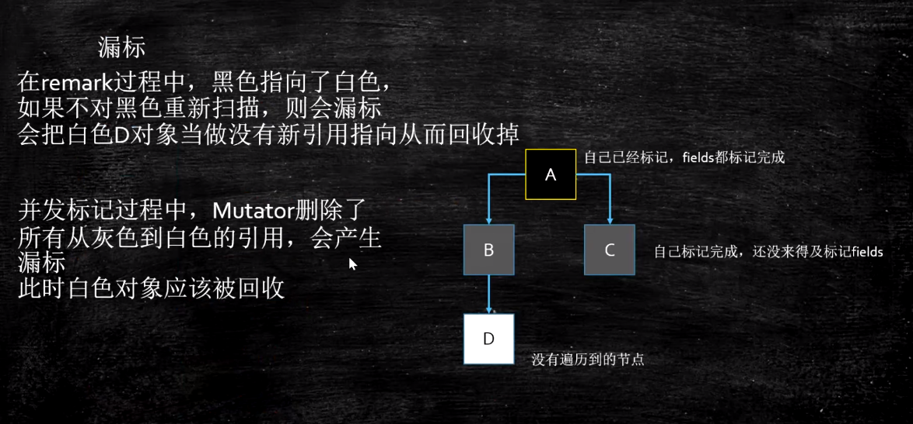
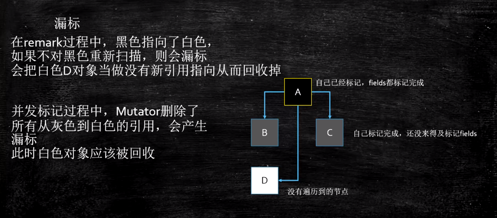

## JVM：并发标记算法
**难点：在标记对象过程中，对象引用关系正在发生改变。**

### 三色标记法

- 白色：未被标记的对象
- 灰色：自身被标记，成员变量未被标记
- 黑色：自身和成员变量均已标记完成

### 产生漏标
漏标是指，本来是live Object，但是由于没有遍历到，被当成garbage回收掉了。
> 两个条件缺一不可
1. 标记进行时增加了一个黑到白的引用，如果不重新对黑色进行处理，则会漏标；
2. 标记进行时删除了灰对象到白对象的引用，那么这个白对象有可能被漏标；

    

    

### 如何防止产生漏标
1. incremental update -- 增量更新，关注引用的增加，把黑色重新标记为灰色，下次重新扫描属性；（CMS使用）
2. SATB snapshot at the beginning - 关注引用的删除；当B->D消失时，要把这个引用推到GC的堆栈，保证D还能被GC扫描到；（G1使用）

### 为什么G1使用STAB
灰色 -> 白色  引用消失时，如果没有黑色指向白色，引用会被push到堆栈，下次扫描时拿到这个引用，由于有RSet的存在，不需要扫描整个堆去查找指向白色的引用，效率比较高；SATB配合RSet，浑然天成；
