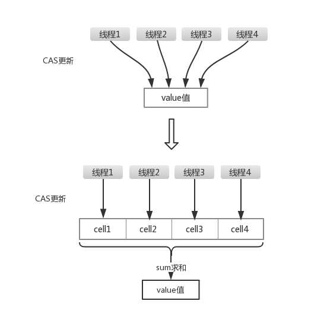

# Java高并发（三十二）：原子操作增强类LongAdder、LongAccumulator

## 来个需求
一个jvm中实现一个计数器功能，需保证多线程情况下数据正确性。

我们来模拟50个线程，每个线程对计数器递增100万次，最终结果应该是5000万。

我们使用4种方式实现，看一下其性能，然后引出为什么需要使用LongAdder、LongAccumulator。

## 方式一：synchronized方式实现

```java
import java.util.ArrayList;
import java.util.List;
import java.util.concurrent.CompletableFuture;
import java.util.concurrent.CountDownLatch;
import java.util.concurrent.ExecutionException;
import java.util.concurrent.atomic.LongAccumulator;

public class Demo1 {
    static int count = 0;
    public static synchronized void incr() {
        count++;
    }
    public static void main(String[] args) throws ExecutionException, InterruptedException {
        for (int i = 0; i < 10; i++) {
            count = 0;
            m1();
        }
    }
    private static void m1() throws InterruptedException {
        long t1 = System.currentTimeMillis();
        int threadCount = 50;
        CountDownLatch countDownLatch = new CountDownLatch(threadCount);
        for (int i = 0; i < threadCount; i++) {
            new Thread(() -> {
                try {
                    for (int j = 0; j < 1000000; j++) {
                        incr();
                    }
                } finally {
                    countDownLatch.countDown();
                }
            }).start();
        }
        countDownLatch.await();
        long t2 = System.currentTimeMillis();
        System.out.println(String.format("结果：%s,耗时(ms)：%s", count, (t2 - t1)));
    }
}
```

输出：

```java
结果：50000000,耗时(ms)：1437
结果：50000000,耗时(ms)：1913
结果：50000000,耗时(ms)：386
结果：50000000,耗时(ms)：383
结果：50000000,耗时(ms)：381
结果：50000000,耗时(ms)：382
结果：50000000,耗时(ms)：379
结果：50000000,耗时(ms)：379
结果：50000000,耗时(ms)：392
结果：50000000,耗时(ms)：384
```

平均耗时：390毫秒

## 方式2：AtomicLong实现

```java
import java.util.concurrent.CountDownLatch;
import java.util.concurrent.ExecutionException;
import java.util.concurrent.atomic.AtomicLong;

public class Demo2 {
    static AtomicLong count = new AtomicLong(0);
    public static void incr() {
        count.incrementAndGet();
    }
    public static void main(String[] args) throws ExecutionException, InterruptedException {
        for (int i = 0; i < 10; i++) {
            count.set(0);
            m1();
        }
    }
    private static void m1() throws InterruptedException {
        long t1 = System.currentTimeMillis();
        int threadCount = 50;
        CountDownLatch countDownLatch = new CountDownLatch(threadCount);
        for (int i = 0; i < threadCount; i++) {
            new Thread(() -> {
                try {
                    for (int j = 0; j < 1000000; j++) {
                        incr();
                    }
                } finally {
                    countDownLatch.countDown();
                }
            }).start();
        }
        countDownLatch.await();
        long t2 = System.currentTimeMillis();
        System.out.println(String.format("结果：%s,耗时(ms)：%s", count, (t2 - t1)));
    }
}
```

输出：

```java
结果：50000000,耗时(ms)：971
结果：50000000,耗时(ms)：915
结果：50000000,耗时(ms)：920
结果：50000000,耗时(ms)：923
结果：50000000,耗时(ms)：910
结果：50000000,耗时(ms)：916
结果：50000000,耗时(ms)：923
结果：50000000,耗时(ms)：916
结果：50000000,耗时(ms)：912
结果：50000000,耗时(ms)：908
```

平均耗时：920毫秒

AtomicLong内部采用CAS的方式实现，并发量大的情况下，CAS失败率比较高，导致性能比synchronized还低一些。并发量不是太大的情况下，CAS性能还是可以的。

## 方式3：LongAdder实现

先介绍一下LongAdder，说到LongAdder，不得不提的就是AtomicLong，AtomicLong是JDK1.5开始出现的，里面主要使用了一个long类型的value作为成员变量，然后使用循环的CAS操作去操作value的值，并发量比较大的情况下，CAS操作失败的概率较高，内部失败了会重试，导致耗时可能会增加。

LongAdder是JDK1.8开始出现的，所提供的API基本上可以替换掉原先的AtomicLong。LongAdder在并发量比较大的情况下，操作数据的时候，相当于把这个数字分成了很多份数字，然后交给多个人去管控，每个管控者负责保证部分数字在多线程情况下操作的正确性。当多线程访问的时，通过hash算法映射到具体管控者去操作数据，最后再汇总所有的管控者的数据，得到最终结果。相当于降低了并发情况下锁的粒度，所以效率比较高，看一下下面的图，方便理解：



```java
import java.util.concurrent.CountDownLatch;
import java.util.concurrent.ExecutionException;
import java.util.concurrent.atomic.AtomicLong;
import java.util.concurrent.atomic.LongAdder;

public class Demo3 {
    static LongAdder count = new LongAdder();
    public static void incr() {
        count.increment();
    }
    public static void main(String[] args) throws ExecutionException, InterruptedException {
        for (int i = 0; i < 10; i++) {
            count.reset();
            m1();
        }
    }
    private static void m1() throws ExecutionException, InterruptedException {
        long t1 = System.currentTimeMillis();
        int threadCount = 50;
        CountDownLatch countDownLatch = new CountDownLatch(threadCount);
        for (int i = 0; i < threadCount; i++) {
            new Thread(() -> {
                try {
                    for (int j = 0; j < 1000000; j++) {
                        incr();
                    }
                } finally {
                    countDownLatch.countDown();
                }
            }).start();
        }
        countDownLatch.await();
        long t2 = System.currentTimeMillis();
        System.out.println(String.format("结果：%s,耗时(ms)：%s", count.sum(), (t2 - t1)));
    }
}
```

输出：

```java
结果：50000000,耗时(ms)：206
结果：50000000,耗时(ms)：105
结果：50000000,耗时(ms)：107
结果：50000000,耗时(ms)：107
结果：50000000,耗时(ms)：105
结果：50000000,耗时(ms)：99
结果：50000000,耗时(ms)：106
结果：50000000,耗时(ms)：102
结果：50000000,耗时(ms)：106
结果：50000000,耗时(ms)：102
```

平均耗时：100毫秒

代码中new LongAdder()创建一个LongAdder对象，内部数字初始值是0，调用increment()方法可以对LongAdder内部的值原子递增1。reset()方法可以重置LongAdder的值，使其归0。

## 方式4：LongAccumulator实现

LongAccumulator是LongAdder的功能增强版。LongAdder的API只有对数值的加减，而LongAccumulator提供了自定义的函数操作，其构造函数如下：

```java
/**
  * accumulatorFunction：需要执行的二元函数（接收2个long作为形参，并返回1个long）
  * identity：初始值
 **/
public LongAccumulator(LongBinaryOperator accumulatorFunction, long identity) {
    this.function = accumulatorFunction;
    base = this.identity = identity;
}
```

```java
import java.util.concurrent.CountDownLatch;
import java.util.concurrent.ExecutionException;
import java.util.concurrent.atomic.LongAccumulator;
import java.util.concurrent.atomic.LongAdder;

public class Demo4 {
    static LongAccumulator count = new LongAccumulator((x, y) -> x + y, 0L);
    public static void incr() {
        count.accumulate(1);
    }
    public static void main(String[] args) throws ExecutionException, InterruptedException {
        for (int i = 0; i < 10; i++) {
            count.reset();
            m1();
        }
    }
    private static void m1() throws ExecutionException, InterruptedException {
        long t1 = System.currentTimeMillis();
        int threadCount = 50;
        CountDownLatch countDownLatch = new CountDownLatch(threadCount);
        for (int i = 0; i < threadCount; i++) {
            new Thread(() -> {
                try {
                    for (int j = 0; j < 1000000; j++) {
                        incr();
                    }
                } finally {
                    countDownLatch.countDown();
                }
            }).start();
        }
        countDownLatch.await();
        long t2 = System.currentTimeMillis();
        System.out.println(String.format("结果：%s,耗时(ms)：%s", count.longValue(), (t2 - t1)));
    }
}
```

输出：

```java
结果：50000000,耗时(ms)：138
结果：50000000,耗时(ms)：111
结果：50000000,耗时(ms)：111
结果：50000000,耗时(ms)：103
结果：50000000,耗时(ms)：103
结果：50000000,耗时(ms)：105
结果：50000000,耗时(ms)：101
结果：50000000,耗时(ms)：106
结果：50000000,耗时(ms)：102
结果：50000000,耗时(ms)：103
```

平均耗时：100毫秒

LongAccumulator的效率和LongAdder差不多，不过更灵活一些。

调用new LongAdder()等价于new LongAccumulator((x, y) -> x + y, 0L)。

从上面4个示例的结果来看，LongAdder、LongAccumulator全面超越同步锁及AtomicLong的方式，建议在使用AtomicLong的地方可以直接替换为LongAdder、LongAccumulator，吞吐量更高一些。