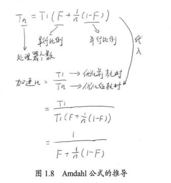
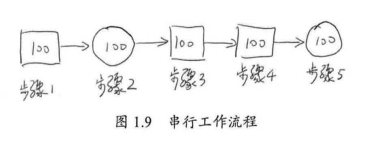
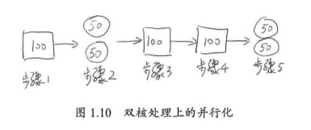
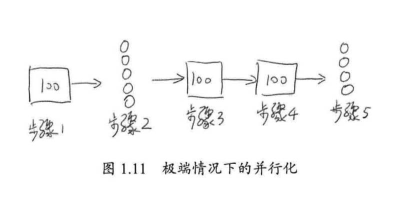
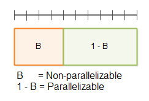
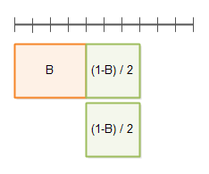
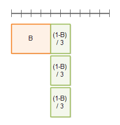
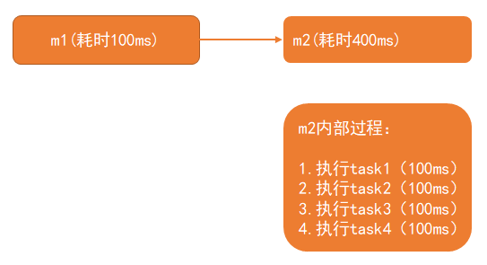
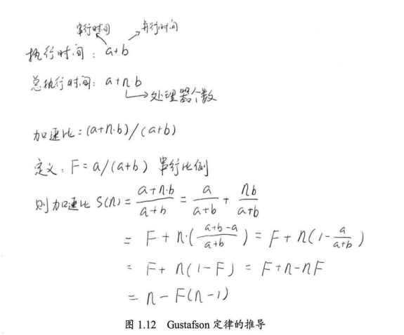

# Java高并发（三）：有关并行的两个重要定律

## 前言

有关为什么要使用并行程序的问题前面已经进行了简单的探讨。总的来说，最重要的应该是处于两个目的。

第一，为了获得更好的性能；

第二，由于业务模型的需要，确实需要多个执行实体。

在这里，我将更加关注第一种情况，也就是有关性能的问题。将串行程序改造为并发程序，一般来说可以提高程序的整体性能，但是究竟能提高多少，甚至说究竟是否真的可以提高，还是一个需要研究的问题。目前，主要有两个定律对这个问题进行解答，一个是Amdahl定律，另外一个是Gustafson定律。

## Amdahl(阿姆达尔)定律

Amdahl定律是计算机科学中非常重要的定律。它定义了串行系统并行化后的加速比的计算公式和理论上线。

加速比定义：加速比 = 优化前系统耗时 / 优化后系统耗时

所谓加速比就是优化前耗时与优化后耗时的比值。加速比越高，表明优化效果越明显。图1.8显示了Amdahl公式的推到过程，其中n表示处理器个数，T表示时间，T1表示优化前耗时(也就是只有1个处理器时的耗时)，Tn表示使用n个处理器优化后的耗时。F是程序中只能串行执行的比例。

根据这个公式，如果CPU处理器数量趋于无穷，那么加速比与系统的串行化比例成反比，如果系统中必须有50%的代码串行执行，那么系统的最大加速比为2。

假设有一个程序分为以下步骤执行，每个执行步骤花费100个单位时间。其中，只有步骤2和步骤5可以并行，步骤1、3、4必须串行，如图1.9所示。在全串行的情况下，系统合计耗时为500个单位时间。

若步骤2和步骤5并行化，假设在双核处理器上，则有如图1.10所示的处理流程。在这种情况下，步骤2和步骤5的耗时将为50个单位时间。故系统整体耗时为400个单位时间。根据加速比的定义有：

加速比 = 优化前系统耗时 / 优化后系统耗时 = 500/400 = 1.25

由于5个步骤中，3个步骤必须串行，因此其串行化比例为3/5=0.6，即 F = 0.6，且双核处理器的处理器个数N为2。代入加速比公式得：

加速比 = 1/(0.6+(1-0.6)/2)=1.25

在极端情况下，假设并行处理器个数为无穷大，则有如图1.11所示的处理过程。步骤2和步骤5的处理时间趋于0。即使这样，系统整体耗时依然大于300个单位时间。使用加速比计算公式，N趋于无穷大，有加速比 = 1/F，且F=0.6，故有加速比=1.67。即加速比的极限为500/300=1.67。

由此可见，为了提高系统的速度，仅增加CPU处理的数量并不一定能起到有效的作用。需要从根本上修改程序的串行行为，提高系统内可并行化的模块比重，在此基础上，合理增加并行处理器数量，才能以最小的投入，得到最大的加速比。

> 注意：根据Amdahl定律，使用多核CPU对系统进行优化，优化的效果取决于CPU的数量，以及系统中串行化程序的比例。CPU数量越多，串行化比例越低，则优化效果越好。仅提高CPU数量而不降低程序的串行化比例，也无法提高系统的性能。

**阿姆达尔定律图示**

为了更好地理解阿姆达尔定律，我会尝试演示这个定定律是如何诞生的。

首先，一个程序可以被分割为两部分，一部分为不可并行部分B，一部分为可并行部分1 – B。如下图：

在顶部被带有分割线的那条直线代表总时间 T(1)。

下面你可以看到在并行因子为2的情况下的执行时间：

并行因子为3的情况：

**举个例子**

一个业务会串行调用2个方法，m1，m2，m1耗时100ms，m2耗时400ms，m2内部串行执行了4个无依赖的任务，每个任务100ms，如下图：

m2内部的4个任务无依赖的，即可以并行进行处理，4个任务同时并行，当cpu数量大于等于4的时候，可以让4个任务同时进行，此时m2耗时最小，即100ms，cpu为2个的时候，同时只能够执行2个任务，其他2个任务处于等待cpu分配时间片状态，此时m2耗时200ms；当cpu超过4个的时候，或者趋于无限大的时候，m2耗时还是100ms，此时cpu数量再怎么增加对性能也没有提升了，此时需要提升的是任务可以并行的数量。

从阿姆达尔定律可以看出，程序的可并行化部分可以通过使用更多的硬件（更多的线程或CPU）运行更快。对于不可并行化的部分，只能通过优化代码来达到提速的目的。因此，你可以通过优化不可并行化部分来提高你的程序的运行速度和并行能力。你可以对不可并行化在算法上做一点改动，如果有可能，你也可以把一些移到可并行化放的部分。

## Gustafson定律

Gustafson定律也试图说明处理器个数、串行化比例和加速比之间的关系，如图1.12所示，但是Gustafson定律和Amdahl定律的角度不同。同样，加速比都被定义为优化前的系统耗时除以优化后的系统耗时。

根据Gustafson定律，我们可以更容易地发现，如果串行化比例很小，并行化比例很大，那么加速比就是处理器的个数。只要不断地累加处理器，就能获得更快的速度。

Amdahl定律和Gustafson定律结论有所不同，并不是说其中有个是错误的，只是二者从不同的角度去看待问题的结果，他们的侧重点有所不同。

**Amdahl强调：** 当串行换比例一定时，加速比是有上限的，不管你堆叠多少个CPU参与计算，都不能突破这个上限。  
**Gustafson定律关系的是：** 如果可被并行化的代码所占比例足够大，那么加速比就能随着CPU的数量线性增长。

总的来说，提升性能的方法：想办法提升系统并行的比例，同时增加CPU数量。