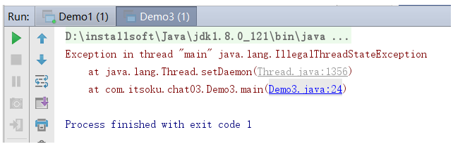

## Java高并发（九）：用户线程和守护线程

守护线程是一种特殊的线程，在后台默默地完成一些系统性的服务，比如垃圾回收线程、JIT线程都是守护线程。与之对应的是用户线程，用户线程可以理解为是系统的工作线程，它会完成这个程序需要完成的业务操作。如果用户线程全部结束了，意味着程序需要完成的业务操作已经结束了，系统可以退出了。所以当系统只剩下守护进程的时候，java虚拟机会自动退出。

java线程分为用户线程和守护线程，线程的daemon属性为true表示是守护线程，false表示是用户线程。

### 程序只有守护线程时，系统会自动退出

```java
public class Demo1 {
    public static class T1 extends Thread {
        public T1(String name) {
            super(name);
        }
        @Override
        public void run() {
            System.out.println(this.getName() + "开始执行," + (this.isDaemon() ? "我是守护线程" : "我是用户线程"));
            while (true) ;
        }
    }
    public static void main(String[] args) {
        T1 t1 = new T1("子线程1");
        t1.start();
        System.out.println("主线程结束");
    }
}
```

运行上面代码，结果如下：


可以看到主线程已经结束了，但是程序无法退出，原因：子线程1是用户线程，内部有个死循环，一直处于运行状态，无法结束。

再看下面的代码：

```java
public class Demo2 {
    public static class T1 extends Thread {
        public T1(String name) {
            super(name);
        }
        @Override
        public void run() {
            System.out.println(this.getName() + "开始执行," + (this.isDaemon() ? "我是守护线程" : "我是用户线程"));
            while (true) ;
        }
    }
    public static void main(String[] args) {
        T1 t1 = new T1("子线程1");
        t1.setDaemon(true);
        t1.start();
        System.out.println("主线程结束");
    }
}
```

运行结果：


程序可以正常结束了，代码中通过```t1.setDaemon(true);```将t1线程设置为守护线程，main方法所在的主线程执行完毕之后，程序就退出了。

**结论：当程序中所有的用户线程执行完毕之后，不管守护线程是否结束，系统都会自动退出。**

### 设置守护线程，需要在start()方法之前进行

```java
import java.util.concurrent.TimeUnit;

public class Demo3 {
    public static void main(String[] args) {
        Thread t1 = new Thread() {
            @Override
            public void run() {
                try {
                    TimeUnit.SECONDS.sleep(10);
                } catch (InterruptedException e) {
                    e.printStackTrace();
                }
            }
        };
        t1.start();
        t1.setDaemon(true);
    }
}
```

```t1.setDaemon(true);```是在t1的start()方法之后执行的，执行会报异常，运行结果如下：



### 线程daemon的默认值

创建线程源码，位于Thread类的init()方法中：

```java
Thread parent = currentThread();
this.daemon = parent.isDaemon();
```

dameon的默认值为为父线程的daemon，也就是说，父线程如果为用户线程，子线程默认也是用户线程，父线程如果是守护线程，子线程默认也是守护线程。

示例代码：

```java
import java.util.concurrent.TimeUnit;

public class Demo4 {
    public static class T1 extends Thread {
        public T1(String name) {
            super(name);
        }
        @Override
        public void run() {
            System.out.println(this.getName() + ".daemon:" + this.isDaemon());
        }
    }
    public static void main(String[] args) throws InterruptedException {
        System.out.println(Thread.currentThread().getName() + ".daemon:" + Thread.currentThread().isDaemon());
        T1 t1 = new T1("t1");
        t1.start();
        Thread t2 = new Thread() {
            @Override
            public void run() {
                System.out.println(this.getName() + ".daemon:" + this.isDaemon());
                T1 t3 = new T1("t3");
                t3.start();
            }
        };
        t2.setName("t2");
        t2.setDaemon(true);
        t2.start();
        TimeUnit.SECONDS.sleep(2);
    }
}
```

运行代码，输出：

```java
main.daemon:false
t1.daemon:false
t2.daemon:true
t3.daemon:true
```

t1是由主线程(main方法所在的线程)创建的，main线程是t1的父线程，所以t1.daemon为false，说明t1是用户线程。

t2线程调用了```setDaemon(true);```将其设为守护线程，t3是由t2创建的，所以t3默认线程类型和t2一样，t2.daemon为true。

### 总结

1. java中的线程分为用户线程和守护线程
2. 程序中的所有的用户线程结束之后，不管守护线程处于什么状态，java虚拟机都会自动退出
3. 调用线程的实例方法setDaemon()来设置线程是否是守护线程
4. setDaemon()方法必须在线程的start()方法之前调用，在后面调用会报异常，并且不起效
5. 线程的daemon默认值和其父线程一样