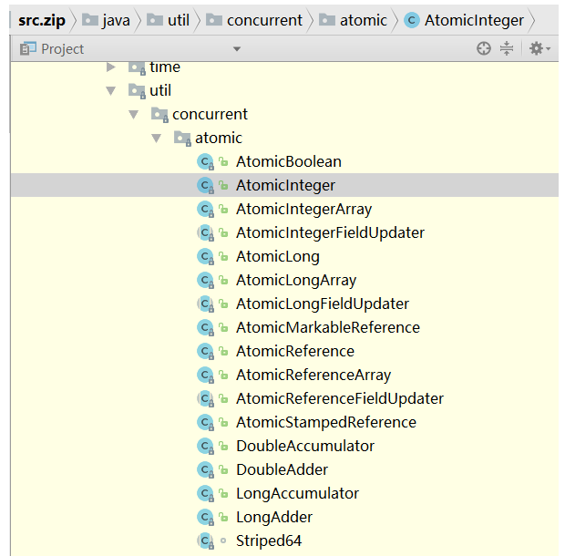
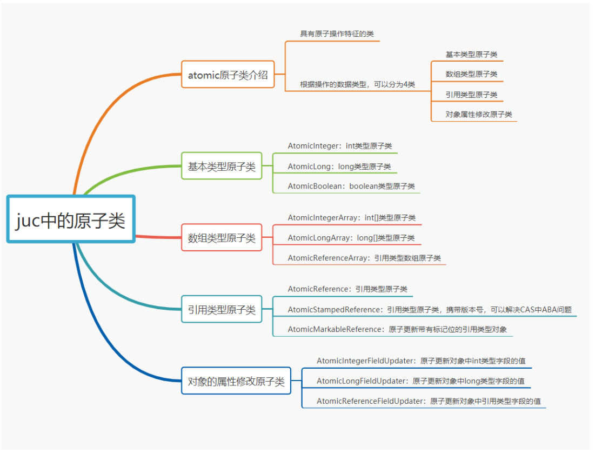

# Java高并发（二十三）：JUC中的原子操作类

## JUC中原子类介绍

atomic 翻译成中文是原子的意思。在化学上，我们知道原子是构成一般物质的最小单位，在化学反应中是不可分割的。在我们这里 atomic 是指一个操作是不可中断的。即使是在多个线程一起执行的时候，一个操作一旦开始，就不会被其他线程干扰，所以，所谓原子类说简单点就是具有原子操作特征的类，原子操作类提供了一些修改数据的方法，这些方法都是原子操作的，在多线程情况下可以确保被修改数据的正确性。

JUC中对原子操作提供了强大的支持，这些类位于java.util.concurrent.atomic包中，如下图：



## JUC中原子类思维导图



## 基本类型原子类

使用原子的方式更新基本类型
- AtomicInteger：int类型原子类
- AtomicLong：long类型原子类
- AtomicBoolean ：boolean类型原子类

**AtomicInteger 类常用方法**

```java
public final int get() //获取当前的值
public final int getAndSet(int newValue)//获取当前的值，并设置新的值
public final int getAndIncrement()//获取当前的值，并自增
public final int getAndDecrement() //获取当前的值，并自减
public final int getAndAdd(int delta) //获取当前的值，并加上预期的值
boolean compareAndSet(int expect, int update) //如果输入的数值等于预期值，则以原子方式将该值设置为输入值（update）
public final void lazySet(int newValue)//最终设置为newValue,使用 lazySet 设置之后可能导致其他线程在之后的一小段时间内还是可以读到旧的值。
```

部分源码

```java
private static final Unsafe unsafe = Unsafe.getUnsafe();
private static final long valueOffset;
static {
    try {
        valueOffset = unsafe.objectFieldOffset
            (AtomicInteger.class.getDeclaredField("value"));
    } catch (Exception ex) { throw new Error(ex); }
}
private volatile int value;
```

```
2个关键字段说明：
value：使用volatile修饰，可以确保value在多线程中的可见性。
valueOffset：value属性在AtomicInteger中的偏移量，通过这个偏移量可以快速定位到value字段，这个是实现AtomicInteger的关键。
```

**getAndIncrement源码：**

```java
public final int getAndIncrement() {
    return unsafe.getAndAddInt(this, valueOffset, 1);
}
```

内部调用的是Unsafe类中的getAndAddInt方法，我们看一下getAndAddInt源码：

```java
public final int getAndAddInt(Object var1, long var2, int var4) {
    int var5;
    do {
        var5 = this.getIntVolatile(var1, var2);
    } while(!this.compareAndSwapInt(var1, var2, var5, var5 + var4));
    return var5;
}
```

```
说明：
this.getIntVolatile：可以确保从主内存中获取变量最新的值。

compareAndSwapInt：CAS操作，CAS的原理是拿期望的值和原本的值作比较，如果相同则更新成新的值，可以确保在多线程情况下只有一个线程会操作成功，不成功的返回false。

上面有个do-while循环，compareAndSwapInt返回false之后，会再次从主内存中获取变量的值，继续做CAS操作，直到成功为止。

getAndAddInt操作相当于线程安全的count++操作，如同：
synchronize(lock){
count++;
}

count++操作实际上是被拆分为3步骤执行：
  1. 获取count的值，记做A：A=count
  2. 将A的值+1，得到B：B = A+1
  3. 让B赋值给count：count = B

多线程情况下会出现线程安全的问题，导致数据不准确。
synchronize的方式会导致占时无法获取锁的线程处于阻塞状态，性能比较低。CAS的性能比synchronize要快很多。
```

示例

使用AtomicInteger实现网站访问量计数器功能，模拟100人同时访问网站，每个人访问10次，代码如下：

```java
import java.util.concurrent.CountDownLatch;
import java.util.concurrent.TimeUnit;
import java.util.concurrent.atomic.AtomicInteger;

public class Demo1 {
    //访问次数
    static AtomicInteger count = new AtomicInteger();
    //模拟访问一次
    public static void request() throws InterruptedException {
        //模拟耗时5毫秒
        TimeUnit.MILLISECONDS.sleep(5);
        //对count原子+1
        count.incrementAndGet();
    }
    public static void main(String[] args) throws InterruptedException {
        long starTime = System.currentTimeMillis();
        int threadSize = 100;
        CountDownLatch countDownLatch = new CountDownLatch(threadSize);
        for (int i = 0; i < threadSize; i++) {
            Thread thread = new Thread(() -> {
                try {
                    for (int j = 0; j < 10; j++) {
                        request();
                    }
                } catch (InterruptedException e) {
                    e.printStackTrace();
                } finally {
                    countDownLatch.countDown();
                }
            });
            thread.start();
        }
        countDownLatch.await();
        long endTime = System.currentTimeMillis();
        System.out.println(Thread.currentThread().getName() + "，耗时：" + (endTime - starTime) + ",count=" + count);
    }
}
```

输出：

```java
main，耗时：158,count=1000
```

通过输出中可以看出incrementAndGet在多线程情况下能确保数据的正确性。

## 数组类型原子类介绍

使用原子的方式更新数组里的某个元素，可以确保修改数组中数据的线程安全性。
- AtomicIntegerArray：整形数组原子操作类
- AtomicLongArray：长整形数组原子操作类
- AtomicReferenceArray ：引用类型数组原子操作类

**AtomicIntegerArray 类常用方法**

```java
public final int get(int i) //获取 index=i 位置元素的值
public final int getAndSet(int i, int newValue)//返回 index=i 位置的当前的值，并将其设置为新值：newValue
public final int getAndIncrement(int i)//获取 index=i 位置元素的值，并让该位置的元素自增
public final int getAndDecrement(int i) //获取 index=i 位置元素的值，并让该位置的元素自减
public final int getAndAdd(int delta) //获取 index=i 位置元素的值，并加上预期的值
boolean compareAndSet(int expect, int update) //如果输入的数值等于预期值，则以原子方式将 index=i 位置的元素值设置为输入值（update）
public final void lazySet(int i, int newValue)//最终 将index=i 位置的元素设置为newValue,使用 lazySet 设置之后可能导致其他线程在之后的一小段时间内还是可以读到旧的值。
```

统计网站页面访问量，假设网站有10个页面，现在模拟100个人并行访问每个页面10次，然后将每个页面访问量输出，应该每个页面都是1000次，代码如下：

```java
import java.util.Arrays;
import java.util.concurrent.CountDownLatch;
import java.util.concurrent.TimeUnit;
import java.util.concurrent.atomic.AtomicInteger;
import java.util.concurrent.atomic.AtomicIntegerArray;

public class Demo2 {
    static AtomicIntegerArray pageRequest = new AtomicIntegerArray(new int[10]);
    /**
     * 模拟访问一次
     *
     * @param page 访问第几个页面
     * @throws InterruptedException
     */
    public static void request(int page) throws InterruptedException {
        //模拟耗时5毫秒
        TimeUnit.MILLISECONDS.sleep(5);
        //pageCountIndex为pageCount数组的下标，表示页面对应数组中的位置
        int pageCountIndex = page - 1;
        pageRequest.incrementAndGet(pageCountIndex);
    }
    public static void main(String[] args) throws InterruptedException {
        long starTime = System.currentTimeMillis();
        int threadSize = 100;
        CountDownLatch countDownLatch = new CountDownLatch(threadSize);
        for (int i = 0; i < threadSize; i++) {
            Thread thread = new Thread(() -> {
                try {
                    for (int page = 1; page <= 10; page++) {
                        for (int j = 0; j < 10; j++) {
                            request(page);
                        }
                    }
                } catch (InterruptedException e) {
                    e.printStackTrace();
                } finally {
                    countDownLatch.countDown();
                }
            });
            thread.start();
        }
        countDownLatch.await();
        long endTime = System.currentTimeMillis();
        System.out.println(Thread.currentThread().getName() + "，耗时：" + (endTime - starTime));
        for (int pageIndex = 0; pageIndex < 10; pageIndex++) {
            System.out.println("第" + (pageIndex + 1) + "个页面访问次数为" + pageRequest.get(pageIndex));
        }
    }
}
```

输出：

```java
main，耗时：635
第1个页面访问次数为1000
第2个页面访问次数为1000
第3个页面访问次数为1000
第4个页面访问次数为1000
第5个页面访问次数为1000
第6个页面访问次数为1000
第7个页面访问次数为1000
第8个页面访问次数为1000
第9个页面访问次数为1000
第10个页面访问次数为1000
```

说明：

> 代码中将10个面的访问量放在了一个int类型的数组中，数组大小为10，然后通过AtomicIntegerArray来操作数组中的每个元素，可以确保操作数据的原子性，每次访问会调用incrementAndGet，此方法需要传入数组的下标，然后对指定的元素做原子+1操作。输出结果都是1000，可以看出对于数组中元素的并发修改是线程安全的。如果线程不安全，则部分数据可能会小于1000。

## 引用类型原子类介绍

基本类型原子类只能更新一个变量，如果需要原子更新多个变量，需要使用 引用类型原子类。
- AtomicReference：引用类型原子类
- AtomicStampedRerence：原子更新引用类型里的字段原子类
- AtomicMarkableReference ：原子更新带有标记位的引用类型

AtomicReference 和 AtomicInteger 非常类似，不同之处在于 AtomicInteger是对整数的封装，而AtomicReference则是对应普通的对象引用，它可以确保你在修改对象引用时的线程安全性。在介绍AtomicReference的同时，我们先来了解一个有关原子操作逻辑上的不足。

### ABA问题

之前我们说过，线程判断被修改对象是否可以正确写入的条件是对象的当前值和期望值是否一致。这个逻辑从一般意义上来说是正确的，但是可能出现一个小小的例外，就是当你获得当前数据后，在准备修改为新值钱，对象的值被其他线程连续修改了两次，而经过这2次修改后，对象的值又恢复为旧值，这样，当前线程就无法正确判断这个对象究竟是否被修改过，这就是所谓的ABA问题，可能会引发一些问题。

有一家蛋糕店，为了挽留客户，决定为贵宾卡客户一次性赠送20元，刺激客户充值和消费，但条件是，每一位客户只能被赠送一次，现在我们用AtomicReference来实现这个功能，代码如下：

```java
import java.util.concurrent.TimeUnit;
import java.util.concurrent.atomic.AtomicReference;

public class Demo3 {
    //账户原始余额
    static int accountMoney = 19;
    //用于对账户余额做原子操作
    static AtomicReference<Integer> money = new AtomicReference<>(accountMoney);
    /**
     * 模拟2个线程同时更新后台数据库，为用户充值
     */
    static void recharge() {
        for (int i = 0; i < 2; i++) {
            new Thread(() -> {
                for (int j = 0; j < 5; j++) {
                    Integer m = money.get();
                    if (m == accountMoney) {
                        if (money.compareAndSet(m, m + 20)) {
                            System.out.println("当前余额：" + m + "，小于20，充值20元成功，余额：" + money.get() + "元");
                        }
                    }
                    //休眠100ms
                    try {
                        TimeUnit.MILLISECONDS.sleep(100);
                    } catch (InterruptedException e) {
                        e.printStackTrace();
                    }
                }
            }).start();
        }
    }
    /**
     * 模拟用户消费
     */
    static void consume() throws InterruptedException {
        for (int i = 0; i < 5; i++) {
            Integer m = money.get();
            if (m > 20) {
                if (money.compareAndSet(m, m - 20)) {
                    System.out.println("当前余额：" + m + "，大于10，成功消费10元，余额：" + money.get() + "元");
                }
            }
            //休眠50ms
            TimeUnit.MILLISECONDS.sleep(50);
        }
    }
    public static void main(String[] args) throws InterruptedException {
        recharge();
        consume();
    }
}
```

输出：

```java
当前余额：19，小于20，充值20元成功，余额：39元
当前余额：39，大于10，成功消费10元，余额：19元
当前余额：19，小于20，充值20元成功，余额：39元
当前余额：39，大于10，成功消费10元，余额：19元
当前余额：19，小于20，充值20元成功，余额：39元
当前余额：39，大于10，成功消费10元，余额：19元
当前余额：19，小于20，充值20元成功，余额：39元
```

```
从输出中可以看到，这个账户被先后反复多次充值。其原因是账户余额被反复修改，修改后的值和原有的数值19一样，使得CAS操作无法正确判断当前数据是否被修改过（是否被加过20）。虽然这种情况出现的概率不大，但是依然是有可能出现的，因此，当业务上确实可能出现这种情况时，我们必须多加防范。JDK也为我们考虑到了这种情况，使用AtomicStampedReference可以很好地解决这个问题。
```

### 使用AtomicStampedRerence解决ABA的问题

AtomicReference无法解决上述问题的根本原因是，对象在被修改过程中丢失了状态信息，比如充值20元的时候，需要同时标记一个状态，用来标注用户被充值过。因此我们只要能够记录对象在修改过程中的状态值，就可以很好地解决对象被反复修改导致线程无法正确判断对象状态的问题。

AtomicStampedRerence正是这么做的，他内部不仅维护了对象的值，还维护了一个时间戳（我们这里把他称为时间戳，实际上它可以使用任何一个整形来表示状态值），当AtomicStampedRerence对应的数值被修改时，除了更新数据本身外，还必须要更新时间戳。当AtomicStampedRerence设置对象值时，对象值及时间戳都必须满足期望值，写入才会成功。因此，即使对象值被反复读写，写回原值，只要时间戳发生变量，就能防止不恰当的写入。

AtomicStampedRerence的几个Api在AtomicReference的基础上新增了有关时间戳的信息。

```java
//比较设置，参数依次为：期望值、写入新值、期望时间戳、新时间戳
public boolean compareAndSet(V expectedReference, V newReference, int expectedStamp, int newStamp);
//获得当前对象引用
public V getReference();
//获得当前时间戳
public int getStamp();
//设置当前对象引用和时间戳
public void set(V newReference, int newStamp);
```

现在我们使用AtomicStampedRerence来修改一下上面充值的问题，代码如下：

```java
import java.util.concurrent.TimeUnit;
import java.util.concurrent.atomic.AtomicReference;
import java.util.concurrent.atomic.AtomicStampedReference;

public class Demo4 {
    //账户原始余额
    static int accountMoney = 19;
    //用于对账户余额做原子操作
    static AtomicStampedReference<Integer> money = new AtomicStampedReference<>(accountMoney, 0);
    /**
     * 模拟2个线程同时更新后台数据库，为用户充值
     */
    static void recharge() {
        for (int i = 0; i < 2; i++) {
            int stamp = money.getStamp();
            new Thread(() -> {
                for (int j = 0; j < 50; j++) {
                    Integer m = money.getReference();
                    if (m == accountMoney) {
                        if (money.compareAndSet(m, m + 20, stamp, stamp + 1)) {
                            System.out.println("当前时间戳：" + money.getStamp() + ",当前余额：" + m + "，小于20，充值20元成功，余额：" + money.getReference() + "元");
                        }
                    }
                    //休眠100ms
                    try {
                        TimeUnit.MILLISECONDS.sleep(100);
                    } catch (InterruptedException e) {
                        e.printStackTrace();
                    }
                }
            }).start();
        }
    }
    /**
     * 模拟用户消费
     */
    static void consume() throws InterruptedException {
        for (int i = 0; i < 50; i++) {
            Integer m = money.getReference();
            int stamp = money.getStamp();
            if (m > 20) {
                if (money.compareAndSet(m, m - 20, stamp, stamp + 1)) {
                    System.out.println("当前时间戳：" + money.getStamp() + ",当前余额：" + m + "，大于10，成功消费10元，余额：" + money.getReference() + "元");
                }
            }
            //休眠50ms
            TimeUnit.MILLISECONDS.sleep(50);
        }
    }
    public static void main(String[] args) throws InterruptedException {
        recharge();
        consume();
    }
}
```

输出：

```
当前时间戳：1,当前余额：19，小于20，充值20元成功，余额：39元
当前时间戳：2,当前余额：39，大于10，成功消费10元，余额：19元
```

结果正常了。

关于这个时间戳的，在数据库修改数据中也有类似的用法，比如2个编辑同时编辑一篇文章，同时提交，只允许一个用户提交成功，提示另外一个用户：博客已被其他人修改，如何实现呢？

```java
博客表：t_blog（id,content,stamp)，stamp默认值为0，每次更新+1

A、B 二个编辑同时对一篇文章进行编辑，stamp都为0，当点击提交的时候，将stamp和id作为条件更新博客内容，执行的sql如下：

update t_blog set content = 更新的内容,stamp = stamp+1 where id = 博客id and stamp = 0;

这条update会返回影响的行数，只有一个会返回1，表示更新成功，另外一个提交者返回0，表示需要修改的数据已经不满足条件了，被其他用户给修改了。这种修改数据的方式也叫乐观锁。
```

## 对象的属性修改原子类介绍

如果需要原子更新某个类里的某个字段时，需要用到对象的属性修改原子类。
- AtomicIntegerFieldUpdater：原子更新整形字段的值
- AtomicLongFieldUpdater：原子更新长整形字段的值
- AtomicReferenceFieldUpdater ：原子更新应用类型字段的值

要想原子地更新对象的属性需要两步：
- 第一步，因为对象的属性修改类型原子类都是抽象类，所以每次使用都必须使用静态方法 newUpdater()创建一个更新器，并且需要设置想要更新的类和属性。
- 第二步，更新的对象属性必须使用 public volatile 修饰符。

调用AtomicReferenceFieldUpdater静态方法newUpdater创建AtomicReferenceFieldUpdater对象

```java
public static <U, W> AtomicReferenceFieldUpdater<U, W> newUpdater(Class<U> tclass, Class<W> vclass, String fieldName)
```

说明:

```
三个参数

tclass：需要操作的字段所在的类
vclass：操作字段的类型
fieldName：字段名称
```

多线程并发调用一个类的初始化方法，如果未被初始化过，将执行初始化工作，要求只能初始化一次

```java
import com.sun.org.apache.xpath.internal.operations.Bool;
import java.util.concurrent.TimeUnit;
import java.util.concurrent.atomic.AtomicReferenceFieldUpdater;

public class Demo5 {
    static Demo5 demo5 = new Demo5();
    //isInit用来标注是否被初始化过
    volatile Boolean isInit = Boolean.FALSE;
    AtomicReferenceFieldUpdater<Demo5, Boolean> updater = AtomicReferenceFieldUpdater.newUpdater(Demo5.class, Boolean.class, "isInit");
    /**
     * 模拟初始化工作
     *
     * @throws InterruptedException
     */
    public void init() throws InterruptedException {
        //isInit为false的时候，才进行初始化，并将isInit采用原子操作置为true
        if (updater.compareAndSet(demo5, Boolean.FALSE, Boolean.TRUE)) {
            System.out.println(System.currentTimeMillis() + "," + Thread.currentThread().getName() + "，开始初始化!");
            //模拟休眠3秒
            TimeUnit.SECONDS.sleep(3);
            System.out.println(System.currentTimeMillis() + "," + Thread.currentThread().getName() + "，初始化完毕!");
        } else {
            System.out.println(System.currentTimeMillis() + "," + Thread.currentThread().getName() + "，有其他线程已经执行了初始化!");
        }
    }
    public static void main(String[] args) {
        for (int i = 0; i < 5; i++) {
            new Thread(() -> {
                try {
                    demo5.init();
                } catch (InterruptedException e) {
                    e.printStackTrace();
                }
            }).start();
        }
    }
}
```

输出：

```
1565159962098,Thread-0，开始初始化!
1565159962098,Thread-3，有其他线程已经执行了初始化!
1565159962098,Thread-4，有其他线程已经执行了初始化!
1565159962098,Thread-2，有其他线程已经执行了初始化!
1565159962098,Thread-1，有其他线程已经执行了初始化!
1565159965100,Thread-0，初始化完毕!
```

说明：
1. isInit属性必须要volatille修饰，可以确保变量的可见性
2. 可以看出多线程同时执行init()方法，只有一个线程执行了初始化的操作，其他线程跳过了。多个线程同时到达updater.compareAndSet，只有一个会成功。
