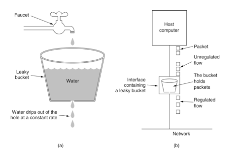
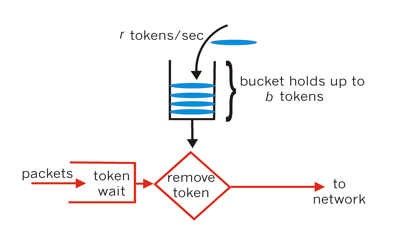

# Java高并发（二十九）：实战，搞懂限流

## 常见的限流的场景

1. 秒杀活动，数量有限，访问量巨大，为了防止系统宕机，需要做限流处理
2. 国庆期间，一般的旅游景点人口太多，采用排队方式做限流处理
3. 医院看病通过发放排队号的方式来做限流处理。

## 常见的限流算法

1. 通过控制最大并发数来进行限流
2. 使用漏桶算法来进行限流
3. 使用令牌桶算法来进行限流

## 通过控制最大并发数来进行限流

以秒杀业务为例，10个iphone，100万人抢购，100万人同时发起请求，最终能够抢到的人也就是前面几个人，后面的基本上都没有希望了，那么我们可以通过控制并发数来实现，比如并发数控制在10个，其他超过并发数的请求全部拒绝，提示：秒杀失败，请稍后重试。

并发控制的，通俗解释：一大波人去商场购物，必须经过一个门口，门口有个门卫，兜里面有指定数量的门禁卡，来的人先去门卫那边拿取门禁卡，拿到卡的人才可以刷卡进入商场，拿不到的可以继续等待。进去的人出来之后会把卡归还给门卫，门卫可以把归还来的卡继续发放给其他排队的顾客使用。

JUC中提供了这样的工具类：Semaphore，示例代码：

```java
import java.util.concurrent.Semaphore;
import java.util.concurrent.TimeUnit;

public class Demo1 {
    static Semaphore semaphore = new Semaphore(5);
    public static void main(String[] args) {
        for (int i = 0; i < 20; i++) {
            new Thread(() -> {
                boolean flag = false;
                try {
                    flag = semaphore.tryAcquire(100, TimeUnit.MICROSECONDS);
                    if (flag) {
                        //休眠2秒，模拟下单操作
                        System.out.println(Thread.currentThread() + "，尝试下单中。。。。。");
                        TimeUnit.SECONDS.sleep(2);
                    } else {
                        System.out.println(Thread.currentThread() + "，秒杀失败，请稍微重试！");
                    }
                } catch (InterruptedException e) {
                    e.printStackTrace();
                } finally {
                    if (flag) {
                        semaphore.release();
                    }
                }
            }).start();
        }
    }
}
```

输出：

```java
Thread[Thread-10,5,main]，尝试下单中。。。。。
Thread[Thread-8,5,main]，尝试下单中。。。。。
Thread[Thread-9,5,main]，尝试下单中。。。。。
Thread[Thread-12,5,main]，尝试下单中。。。。。
Thread[Thread-11,5,main]，尝试下单中。。。。。
Thread[Thread-2,5,main]，秒杀失败，请稍微重试！
Thread[Thread-1,5,main]，秒杀失败，请稍微重试！
Thread[Thread-18,5,main]，秒杀失败，请稍微重试！
Thread[Thread-16,5,main]，秒杀失败，请稍微重试！
Thread[Thread-0,5,main]，秒杀失败，请稍微重试！
Thread[Thread-3,5,main]，秒杀失败，请稍微重试！
Thread[Thread-14,5,main]，秒杀失败，请稍微重试！
Thread[Thread-6,5,main]，秒杀失败，请稍微重试！
Thread[Thread-13,5,main]，秒杀失败，请稍微重试！
Thread[Thread-17,5,main]，秒杀失败，请稍微重试！
Thread[Thread-7,5,main]，秒杀失败，请稍微重试！
Thread[Thread-19,5,main]，秒杀失败，请稍微重试！
Thread[Thread-15,5,main]，秒杀失败，请稍微重试！
Thread[Thread-4,5,main]，秒杀失败，请稍微重试！
Thread[Thread-5,5,main]，秒杀失败，请稍微重试！
```

## 使用漏桶算法来进行限流

国庆期间比较火爆的景点，人流量巨大，一般入口处会有限流的弯道，让游客进去进行排队，排在前面的人，每隔一段时间会放一拨进入景区。排队人数超过了指定的限制，后面再来的人会被告知今天已经游客量已经达到峰值，会被拒绝排队，让其明天或者以后再来，这种玩法采用漏桶限流的方式。

漏桶算法思路很简单，水（请求）先进入到漏桶里，漏桶以一定的速度出水，当水流入速度过大会直接溢出，可以看出漏桶算法能强行限制数据的传输速率。

漏桶算法示意图：



简陋版的实现，代码如下：

```java
import java.util.Objects;
import java.util.concurrent.ArrayBlockingQueue;
import java.util.concurrent.BlockingQueue;
import java.util.concurrent.TimeUnit;
import java.util.concurrent.atomic.AtomicInteger;
import java.util.concurrent.locks.LockSupport;

public class Demo2 {
    public static class BucketLimit {
        static AtomicInteger threadNum = new AtomicInteger(1);
        //容量
        private int capcity;
        //流速
        private int flowRate;
        //流速时间单位
        private TimeUnit flowRateUnit;
        private BlockingQueue<Node> queue;
        //漏桶流出的任务时间间隔（纳秒）
        private long flowRateNanosTime;
        public BucketLimit(int capcity, int flowRate, TimeUnit flowRateUnit) {
            this.capcity = capcity;
            this.flowRate = flowRate;
            this.flowRateUnit = flowRateUnit;
            this.bucketThreadWork();
        }
        //漏桶线程
        public void bucketThreadWork() {
            this.queue = new ArrayBlockingQueue<Node>(capcity);
            //漏桶流出的任务时间间隔（纳秒）
            this.flowRateNanosTime = flowRateUnit.toNanos(1) / flowRate;
            Thread thread = new Thread(this::bucketWork);
            thread.setName("漏桶线程-" + threadNum.getAndIncrement());
            thread.start();
        }
        //漏桶线程开始工作
        public void bucketWork() {
            while (true) {
                Node node = this.queue.poll();
                if (Objects.nonNull(node)) {
                    //唤醒任务线程
                    LockSupport.unpark(node.thread);
                }
                //休眠flowRateNanosTime
                LockSupport.parkNanos(this.flowRateNanosTime);
            }
        }
        //返回一个漏桶
        public static BucketLimit build(int capcity, int flowRate, TimeUnit flowRateUnit) {
            if (capcity < 0 || flowRate < 0) {
                throw new IllegalArgumentException("capcity、flowRate必须大于0！");
            }
            return new BucketLimit(capcity, flowRate, flowRateUnit);
        }
        //当前线程加入漏桶，返回false，表示漏桶已满；true：表示被漏桶限流成功，可以继续处理任务
        public boolean acquire() {
            Thread thread = Thread.currentThread();
            Node node = new Node(thread);
            if (this.queue.offer(node)) {
                LockSupport.park();
                return true;
            }
            return false;
        }
        //漏桶中存放的元素
        class Node {
            private Thread thread;
            public Node(Thread thread) {
                this.thread = thread;
            }
        }
    }
    public static void main(String[] args) {
        BucketLimit bucketLimit = BucketLimit.build(10, 60, TimeUnit.MINUTES);
        for (int i = 0; i < 15; i++) {
            new Thread(() -> {
                boolean acquire = bucketLimit.acquire();
                System.out.println(System.currentTimeMillis() + " " + acquire);
                try {
                    TimeUnit.SECONDS.sleep(1);
                } catch (InterruptedException e) {
                    e.printStackTrace();
                }
            }).start();
        }
    }
}
```

代码中BucketLimit.build(10, 60, TimeUnit.MINUTES);创建了一个容量为10，流水为60/分钟的漏桶。

## 使用令牌桶算法来进行限流

令牌桶算法的原理是系统以恒定的速率产生令牌，然后把令牌放到令牌桶中，令牌桶有一个容量，当令牌桶满了的时候，再向其中放令牌，那么多余的令牌会被丢弃；当想要处理一个请求的时候，需要从令牌桶中取出一个令牌，如果此时令牌桶中没有令牌，那么则拒绝该请求。从原理上看，令牌桶算法和漏桶算法是相反的，一个“进水”，一个是“漏水”。这种算法可以应对突发程度的请求，因此比漏桶算法好。

令牌桶算法示意图：



## 限流工具类RateLimiter

Google开源工具包Guava提供了限流工具类RateLimiter，可以非常方便的控制系统每秒吞吐量，示例代码如下：

```java
import com.google.common.util.concurrent.RateLimiter;
import java.util.Calendar;
import java.util.Date;
import java.util.Objects;
import java.util.concurrent.ArrayBlockingQueue;
import java.util.concurrent.BlockingQueue;
import java.util.concurrent.TimeUnit;
import java.util.concurrent.atomic.AtomicInteger;
import java.util.concurrent.locks.LockSupport;

public class Demo3 {
    public static void main(String[] args) throws InterruptedException {
        RateLimiter rateLimiter = RateLimiter.create(5);//设置QPS为5
        for (int i = 0; i < 10; i++) {
            rateLimiter.acquire();
            System.out.println(System.currentTimeMillis());
        }
        System.out.println("----------");
        //可以随时调整速率，我们将qps调整为10
        rateLimiter.setRate(10);
        for (int i = 0; i < 10; i++) {
            rateLimiter.acquire();
            System.out.println(System.currentTimeMillis());
        }
    }
}
```

输出：

```java
1566284028725
1566284028922
1566284029121
1566284029322
1566284029522
1566284029721
1566284029921
1566284030122
1566284030322
1566284030522
----------
1566284030722
1566284030822
1566284030921
1566284031022
1566284031121
1566284031221
1566284031321
1566284031422
1566284031522
1566284031622
```

代码中RateLimiter.create(5)创建QPS为5的限流对象，后面又调用rateLimiter.setRate(10);将速率设为10，输出中分2段，第一段每次输出相隔200毫秒，第二段每次输出相隔100毫秒，可以非常精准的控制系统的QPS。