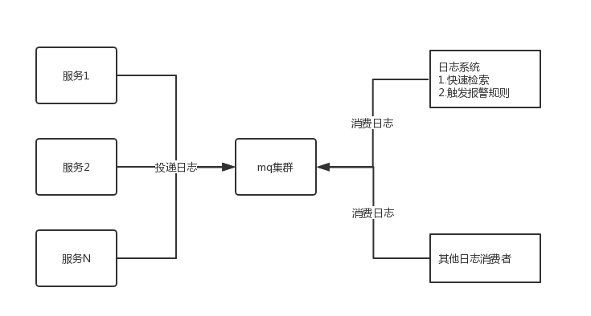

# Java高并发（二十八）：实战，构建日志系统

## 日志存在的痛点

先介绍一下多数公司采用的方式：目前比较流行的是采用springcloud（或者dubbo）做微服务，按照业务拆分为多个独立的服务，服务采用集群的方式部署在不同的机器上，当一个请求过来的时候，可能会调用到很多服务进行处理，springcloud一般采用logback（或者log4j）输出日志到文件中。当系统出问题的时候，按照系统故障的严重程度，严重的会回退版本，然后排查bug，轻的，找运维去线上拉日志，然后排查问题。

这个过程中存在一些问题：
1. 日志文件太大太多，不方便查找
2. 日志分散在不同的机器上，也不方便查找
3. 一个请求可能会调用多个服务，完整的日志难以追踪
4. 系统出现了问题，只能等到用户发现了，自己才知道

本文要解决上面的几个痛点，构建我们的日志系统，达到以下要求：
1. 方便追踪一个请求完整的日志
2. 方便快速检索日志
3. 系统出现问题自动报警，通知相关人员

## 构建日志系统

### 方便追踪一个请求完整的日志

当一个请求过来的时候，可能会调用多个服务，多个服务内部可能又会产生子线程处理业务，所以这里面有两个问题需要解决：
1. 多个服务之间日志的追踪
2. 服务内部子线程和主线程日志的追踪，这个地方举个例子，比如一个请求内部需要给10000人发送推送，内部开启10个线程并行处理，处理完毕之后响应操作者，这里面有父子线程，我们要能够找到这个里面所有的日志

需要追踪一个请求完整日志，我们需要给每个请求设置一个全局唯一编号，可以使用UUID或者其他方式也行。

多个服务之间日志追踪的问题：当一个请求过来的时候，在入口处生成一个trace_id，然后放在ThreadLocal中，如果内部设计到多个服务之间相互调用，调用其他服务的时，将trace_id顺便携带过去。

父子线程日志追踪的问题：可以采用InheritableThreadLocal来存放trace_id，这样可以在线程中获取到父线程中的trace_id。

所以此处我们需要使用InheritableThreadLocal来存储trace_id。

如果自己使用了线程池处理请求的，由于线程池中的线程采用的是复用的方式，所以需要对执行的任务Runable做一些改造，如代码：

```java
public class TraceRunnable implements Runnable {
    private String tranceId;
    private Runnable target;
    public TraceRunnable(Runnable target) {
        this.tranceId = TraceUtil.get();
        this.target = target;
    }
    @Override
    public void run() {
        try {
            TraceUtil.set(this.tranceId);
            MDC.put(TraceUtil.MDC_TRACE_ID, TraceUtil.get());
            this.target.run();
        } finally {
            MDC.remove(TraceUtil.MDC_TRACE_ID);
            TraceUtil.remove();
        }
    }
    public static Runnable trace(Runnable target) {
        return new TraceRunnable(target);
    }
}
```

需要用线程池执行的任务使用TraceRunnable封装一下就可以了。

```java
public class TraceUtil {
    public static final String REQUEST_HEADER_TRACE_ID = "com.ms.header.trace.id";
    public static final String MDC_TRACE_ID = "trace_id";
    private static InheritableThreadLocal<String> inheritableThreadLocal = new InheritableThreadLocal<>();
    /**
     * 获取traceid
     *
     * @return
     */
    public static String get() {
        String traceId = inheritableThreadLocal.get();
        if (traceId == null) {
            traceId = IDUtil.getId();
            inheritableThreadLocal.set(traceId);
        }
        return traceId;
    }
    public static void set(String trace_id) {
        inheritableThreadLocal.set(trace_id);
    }
    public static void remove() {
        inheritableThreadLocal.remove();
    }
}
```

日志输出中携带上trace_id，这样最终我们就可以通过trace_id找到一个请求的完整日志了。

### 方便快速检索日志

日志分散在不同的机器上，如果要快速检索，需要将所有服务产生的日志汇集到一个地方。

关于检索日志的，列一下需求：
1. 我们将收集日志发送到消息中间件中（可以是kafka、rocketmq），消息中间件这块不介绍，选择玩的比较溜的就可以了
2. 系统产生日志尽量不要影响接口的效率
3. 带宽有限的情况下，发送日志也尽量不要去影响业务
4. 日志尽量低延次，产生的日志，尽量在生成之后1分钟后可以检索到
5. 检索日志功能要能够快速响应

**日志发送端的改造**
日志是有业务系统产生的，一个请求过来的时候会产生很多日志，日志产生时，我们尽量减少日志输出对业务耗时的影响，我们的过程如下：
1. 业务系统内部引用一个线程池来异步处理日志，线程池内部可以使用一个容量稍微大一点的阻塞队列
2. 业务系统将日志丢给线程池进行处理
3. 线程池中将需要处理的日志先压缩一下，然后发送至mq

**引入mq存储日志**
业务系统将日志先发送到mq中，后面由其他消费者订阅进行消费。日志量比较大的，对mq的要求也比较高，可以选择kafka，业务量小的，也可以选取activemq。

**使用elasticsearch来检索日志**
elasticsearch（以下简称es）是一个全文检索工具，具体详情可以参考其官网相关文档。使用它来检索数据效率非常高。日志系统中需要我们开发一个消费端来拉取mq中的消息，将其存储到es中方便快速检索，关于这块有几点说一下：
1. 建议按天在es中建立数据库，日质量非常大的，也可以按小时建立数据库。查询的时候，时间就是必选条件了，这样可以快速让es定位到日志库进行检索，提升检索效率
2. 日志常见的需要收集的信息：trace_id、时间、日志级别、类、方法、url、调用的接口开始时间、调用接口的结束时间、接口耗时、接口状态码、异常信息、日志信息等等，可以按照这些在es中建立索引，方便检索。

### 日志监控报警

日志监控报警是非常重要的，这个必须要有，日志系统中需要开发监控报警功能，这块我们可以做成通过页面配置的方式，支持报警规则的配置，如日志中产生了某些异常、接口响应时间大于多少、接口返回状态码404等异常信息的时候能够报警，具体的报警可以是语音电话、短信通知、钉钉机器人报警等等，这些也做成可以配置的。

日志监控模块从mq中拉取日志，然后去匹配我们启用的一些规则进行报警。


