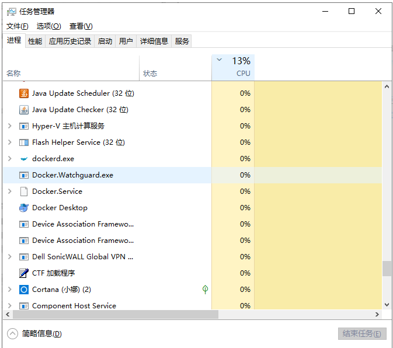
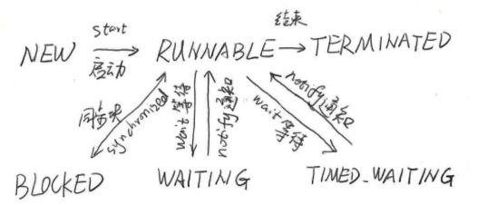

## Java高并发（五）：深入理解进程和线程

### 进程

进程（Process）是计算机中的程序关于某数据集合上的一次运行活动，是系统进行资源分配和调度的基本单位，是操作系统结构的基础。程序是指令、数据及其组织形式的描述，进程是程序的实体。

**进程具有的特征：**
- **动态性：** 进程是程序的一次执行过程，是临时的，有生命期的，是动态产生，动态消亡的
- **并发性：** 任何进程都可以同其他进行一起并发执行
- **独立性：** 进程是系统进行资源分配和调度的一个独立单位
- **结构性：** 进程由程序，数据和进程控制块三部分组成

我们经常使用windows系统，经常会看见.exe后缀的文件，双击这个.exe文件的时候，这个文件中的指令就会被系统加载，那么我们就能得到一个关于这个.exe程序的进程。进程是“活”的，或者说是正在被执行的。

window中打开任务管理器，可以看到当前系统中正在运行的进程，如下图：



### 线程

线程是轻量级的进程，是程序执行的最小单元，使用多线程而不是多进程去进行并发程序的设计，是因为线程间的切换和调度的成本远远小于进程。

我们用一张图来看一下线程的状态图：



线程的所有状态在java.lang.Thread中的State枚举中有定义，如：

```java
public enum State {
    NEW,
    RUNNABLE,
    BLOCKED,
    WAITING,
    TIMED_WAITING,
    TERMINATED;
}
```

线程几个状态的介绍：

- **New：** 表示刚刚创建的线程，这种线程还没有开始执行
- **RUNNABLE：** 运行状态，线程的start()方法调用后，线程会处于这种状态
- **BLOCKED：** 阻塞状态。当线程在执行的过程中遇到了synchronized同步块，但这个同步块被其他线程已获取还未释放时，当前线程将进入阻塞状态，会暂停执行，直到获取到锁。当线程获取到锁之后，又会进入到运行状态（RUNNABLE）
- **WAITING：** 等待状态。和TIME_WAITING都表示等待状态，区别是WAITING会进入一个无时间限制的等，而TIME_WAITING会进入一个有限的时间等待，那么等待的线程究竟在等什么呢？一般来说，WAITING的线程正式在等待一些特殊的事件，比如，通过wait()方法等待的线程在等待notify()方法，而通过join()方法等待的线程则会等待目标线程的终止。一旦等到期望的事件，线程就会再次进入RUNNABLE运行状态。
- **TERMINATED：** 表示结束状态，线程执行完毕之后进入结束状态。

**注意：从NEW状态出发后，线程不能在回到NEW状态，同理，处理TERMINATED状态的线程也不能在回到RUNNABLE状态**

### 进程与线程的一个简单解释

进程（process）和线程（thread）是操作系统的基本概念，但是它们比较抽象，不容易掌握。

1. 计算机的核心是CPU，它承担了所有的计算任务。它就像一座工厂，时刻在运行。
2. 假定工厂的电力有限，一次只能供给一个车间使用。也就是说，一个车间开工的时候，其他车间都必须停工。背后的含义就是，单个CPU一次只能运行一个任务。
3. 进程就好比工厂的车间，它代表CPU所能处理的单个任务。任一时刻，CPU总是运行一个进程，其他进程处于非运行状态。
4. 一个车间里，可以有很多工人。他们协同完成一个任务。
5. 线程就好比车间里的工人。一个进程可以包括多个线程。
6. 车间的空间是工人们共享的，比如许多房间是每个工人都可以进出的。这象征一个进程的内存空间是共享的，每个线程都可以使用这些共享内存。
7. 可是，每间房间的大小不同，有些房间最多只能容纳一个人，比如厕所。里面有人的时候，其他人就不能进去了。这代表一个线程使用某些共享内存时，其他线程必须等它结束，才能使用这一块内存。
8. 一个防止他人进入的简单方法，就是门口加一把锁。先到的人锁上门，后到的人看到上锁，就在门口排队，等锁打开再进去。这就叫”互斥锁”（Mutual exclusion，缩写 Mutex），防止多个线程同时读写某一块内存区域。
9. 还有些房间，可以同时容纳n个人，比如厨房。也就是说，如果人数大于n，多出来的人只能在外面等着。这好比某些内存区域，只能供给固定数目的线程使用。
10. 这时的解决方法，就是在门口挂n把钥匙。进去的人就取一把钥匙，出来时再把钥匙挂回原处。后到的人发现钥匙架空了，就知道必须在门口排队等着了。这种做法叫做”信号量”（Semaphore），用来保证多个线程不会互相冲突。
11. 操作系统的设计，因此可以归结为三点：

    ```
    1. 以多进程形式，允许多个任务同时运行；
    2. 以多线程形式，允许单个任务分成不同的部分运行；
    3. 提供协调机制，一方面防止进程之间和线程之间产生冲突，另一方面允许进程之间和线程之间共享资源。
    ```