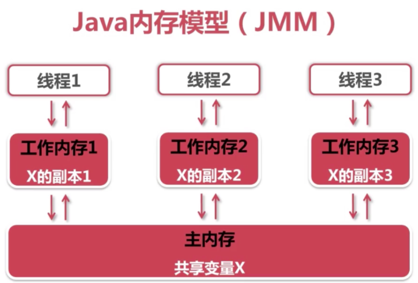
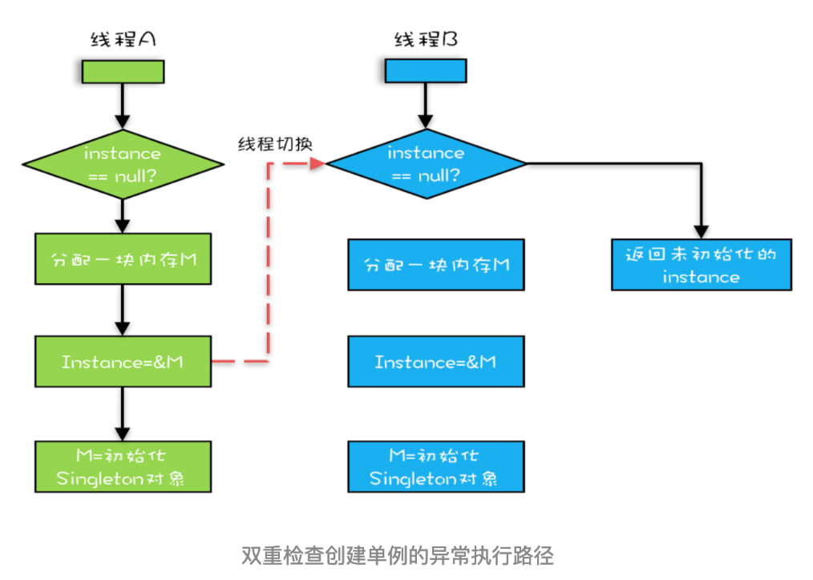

## Java高并发（四）：JMM相关的一些概念

### JMM

MM(java内存模型)，由于并发程序要比串行程序复杂很多，其中一个重要原因是并发程序中数据访问一致性和安全性将会受到严重挑战。如何保证一个线程可以看到正确的数据呢？这个问题看起来很白痴。对于串行程序来说，根本就是小菜一碟，如果你读取一个变量，这个变量的值是1，那么你读取到的一定是1，就是这么简单的问题在并行程序中居然变得复杂起来。事实上，如果不加控制地任由线程胡乱并行，即使原本是1的数值，你也可能读到2。因此我们需要在深入了解并行机制的前提下，再定义一种规则，保证多个线程间可以有小弟，正确地协同工作。而JMM也就是为此而生的。

JMM关键技术点都是围绕着多线程的原子性、可见性、有序性来建立的。

### 原子性

原子性是指操作是不可分的，要么全部一起执行，要么不执行。在java中，其表现在对于共享变量的某些操作，是不可分的，必须连续的完成。比如a++，对于共享变量a的操作，实际上会执行3个步骤：
1. 读取变量a的值，假如a=1
2. a的值+1，为2
3. 将2值赋值给变量a，此时a的值应该为2

这三个操作中任意一个操作，a的值如果被其他线程篡改了，那么都会出现我们不希望出现的结果。所以必须保证这3个操作是原子性的，在操作a++的过程中，其他线程不会改变a的值，如果在上面的过程中出现其他线程修改了a的值，在满足原子性的原则下，上面的操作应该失败。

java中实现原子操作的方法大致有2种：锁机制、无锁CAS机制，后面的章节中会有介绍。

### 可见性

可见性是指一个线程对共享变量的修改，对于另一个线程来说是否是可以看到的。有些同学会说修改同一个变量，那肯定是可以看到的，难道线程眼盲了？

为什么会出现这种问题呢？

看一下java线程内存模型：



- 我们定义的所有变量都储存在```主内存```中
- 每个线程都有自己```独立的工作内存```，里面保存该线程使用到的变量的副本（主内存中该变量的一份拷贝）
- 线程对共享变量所有的操作都必须在自己的工作内存中进行，不能直接从主内存中读写（不能越级）
- 不同线程之间也无法直接访问其他线程的工作内存中的变量，线程间变量值的传递需要通过主内存来进行。（同级不能相互访问）

线程需要修改一个共享变量X，需要先把X从主内存复制一份到线程的工作内存，在自己的工作内存中修改完毕之后，再从工作内存中回写到主内存。
如果线程对变量的操作没有刷写回主内存的话，仅仅改变了自己的工作内存的变量的副本，那么对于其他线程来说是不可见的。
而如果另一个变量没有读取主内存中的新的值，而是使用旧的值的话，同样的也可以列为不可见。

**共享变量可见性的实现原理：**

线程A对共享变量的修改要被线程B及时看到的话，需要进过以下步骤：
1. 线程A在自己的工作内存中修改变量之后，需要将变量的值刷新到主内存中
2. 线程B要把主内存中变量的值更新到工作内存中

关于线程可见性的控制，可以使用volatile、synchronized、锁来实现，后面章节会有详细介绍。

### 有序性

有序性指的是程序按照代码的先后顺序执行。

为了性能优化，编译器和处理器会进行指令冲排序，有时候会改变程序语句的先后顺序，比如程序。

```java
int a = 1;  //1
int b = 20; //2
int c = a + b; //3
```

编译器优化后可能变成

```java
int b = 20;  //1
int a = 1; //2
int c = a + b; //3
```

上面这个例子中，编译器调整了语句的顺序，但是不影响程序的最终结果。

在单例模式的实现上有一种双重检验锁定的方式，代码如下：

```java
public class Singleton {
  static Singleton instance;
  static Singleton getInstance(){
    if (instance == null) {
      synchronized(Singleton.class) {
        if (instance == null)
          instance = new Singleton();
        }
    }
    return instance;
  }
}
```

我们先看```instance = new Singleton();```

**未被编译器优化的操作：**
1. 指令1：分配一款内存M
2. 指令2：在内存M上初始化Singleton对象
3. 指令3：将M的地址赋值给instance变量

**编译器优化后的操作指令：**
1. 指令1：分配一块内存M
2. 指令2：将M的地址赋值给instance变量
3. 指令3：在内存M上初始化Singleton对象

现在有2个线程，刚好执行的代码被编译器优化过，过程如下：



最终线程B获取的instance是没有初始化的，此时去使用instance可能会产生一些意想不到的错误。


现在比较好的做法就是采用静态内部内的方式实现：

```java
public class SingletonDemo {
    private SingletonDemo() {
    }
    private static class SingletonDemoHandler{
        private static SingletonDemo instance = new SingletonDemo();
    }
    public static SingletonDemo getInstance() {
        return SingletonDemoHandler.instance;
    }
}
```