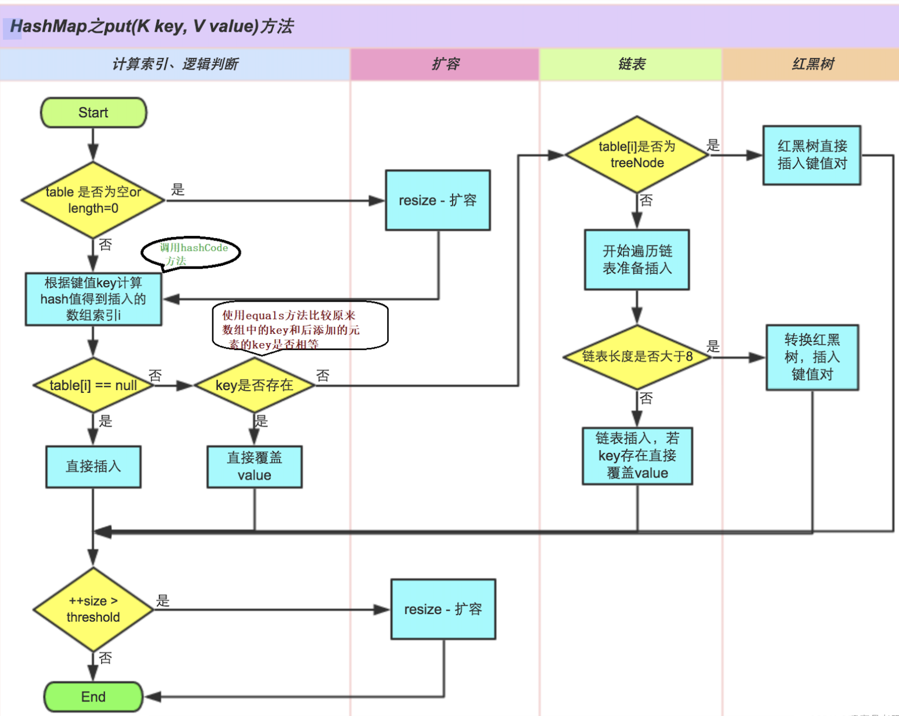

# HashMap

## 简介
- HashMap 基于哈希表的 Map 接口实现，是以 key-value 存储形式存在，即主要用来存放键值对。HashMap 的实现不是同步的，这意味着它不是线程安全的。
- jdk1.8 之前 HashMap 由 数组 + 链表 组成，数组是 HashMap 的主体，链表则是主要为了解决哈希冲突（两个对象调用的 hashCode 方法计算的哈希值经哈希函数算出来的地址被别的元素占用）而存在的（“拉链法”解决冲突）。
- jdk1.8 以后在解决哈希冲突时有了较大的变化，当链表长度大于阈值（或者红黑树的边界值，默认为 8 ）并且当前数组的长度大于 64 时，此时此索引位置上的所有数据改为使用红黑树存储。
  - 将链表转换成红黑树前会判断，即便阈值大于 8，但是数组长度小于 64，此时并不会将链表变为红黑树，而是选择逬行数组扩容。
    - 这样做的目的是因为数组比较小，尽量避开红黑树结构，这种情况下变为红黑树结构，反而会降低效率，因为红黑树需要逬行左旋，右旋，变色这些操作来保持平衡。同时数组长度小于64时，搜索时间相对要快些。所以结上所述为了提高性能和减少搜索时间，底层阈值大于8并且数组长度大于64时，链表才转换为红黑树，具体可以参考 treeifyBin() 方法。

## 特点
- 存储无序
- 键和值位置都可以是null，但是键位置只能存在一个null；
- 键位置是唯一的，是底层的数据结构控制的；
- JDK1.8前HashMap的数据结构是链表+数组，JDK1.8之后是链表+数组+红黑树；
- 当链表长度大于阈值（或者红黑树的边界值，默认为 8 ）并且当前数组的长度大于 64 时，链表改为使用红黑树存储，目的是为了高效查询（jdk1.8新增）；

## HashMap存储数据的过程

示例代码：

```java
HashMap<String, Integer> map = new HashMap<>();
map.put("柳岩", 18);
map.put("杨幂", 28);
map.put("刘德华", 40);
map.put("柳岩", 20);

// 输出结果：
{杨幂=28, 柳岩=20, 刘德华=40}
```

**存储数据的过程分析**
1. 当创建 HashMap 集合对象的时候，HashMap 的构造方法并没有创建数组，而是在第一次调用 put 方法时创建一个长度是16 的数组 Node[] table （jdk1.8 之前是 Entry[] table）用来存储键值对数据。
2. 假设向哈希表中存储 <柳岩,18> 数据，根据柳岩调用 String 类中重写之后的 hashCode() 方法计算出值，然后结合数组长度采用某种算法计算出向 Node 数组中存储数据的空间的索引值。如果计算出的索引空间没有数据，则直接将<柳岩,18>存储到数组中。（举例：计算出的索引是 3 ）
3. 向哈希表中存储数据 <刘德华,40>，假设算出的 hashCode() 方法结合数祖长度计算出的索引值也是3，那么此时数组空间不是 null，此时底层会比较柳岩和刘德华的 hash 值是否一致，如果不一致，则在空间上划出一个结点来存储键值对数据对 <刘德华,40>，这种方式称为拉链法。
4. 假设向哈希表中存储数据 <柳岩,20>，那么首先根据柳岩调用 hashCode() 方法结合数组长度计算出索引肯定是 3，此时比较后存储的数据柳岩和已经存在的数据的 hash 值是否相等，如果 hash 值相等，此时发生哈希碰撞。那么底层会调用柳岩所属类 String 中的 equals() 方法比较两个内容是否相等：
    - 相等：将后添加的数据的 value 覆盖之前的 value。
    - 不相等：继续向下和其他的数据的 key 进行比较，如果都不相等，则划出一个结点存储数据，如果结点长度即链表长度大于阈值 8 并且数组长度大于 64 则将链表变为红黑树。
5. 在不断的添加数据的过程中，会涉及到扩容问题，当超出阈值（且要存放的位置非空）时，扩容。默认的扩容方式：扩容为原来容量的 2 倍，并将原有的数据复制过来。
6. 综上描述，当位于一个表中的元素较多，即 hash 值相等但是内容不相等的元素较多时，通过 key 值依次查找的效率较低。而 jdk1.8 中，哈希表存储采用数组+链表+红黑树实现，当链表长度（阈值）超过8且当前数组的长度大于64时，将链表转换为红黑树，这样大大减少了查找时间。
7. jdk1.8 以前 HashMap 的实现是数组+链表，即使哈希函数取得再好，也很难达到元素百分百均匀分布。当 HashMap 中有大量的元素都存放到同一个桶中时，这个桶下有一条长长的链表，这个时候 HashMap 就相当于一个单链表，假如单链表有n个元素，遍历的时间复杂度就是O(n)，完全失去了它的优势。
    - 针对这种情况，jdk1.8 中引入了红黑树（查找时间复杂度为 O(logn)）来优化这个问题。当链表长度很小的时候，即使遍历，速度也非常快，但是当链表长度不断变长，肯定会对查询性能有一定的影响，所以才需要转成树。
8. 总结

    

> 说明：
>   - size 表示 HashMap 中键值对的实时数量，注意这个不等于数组的长度。
>   - threshold（临界值）= capacity（容量）* loadFactor（负载因子）。这个值是当前已占用数组长度的最大值。size 超过这个值就重新 resize（扩容），扩容后的 HashMap 容量是之前容量的两倍。默认的临界值是12 = 16 * 0.75

## 面试题
- HashMap的加载因子为什么是0.75？
  > 这个值是根据空间和时间，通过泊松分布算法得到的一个折中的值。
- HashMap 中 hash 函数是怎么实现的？还有哪些hash函数的实现方式？
  > 对于 key 的 hashCode 做 hash 操作，无符号右移 16 位然后做异或运算。还有平方取中法，伪随机数法和取余数法。这三种效率都比较低。而无符号右移 16 位异或运算效率是最高的。

- 当两个对象的 hashCode 相等时会怎么样？
  > 会产生哈希碰撞。若 key 值内容相同则替换旧的 value，不然连接到链表后面，链表长度超过阈值 8 就转换为红黑树存储。

- 什么是哈希碰撞，如何解决哈希碰撞？
  > 只要两个元素的 key 计算的哈希码值相同就会发生哈希碰撞。jdk8 之前使用链表解决哈希碰撞。jdk8之后使用链表 + 红黑树解决哈希碰撞。

- 如果两个键的 hashCode 相同，如何存储键值对？
  > 通过 equals 比较内容是否相同。相同：则新的 value 覆盖之前的 value。不相同：则将新的键值对添加到哈希表中。


## 遍历HashMap的几种方式

- 分别遍历Key和Value

  ```java
  for (String key : map.keySet()) {
    System.out.println(key);
  }

  for (Object vlaue : map.values()) {
    System.out.println(value);
  }
  ```

- 使用 Iterator 迭代器迭代(推荐使用)

  ```java
  Iterator<Map.Entry<String, Object>> iterator = map.entrySet().iterator();
  while (iterator.hasNext()) {
      Map.Entry<String, Object> mapEntry = iterator.next();
      System.out.println(mapEntry.getKey() + "---" + mapEntry.getValue());
  }
  ```

- 通过 get 方式（不建议使用）

  ```java
  Set<String> keySet = map.keySet();
  for (String str : keySet) {
    System.out.println(str + "---" + map.get(str));
  }
  ```