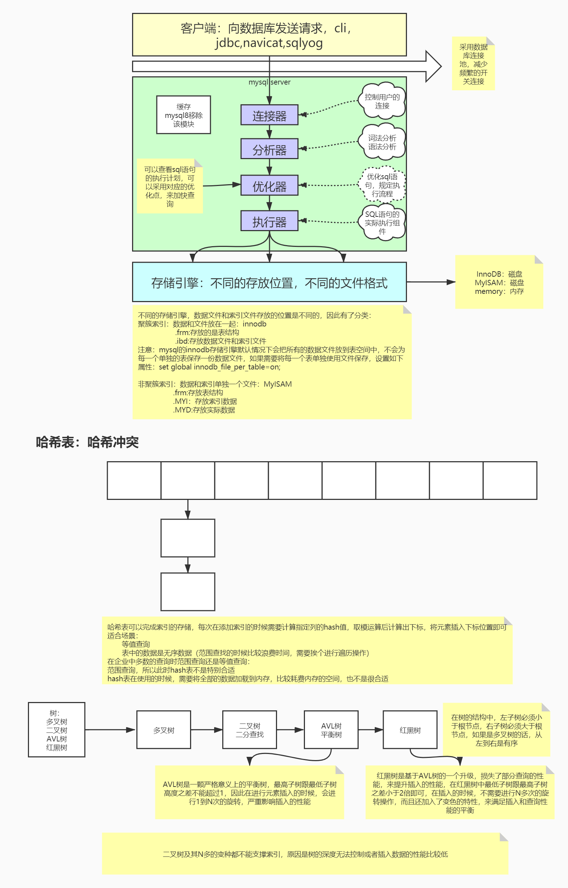
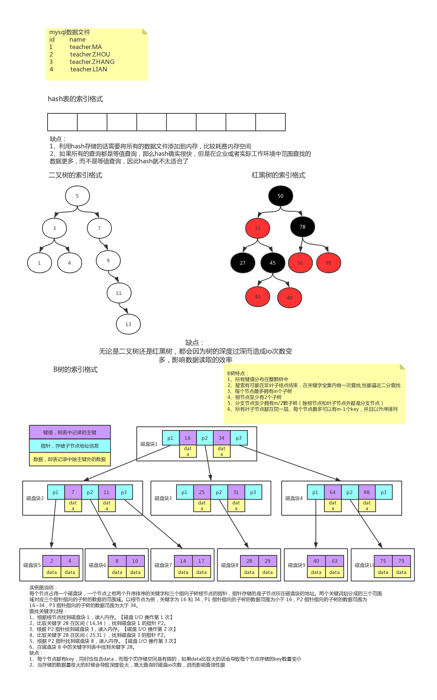
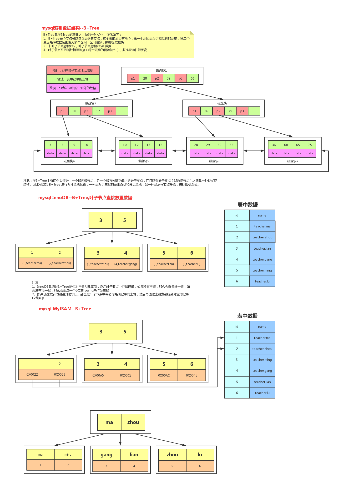
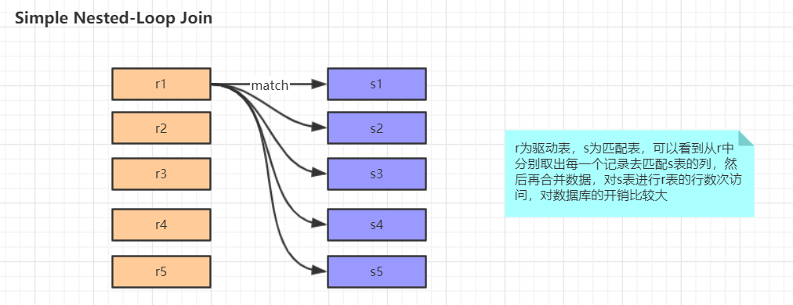
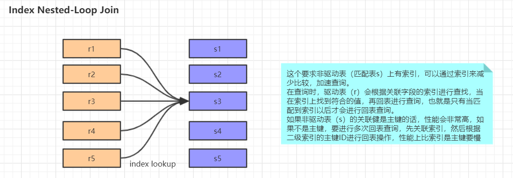
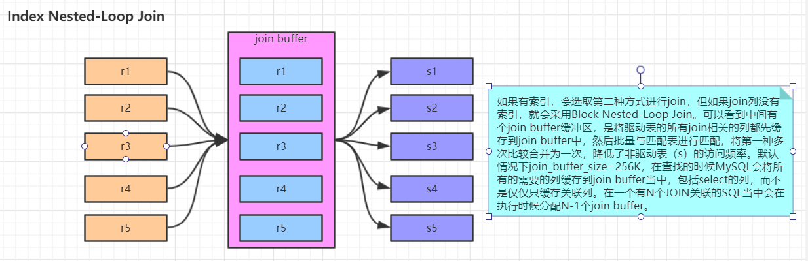

# MySQL调优（一）：概述

  

  
  

## 性能监控
### 使用show profile查询剖析工具，可以指定具体的type（mysql5系列可以使用，高版本可能没有这个命令）

- 此工具默认是禁用的，可以通过服务器变量在会话级别动态的修改；

  ```
  set profiling=1;
  ```

- 当设置完成之后，在服务器上执行的所有语句，都会测量其耗费的时间和其他一些查询执行状态变更相关的数据。

  ```sql
  select * from emp;
  ```

- 在mysql的命令行模式下只能显示两位小数的时间，可以使用如下命令查看具体的执行时间；

  ```sql
  show profiles;
  ```

- 执行如下命令可以查看详细的每个步骤的时间；

  ```sql
  show profile for query 1;
  ```

**type**
- all：显示所有性能信息 `show profile all for query n`
- block io：显示块io操作的次数 `show  profile block io for query n`
- context switches：显示上下文切换次数，被动和主动 `show profile context switches for query n`
- cpu：显示用户cpu时间、系统cpu时间 `show profile cpu for query n`
- IPC：显示发送和接受的消息数量 `show profile ipc for query n`
- Memory：暂未实现
- page faults：显示页错误数量 `show profile page faults for query n`
- source：显示源码中的函数名称与位置 `show profile source for query n`
- swaps：显示swap的次数 `show profile swaps for query n`

### 使用performance schema来更加容易的监控mysql
> MySQL调优（二）：performance_schema详解.md


### 使用show processlist查看连接的线程个数，来观察是否有大量线程处于不正常的状态或者其他不正常的特征
**属性说明**
- id表示session id
- user表示操作的用户
- host表示操作的主机
- db表示操作的数据库
- command表示当前状态
  - sleep：线程正在等待客户端发送新的请求
  - query：线程正在执行查询或正在将结果发送给客户端
  - locked：在mysql的服务层，该线程正在等待表锁
  - analyzing and statistics：线程正在收集存储引擎的统计信息，并生成查询的执行计划
  - Copying to tmp table：线程正在执行查询，并且将其结果集都复制到一个临时表中
  - sorting result：线程正在对结果集进行排序
  - sending data：线程可能在多个状态之间传送数据，或者在生成结果集或者向客户端返回数据
- info表示详细的sql语句
- time表示相应命令执行时间
- state表示命令执行状态


**数据库连接池**


## schema与数据类型优化
### 数据类型的优化
#### 1. 更小的通常更好
- 应该尽量使用可以正确存储数据的最小数据类型，更小的数据类型通常更快，因为它们占用更少的磁盘、内存和CPU缓存，并且处理时需要的CPU周期更少，但是要确保没有低估需要存储的值的范围，如果无法确认哪个数据类型，就选择你认为不会超过范围的最小类型
- 案例：设计两张表，设计不同的数据类型，查看表的容量

#### 2. 简单就好
- 简单数据类型的操作通常需要更少的CPU周期，例如，
  - 整型比字符操作代价更低，因为字符集和校对规则是字符比较比整型比较更复杂，
  - 使用mysql自建类型而不是字符串来存储日期和时间
  - 用整型存储IP地址
    
    ```sql
    select INET_ATON('192.168.85.111');

    select INET_NTOA('3232257391');
    ```
- 案例：创建两张相同的表，改变日期的数据类型，查看SQL语句执行的速度

#### 3. 尽量避免null
- 如果查询中包含可为NULL的列，对mysql来说很难优化，因为可为null的列使得索引、索引统计和值比较都更加复杂，坦白来说，通常情况下null的列改为not null带来的性能提升比较小，所有没有必要将所有的表的schema进行修改，但是应该尽量避免设计成可为null的列;

#### 4. 实际细则
**4.1 整数类型**
- 可以使用的几种整数类型：TINYINT，SMALLINT，MEDIUMINT，INT，BIGINT分别使用8，16，24，32，64位存储空间。
- 尽量使用满足需求的最小数据类型；

**4.2 字符和字符串类型**

```
char长度固定，即每条数据占用等长字节空间；最大长度是255个字符，适合用在身份证号、手机号等定长字符串；

varchar可变程度，可以设置最大长度；最大空间是65535个字节，适合用在长度可变的属性；

text不设置长度，当不知道属性的最大长度时，适合用text;按照查询速度：char>varchar>text；
```

- varchar根据实际内容长度保存数据
  - 使用最小的符合需求的长度；
  - varchar(n) n小于等于255使用额外一个字节保存长度，n>255使用额外两个字节保存长度；
  - varchar(5)与varchar(255)保存同样的内容，硬盘存储空间相同，但内存空间占用不同，是指定的大小；
  - varchar在mysql5.6之前变更长度，或者从255一下变更到255以上时，都会导致锁表；
  - 应用场景
    - 存储长度波动较大的数据，如：文章，有的会很短有的会很长；
    - 字符串很少更新的场景，每次更新后都会重算并使用额外存储空间保存长度；
    - 适合保存多字节字符，如：汉字，特殊字符等；
- char固定长度的字符串
  - 最大长度：255
  - 会自动删除末尾的空格
  - 检索效率、写效率 会比varchar高，以空间换时间
  - 应用场景
    - 存储长度波动不大的数据，如：md5摘要；
    - 存储短字符串、经常更新的字符串；

**4.3 BLOB和TEXT类型**
- MySQL 把每个 BLOB 和 TEXT 值当作一个独立的对象处理。两者都是为了存储很大数据而设计的字符串类型，分别采用二进制和字符方式存储。

**4.4 datetime和timestamp**
- datetime
  - 占用8个字节；
  - 与时区无关，数据库底层时区配置，对datetime无效；
  - 可保存到毫秒；
  - 可保存时间范围大；支持的时间范围是“1000-00-00 00:00:00” 到 “9999-12-31 23:59:59”。
  - 不要使用字符串存储日期类型，占用空间大，损失日期类型函数的便捷性；
- timestamp
  - 占用4个字节；
  - 时间范围：1970-01-01到2038-01-19；
  - 精确到秒；
  - 采用整形存储；
  - 依赖数据库设置的时区；
  - 自动更新timestamp列的值；
- date
  - 占用的字节数比使用字符串、datetime、int存储要少，使用date类型只需要3个字节；
  - 使用date类型还可以利用日期时间函数进行日期之间的计算；
  - date类型用于保存1000-01-01到9999-12-31之间的日期；

**4.5 使用枚举代替字符串类型**
- 有时可以使用枚举类代替常用的字符串类型，mysql存储枚举类型会非常紧凑，会根据列表值的数据压缩到一个或两个字节中，mysql在内部会将每个值在列表中的位置保存为整数，并且在表的.frm文件中保存“数字-字符串”映射关系的查找表；

  ```sql
  create table enum_test(e enum('fish','apple','dog') not null);
  insert into enum_test(e) values('fish'),('dog'),('apple');
  select e+0 from enum_test;
  ```

**4.6 特殊类型数据**
- 人们经常使用varchar(15)来存储ip地址，然而，它的本质是32位无符号整数不是字符串，可以使用INET_ATON()和INET_NTOA函数在这两种表示方法之间转换；
- 案例：

  ```sql
  select inet_aton('1.1.1.1')
  select inet_ntoa(16843009)
  ```
### 合理使用范式和反范式
> 三范式为了解决数据冗余问题

**三范式**
- 1NF：表的列的具有原子性,不可再分解；
- 2NF：表中的记录是唯一的, 就满足2NF, 通常我们设计一个主键来实现；
- 3NF：表中不要有冗余数据, 就是说，表的信息，如果能够被推导出来，就不应该单独的设计一个字段来存放；

#### 1. 范式
**优点**
- 范式化的更新通常比反范式要快；
- 当数据较好的范式化后，很少或者没有重复的数据；
- 范式化的数据比较小，可以放在内存中，操作比较快；

**缺点**
- 通常需要进行关联

#### 2. 反范式
**优点**
- 所有的数据都在同一张表中，可以避免关联；
- 可以设计有效的索引；

**缺点**
- 表格内的冗余较多，删除数据时候会造成表有些有用的信息丢失；

#### 3. 注意
**在企业中很好能做到严格意义上的范式或者反范式，一般需要混合使用**
- 在一个网站实例中，这个网站，允许用户发送消息，并且一些用户是付费用户。现在想查看付费用户最近的10条信息。  在user表和message表中都存储用户类型(account_type)而不用完全的反范式化。这避免了完全反范式化的插入和删除问题，因为即使没有消息的时候也绝不会丢失用户的信息。这样也不会把user_message表搞得太大，有利于高效地获取数据；
- 另一个从父表冗余一些数据到子表的理由是排序的需要；
- 缓存衍生值也是有用的。如果需要显示每个用户发了多少消息（类似论坛的），可以每次执行一个昂贵的自查询来计算并显示它；也可以在user表中建一个num_messages列，每当用户发新消息时更新这个值；

**案例**
- 范式设计

  

- 反范式设计

  

### 主键的选择
#### 1. 代理主键
- 与业务无关的，无意义的数字序列（id）；

#### 2. 自然主键
- 事物属性中的自然唯一标识，与业务属性相关（人的身份证号）；

#### 3. 推荐使用代理主键
- 它们不与业务耦合，因此更容易维护；
- 一个大多数表，最好是全部表，通用的键策略能够减少需要编写的源码数量，减少系统的总体拥有成本；

### 字符集的选择
> utf8 字符存储中文时，有的中文是2个字节，有的是3个字节存储，例如：“中”就是三个字节存储；所以一般用utf8mb4；

1. 纯拉丁字符能表示的内容，没必要选择 latin1 之外的其他字符编码，因为这会节省大量的存储空间。
2. 如果我们可以确定不需要存放多种语言，就没必要非得使用UTF8或者其他UNICODE字符类型，这回造成大量的存储空间浪费。
3. MySQL的数据类型可以精确到字段，所以当我们需要大型数据库中存放多字节数据的时候，可以通过对不同表不同字段使用不同的数据类型来较大程度减小数据存储量，进而降低 IO 操作次数并提高缓存命中率。

### 存储引擎的选择
- 存储引擎的对比

  

### 适当的数据冗余
1. 被频繁引用且只能通过 Join 2张(或者更多)大表的方式才能得到的独立小字段。（物化视图：只有Oracle才有；）
2. 这样的场景由于每次Join仅仅只是为了取得某个小字段的值，Join到的记录又大，会造成大量不必要的 IO，完全可以通过空间换取时间的方式来优化。不过，冗余的同时需要确保数据的一致性不会遭到破坏，确保更新的同时冗余字段也被更新。

### 适当的拆分
- 当我们的表中存在类似于 TEXT 或者是很大的 VARCHAR类型的大字段的时候，如果我们大部分访问这张表的时候都不需要这个字段，我们就该义无反顾的将其拆分到另外的独立表中，以减少常用数据所占用的存储空间。这样做的一个明显好处就是每个数据块中可以存储的数据条数可以大大增加，既减少物理 IO 次数，也能大大提高内存中的缓存命中率。

## 执行计划
> MySQL调优（三）：MySQL执行计划.md

## 通过索引进行优化


**mysql采用B+树的原因或演变过程**
- hash表存储：无法支持范围查询；
- 二叉树：在数据插入的时候会出现数据倾斜（一条腿长，一条腿短），树的深度过深而造成io次数变多（每一个节点就是一次IO），影响数据读取效率。
- 二叉搜索树（BST）：会出现数据倾斜；
- 平衡树（AVL）：为了保证树的平衡（保证最长子树与最短子树的高度差不能超过1），在插入数据的时候会进行旋转操作（左旋、右旋），旋转很耗费时间，插入效率低，查询效率高；
- 红黑树（最长子树不超过最短子树的2倍即可，单分支不出现连续红结点；）：树的深度过深而造成io次数变多（每一个节点就是一次IO），影响数据读取效率。AVL树的变种，损失了部分查询性能来提升插入性能的提升；
- B树：MySQL每次预读16kb数据，3次IO（也是3层B树），只能读16*16*16=4096kb数据，读取数据较少；
- B+树：是在B树的基础上做了优化，B+的非叶子节点中不存储数据只存储key值和指针;3层B+树16*16*16*1000/10=409600kb数据；





### 1. 索引基本知识

#### 1.1 索引的优点
- 大大减少了服务器需要扫描的数据量；
- 帮助服务器避免排序和临时表；
- 将随机io（慢）变成顺序io（快）；

#### 1.2 索引的用处
- 快速查找匹配WHERE子句的行；
- 从consideration中消除行,如果可以在多个索引之间进行选择，mysql通常会使用找到最少行的索引；
- 如果表具有多列索引，则优化器可以使用索引的任何最左前缀来查找行；
- 当有表连接的时候，从其他表检索行数据；
- 查找特定索引列的min或max值；
- 如果排序或分组时在可用索引的最左前缀上完成的，则对表进行排序和分组；
- 在某些情况下，可以优化查询以检索值而无需查询数据行；

#### 1.3 索引的分类
> 数据库会默认帮我们建立索引：唯一索引

- 主键索引：值不能为空
- 唯一索引：值可以为空，效率与主键索引一样；
- 普通索引：普通的列建索引
- 全文索引：一般是char、varchar上用，用的很少
- 组合索引：多个字段组合起来建索引

#### 1.4 面试技术名词
- 回表
  - 普通列的索引（B+） -> 主键（B+） -> 取出整行记录
  - 普通的列建索引后，其B+树的叶子节点存储数据是该表的主键，然后根据主键索引去查询对应的记录；
- 覆盖索引
  - 直接查询B+树索引的节点的主键，不用再根据主键索引去查询对应的数据，避免的回表的过程，减少IO的次数
  - 能用覆盖索引，尽量使用覆盖索引；

    ```sql
    --第一次查找会查找name列的B+树，取出叶子节点中的主键，然后去主键的B+树索引中将整行数据取出来
    select * from emp where name = 1;

    --不需要再从主键索引中去取数据，即为覆盖索引
    select id from emp where name = 1;
    ```

- 最左匹配（组合索引特有）：必须要先有最左边，才能查右边

  ```sql
  --（name,age)建组合索引

  --先按照name来匹配索引
  select * from emp where name = ? and age = ?
  
  --没有左边，右边查不了，索引失效？出现此种情况，可以：建（age,name)索引 或 age 单独建立一个索引
  select * from emp where age = ?
  ```

  ```sql
  select * from emp where name = ? and age = ?
  select * from emp where age = ?
  select * from emp where name = ?

  --以上三条sql怎么建索引更好
  1. (name,age) 建立组合索引，age列单独建立索引，因为age的值较短，占用磁盘空间小，文件越大，IO次数就越高；
  2. name、age 单独建索引，在高版本的mysql中会出现索引合并
  ```
- 谓词下推

  ```sql
  select t1.name, t2.name from t1 join t2 on t1.id = t2.id
  ```
  
- 索引下推(组合索引)
  - 在存储引擎的时候，已经通过索引过滤掉大部分数据
  - 优点：在非主键索引上的优化，可以有效减少回表的次数，大大提升了查询的效率。
  - 关闭索引下推可以使用如下命令：

  ```bash
  set optimizer_switch='index_condition_pushdown=off';
  ```


索引页分裂？
索引页合并？
#### 1.5 索引采用的数据结构
- 哈希表（Memory）
- B+树（MyISAM、InnoDB）

#### 1.6 索引匹配方式

  ```sql
  create table staffs(

      id int primary key auto_increment,

      name varchar(24) not null default '' comment '姓名',

      age int not null default 0 comment '年龄',

      pos varchar(20) not null default '' comment '职位',

      add_time timestamp not null default current_timestamp comment '入职时间'

    ) charset utf8 comment '员工记录表';

  -----------
  alter table staffs add index idx_nap(name, age, pos);
  ```

- 全值匹配：全值匹配指的是和索引中的所有列进行匹配

  ```sql
  explain select * from staffs where name = 'July' and age = '23' and pos = 'dev';
  ```

- 匹配最左前缀：只匹配前面的几列

  ```sql
  explain select * from staffs where name = 'July' and age = '23';

  explain select * from staffs where name = 'July';
  ```

- 匹配列前缀：可以匹配某一列的值的开头部分；

  ```sql
  explain select * from staffs where name like 'J%';

  explain select * from staffs where name like '%y';
  ```

- 匹配范围值：可以查找某一个范围的数据；

  ```sql
  explain select * from staffs where name > 'Mary';
  ```

- 精确匹配某一列并范围匹配另外一列：可以查询第一列的全部和第二列的部分（必须按照索引的顺序）；

  ```sql
  explain select * from staffs where name = 'July' and age > 25;
  ```

- 只访问索引的查询：查询的时候只需要访问索引，不需要访问数据行，本质上就是覆盖索引（extra的为 using index，则用到了索引）；

  ```sql
  explain select name,age,pos from staffs where name = 'July' and age = 25 and pos = 'dev';
  ```

### 2. 哈希索引
- 基于哈希表的实现，只有精确匹配索引所有列的查询才有效（不能使用范围查找）；
- 在mysql中，只有memory的存储引擎显式支持哈希索引；
- 哈希索引自身只需存储对应的hash值，所以索引的结构十分紧凑，这让哈希索引查找的速度非常快；
- 哈希索引的限制
  1. 哈希索引只包含哈希值和行指针，而不存储字段值，索引不能使用索引中的值来避免读取行；
  2. 哈希索引数据并不是按照索引值顺序存储的，所以无法进行排序；
  3. 哈希索引不支持部分列匹配查找，哈希索引是使用索引列的全部内容来计算哈希值；
  4. 哈希索引支持等值比较查询，也不支持任何范围查询；
  5. 访问哈希索引的数据非常快，除非有很多哈希冲突，当出现哈希冲突的时候，存储引擎必须遍历链表中的所有行指针，逐行进行比较，直到找到所有符合条件的行；
  6. 哈希冲突比较多的话，维护的代价也会很高；(如何避免哈希冲突？)
- 案例
  > 当需要存储大量的URL，并且根据URL进行搜索查找，如果使用B+树，存储的内容就会很大
  select id from url where url=""
  也可以利用将url使用CRC32做哈希，可以使用以下查询方式：
  select id fom url where url="" and url_crc=CRC32("")
  此查询性能较高原因是使用体积很小的索引来完成查找

### 3. 组合索引
- 当包含多个列作为索引，需要注意的是正确的顺序依赖于该索引的查询，同时需要考虑如何更好的满足排序和分组的需要；
- 案例，建立组合索引a,b,c
  - 不同SQL语句使用索引情况

    

    - like中%作为前缀，索引失效；
    - 范围查找后面的匹配条件所使用的索引，索引失效；

### 4. 聚簇索引与非聚簇索引
#### 4.1 聚簇索引
不是单独的索引类型，而是一种数据存储方式，指的是数据行跟相邻的键值紧凑的存储在一起；

- 优点：
   1. 可以把相关数据保存在一起；
   2. 数据访问更快，因为索引和数据保存在同一个树中；
   3. 使用覆盖索引扫描的查询可以直接使用页节点中的主键值；
- 缺点：
   1. 聚簇数据最大限度地提高了IO密集型应用的性能，如果数据全部在内存，那么聚簇索引就没有什么优势；
   2. 插入速度严重依赖于插入顺序，按照主键的顺序插入是最快的方式；
   3. 更新聚簇索引列的代价很高，因为会强制将每个被更新的行移动到新的位置；
   4. 基于聚簇索引的表在插入新行，或者主键被更新导致需要移动行的时候，可能面临页分裂的问题；
   5. 聚簇索引可能导致全表扫描变慢，尤其是行比较稀疏，或者由于页分裂导致数据存储不连续的时候；

#### 4.2 非聚簇索引
数据文件跟索引文件分开存放

### 5. 覆盖索引
> 是一种现象，而不是分类；

#### 5.1 基本介绍
1. 如果一个索引包含所有需要查询的字段的值，我们称之为覆盖索引；
2. 不是所有类型的索引都可以称为覆盖索引，覆盖索引必须要存储索引列的值；
3. 不同的存储实现覆盖索引的方式不同，不是所有的引擎都支持覆盖索引，memory不支持覆盖索引；

#### 5.2 优势
1. 索引条目通常远小于数据行大小，如果只需要读取索引，那么mysql就会极大的减少数据访问量；
2. 因为索引是按照列值顺序存储的，所以对于IO密集型的范围查询会比随机从磁盘读取每一行数据的IO要少的多；
3. 一些存储引擎如MYISAM在内存中只缓存索引，数据则依赖于操作系统来缓存，因此要访问数据需要一次系统调用，这可能会导致严重的性能问题；
4. 由于INNODB的聚簇索引，覆盖索引对INNODB表特别有用；

#### 5.3 案例演示

1. 当发起一个被索引覆盖的查询时，在explain的extra列可以看到using index的信息，此时就使用了覆盖索引；

    ```sql
    mysql> explain select store_id,film_id from inventory\G
    *************************** 1. row ***************************
               id: 1
      select_type: SIMPLE
            table: inventory
       partitions: NULL
             type: index
    possible_keys: NULL
              key: idx_store_id_film_id
          key_len: 3
              ref: NULL
             rows: 4581
         filtered: 100.00
            Extra: Using index
    1 row in set, 1 warning (0.01 sec)
    ```

2. 在大多数存储引擎中，覆盖索引只能覆盖那些只访问索引中部分列的查询。不过，可以进一步的进行优化，可以使用innodb的二级索引来覆盖查询。

    > 例如：actor使用innodb存储引擎，并在last_name字段又二级索引，虽然该索引的列不包括主键actor_id，但也能够用于对actor_id做覆盖查询。

    ```sql
    mysql> explain select actor_id,last_name from actor where last_name='HOPPER'\G
    *************************** 1. row ***************************
               id: 1
      select_type: SIMPLE
            table: actor
       partitions: NULL
             type: ref
    possible_keys: idx_actor_last_name
              key: idx_actor_last_name
          key_len: 137
              ref: const
             rows: 2
         filtered: 100.00
            Extra: Using index
    1 row in set, 1 warning (0.00 sec)
    ```

### 6. 优化小细节

1. 当使用索引列进行查询的时候尽量不要使用表达式，把计算放到业务层而不是数据库层；

    ```sql
    --在执行计划中效率更高，type为const
    select actor_id from actor where actor_id=4;

    --执行计划中效率低，type为index
    select actor_id from actor where actor_id+1=5;
    ```

2. 尽量使用主键查询，而不是其他索引，因此主键查询不会触发回表查询；
3. 使用前缀索引；
    - 实例说明：
      - 有时候需要索引很长的字符串，这会让索引变的大且慢，通常情况下可以使用某个列开始的部分字符串，这样大大的节约索引空间，从而提高索引效率，但这会降低索引的选择性，索引的选择性是指不重复的索引值和数据表记录总数的比值，范围从1/#T到1之间。索引的选择性越高则查询效率越高，因为选择性更高的索引可以让mysql在查找的时候过滤掉更多的行。
      - 一般情况下某个列前缀的选择性也是足够高的，足以满足查询的性能，但是对应BLOB,TEXT,VARCHAR类型的列，必须要使用前缀索引，因为mysql不允许索引这些列的完整长度，使用该方法的诀窍在于要选择足够长的前缀以保证较高的选择性，通过又不能太长。

      ```sql
      --创建数据表
      create table citydemo(city varchar(50) not null);
      insert into citydemo(city) select city from city;

      --重复执行5次下面的sql语句
      insert into citydemo(city) select city from citydemo;

      --更新城市表的名称
      update citydemo set city=(select city from city order by rand() limit 1);

      --查找最常见的城市列表，发现每个值都出现45-65次，
      select count(*) as cnt,city from citydemo group by city order by cnt desc limit 10;

      --查找最频繁出现的城市前缀，先从3个前缀字母开始，发现比原来出现的次数更多，可以分别截取多个字符查看城市出现的次数
      select count(*) as cnt,left(city,3) as pref from citydemo group by pref order by cnt desc limit 10;
      select count(*) as cnt,left(city,7) as pref from citydemo group by pref order by cnt desc limit 10;
      --此时前缀的选择性接近于完整列的选择性

      --还可以通过另外一种方式来计算完整列的选择性，可以看到当前缀长度到达7之后，再增加前缀长度，选择性提升的幅度已经很小了
      select count(distinct left(city,3))/count(*) as sel3,
      count(distinct left(city,4))/count(*) as sel4,
      count(distinct left(city,5))/count(*) as sel5,
      count(distinct left(city,6))/count(*) as sel6,
      count(distinct left(city,7))/count(*) as sel7,
      count(distinct left(city,8))/count(*) as sel8
      from citydemo;

      --计算完成之后可以创建前缀索引
      alter table citydemo add key(city(7));

      --注意：前缀索引是一种能使索引更小更快的有效方法，但是也包含缺点：mysql无法使用前缀索引做order by 和 group by。
      ```

      基数(Cardinality)？Hyperloglog？

4. 使用索引扫描来排序；
    - mysql有两种方式可以生成有序的结果；通过排序操作或者按索引顺序扫描，如果explain出来的type列的值为index，则说明mysql使用了索引扫描来做排序；
    - 扫描索引本身是很快的，因为只要从一条索引记录移动到紧接着的下一条记录。但如果索引不能覆盖查询所需的全部列，那么就不得不每扫描一条索引记录就得回表查询一次对应的行，这基本都是随机IO，因此按索引顺序读取数据的速度通常要比顺序地全表扫描慢。
    - mysql可以使用同一个索引即满足排序，又用于查找行，如果可能的话，设计索引时应该尽可能地同时满足这两种任务。
    - 只有当索引的列顺序和order by字句的顺序完全一致，并且所有的排序方式都一样时，mysql才能够使用索引来对结果进行排序，如果查询需要关联多张表，则只有当order by子句引用的字段全部为第一张表时，才能使用索引做排序。order by子句和查找型查询的限制是一样的，需要满足索引的最左前缀的要求，否则，mysql都需要执行顺序操作，而无法利用索引排序；

---

    ```sql
    --sakila 数据库中rental表在rental_date,inventory_id,customer_id上有rental_date的索引
    --使用rental_date索引为下面的查询做排序
    explain select rental_id,staff_id from rental where rental_date='2005-05-25' order by inventory_id,customer_id\G
    ......
    --order by 子句不满足索引的最左前缀要求，也可以用于查询排序，这是因为索引的第一列被指定为一个常数


    --该查询为索引的第一列提供了常量条件，而使用第二列进行排序，将两个列组合在一起，就形成了索引的最左前缀
    explain select rental_id,staff_id, from rental where rental_date='2005-05-25' order by inventory_id desc\G
    ```

 ---

5. union all,in,or都能够使用索引，但是推荐使用in；

    ```sql
    --能用union all就尽量使用
    explain select * from actor where actor_id = 1 union all select * from actor where actor_id = 2;
    
    --从执行计划上看，此条sql与第三条sql执行的情况是一样的，但此条sql的执行时间更短
    explain select * from actor where actor_id in (1,2);

    explain select * from actor where actor_id = 1 or actor_id =2;
    ```
6. 范围列可以用到索引；
    - 范围条件是：<、>
    - 范围列可以用到索引，但是范围列后面的列无法用到索引，索引最多用于一个范围列
7. 强制类型转换会全表扫描；

    ```sql
    create table user(id int,name varchar(10),phone varchar(11));

    alter table user add index idx_1(phone);
    ```

    ```sql
    -- 不会触发索引
    explain select * from user where phone=13800001234;

    -- 触发索引
    explain select * from user where phone='13800001234';
    ```

8. 更新十分频繁，数据区分度不高的字段上不宜建立索引；
    - 更新会变更B+树，更新频繁的字段建议索引会大大降低数据库性能；
    - 类似于性别这类区分不大的属性，建立索引是没有意义的，不能有效的过滤数据；
    - 一般区分度在80%以上的时候就可以建立索引，区分度可以使用 count(distinct(列名))/count(*) 来计算；
9. 创建索引的列，不允许为null，可能会得到不符合预期的结果；
10. 当需要进行表连接的时候，最好不要超过三张表，因为需要join的字段，数据类型必须一致；

    ```sql
    select * from t1 join t2 t1.id = t2.id and t1.name = '张三';

    select * from t1 join t2 on t1.id = t2.id where t1.name = '张三';

    结论：
    当使用内连接的时候，两种方式一样；

    当使用左外连接的时候，会把左表的数据全部查出；
    当使用右外连接的时候，会把右表的数据全部查出；

    and 则是在表连接前过滤A表或B表里面哪些记录符合连接条件，同时兼顾是left join 还是right join。即假如是左连接的话，如果左边表的某条记录不符合连接条件，那么它不进行连接，但是仍然留在结果集中（此时右边部分的连接结果为NULL）。on条件是在生成临时表时使用的条件，它不管on中的条件是否为真，都会返回左边表中的记录
    ```

11. 能使用limit的时候尽量使用limit；
12. 单表索引建议控制在5个以内；
13. 单索引字段数不允许超过5个（组合索引）；
14. 创建索引的时候应该避免以下错误概念；
    - 索引越多越好；
    - 过早优化，在不了解系统的情况下进行优化；

#### 7. 索引监控

```sql
show status like 'Handler_read%';
```

#### 7.1 参数解释
- Handler_read_first：读取索引第一个条目的次数；
- Handler_read_key：通过index获取数据的次数；
- Handler_read_last：读取索引最后一个条目的次数；
- Handler_read_next：通过索引读取下一条数据的次数；
- Handler_read_prev：通过索引读取上一条数据的次数；
- Handler_read_rnd：从固定位置读取数据的次数；
- Handler_read_rnd_next：从数据节点读取下一条数据的次数

Handler_read_key和Handler_read_rnd_next的值比较大的话（越大越好），说明建立的索引比较好，效率高；


### 8. 简单案例
> 索引优化分析案例

预先准备好数据

```sql
SET FOREIGN_KEY_CHECKS=0;
DROP TABLE IF EXISTS `itdragon_order_list`;
CREATE TABLE `itdragon_order_list` (
  `id` bigint(11) NOT NULL AUTO_INCREMENT COMMENT '主键id，默认自增长',
  `transaction_id` varchar(150) DEFAULT NULL COMMENT '交易号',
  `gross` double DEFAULT NULL COMMENT '毛收入(RMB)',
  `net` double DEFAULT NULL COMMENT '净收入(RMB)',
  `stock_id` int(11) DEFAULT NULL COMMENT '发货仓库',
  `order_status` int(11) DEFAULT NULL COMMENT '订单状态',
  `descript` varchar(255) DEFAULT NULL COMMENT '客服备注',
  `finance_descript` varchar(255) DEFAULT NULL COMMENT '财务备注',
  `create_type` varchar(100) DEFAULT NULL COMMENT '创建类型',
  `order_level` int(11) DEFAULT NULL COMMENT '订单级别',
  `input_user` varchar(20) DEFAULT NULL COMMENT '录入人',
  `input_date` varchar(20) DEFAULT NULL COMMENT '录入时间',
  PRIMARY KEY (`id`)
) ENGINE=InnoDB AUTO_INCREMENT=10003 DEFAULT CHARSET=utf8;

INSERT INTO itdragon_order_list VALUES ('10000', '81X97310V32236260E', '6.6', '6.13', '1', '10', 'ok', 'ok', 'auto', '1', 'itdragon', '2017-08-28 17:01:49');
INSERT INTO itdragon_order_list VALUES ('10001', '61525478BB371361Q', '18.88', '18.79', '1', '10', 'ok', 'ok', 'auto', '1', 'itdragon', '2017-08-18 17:01:50');
INSERT INTO itdragon_order_list VALUES ('10002', '5RT64180WE555861V', '20.18', '20.17', '1', '10', 'ok', 'ok', 'auto', '1', 'itdragon', '2017-09-08 17:01:49');

```

逐步开始进行优化：

第一个案例：

```sql
select * from itdragon_order_list where transaction_id = "81X97310V32236260E";
--通过查看执行计划发现type=all,需要进行全表扫描
explain select * from itdragon_order_list where transaction_id = "81X97310V32236260E";

--优化一、为transaction_id创建唯一索引
 create unique index idx_order_transaID on itdragon_order_list (transaction_id);
--当创建索引之后，唯一索引对应的type是const，通过索引一次就可以找到结果，普通索引对应的type是ref，表示非唯一性索引赛秒，找到值还要进行扫描，直到将索引文件扫描完为止，显而易见，const的性能要高于ref
 explain select * from itdragon_order_list where transaction_id = "81X97310V32236260E";

 --优化二、使用覆盖索引，查询的结果变成 transaction_id,当extra出现using index,表示使用了覆盖索引
 explain select transaction_id from itdragon_order_list where transaction_id = "81X97310V32236260E";
```

第二个案例

```sql
--创建复合索引
create index idx_order_levelDate on itdragon_order_list (order_level,input_date);

--创建索引之后发现跟没有创建索引一样，都是全表扫描，都是文件排序
explain select * from itdragon_order_list order by order_level,input_date;

--可以使用force index强制指定索引
explain select * from itdragon_order_list force index(idx_order_levelDate) order by order_level,input_date;
--其实给订单排序意义不大，给订单级别添加索引意义也不大，因此可以先确定order_level的值，然后再给input_date排序
explain select * from itdragon_order_list where order_level=3 order by input_date;
```

## 查询优化

> 在编写快速的查询之前，需要清楚一点，真正重要的是响应时间，而且要知道在整个SQL语句的执行过程中每个步骤都花费了多长时间，要知道哪些步骤是拖垮执行效率的关键步骤，想要做到这点，必须要知道查询的生命周期，然后进行优化，不同的应用场景有不同的优化方式，不要一概而论，具体情况具体分析。

### 1. 查询慢的原因
- 网络
- CPU
- IO
- 上下文切换
- 系统调用
- 生成统计信息
- 锁等待时间：INNODB锁的是索引

### 2. 优化数据访问
- 查询性能低下的主要原因是访问的数据太多，某些查询不可避免的需要筛选大量的数据，我们可以通过减少访问数据量的方式进行优化；
  - 确认应用程序是否在检索大量超过需要的数据（理论上，查询数据超过了30%，会全表扫描，但实际情况需要具体分析）；
  - 确认mysql服务器层是否在分析大量超过需要的数据行；
- 是否向数据库请求了不需要的数据；
  - 查询不需要的记录
    - 我们常常会误以为mysql会只返回需要的数据，实际上mysql却是先返回全部结果再进行计算，在日常的开发习惯中，经常是先用select语句查询大量的结果，然后获取前面的N行后关闭结果集。
    - 优化方式是在查询后面添加limit；
  - 多表关联时返回全部列

    ```sql
    select * from actor inner join film_actor using(actor_id) inner join film using(film_id) where film.title='Academy Dinosaur';

    select actor.* from actor...;
    ```

  - 总是取出全部列；
    - 在公司的企业需求中，禁止使用select *,虽然这种方式能够简化开发，但是会影响查询的性能，所以尽量不要使用；
  - 重复查询相同的数据；
    - 如果需要不断的重复执行相同的查询，且每次返回完全相同的数据，因此，基于这样的应用场景，我们可以将这部分数据缓存起来，这样的话能够提高查询效率；

### 3. 执行过程的优化
#### 3.1 查询缓存
> 在解析一个查询语句之前，如果查询缓存是打开的，那么mysql会优先检查这个查询是否命中查询缓存中的数据，如果查询恰好命中了查询缓存，那么会在返回结果之前会检查用户权限，如果权限没有问题，那么mysql会跳过所有的阶段，就直接从缓存中拿到结果并返回给客户端。

#### 3.2 查询优化处理
> mysql查询完缓存之后会经过以下几个步骤：解析SQL、预处理、优化SQL执行计划，这几个步骤出现任何的错误，都可能会终止查询。

##### 3.2.1 语法解析器和预处理
mysql通过关键字将SQL语句进行解析，并生成一颗解析树，mysql解析器将使用mysql语法规则验证和解析查询，例如验证使用使用了错误的关键字或者顺序是否正确等等，预处理器会进一步检查解析树是否合法，例如表名和列名是否存在，是否有歧义，还会验证权限等等。

##### 3.2.2 查询优化器
当语法树没有问题之后，相应的要由优化器将其转成执行计划，一条查询语句可以使用非常多的执行方式，最后都可以得到对应的结果，但是不同的执行方式带来的效率是不同的，优化器的最主要目的就是要选择最有效的执行计划

mysql使用的是基于成本的优化器，在优化的时候会尝试预测一个查询使用某种查询计划时候的成本，并选择其中成本最小的一个。

- `select count(*) from film_actor;
show status like 'last_query_cost';`
可以看到这条查询语句大概需要做1104个数据页才能找到对应的数据，这是经过一系列的统计信息计算来的；
  - 每个表或者索引的页面个数;
  - 索引的基数
  - 索引和数据行的长度
  - 索引的分布情况
- 在很多情况下mysql会选择错误的执行计划，原因如下：
  - 统计信息不准确：InnoDB因为其mvcc的架构，并不能维护一个数据表的行数的精确统计信息；
  - 执行计划的成本估算不等同于实际执行的成本：有时候某个执行计划虽然需要读取更多的页面，但是他的成本却更小，因为如果这些页面都是顺序读或者这些页面都已经在内存中的话，那么它的访问成本将很小，mysql层面并不知道哪些页面在内存中，哪些在磁盘，所以查询之际执行过程中到底需要多少次IO是无法得知的；
  - mysql的最优可能跟你想的不一样：mysql的优化是基于成本模型的优化，但是有可能不是最快的优化；
  - mysql不考虑其他并发执行的查询；
  - mysql不会考虑不受其控制的操作成本：执行存储过程或者用户自定义函数的成本；
- 优化器的优化策略
  - 静态优化：直接对解析树进行分析，并完成优化；
  - 动态优化：动态优化与查询的上下文有关，也可能跟取值、索引对应的行数有关；
  - mysql对查询的静态优化只需要一次，但对动态优化在每次执行时都需要重新评估；
- 优化器的优化类型
  - 重新定义关联表的顺序：数据表的关联并不总是按照在查询中指定的顺序进行，决定关联顺序时优化器很重要的功能；
  - 将外连接转化成内连接(inner join)，内连接的效率要高于外连接(left join / right join)；
  - 使用等价变换规则，mysql可以使用一些等价变化来简化并规划表达式；
  - 优化count(),min(),max()：索引和列是否可以为空通常可以帮助mysql优化这类表达式：例如，要找到某一列的最小值，只需要查询索引的最左端的记录即可，不需要全文扫描比较；
  - 预估并转化为常数表达式，当mysql检测到一个表达式可以转化为常数的时候，就会一直把该表达式作为常数进行处理

    ```sql
    explain select film.film_id,film_actor.actor_id from film inner join film_actor using(film_id) where film.film_id = 1
    ```

  - 索引覆盖扫描，当索引中的列包含所有查询中需要使用的列的时候，可以使用覆盖索引；
  - 子查询优化：mysql在某些情况下可以将子查询转换一种效率更高的形式，从而减少多个查询多次对数据进行访问，例如将经常查询的数据放入到缓存中；
  - 等值传播：如果两个列的值通过等式关联，那么mysql能够把其中一个列的where条件传递到另一个上：

    ```sql
    explain select film.film_id from film inner join film_actor using(film_id
    ) where film.film_id > 500;

    --这里使用film_id字段进行等值关联，film_id这个列不仅适用于film表而且适用于film_actor表
    explain select film.film_id from film inner join film_actor using(film_id
    ) where film.film_id > 500 and film_actor.film_id > 500;
    ```

- 关联查询
  - join的实现方式原理
    1. Simple Nested-Loop Join

        

    2. Index Nested-Loop Join

        

    3. Block Nested-Loop Join

        

        - （1）Join Buffer会缓存所有参与查询的列而不是只有Join的列。
        - （2）可以通过调整join_buffer_size缓存大小
        - （3）join_buffer_size的默认值是256K，join_buffer_size的最大值在MySQL 5.1.22版本前是4G-1，而之后的版本才能在64位操作系统下申请大于4G的Join Buffer空间。
        - （4）使用Block Nested-Loop Join算法需要开启优化器管理配置的optimizer_switch的设置block_nested_loop为on，默认为开启。

        ```sql
        show variables like '%optimizer_switch%'
        ```

  - 案例演示

    ```sql
    --查看不同的顺序执行方式对查询性能的影响：
    explain select film.film_id,film.title,film.release_year,actor.actor_id,actor.first_name,actor.last_name from film inner join film_actor using(film_id) inner join actor using(actor_id);

    --查看执行的成本：
    show status like 'last_query_cost'; 
    --按照自己预想的规定顺序执行(straight_join)：
    explain select straight_join film.film_id,film.title,film.release_year,actor.actor_id,actor.first_name,actor.last_name from film inner join film_actor using(film_id) inner join actor using(actor_id);

    --查看执行的成本：
    show status like 'last_query_cost'; 
    ```

- 排序优化

  ```
  无论如何排序都是一个成本很高的操作，所以从性能的角度出发，应该尽可能避免排序或者尽可能避免对大量数据进行排序。
  推荐使用利用索引进行排序，但是当不能使用索引的时候，mysql就需要自己进行排序，如果数据量小则再内存中进行，如果数据量大就需要使用磁盘，mysql中称之为filesort。
  如果需要排序的数据量小于排序缓冲区(show variables like '%sort_buffer_size%';),mysql使用内存进行快速排序操作，如果内存不够排序，那么mysql就会先将树分块，对每个独立的块使用快速排序进行排序，并将各个块的排序结果存放再磁盘上，然后将各个排好序的块进行合并，最后返回排序结果。
  ```

  - 排序的算法
    - 两次传输排序：第一次数据读取是将需要排序的字段读取出来，然后进行排序，第二次是将排好序的结果按照需要去读取数据行。这种方式效率比较低，原因是第二次读取数据的时候因为已经排好序，需要去读取所有记录而此时更多的是随机IO，读取数据成本会比较高；两次传输的优势，在排序的时候存储尽可能少的数据，让排序缓冲区可以尽可能多的容纳行数来进行排序操作。
    - 单次传输排序：先读取查询所需要的所有列，然后再根据给定列进行排序，最后直接返回排序结果，此方式只需要一次顺序IO读取所有的数据，而无须任何的随机IO，问题在于查询的列特别多的时候，会占用大量的存储空间，无法存储大量的数据。
    - 当需要排序的列的总大小超过max_length_for_sort_data定义的字节，mysql会选择双次排序，反之使用单次排序，当然，用户可以设置此参数的值来选择排序的方式。

### 4. 优化特定类型的查询
#### 4.1 优化count()查询
count()是特殊的函数，有两种不同的作用，一种是某个列值的数量，也可以统计行数。

- 总有人认为myisam的count函数比较快，这是有前提条件的，只有没有任何where条件的count(*)才是比较快的；
- 使用近似值：在某些应用场景中，不需要完全精确的值，可以参考使用近似值来代替，比如可以使用explain来获取近似的值；其实在很多OLAP的应用中，需要计算某一个列值的基数，有一个计算近似值的算法叫hyperloglog。
- 更复杂的优化：一般情况下，count()需要扫描大量的行才能获取精确的数据，其实很难优化，在实际操作的时候可以考虑使用索引覆盖扫描，或者增加汇总表，或者增加外部缓存系统。

#### 4.2 优化关联查询
- 确保on或者using子句中的列上有索引，在创建索引的时候就要考虑到关联的顺序；
  - 当表A和表B使用列C关联的时候，如果优化器的关联顺序是B、A，那么就不需要再B表的对应列上建上索引，没有用到的索引只会带来额外的负担，一般情况下来说，只需要在关联顺序中的第二个表的相应列上创建索引；
- 确保任何的groupby和order by中的表达式只涉及到一个表中的列，这样mysql才有可能使用索引来优化这个过程；

#### 4.3 优化子查询
子查询的优化最重要的优化建议是尽可能使用关联查询代替；

#### 4.4 优化group by和distinct
很多场景下，mysql使用相同的方法来优化group by和distinct的查询，使用索引是最有效的方式，当时有很多的情况下无法使用索引，可以使用临时表或者文件排序来分组。

- 如果对关联查询做分组，并且是按照查找表中的某个列进行分组，那么可以采用查找表的标识列分组的效率比其他列更高；

  ```sql
  select actor.first_name,actor.last_name,count(*) from film_actor inner join actor using(actor_id) group by actor.first_name,actor.last_name;

  --id分组没有意义；若表中没有重复值，可以用id分组，否则重复值也算一条记录
  select actor.first_name,actor.last_name,count(*) from film_actor inner join actor using(actor_id) group by actor.actor_id;
  ```


#### 4.5 优化limit分页
> 在很多应用场景中我们需要将数据进行分页，一般会使用limit加上偏移量的方法实现，同时加上合适的orderby 的子句，如果这种方式有索引的帮助，效率通常不错，否则的化需要进行大量的文件排序操作，还有一种情况，当偏移量非常大的时候，前面的大部分数据都会被抛弃，这样的代价太高。
要优化这种查询的话，要么是在页面中限制分页的数量，要么优化大偏移量的性能;

优化此类查询的最简单的办法就是尽可能地使用覆盖索引，而不是查询所有的列；

```sql
select film_id,description from film order by title limit 50,5

--扫描的行数更少，rows
explain select film.film_id,film.description from film inner join (select film_id from film order by title limit 50,5) as lim using(film_id);
```

#### 4.6 优化union查询
> mysql总是通过创建并填充临时表的方式来执行union查询，因此很多优化策略在union查询中都没法很好的使用。经常需要手工的将where、limit、order by等子句下推到各个子查询中，以便优化器可以充分利用这些条件进行优化。

除非确实需要服务器消除重复的行，否则一定要使用union all，因此没有all关键字，mysql会在查询的时候给临时表加上distinct的关键字，这个操作的代价很高。

```sql
--行转列

name  subject  score
zs    yuwen    89
zs    shuxue   89
zs    yingyu   89
ls    yuwen    90
ls    shuxue   90
ls    yinyu    90


name  yuwen  shuxue  yingyu 


oracle中实现行转列: join、union、decode、case when；

mysql中实现行转列：join、union、case when
```

#### 4.7 推荐使用用户自定义变量
> 用户自定义变量是一个容易被遗忘的mysql特性，但是如果能够用好，在某些场景下可以写出非常高效的查询语句，在查询中混合使用过程化和关系话逻辑的时候，自定义变量会非常有用。
用户自定义变量是一个用来存储内容的临时容器，在连接mysql的整个过程中都存在。

- 自定义变量的使用

  ```sql
  set @one :=1

  set @min_actor :=(select min(actor_id) from actor)

  set @last_week :=current_date-interval 1 week;
  ```

- 自定义变量的限制
  1. 无法使用查询缓存;
  2. 不能在使用常量或者标识符的地方使用自定义变量，例如表名、列名或者limit子句;
  3. 用户自定义变量的生命周期是在一个连接中有效，所以不能用它们来做连接间的通信;
  4. 不能显式地声明自定义变量地类型;
  5. mysql优化器在某些场景下可能会将这些变量优化掉，这可能导致代码不按预想地方式运行;
  6. 赋值符号：=的优先级非常低，所以在使用赋值表达式的时候应该明确的使用括号;
  7. 使用未定义变量不会产生任何语法错误;
- 自定义变量的使用案例
  - 优化排名语句
    1. 在给一个变量赋值的同时使用这个变量

      ```sql
      select actor_id,@rownum:=@rownum+1 as rownum from actor limit 10;
      ```

    2. 查询获取演过最多电影的前10名演员，然后根据出演电影次数做一个排名;

      ```sql
      select actor_id,count(*) as cnt from film_actor group by actor_id order by cnt desc limit 10;
      ```
  - 避免重新查询刚刚更新的数据
    - 当需要高效的更新一条记录的时间戳，同时希望查询当前记录中存放的时间戳是什么;

      ```sql
      update t1 set  lastUpdated=now() where id =1;
      select lastUpdated from t1 where id =1;

      update t1 set lastupdated = now() where id = 1 and @now:=now();
      select @now;
      ```

  - 确定取值的顺序
    - 在赋值和读取变量的时候可能是在查询的不同阶段

      ```sql
      set @rownum:=0;
      select actor_id,@rownum:=@rownum+1 as cnt from actor where @rownum<=1;
      --因为where和select在查询的不同阶段执行，所以看到查询到两条记录，这不符合预期

      set @rownum:=0;
      select actor_id,@rownum:=@rownum+1 as cnt from actor where @rownum<=1 order by first_name
      --当引入了orde;r by之后，发现打印出了全部结果，这是因为order by引入了文件排序，而where条件是在文件排序操作之前取值的

      --解决这个问题的关键在于让变量的赋值和取值发生在执行查询的同一阶段：
      set @rownum:=0;
      select actor_id,@rownum as cnt from actor where (@rownum:=@rownum+1)<=1;
      ```

## 分区表
对于用户而言，分区表是一个独立的逻辑表，但是底层是由多个物理子表组成。分区表对于用户而言是一个完全封装底层实现的黑盒子，对用户而言是透明的，从文件系统中可以看到多个使用#分隔命名的表文件。
mysql在创建表时使用partition by子句定义每个分区存放的数据，在执行查询的时候，优化器会根据分区定义过滤那些没有我们需要数据的分区，这样查询就无须扫描所有分区。
分区的主要目的是将数据安好一个较粗的力度分在不同的表中，这样可以将相关的数据存放在一起。

### 1. 分区表的应用场景
1. 表非常大以至于无法全部都放在内存中，或者只在表的最后部分有热点数据，其他均是历史数据；
2. 分区表的数据更容易维护
    - 批量删除大量数据可以使用清除整个分区的方式
    - 对一个独立分区进行优化、检查、修复等操作
3. 分区表的数据可以分布在不同的物理设备上，从而高效地利用多个硬件设备
4. 可以使用分区表来避免某些特殊的瓶颈
    - innodb的单个索引的互斥访问
    - ext3文件系统的inode锁竞争
5. 可以备份和恢复独立的分区

### 2. 分区表的限制
1. 一个表最多只能有1024个分区，在5.7版本的时候可以支持8196个分区
2. 在早期的mysql中，分区表达式必须是整数或者是返回整数的表达式，在mysql5.5中，某些场景可以直接使用列来进行分区；
3. 如果分区字段中有主键或者唯一索引的列，那么所有主键列和唯一索引列都必须包含进来；
4. 分区表无法使用外键约束；

### 3. 分区表的原理
> 分区表由多个相关的底层表实现，这个底层表也是由句柄对象标识，我们可以直接访问各个分区。存储引擎管理分区的各个底层表和管理普通表一样（所有的底层表都必须使用相同的存储引擎），分区表的索引只是在各个底层表上各自加上一个完全相同的索引。从存储引擎的角度来看，底层表和普通表没有任何不同，存储引擎也无须知道这是一个普通表还是一个分区表的一部分。

分区表的操作按照以下的操作逻辑进行：
- select查询：当查询一个分区表的时候，分区层先打开并锁住所有的底层表，优化器先判断是否可以过滤部分分区，然后再调用对应的存储引擎接口访问各个分区的数据；
- insert操作：当写入一条记录的时候，分区层先打开并锁住所有的底层表，然后确定哪个分区接受这条记录，再将记录写入对应底层表；
- delete操作：当删除一条记录时，分区层先打开并锁住所有的底层表，然后确定数据对应的分区，最后对相应底层表进行删除操作；
- update操作
  - 当更新一条记录时，分区层先打开并锁住所有的底层表，mysql先确定需要更新的记录再哪个分区，然后取出数据并更新，再判断更新后的数据应该再哪个分区，最后对底层表进行写入操作，并对源数据所在的底层表进行删除操作；
  - 有些操作时支持过滤的，例如，当删除一条记录时，MySQL需要先找到这条记录，如果where条件恰好和分区表达式匹配，就可以将所有不包含这条记录的分区都过滤掉，这对update同样有效。如果是insert操作，则本身就是只命中一个分区，其他分区都会被过滤掉。mysql先确定这条记录属于哪个分区，再将记录写入对应得曾分区表，无须对任何其他分区进行操作；
  - 虽然每个操作都会“先打开并锁住所有的底层表”，但这并不是说分区表在处理过程中是锁住全表的，如果存储引擎能够自己实现行级锁，例如innodb，则会在分区层释放对应表锁。

### 4. 分区表的类型
#### 4.1 范围分区
根据列值在给定范围内将行分配给分区。

​		范围分区表的分区方式是：每个分区都包含行数据且分区的表达式在给定的范围内，分区的范围应该是连续的且不能重叠，可以使用values less than运算符来定义。

​1. 创建普通的表

```sql
CREATE TABLE employees (
    id INT NOT NULL,
    fname VARCHAR(30),
    lname VARCHAR(30),
    hired DATE NOT NULL DEFAULT '1970-01-01',
    separated DATE NOT NULL DEFAULT '9999-12-31',
    job_code INT NOT NULL,
    store_id INT NOT NULL
);
```

​2. 创建带分区的表，下面建表的语句是按照store_id来进行分区的，指定了4个分区

```sql
CREATE TABLE employees (
    id INT NOT NULL,
    fname VARCHAR(30),
    lname VARCHAR(30),
    hired DATE NOT NULL DEFAULT '1970-01-01',
    separated DATE NOT NULL DEFAULT '9999-12-31',
    job_code INT NOT NULL,
    store_id INT NOT NULL
)
PARTITION BY RANGE (store_id) (
    PARTITION p0 VALUES LESS THAN (6),
    PARTITION p1 VALUES LESS THAN (11),
    PARTITION p2 VALUES LESS THAN (16),
    PARTITION p3 VALUES LESS THAN (21)
);
--在当前的建表语句中可以看到，store_id的值在1-5的在p0分区，6-10的在p1分区，11-15的在p3分区，16-20的在p4分区，但是如果插入超过20的值就会报错，因为mysql不知道将数据放在哪个分区
```

​3. 可以使用less than maxvalue来避免此种情况

```sql
CREATE TABLE employees (
    id INT NOT NULL,
    fname VARCHAR(30),
    lname VARCHAR(30),
    hired DATE NOT NULL DEFAULT '1970-01-01',
    separated DATE NOT NULL DEFAULT '9999-12-31',
    job_code INT NOT NULL,
    store_id INT NOT NULL
)
PARTITION BY RANGE (store_id) (
    PARTITION p0 VALUES LESS THAN (6),
    PARTITION p1 VALUES LESS THAN (11),
    PARTITION p2 VALUES LESS THAN (16),
    PARTITION p3 VALUES LESS THAN MAXVALUE
);
--maxvalue表示始终大于等于最大可能整数值的整数值
```

​4. 可以使用相同的方式根据员工的职务代码对表进行分区

```sql
CREATE TABLE employees (
    id INT NOT NULL,
    fname VARCHAR(30),
    lname VARCHAR(30),
    hired DATE NOT NULL DEFAULT '1970-01-01',
    separated DATE NOT NULL DEFAULT '9999-12-31',
    job_code INT NOT NULL,
    store_id INT NOT NULL
)
PARTITION BY RANGE (job_code) (
    PARTITION p0 VALUES LESS THAN (100),
    PARTITION p1 VALUES LESS THAN (1000),
    PARTITION p2 VALUES LESS THAN (10000)
);
```

​5. 可以使用date类型进行分区：如虚妄根据每个员工离开公司的年份进行划分，如year(separated)

```sql
CREATE TABLE employees (
    id INT NOT NULL,
    fname VARCHAR(30),
    lname VARCHAR(30),
    hired DATE NOT NULL DEFAULT '1970-01-01',
    separated DATE NOT NULL DEFAULT '9999-12-31',
    job_code INT,
    store_id INT
)
PARTITION BY RANGE ( YEAR(separated) ) (
    PARTITION p0 VALUES LESS THAN (1991),
    PARTITION p1 VALUES LESS THAN (1996),
    PARTITION p2 VALUES LESS THAN (2001),
    PARTITION p3 VALUES LESS THAN MAXVALUE
);
```

​6. 可以使用函数根据range的值来对表进行分区，如timestampunix_timestamp()

```sql
CREATE TABLE quarterly_report_status (
    report_id INT NOT NULL,
    report_status VARCHAR(20) NOT NULL,
    report_updated TIMESTAMP NOT NULL DEFAULT CURRENT_TIMESTAMP ON UPDATE CURRENT_TIMESTAMP
)
PARTITION BY RANGE ( UNIX_TIMESTAMP(report_updated) ) (
    PARTITION p0 VALUES LESS THAN ( UNIX_TIMESTAMP('2008-01-01 00:00:00') ),
    PARTITION p1 VALUES LESS THAN ( UNIX_TIMESTAMP('2008-04-01 00:00:00') ),
    PARTITION p2 VALUES LESS THAN ( UNIX_TIMESTAMP('2008-07-01 00:00:00') ),
    PARTITION p3 VALUES LESS THAN ( UNIX_TIMESTAMP('2008-10-01 00:00:00') ),
    PARTITION p4 VALUES LESS THAN ( UNIX_TIMESTAMP('2009-01-01 00:00:00') ),
    PARTITION p5 VALUES LESS THAN ( UNIX_TIMESTAMP('2009-04-01 00:00:00') ),
    PARTITION p6 VALUES LESS THAN ( UNIX_TIMESTAMP('2009-07-01 00:00:00') ),
    PARTITION p7 VALUES LESS THAN ( UNIX_TIMESTAMP('2009-10-01 00:00:00') ),
    PARTITION p8 VALUES LESS THAN ( UNIX_TIMESTAMP('2010-01-01 00:00:00') ),
    PARTITION p9 VALUES LESS THAN (MAXVALUE)
);
--timestamp不允许使用任何其他涉及值的表达式
```

基于时间间隔的分区方案，在mysql5.7中，可以基于范围或事件间隔实现分区方案，有两种选择：
- 基于范围的分区，对于分区表达式，可以使用操作函数基于date、time、或者datatime列来返回一个整数值

  ```sql
  CREATE TABLE members (
      firstname VARCHAR(25) NOT NULL,
      lastname VARCHAR(25) NOT NULL,
      username VARCHAR(16) NOT NULL,
      email VARCHAR(35),
      joined DATE NOT NULL
  )
  PARTITION BY RANGE( YEAR(joined) ) (
      PARTITION p0 VALUES LESS THAN (1960),
      PARTITION p1 VALUES LESS THAN (1970),
      PARTITION p2 VALUES LESS THAN (1980),
      PARTITION p3 VALUES LESS THAN (1990),
      PARTITION p4 VALUES LESS THAN MAXVALUE
  );

  CREATE TABLE quarterly_report_status (
      report_id INT NOT NULL,
      report_status VARCHAR(20) NOT NULL,
      report_updated TIMESTAMP NOT NULL DEFAULT CURRENT_TIMESTAMP ON UPDATE CURRENT_TIMESTAMP
  )
  PARTITION BY RANGE ( UNIX_TIMESTAMP(report_updated) ) (
      PARTITION p0 VALUES LESS THAN ( UNIX_TIMESTAMP('2008-01-01 00:00:00') ),
      PARTITION p1 VALUES LESS THAN ( UNIX_TIMESTAMP('2008-04-01 00:00:00') ),
      PARTITION p2 VALUES LESS THAN ( UNIX_TIMESTAMP('2008-07-01 00:00:00') ),
      PARTITION p3 VALUES LESS THAN ( UNIX_TIMESTAMP('2008-10-01 00:00:00') ),
      PARTITION p4 VALUES LESS THAN ( UNIX_TIMESTAMP('2009-01-01 00:00:00') ),
      PARTITION p5 VALUES LESS THAN ( UNIX_TIMESTAMP('2009-04-01 00:00:00') ),
      PARTITION p6 VALUES LESS THAN ( UNIX_TIMESTAMP('2009-07-01 00:00:00') ),
      PARTITION p7 VALUES LESS THAN ( UNIX_TIMESTAMP('2009-10-01 00:00:00') ),
      PARTITION p8 VALUES LESS THAN ( UNIX_TIMESTAMP('2010-01-01 00:00:00') ),
      PARTITION p9 VALUES LESS THAN (MAXVALUE)
  );
  ```

- 基于范围列的分区，使用date或者datatime列作为分区列

  ```sql
  CREATE TABLE members (
      firstname VARCHAR(25) NOT NULL,
      lastname VARCHAR(25) NOT NULL,
      username VARCHAR(16) NOT NULL,
      email VARCHAR(35),
      joined DATE NOT NULL
  )
  PARTITION BY RANGE COLUMNS(joined) (
      PARTITION p0 VALUES LESS THAN ('1960-01-01'),
      PARTITION p1 VALUES LESS THAN ('1970-01-01'),
      PARTITION p2 VALUES LESS THAN ('1980-01-01'),
      PARTITION p3 VALUES LESS THAN ('1990-01-01'),
      PARTITION p4 VALUES LESS THAN MAXVALUE
  );
  ```

  - 案例：

```sql
-------不分区的表
CREATE TABLE no_part_tab
(id INT DEFAULT NULL,
remark VARCHAR(50) DEFAULT NULL,
d_date DATE DEFAULT NULL
)ENGINE=MYISAM;

--分区的表

CREATE TABLE part_tab
(id INT DEFAULT NULL,
remark VARCHAR(50) DEFAULT NULL,
d_date DATE DEFAULT NULL
)ENGINE=MYISAM
PARTITION BY RANGE(YEAR(d_date))(
PARTITION p0 VALUES LESS THAN(1995),
PARTITION p1 VALUES LESS THAN(1996),
PARTITION p2 VALUES LESS THAN(1997),
PARTITION p3 VALUES LESS THAN(1998),
PARTITION p4 VALUES LESS THAN(1999),
PARTITION p5 VALUES LESS THAN(2000),
PARTITION p6 VALUES LESS THAN(2001),
PARTITION p7 VALUES LESS THAN(2002),
PARTITION p8 VALUES LESS THAN(2003),
PARTITION p9 VALUES LESS THAN(2004),
PARTITION p10 VALUES LESS THAN maxvalue);

--插入未分区表记录

DROP PROCEDURE IF EXISTS no_load_part;


DELIMITER//
CREATE PROCEDURE no_load_part()
BEGIN
    DECLARE i INT;
    SET i =1;
    WHILE i<80001
    DO
    INSERT INTO no_part_tab VALUES(i,'no',ADDDATE('1995-01-01',(RAND(i)*36520) MOD 3652));
    SET i=i+1;
    END WHILE;
END//
DELIMITER ;

CALL no_load_part;


--插入分区表记录

DROP PROCEDURE IF EXISTS load_part;

DELIMITER&&
CREATE PROCEDURE load_part()
BEGIN
    DECLARE i INT;
    SET i=1;
    WHILE i<80001
    DO
    INSERT INTO part_tab VALUES(i,'partition',ADDDATE('1995-01-01',(RAND(i)*36520) MOD 3652));
    SET i=i+1;
    END WHILE;
END&&
DELIMITER ;

CALL load_part;
```

##### 4.2 列表分区
类似于按range分区，区别在于list分区是基于列值匹配一个离散值集合中的某个值来进行选择；

```sql
CREATE TABLE employees (

    id INT NOT NULL,

    fname VARCHAR(30),

    lname VARCHAR(30),

    hired DATE NOT NULL DEFAULT '1970-01-01',

    separated DATE NOT NULL DEFAULT '9999-12-31',

    job_code INT,

    store_id INT

)

PARTITION BY LIST(store_id) (

    PARTITION pNorth VALUES IN (3,5,6,9,17),

    PARTITION pEast VALUES IN (1,2,10,11,19,20),

    PARTITION pWest VALUES IN (4,12,13,14,18),

    PARTITION pCentral VALUES IN (7,8,15,16)

);
```

#### 4.3 列分区
mysql从5.5开始支持column分区，可以认为i是range和list的升级版，在5.5之后，可以使用column分区替代range和list，但是column分区只接受普通列不接受表达式；

```sql
 CREATE TABLE `list_c` (
 `c1` int(11) DEFAULT NULL,
 `c2` int(11) DEFAULT NULL
) ENGINE=InnoDB DEFAULT CHARSET=latin1
/*!50500 PARTITION BY RANGE COLUMNS(c1)
(PARTITION p0 VALUES LESS THAN (5) ENGINE = InnoDB,
 PARTITION p1 VALUES LESS THAN (10) ENGINE = InnoDB) */

 CREATE TABLE `list_c` (
 `c1` int(11) DEFAULT NULL,
 `c2` int(11) DEFAULT NULL,
 `c3` char(20) DEFAULT NULL
) ENGINE=InnoDB DEFAULT CHARSET=latin1
/*!50500 PARTITION BY RANGE COLUMNS(c1,c3)
(PARTITION p0 VALUES LESS THAN (5,'aaa') ENGINE = InnoDB,
 PARTITION p1 VALUES LESS THAN (10,'bbb') ENGINE = InnoDB) */

 CREATE TABLE `list_c` (
 `c1` int(11) DEFAULT NULL,
 `c2` int(11) DEFAULT NULL,
 `c3` char(20) DEFAULT NULL
) ENGINE=InnoDB DEFAULT CHARSET=latin1
/*!50500 PARTITION BY LIST COLUMNS(c3)
(PARTITION p0 VALUES IN ('aaa') ENGINE = InnoDB,
 PARTITION p1 VALUES IN ('bbb') ENGINE = InnoDB) */

```

#### 4.4 hash分区
基于用户定义的表达式的返回值来进行选择的分区，该表达式使用将要插入到表中的这些行的列值进行计算。这个函数可以包含myql中有效的、产生非负整数值的任何表达式；

```sql
CREATE TABLE employees (
    id INT NOT NULL,
    fname VARCHAR(30),
    lname VARCHAR(30),
    hired DATE NOT NULL DEFAULT '1970-01-01',
    separated DATE NOT NULL DEFAULT '9999-12-31',
    job_code INT,
    store_id INT
)
PARTITION BY HASH(store_id)
PARTITIONS 4;
CREATE TABLE employees (
    id INT NOT NULL,
    fname VARCHAR(30),
    lname VARCHAR(30),
    hired DATE NOT NULL DEFAULT '1970-01-01',
    separated DATE NOT NULL DEFAULT '9999-12-31',
    job_code INT,
    store_id INT
)
PARTITION BY LINEAR HASH(YEAR(hired))
PARTITIONS 4;
```

#### 4.5 key分区
类似于hash分区，区别在于key分区只支持一列或多列，且mysql服务器提供其自身的哈希函数，必须有一列或多列包含整数值；

```sql
CREATE TABLE tk (
    col1 INT NOT NULL,
    col2 CHAR(5),
    col3 DATE
)
PARTITION BY LINEAR KEY (col1)
PARTITIONS 3;

```

#### 4.6 子分区
在分区的基础之上，再进行分区后存储；

```sql
CREATE TABLE `t_partition_by_subpart`
(
  `id` INT AUTO_INCREMENT,
  `sName` VARCHAR(10) NOT NULL,
  `sAge` INT(2) UNSIGNED ZEROFILL NOT NULL,
  `sAddr` VARCHAR(20) DEFAULT NULL,
  `sGrade` INT(2) NOT NULL,
  `sStuId` INT(8) DEFAULT NULL,
  `sSex` INT(1) UNSIGNED DEFAULT NULL,
  PRIMARY KEY (`id`, `sGrade`)
)  ENGINE = INNODB
PARTITION BY RANGE(id)
SUBPARTITION BY HASH(sGrade) SUBPARTITIONS 2
(
PARTITION p0 VALUES LESS THAN(5),
PARTITION p1 VALUES LESS THAN(10),
PARTITION p2 VALUES LESS THAN(15)
);
```

### 5. 如何使用分区表
如果需要从非常大的表中查询出某一段时间的记录，而这张表中包含很多年的历史数据，数据是按照时间排序的，此时应该如何查询数据呢？
因为数据量巨大，肯定不能在每次查询的时候都扫描全表。考虑到索引在空间和维护上的消耗，也不希望使用索引，即使使用索引，会发现会产生大量的碎片，还会产生大量的随机IO，但是当数据量超大的时候，索引也就无法起作用了，此时可以考虑使用分区来进行解决；

1. 全量扫描数据，不要任何索引；
使用简单的分区方式存放表，不要任何索引，根据分区规则大致定位需要的数据为止，通过使用where条件将需要的数据限制在少数分区中，这种策略适用于以正常的方式访问大量数据；
2. 索引数据，并分离热点；
如果数据有明显的热点，而且除了这部分数据，其他数据很少被访问到，那么可以将这部分热点数据单独放在一个分区中，让这个分区的数据能够有机会都缓存在内存中，这样查询就可以只访问一个很小的分区表，能够使用索引，也能够有效的使用缓存；

### 6. 在使用分区表的时候需要注意的问题
- null值会使分区过滤无效
- 分区列和索引列不匹配，会导致查询无法进行分区过滤
- 选择分区的成本可能很高
- 打开并锁住所有底层表的成本可能很高
- 维护分区的成本可能很高


## 服务器参数设置
### 1. general
- datadir=/var/lib/mysql：数据文件存放的目录
- socket=/var/lib/mysql/mysql.sock：mysql.socket表示server和client在同一台服务器，并且使用localhost进行连接，就会使用socket进行连接；
- pid_file=/var/lib/mysql/mysql.pid：存放mysql的pid；
- port=3306：mysql服务的端口号；
- default_storage_engine=InnoDB：mysql存储引擎；
- skip-grant-tables：当忘记mysql的用户名密码的时候，可以在mysql配置文件中配置该参数，跳过权限表验证，不需要密码即可登录mysql；

### 2. character
- character_set_client：客户端数据的字符集；
- character_set_connection：mysql处理客户端发来的信息时，会把这些数据转换成连接的字符集格式；
- character_set_results：mysql发送给客户端的结果集所用的字符集；
- character_set_database：数据库默认的字符集；
- character_set_server：mysql server的默认字符集；

### 3. connection
- max_connections：mysql的最大连接数，如果数据库的并发连接请求比较大，应该调高该值；
- max_user_connections：限制每个用户的连接个数；
- back_log：mysql能够暂存的连接数量，当mysql的线程在一个很短时间内得到非常多的连接请求时，就会起作用，如果mysql的连接数量达到max_connections时，新的请求会被存储在堆栈中，以等待某一个连接释放资源，如果等待连接的数量超过back_log,则不再接受连接资源；该值设置不宜过大；
- wait_timeout：mysql在关闭一个非交互的连接之前需要等待的时长；JDBC是非交互式的
- interactive_timeout：关闭一个交互连接之前需要等待的秒数；命令行是交互式的

### 4. log
- log_error：指定错误日志文件名称，用于记录当mysqld启动和停止时，以及服务器在运行中发生任何严重错误时的相关信息；
- log_bin：指定二进制日志文件名称，用于记录对数据造成更改的所有查询语句；主从复制；
- binlog_do_db：指定将更新记录到二进制日志的数据库，其他所有没有显式指定的数据库更新将忽略，不记录在日志中；
- binlog_ignore_db：指定不将更新记录到二进制日志的数据库；
- sync_binlog：指定多少次写日志后同步磁盘；
- general_log：是否开启查询日志记录；
- general_log_file：指定查询日志文件名，用于记录所有的查询语句；
- slow_query_log：是否开启慢查询日志记录；
- slow_query_log_file：指定慢查询日志文件名称，用于记录耗时比较长的查询语句；
- long_query_time：设置慢查询的时间，超过这个时间的查询语句才会记录日志；
- log_slow_admin_statements：是否将管理语句写入慢查询日志；

### 5. cache
- key_buffer_size：索引缓存区的大小（只对myisam表起作用）；
- query cache
  - query_cache_size：查询缓存的大小，未来版本被删除；
    - `show status like '%Qcache%';`：查看缓存的相关属性；
    - Qcache_free_blocks：缓存中相邻内存块的个数，如果值比较大，那么查询缓存中碎片比较多；
    - Qcache_free_memory：查询缓存中剩余的内存大小；
    - Qcache_hits：表示有多少次命中缓存；
    - Qcache_inserts：表示多少次未命中而插入；
    - Qcache_lowmen_prunes：多少条query因为内存不足而被移除cache；
    - Qcache_queries_in_cache：当前cache中缓存的query数量；
    - Qcache_total_blocks：当前cache中block的数量；
  - query_cache_limit：超出此大小的查询将不被缓存；
  - query_cache_min_res_unit：缓存块最小大小；
  - query_cache_type：缓存类型，决定缓存什么样的查询；
    - 0表示禁用；
    - 1表示将缓存所有结果，除非sql语句中使用sql_no_cache禁用查询缓存；
    - 2表示只缓存select语句中通过sql_cache指定需要缓存的查询；
- sort_buffer_size：每个需要排序的线程分派该大小的缓冲区；
- max_allowed_packet=32M：限制server接受的数据包大小；
- join_buffer_size=2M：表示关联缓存的大小；
- thread_cache_size：服务器线程缓存，这个值表示可以重新利用保存再缓存中的线程数量，当断开连接时，那么客户端的线程将被放到缓存中以响应下一个客户而不是销毁，如果线程重新被请求，那么请求将从缓存中读取，如果缓存中是空的或者是新的请求，这个线程将被重新请求，那么这个线程将被重新创建，如果有很多新的线程，增加这个值即可；
  - Threads_cached：代表当前此时此刻线程缓存中有多少空闲线程；
  - Threads_connected：代表当前已建立连接的数量；
  - Threads_created：代表最近一次服务启动，已创建现成的数量，如果该值比较大，那么服务器会一直再创建线程；
  - Threads_running：代表当前激活的线程数；

### 6. INNODB
- innodb_buffer_pool_size=：该参数指定大小的内存来缓冲数据和索引，最大可以设置为物理内存的80%；
- innodb_flush_log_at_trx_commit：主要控制innodb将log buffer中的数据写入日志文件并flush磁盘的时间点，值分别为0，1，2；
- innodb_thread_concurrency：设置innodb线程的并发数，默认为0表示不受限制，如果要设置建议跟服务器的cpu核心数一致或者是cpu核心数的两倍；
- innodb_log_buffer_size：此参数确定日志文件所用的内存大小，以M为单位；
- innodb_log_file_size：此参数确定数据日志文件的大小，以M为单位；
- innodb_log_files_in_group：以循环方式将日志文件写到多个文件中；
- read_buffer_size：mysql读入缓冲区大小，对表进行顺序扫描的请求将分配到一个读入缓冲区；
- read_rnd_buffer_size：mysql随机读的缓冲区大小；
- innodb_file_per_table：此参数确定为每张表分配一个新的文件；
