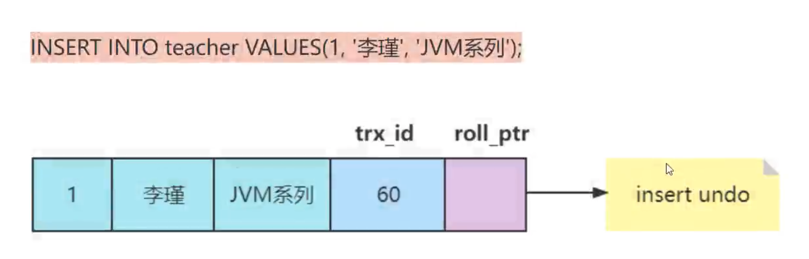
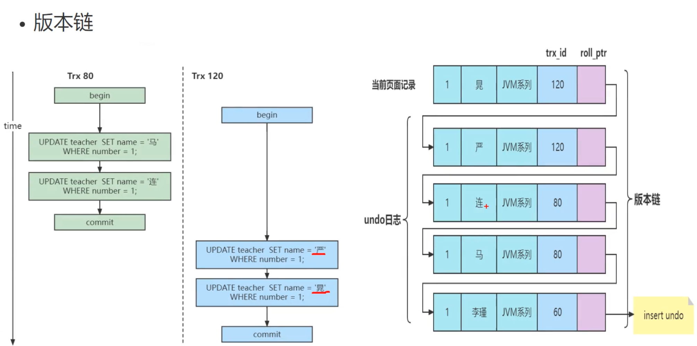
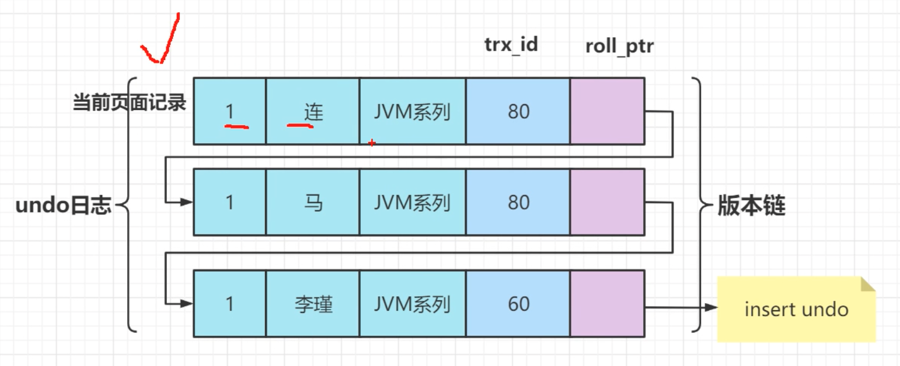
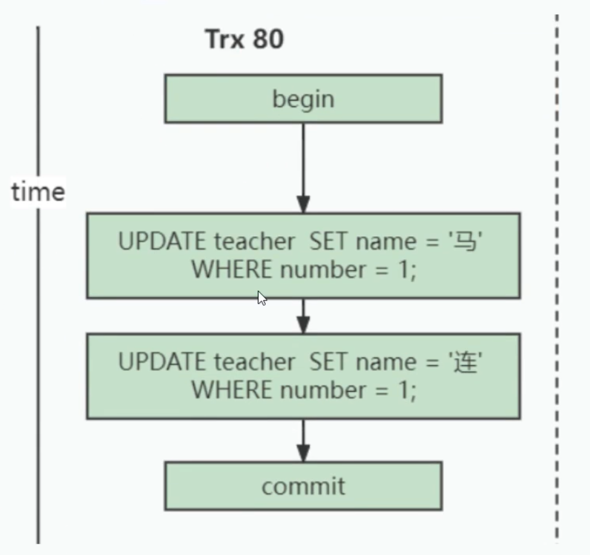
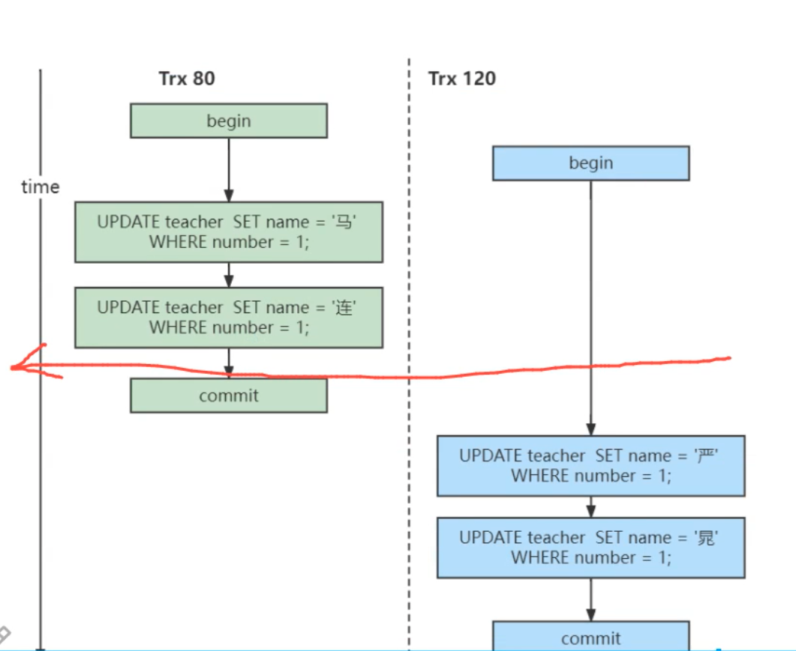
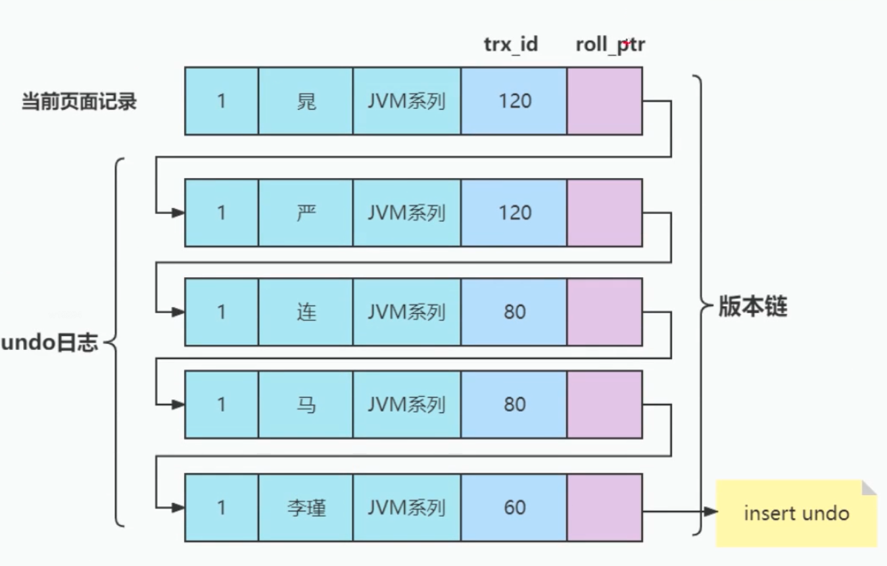
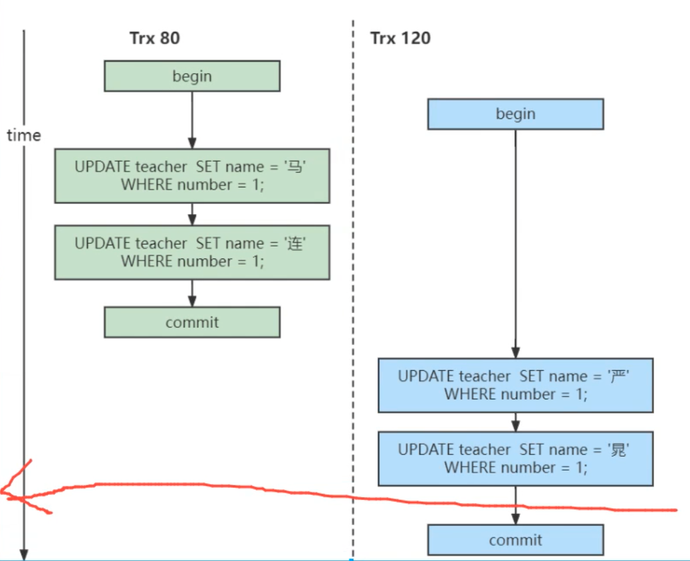

# MVCC
- 全称 Multi-Version Concurrency Control,即多版本并发控制，主要是为了提高数据库的并发性能。
- 同一行数据平时发生读写请求时，会上锁阻塞住。但是 MVCC 用更好的方式去处理 读-写 请求，做到在发生 读-写 请求冲突时不用加锁。这个读是指 快照读，而不是当前读，当前读是一种加锁操作，是悲观锁。

## MVCC原理
> MySQL 在 REPEATABLE READ 隔离级别下，是可以很大程度避免幻读问题的发生的（好像解决了，但是有没完全解决）

### 版本链
- 对于使用 InnoDB 存储引擎的表来说，它的聚簇索引记录中都包含两个必要列：
  - trx_id：每次一个事务对某条聚簇索引记录进行改动时，都会把改事务的事务id赋值给 trx_id 隐藏列；
  - roll_pointer：每次对某条聚簇索引记录进行改动时，都会把旧的版本写入到 undo.log中，然后这个隐藏列就相当于一个指针，可以通过它来找到该记录修改前的信息
  - row_id：并不是必要的，创建的表中有主键或者非NULL的UNIOUE键时都不会包含 row_id 列

> 补充点：undo.log，为了实现事务的原子性，innoDB存储引擎在实际进行增、删、改一条记录时，都需要先把对应的 undo.log 记下来。一般每对一条记录做一次改动，就对应着一条 undo.log ，但在某些更新记录的操作中，也可能会对应着2条 undo.log。一个事务在执行过程中可能新增、删除、更新若干条记录，也就是说需要记录很多对应的 undo.log，这些 undo.log 会被从0开始编号，也就是根据生成的顺序分别称为：第0号undo.log、第1号undo.log、...、第n号undo.log，这个编号也被称为undo no。

演示表：

```sql
CREATE TABLE teacher (
number INT,
name VARCHAR(100),
domain varchar(100),
PRIMARY KEY (number)
) Engine=InnoDB CHARSET=utf8;


--插入一条数据
INSERT INTO teacher VALUES(1, '李瑾', 'JVM系列');
```

假设插入该记录的事务id为60，那么此刻该条记录，如图所示：

  

假设之后两个事务id分别为80、120的事务对这条记录进行 update 操作，流程如图：

  

每次对记录进行改动，都会记录一条 undo.log，每条 undo.log 也都有一个 roll_pointer 属性（insert操作对应的undo.log没有roll_pointer属性，因为该记录并没有更早的版本），可以将这些undo.log都连起来，串成一个链表。

对该记录每次更新后，都会将旧值放到一条undo.log中，就算是该记录的一个旧版本，随着更新次数的增多，所有的版本都会被roll_pointer属性连接成一个链表，我们把这个链表称为版本链，版本链的头节点就是当前记录最新的值。另外，每个版本中还包含生成该版本时对应的事务id。于是可以利用这个记录的版本链来控制并发事务访问相同记录的行为，那么这种机制就被称为 多版本并发控制。


### ReadView
- 对于使用 READ UNCOMMITED 隔离级别的事务来说，由于可以读到未提交事务修改过的记录，所以直接读取记录的最新版本就好了（即，会出现脏读、不可重复读、幻读）。
- 对于使用 SERIALIZABLE 隔离级别的事务来说，InnoDB使用加锁的方式来访问记录（即，所有的事务都是串行的，当然不会出现脏读、不可重复读、幻读）。
- 对于使用 READ COMMITTED 和 REPEATABLE READ 隔离级别的事务来说，都必须保证读到已经提交的事务修改过的记录，也就是说假如另一个事务已经修改了记录但是尚未提交，是不能直接读取最新版本的记录的，核心问题就是：READ COMMITTED 和 REPEATABLE READ 隔离级别在不可重复读和幻读上的区别是从哪里来的，其实结合前面的知识，这两种隔离级别关键是需要判断一下版本链中的哪个版本是当前事务可见的。为此，InnoDB提出了一个ReadView的概念（作用于SQL查询语句）。


**ReadView中主要包含4个比较重要的内容**
- m_ids：表示在生成ReadView时当前系统中活跃的读写事务的事务id列表；
- min_trx_id：表示在生成ReadView时当前系统中活跃的读写事务中最小的事务id，也就是m_ids中的最小值；
- max_trx_id：表示生成ReadView时系统中应该分配给下一个事务的id值。注意max_trx_id并不是m_ids中的最大值，事务id是递增分配的。
  - 比方说现在有id为1，2，3这三个事务，之后id为3的事务提交了。那么一个新的读事务在生成ReadView时，m_ids就包括1和2，min_trx_id的值就是1，max_trx_id的值就是4。
- creator_trx_id：表示生成该ReadView的事务的事务id；


### READ COMMITTED

**脏读问题的解决**
- READ COMMITTED隔离级别的事务在每次查询开始时都会生成一个独立的ReadView。
- 在MySQL中，READ COMMITTED和REPEATABLE READ隔离级别的的一个非常大的区别就是它们生成ReadView的时机不同。
  - READ COMMITTED：每次读取数据前都生成一个ReadView 

以表teacher 为例，假设现在表teacher 中只有一条由事务id为60的事务插入的一条记录，接下来看一下READ COMMITTED和REPEATABLE READ所谓的生成ReadView的时机不同到底不同在哪里。比方说现在系统里有两个事务id分别为80、120的事务在执行：

```sql
Transaction 80

UPDATE teacher  SET name = '马' WHERE number = 1;
UPDATE teacher  SET name = '连' WHERE number = 1;
...
```

此刻，表teacher 中number为1的记录得到的版本链表如下所示：

  

假设现在有一个使用READ COMMITTED隔离级别的事务开始执行：

  

```sql
--使用READ COMMITTED隔离级别的事务

BEGIN;
SELECE1：Transaction 80、120未提交

SELECT * FROM teacher WHERE number = 1; # 得到的列name的值为'李瑾'
```

第一次select的时间点，如图：

  

在执行SELECT语句时会先生成一个ReadView:ReadView的m_ids列表的内容就是[80, 120]，min_trx_id为80，max_trx_id为121，creator_trx_id为0。

**已提交读，版本链执行过程（解决脏读）**
1. 从版本链中挑选可见的记录，从图中可以看出，最新版本的列name的内容是'连'，该版本的trx_id值为80，在m_ids列表内，所以不符合可见性要求（trx_id属性值在ReadView的min_trx_id和max_trx_id之间说明创建ReadView时生成该版本的事务还是活跃的，该版本不可以被访问；如果不在，说明创建ReadView时生成该版本的事务已经被提交，该版本可以被访问），根据roll_pointer跳到下一个版本。
2. 下一个版本的列name的内容是'马'，该版本的trx_id值也为80，也在m_ids列表内，所以也不符合要求，继续跳到下一个版本。
3. 下一个版本的列name的内容是'李瑾'，该版本的trx_id值为60，小于ReadView中的min_trx_id值，所以这个版本是符合要求的，最后返回给用户的版本就是这条列name为'李瑾'的记录。

**所以有了这种机制，就不会发生脏读问题！因为会去判断活跃版本，必须是不在活跃版本的才能用，不可能读到没有 commit的记录。**


**不可重复读问题**

然后，我们把事务id为80的事务提交一下，然后再到事务id为120的事务中更新一下表teacher 中number为1的记录：

```sql
Transaction120

BEGIN;

--更新了一些别的表的记录

UPDATE teacher  SET name = '严' WHERE number = 1;
UPDATE teacher  SET name = '晁' WHERE number = 1;
```

此刻，表teacher 中number为1的记录的版本链就长这样：

  

然后再到刚才使用READ COMMITTED隔离级别的事务中继续查找这个number为1的记录，如下：

```sql
--使用READ COMMITTED隔离级别的事务

BEGIN;

SELECE1：Transaction 80、120均未提交

SELECT * FROM teacher WHERE number = 1; # 得到的列name的值为'李瑾'

SELECE2：Transaction 80提交，Transaction 120未提交

SELECT * FROM teacher WHERE number = 1; # 得到的列name的值为'连'
```

第2次select的时间点，如图：

  

在执行SELECT语句时会又会单独生成一个ReadView，该ReadView信息如下：m_ids列表的内容就是[120]（事务id为80的那个事务已经提交了，所以再次生成快照时就没有它了），min_trx_id为120，max_trx_id为121，creator_trx_id为0。

然后从版本链中挑选可见的记录，从图中可以看出，最新版本的列name的内容是'晁'，该版本的trx_id值为120，在m_ids列表内，所以不符合可见性要求，根据roll_pointer跳到下一个版本。 下一个版本的列name的内容是'严'，该版本的trx_id值为120，也在m_ids列表内，所以也不符合要求，继续跳到下一个版本。 下一个版本的列name的内容是'连'，该版本的trx_id值为80，小于ReadView中的min_trx_id值120，所以这个版本是符合要求的，最后返回给用户的版本就是这条列name为'连'的记录。

以此类推，如果之后事务id为120的记录也提交了，再次在使用READ COMMITTED隔离级别的事务中查询表teacher 中number值为1的记录时，得到的结果就是'晁'了，具体流程我们就不分析了。

所以以上情况下，解决了“脏读”问题，但会出现“不可重复读”问题（使用 READ COMMITTED 隔离级别的事务在每次查询开始时都会生成一个独立的 ReadView）。

### REPEATABLE READ

**REPEATABLE READ解决不可重复读问题**
- REPEATABLE READ：在第一次读取数据时生成一个ReadView
  - 对于使用REPEATABLE READ隔离级别的事务来说，只会在第一次执行查询语句时生成一个ReadView，之后的查询就不会重复生成了。

比如现在系统里有两个事务id分别为80、120的事务在执行：

```sql
Transaction 80

UPDATE teacher  SET name = '马' WHERE number = 1;
UPDATE teacher  SET name = '连' WHERE number = 1;
...
```

此刻，表teacher 中number为1的记录得到的版本链表如下所示：

  


假设现在有一个使用REPEATABLE READ隔离级别的事务开始执行：

```sql
使用REPEATABLE READ隔离级别的事务

BEGIN;
SELECE1：Transaction 80、120未提交

SELECT * FROM teacher WHERE number = 1; # 得到的列name的值为'李瑾'
```

这个SELECE1的执行过程如下： 在执行SELECT语句时会先生成一个ReadView：ReadView的m_ids列表的内容就是[80, 120]，min_trx_id为80，max_trx_id为121，creator_trx_id为0。

**可重复读，版本链执行过程（解决不可重复读）**
- 从版本链中挑选可见的记录，从图中可以看出，最新版本的列name的内容是'连'，该版本的trx_id值为80，在m_ids列表内，所以不符合可见性要求（trx_id属性值在ReadView的min_trx_id和max_trx_id之间说明创建ReadView时生成该版本的事务还是活跃的，该版本不可以被访问；如果不在，说明创建ReadView时生成该版本的事务已经被提交，该版本可以被访问），根据roll_pointer跳到下一个版本。 
- 下一个版本的列name的内容是'马'，该版本的trx_id值也为80，也在m_ids列表内，所以也不符合要求，继续跳到下一个版本。
- 下一个版本的列name的内容是'李瑾'，该版本的trx_id值为60，小于ReadView中的min_trx_id值，所以这个版本是符合要求的，最后返回给用户的版本就是这条列name为'李瑾'的记录。
- 之后，我们把事务id为80的事务提交一下，然后再到事务id为120的事务中更新一下表teacher 中number为1的记录：

  ```sql
  Transaction120

  BEGIN;

  更新了一些别的表的记录

  UPDATE teacher  SET name = '严' WHERE number = 1;
  UPDATE teacher  SET name = '晁' WHERE number = 1;
  ```

此刻，表teacher 中number为1的记录的版本链就长这样：

  

然后再到刚才使用REPEATABLE READ隔离级别的事务中继续查找这个number为1的记录，如下：

```sql
--使用REPEATABLE READ隔离级别的事务

BEGIN;

SELECE1：Transaction 80、120均未提交

SELECT * FROM teacher WHERE number = 1; # 得到的列name的值为'李瑾'

SELECE2：Transaction 80提交，Transaction 120未提交

SELECT * FROM teacher WHERE number = 1; # 得到的列name的值为'李瑾'
```

这个SELECE2的执行过程如下：因为当前事务的隔离级别为REPEATABLE READ，而之前在执行SELECE1时已经生成过ReadView了，所以此时直接复用之前的ReadView，之前的ReadView的m_ids列表的内容就是[80, 120]，min_trx_id为80，max_trx_id为121，creator_trx_id为0。

也就是说两次SELECT查询得到的结果是重复的，记录的列name值都是'李瑾'，这就是可重复读的含义。

**ReadView中的比较规则**
1. 如果被访问版本的trx_id属性值与ReadView中的creator_trx_id值相同，意味着当前事务在访问它自己修改过的记录，所以该版本可以被当前事务访问。
2. 如果被访问版本的trx_id属性值小于ReadView中的min_trx_id值，表明生成该版本的事务在当前事务生成ReadView前已经提交，所以该版本可以被当前事务访问。
3. 如果被访问版本的trx_id属性值大于或等于ReadView中的max_trx_id值，表明生成该版本的事务在当前事务生成ReadView后才开启，所以该版本不可以被当前事务访问。
4. 如果被访问版本的trx_id属性值在ReadView的min_trx_id和max_trx_id之间(min_trx_id < trx_id < max_trx_id)，那就需要判断一下trx_id属性值是不是在m_ids列表中，如果在，说明创建ReadView时生成该版本的事务还是活跃的，该版本不可以被访问；如果不在，说明创建ReadView时生成该版本的事务已经被提交，该版本可以被访问。


### MVCC下的幻读解决和幻读现象
- REPEATABLE READ隔离级别下MVCC可以解决不可重复读问题；
- 幻读是一个事务按照某个相同条件多次读取记录时，后读取时读到了之前没有读到的记录，而这个记录来自另一个事务添加的新记录。

> 我们可以想想，在REPEATABLE READ隔离级别下的事务T1先根据某个搜索条件读取到多条记录，然后事务T2插入一条符合相应搜索条件的记录并提交，然后事务T1再根据相同搜索条件执行查询。结果会是什么？

不管事务T2比事务T1是否先开启，事务T1都是看不到T2的提交的。请自行按照上面介绍的版本链、ReadView以及判断可见性的规则来分析一下。 但是，在REPEATABLE READ隔离级别下InnoDB中的MVCC 可以很大程度地避免幻读现象，而不是完全禁止幻读。

我们首先在事务T1中：

```sql
select * from teacher where number = 30;
```

很明显，这个时候是找不到number = 30的记录的。 我们在事务T2中，执行：

```sql
insert into teacher values(30,'豹','数据湖');
```

通过执行insert into teacher values(30,'豹','数据湖');，我们往表中插入了一条number = 30的记录。 此时回到事务T1，执行：

```sql
update teacher set domain='RocketMQ' where number=30;
select * from teacher where number = 30;
```

事务T1很明显出现了幻读现象。 在REPEATABLE READ隔离级别下，T1第一次执行普通的SELECT 语句时生成了一个ReadView（但是版本链没有），之后T2向teacher 表中新插入一条记录并提交，然后T1也进行了一个update语句。 ReadView并不能阻止T1执行UPDATE 或者DELETE 语句来改动这个新插入的记录，但是这样一来，这条新记录的trx_id隐藏列的值就变成了T1的事务id。

之后T1再使用普通的SELECT 语句去查询这条记录时就可以看到这条记录了，也就可以把这条记录返回给客户端。因为这个特殊现象的存在，我们也可以认为MVCC 并不能完全禁止幻读（就是第一次读如果是空的情况，且在自己事务中进行了该条数据的修改）。

### MVCC小结
从上边的描述中我们可以看出来，所谓的MVCC（Multi-Version Concurrency Control ，多版本并发控制）指的就是在使用READ COMMITTD、REPEATABLE READ这两种隔离级别的事务在执行普通的SELECT操作时访问记录的版本链的过程，这样子可以使不同事务的读-写、写-读操作并发执行，从而提升系统性能。

READ COMMITTD、REPEATABLE READ这两个隔离级别的一个很大不同就是：生成ReadView的时机不同，READ COMMITTD在每一次进行普通SELECT操作前都会生成一个ReadView，而REPEATABLE READ只在第一次进行普通SELECT操作前生成一个ReadView，之后的查询操作都重复使用这个ReadView就好了，从而基本上可以避免幻读现象（就是第一次读如果ReadView是空的情况中的某些情况则避免不了）。

另外，所谓的MVCC只是在我们进行普通的SEELCT查询时才生效，截止到目前我们所见的所有SELECT语句都算是普通的查询，至于什么是个不普通的查询，后面马上就会讲到（锁定读）。