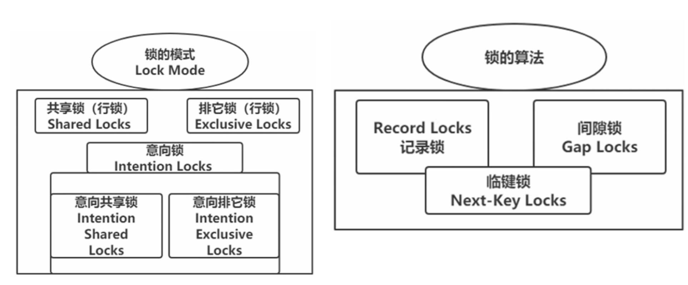

# MySQL中的锁

## MySQL中的锁及解决的问题

  

### 并发事务问题
一个事务进行读取操作，另一个进行改动操作，这种情况下可能发生脏读、不可重复读、幻读的问题。

#### 方案一：读操作MVCC，写操作进行加锁
事务利用MVCC进行的读取操作称之为一致性读，或者一致性无锁读，也称之为快照读，但是往往读取的是历史版本数据。所有普通的SELECT语句（plain SELECT）在READ COMMITTED、REPEATABLE READ隔离级别下都算是一致性读。

一致性读并不会对表中的任何记录做加锁操作，其他事务可以自由的对表中的记录做改动。

很明显，采用MVCC方式的话，读-写操作彼此并不冲突，性能更高，采用加锁方式的话，读-写操作彼此需要排队执行，影响性能。一般情况下我们当然愿意采用MVCC来解决读-写操作并发执行的问题，但是业务在某些情况下，要求必须采用加锁的方式执行。

#### 方案二：读、写操作都采用加锁的方式
该方案可以避免脏读、不可重复读，但不能解决幻读问题，因为在第一次读取时，幻读记录不存在，不知道给谁加锁。
- 脏读的产生是因为当前事务读取了另一个未提交事务写的一条记录，如果另一个事务在写记录的时候就给这条记录加锁，那么当前事务就无法继续读取该记录了，所以也就不会有脏读问题的产生了。
- 不可重复读的产生是因为当前事务先读取一条记录，另外一个事务对该记录做了改动之后并提交之后，当前事务再次读取时会获得不同的值，如果在当前事务读取记录时就给该记录加锁，那么另一个事务就无法修改该记录，自然也不会发生不可重复读了。
- 幻读问题的产生是因为当前事务读取了一个范围的记录，然后另外的事务向该范围内插入了新记录，当前事务再次读取该范围的记录时发现了新插入的新记录，我们把新插入的那些记录称之为幻影记录。采用加锁的方式解决幻读问题就有不太容易了，因为当前事务在第一次读取记录时那些幻影记录并不存在，所以读取的时候加锁就有点麻烦—— 因为并不知道给谁加锁。

> 适用场景：业务场景不允许读取记录的旧版本，而是每次都必须去读取记录的最新版本。
>
>   比方在银行存款的事务中，你需要先把账户的余额读出来，然后将其加上本次存款的数额，最后再写到数据库中。在将账户余额读取出来后，就不想让别的事务再访问该余额，直到本次存款事务执行完成，其他事务才可以访问账户的余额。这样在读取记录的时候也就需要对其进行加锁操作，这样也就意味着读操作和写操作也像写-写操作那样排队执行。

### 锁定读（LockingReads）/LBCC
也称当前读, 读取的是最新版本, 并且对读取的记录加锁, 阻塞其他事务同时改动相同记录，避免出现安全问题。

**当前读有哪些？**
- select lock in share mode (共享锁)
- select for update (排他锁)
- update (排他锁)
- insert (排他锁/独占锁)
- delete (排他锁)
- 串行化事务隔离级别都是当前读


当前读这种实现方式，也可以称之为LBCC（基于锁的并发控制，Lock-Based Concurrency Control）

#### 共享锁和独占锁
在使用加锁的方式解决问题时，由于既要允许读-读情况不受影响，又要使写-写、读-写或写-读情况中的操作相互阻塞，MySQL中的锁有好几类：
- 共享锁英文名：Shared Locks，简称S锁。在事务要读取一条记录时，需要先获取该记录的S锁。
  > 假如事务E1首先获取了一条记录的S锁之后，事务E2接着也要访问这条记录：
  > 如果事务E2想要再获取一个记录的S锁，那么事务E2也会获得该锁，也就意味着事务E1和E2在该记录上同时持有S锁。
- 独占锁，也常称排他锁，英文名：Exclusive Locks，简称X锁。在事务要改动一条记录时，需要先获取该记录的X锁。
  > - 如果事务E2想要再获取一个记录的X锁，那么此操作会被阻塞，直到事务E1提交之后将S锁释放掉。
  > - 如果事务E1首先获取了一条记录的X锁之后，那么不管事务E2接着想获取该记录的S锁还是X锁都会被阻塞，直到事务E1提交。
  > 所以我们说S锁和S锁是兼容的，S锁和X锁是不兼容的，X锁和X锁也是不兼容的。

#### 锁定读的SELECT语句
MySQ有两种比较特殊的SELECT语句格式：

- 对读取的记录加S锁：

  ```sql
  #共享锁，S锁
  SELECT * from test LOCK IN SHARE MODE;
  ```

  - 也就是在普通的SELECT语句后边加LOCK IN SHARE MODE，如果当前事务执行了该语句，那么它会为读取到的记录加S锁，这样允许别的事务继续获取这些记录的S锁（比方说别的事务也使用SELECT ... LOCK IN SHARE MODE语句来读取这些记录），但是不能获取这些记录的X锁（比方说使用SELECT ... FOR UPDATE语句来读取这些记录，或者直接修改这些记录）。
  - 如果别的事务想要获取这些记录的X锁，那么它们会阻塞，直到当前事务提交之后将这些记录上的S锁释放掉。

- 对读取的记录加X锁：

  ```sql
  #排它锁，X锁
  SELECT * from test FOR UPDATE;
  ```

  - 也就是在普通的SELECT语句后边加FOR UPDATE，如果当前事务执行了该语句，那么它会为读取到的记录加X锁，这样既不允许别的事务获取这些记录的S锁（比方说别的事务使用SELECT ... LOCK IN SHARE MODE语句来读取这些记录），也不允许获取这些记录的X锁（比如说使用SELECT ... FOR UPDATE语句来读取这些记录，或者直接修改这些记录）。
  - 如果别的事务想要获取这些记录的S锁或者X锁，那么它们会阻塞，直到当前事务提交之后将这些记录上的X锁释放掉。