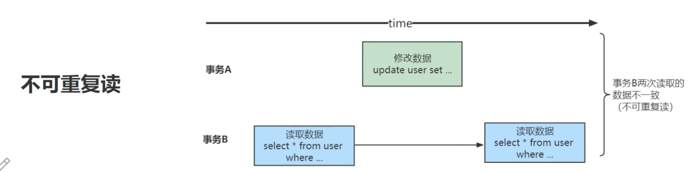

# MySQL：事务和事务隔离级别

## 为什么需要事务
事务是数据库管理系统（DBMS）执行过程中的一个逻辑单位（不可再进行分割），由一个有限的数据库操作序列构成（多个DML语句，select语句不包含事务），要不全部成功，要不全部不成功。

> A 给B 要划钱，A 的账户-1000元， B 的账户就要+1000元，这两个update 语句必须作为一个整体来执行，不然A 扣钱了，B 没有加钱这种情况就是错误的。那么事务就可以保证A 、B 账户的变动要么全部一起发生，要么全部一起不发生。

## 事务的特性
>事务应该具有4个属性：原子性、一致性、隔离性、持久性。这四个属性通常称为ACID特性。

### 原子性（atomicity）
一个事务必须被视为一个不可分割的最小单元，整个事务中的所有操作要么全部提交成功，要么全部失败，对于一个事务来说，不能只执行其中的一部分操作。

> 比如：
>   连老师借给李老师1000元：
>    1. 连老师工资卡扣除1000元；
>    2. 李老师工资卡增加1000元；
>
>  整个事务的操作要么全部成功，要么全部失败，不能出现连老师工资卡扣除，但是李老师工资卡不增加的情况。如果原子性不能保证，就会很自然的出现一致性问题。

### 一致性（consistency）
一致性是指事务将数据库从一种一致性转换到另外一种一致性状态，在事务开始之前和事务结束之后数据库中数据的完整性没有被破坏。

> 连老师借给李老师1000元；
>  1. 连老师工资卡扣除1000元；
>  2. 李老师工资卡增加1000元；
>
>  扣除的钱（-500）与增加的钱（500）相加应该为0，或者说连老师和李老师的账户的钱加起来，前后应该不变。

### 持久性（durability）
一旦事务提交，则其所做的修改就会永久保存到数据库中。此时即使系统崩溃，已经提交的修改数据也不会丢失。

### 隔离性（isolation）
一个事务的执行不能被其他事务干扰。即一个事务内部的操作及使用的数据对并发的其他事务是隔离的，并发执行的各个事务之间不能互相干扰。

> 如果隔离性不能保证，会导致什么问题？
> 
>  连老师借给李老师生活费，借了两次，每次都是1000，连老师的卡里开始有10000，李老师的卡里开始有500，从理论上，借完后，连老师的卡里有8000，李老师卡里应该有2500.
>
>  我们将连老师向李老师同时进行的两次转账操作分别称为T1和T2,在现实世界中T1和T2是应该没有关系的，可以先执行完T1,再执行T2,或者先执行完T2，在执行T1,结果都是一样的。但是很不幸，真实的数据中T1和T2
的操作可能交替执行的，如图：

  

> 如果按照上图中的执行顺序来进行两次转账的话，最终我们看到，老师的账户还剩9000元钱，相当于只扣了1000元钱，但是李老师的账户里却成了2500元，多了1000元，这银行岂不是要亏死了？
>
> 所以对于显示世界中状态转换对应的某些数据库操作来说，不仅要保证这些操作以原子性的方式执行完成，而且要保证其他的状态转换不会影响到本次状态转换，这个规则被称之为隔离性。

## 事务并发引发的问题
我们知道MySQL是一个客户端／服务器架构的软件，对于同一个服务器来说，可以有若干个客户端与之连接，每个客户端与服务器连接上之后，就可以称之为一个会话（Session）。每个客户端都可以在自己的会话中向服务器发出请求语句，一个请求语句可能是某个事务的一部分，也就是对于服务器来说可能同时处理多个事务。

在上面我们说过事务有一个称之为隔离性的特性，理论上在某个事务对某个数据进行访问时，其他事务应该进行排队，当该事务提交之后，其他事务才可以继续访问这个数据，这样的话并发事务的执行就变成了串行化执行。

但是对串行化执行性能影响太大，我们既想保持事务的一定的隔离性，又想让服务器在处理访问同一数据的多个事务时性能尽量高些，当我们舍弃隔离性的时候，可能会带来什么样的数据问题呢？

### 脏读
当一个事务读取到了另外一个事务修改但未提交的数据，被称为脏读。

  

1. 在事务A执行过程中，事务A对数据资源进行了修改，事务B读取了事务A修改后的数据；
2. 由于某些原因，事务A并没有完成提交，发生了Rollback操作，则事务B读取的数据就是脏数据。这种读取到另一个事务未提交的数据现象就是脏读。

### 不可重复读（数据的修改）
当事务内相同的记录被检索两次，且两次得到的结果不同，此现象成为不可重复读。

  

事务B内读取了两次数据资源，在这两次读取的过程中事务A修改了数据，导致事务B在这两次读取出来的数据不一致。

### 幻读（数据的新增）
在事务执行过程中，另一个事务将新纪录添加到正在读取的事务中时，会发生幻读。

  

事务B前后两次读取同一个范围的数据，在事务B两次读取的过程中事务A新增了数据，导致事务B后一次读取到前一次查询没有看到的行。幻读和不可重复读有些类似，但是幻读重点强调了读取到了之前读取没有获取到的记录。


## SQL标准中的四种隔离级别

**事务问题严重程度排名**
> 脏读>不可重复读>幻读

**四种隔离级别**
- READ UNCOMMITTED：未提交读
- READ COMMITTED：已提交读
- REPEATABLE READ：可重复读
- SERIALIZABLE：可串行化

SQL标准中规定，针对不同的隔离级别，并发事务可以发生不同严重程度的问题，具体情况如下：
- READ UNCOMMITTED隔离级别下，可能发生脏读、不可重复读和幻读问题
- READ COMMITTED隔离级别下，可能发生不可重复读和幻读问题，但是不可以发生脏读问题
- REPEATABLE READ隔离级别下，可能发生幻读问题，但是不可以发生脏读和不可重复读的问题
- SERIALIZABLE隔离级别下，各种问题都不可以发生

  


## MySQL中的隔离级别
> 不同的数据库厂商对SQL标准中规定的四种隔离级别不一样：
>  1. Oracle就只支持READ COMMITTED和SERIALIZABLE隔离级别；
>  2. MySQL虽然支持4种隔离级别，但与SQL标准中所规定的的各级隔离级别允许发生的问题却有些出入，MySQL在 REPEATABLE READ 隔离级别下，是可以禁止幻读问题的发生。

  

MySQL的默认隔离级别是 REPEATABLE READ，我们可以手动修改事务的隔离级别。

### 如何设置事务的隔离级别

可以通过下边的语句修改事务的隔离级别：

```bash
SET [GLOBAL|SESSION] TRANSACTION ISOLATION LEVEL level;
```

其中的level可选值有4个：

```bash
level: {
    REPEATABLE READ
   | READ COMMITTED
   | READ UNCOMMITTED
   | SERIALIZABLE
}
```

设置事务的隔离级别的语句中，在SET关键字后可以放置GLOBAL关键字、SESSION关键字或者什么都不放，这样会对不同范围的事务产生不同的影响，具体如下：

**使用GLOBAL关键字（在全局范围影响）**

比如：

```bash
#只对执行完该语句之后产生的会话起作用。当前已经存在的会话无效
SET GLOBAL TRANSACTION ISOLATION LEVEL SERIALIZABLE;
```

**使用SESSION关键字（在会话范围影响）**

```bash
#对当前会话的所有后续的事务有效
SET SESSION TRANSACTION ISOLATION LEVEL SERIALIZABLE;
```

> 该语句可以在已经开启的事务中间执行，但不会影响当前正在执行的事务。
> 
> 如果在事务之间执行，则对后续的事务有效。

**GLOBAL和SESSION 都不用（只对执行语句后的下一个事务产生影响）**

```bash
#只对当前会话中下一个即将开启的事务有效
SET TRANSACTION ISOLATION LEVEL SERIALIZABLE;
```

> 只对当前会话中下一个即将开启的事务有效。下一个事务执行完后，后续事务将恢复到之前的隔离级别。该语句不能在已经开启的事务中间执行，会报错的。
> 
> 如果我们在服务器启动时想改变事务的默认隔离级别，可以修改启动参数transaction-isolation的值，比方说我们在启动服务器时指定了--transaction-isolation=SERIALIZABLE，那么事务的默认隔离级别就从原来的REPEATABLE READ变成了SERIALIZABLE。

```bash
#查看当前会话默认的隔离级别
SHOW VARIABLES LIKE 'transaction_isolation';

#或者简写成
SELECT @@transaction_isolation;
```

注意：transaction_isolation是在MySQL 5.7.20的版本中引入来替换tx_isolation的，如果你使用的是之前版本的MySQL，请将上述用到系统变量transaction_isolation的地方替换为tx_isolation。


## MySQL事务

### 事务基本语法

**事务开始**
- begin
- START TRANSACTION（推荐）
- begin work

**事务回滚**
- rollback

**事务提交**
- commit
  - 使用事务插入两行数据，commit后数据还在；
  - 使用事务插入两行数据，rollback后数据没有了；

### 保存点
如果你开启了一个事务，执行了很多语句，忽然发现某条语句有点问题，你只好使用 rollback 语句来让数据库状态恢复到事务执行之前的样子，然后一切从头再来，但是可能根据业务和数据的变化，不需要全部回滚。所以MySQL提出了一个保存点（savepoint）的概念，就在事务对应的数据库语句中打几个点，我们在调用 rollback 语句时可以指定会滚到哪个点，而不是回到最初的原点。

**定义保存点的语法**

```sql
SAVEPOINT 保存点名称
```

想回滚到某个保存点时，可以使用下边这个语句（语句中的单词WORK和SAVEPOINT是可有可无的）：

```sql
ROLLBACK TO [SAVEPOINT] 保存点名称；
```

不过如果 ROLLBACK 语句后边不跟随保存点名称的话，会直接回滚到事务执行之前的状态。

```sql
--删除某个保存点
RELEASE SAVEPOINT 保存点名称
```

### 隐式提交

当我们使用 START TRANSACTION 或者 BEGIN 开启一个事务，或者把系统变量 autocommit 的值设置为 OFF 时，事务就不会进行自动提交，但是如果我们输入了某些语句之后就会悄悄的提交掉，就像我们输入了 COMMIT 了一样，这种因为某些特殊的语句而导致事务提交的情况称为隐式提交，这些导致事务隐式提交的语句包括：
  - 执行DDL
  - 隐式的使用或修改mysql数据库中的表
  - 事务控制或关于锁定的语句
  - 加载数据的语句
  - 关于MySQL复制的一些语句
  - 其他的一些语句

**执行DDL**
> DDL：定义或修改数据库对象的数据定义语言（Datadefinition language,缩写为：DDL）

数据库对象，指的就是数据库、表、视图、存储过程等这些。当我们使用CREATE/ALTER/DROP等语句去修改数据库对象时，就会隐式的提交前边语句所属于的事务。

比如：

```sql
BEGIN;

SELECT ... #事务中的一条语句

UPDATE ... #事务中的一条语句

... #事务中的其它语句

CREATE TABLE ...
```

**隐式使用或修改mysql数据库中的表**
> 当我们使用ALTER USER、CREATE USER、DROP USER、GRANT、RENAME USER、REVOKE、SET PASSWORD等语句时也会隐式的提交前边语句所属于的事务。

**事务控制或关于锁定的语句**
- 当我们在一个会话里，一个事务还没提交或者回滚时就又使用START TRANSACTION或者BEGIN语句开启了另一个事务时，会隐式的提交上一个事务。
- 当前的autocommit系统变量的值为OFF，我们手动把它调为ON时，也会隐式的提交前边语句所属的事务。
- 使用LOCK TABLES、UNLOCK TABLES等关于锁定的语句也会隐式的提交前边语句所属的事务。

比如：

  ```sql
  BEGIN;

  SELECT ... #事务中的一条语句

  UPDATE ... #事务中的一条语句

  ... #事务中的其它语句

  BEGIN; #此语句会隐式的提交前边语句所属于的事务
  ```

**加载数据的语句**
- 使用LOAD DATA 语句来批量往数据库导入数据时，也会隐式的提交前边语句所属的事务。

**关于MySQL复制的一些语句**
- 使用 START SLAVE、STOP SLAVE、RESET SLAVE、CHANGE MASTER TO 等语句时也会隐式提交前边语句所属的事务。

**其他的一些语句**
- 使用 ANALYZE TABLE、CACHE INDEX、CHECK TABLE、FLUSH、LOAD INDEX INTO CACHE、OPTIMIZE TABLE、REPAIR TABLE、RESET 等语句也会隐式提交前边语句所属的事务。