## Nodejs：Windows下Nodejs环境部署
### 彻底卸载已安装的Node.js
- 从控制面板中卸载程序和功能；
- 重新启动（或者您可能会从任务管理器中杀死所有与节点相关的进程）；
- 寻找这些文件夹并删除它们（及其内容）（如果还有）。根据您安装的版本，UAC设置和CPU架构，这些可能或可能不存在：
  - C:\Program Files (x86)\Nodejs
  - C:\Program Files\Nodejs
  - C:\Users{User}\AppData\Roaming\npm（或%appdata%\npm）
  - C:\Users{User}\AppData\Roaming\npm-cache（或%appdata%\npm-cache）
- 检查您的%PATH%环境变量以确保没有引用Nodejs或npm存在；
- 如果仍然没有卸载，请where node在命令提示符下键入，您将看到它所在的位置 - 删除（也可能是父目录）；
- 重新启动；

### 一、环境
- 系统环境：Windows 7 旗舰版（64位）
- Node.js版本：12.16.2 LTS（64位）
- ~~注：如需要运行BO、云直播、数字录播等系统的前端代码，请安装：版本为8.11.1 的node.js,操作步骤与下面类似。~~

### 二、下载并安装Node.js
1. 访问Node.js官网，下载与自己系统对应的Node.js安装包，官网地址：https://nodejs.org/en/

2. 选择并点击图片中按钮，下载Node.js安装包。

  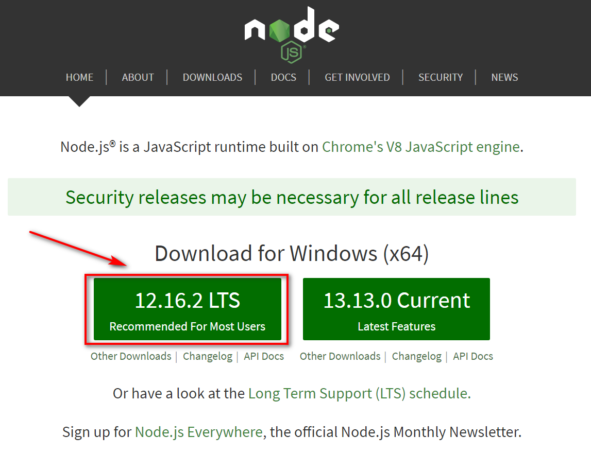


3. 双击已经下载的node.js安装包，然后点击下一步

  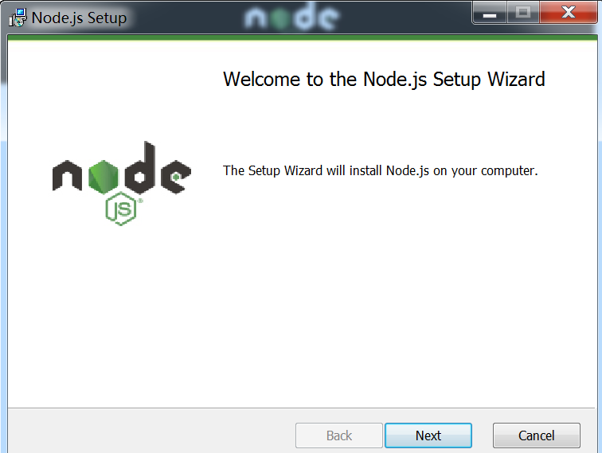

4. 勾选 同意 后下一步

  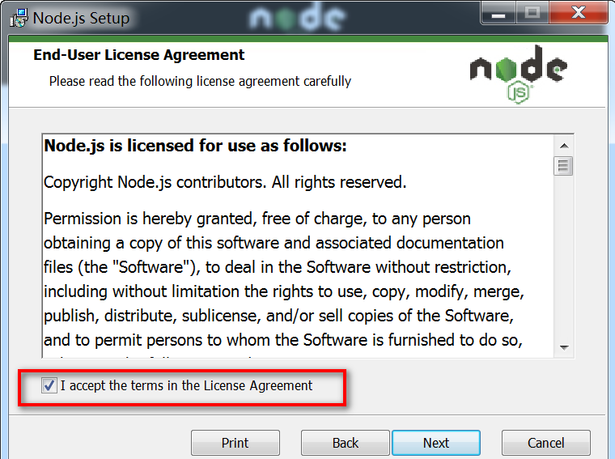

5. 点击“Change”按钮，选择Node.js安装的位置，我的是：C:\Develop\nodejs

  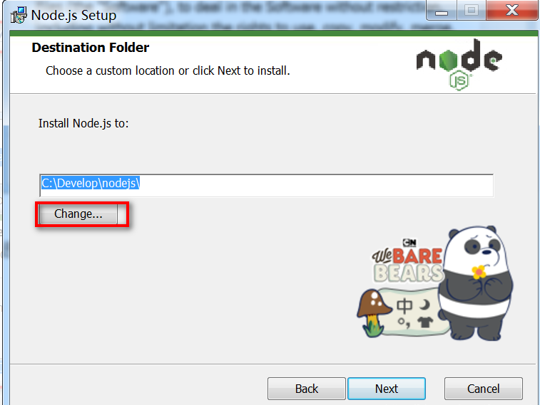

6. 该步骤直接默认安装即可，下一步。

  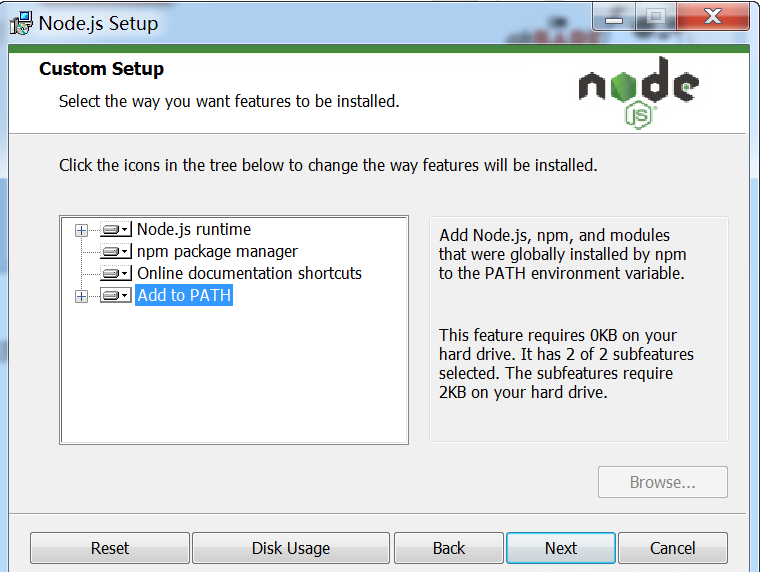

  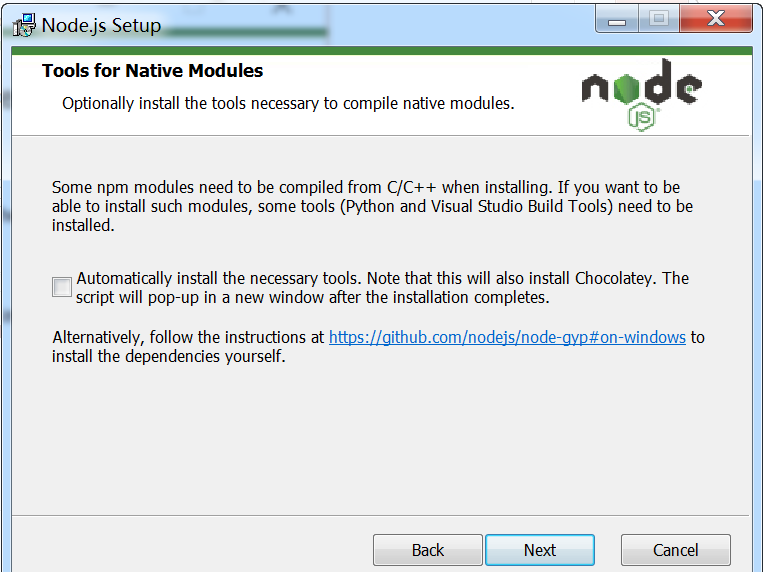

  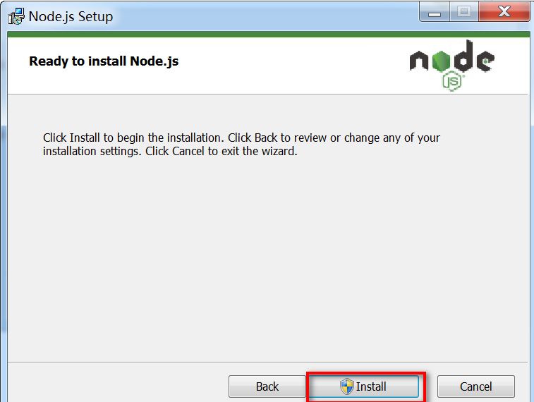

  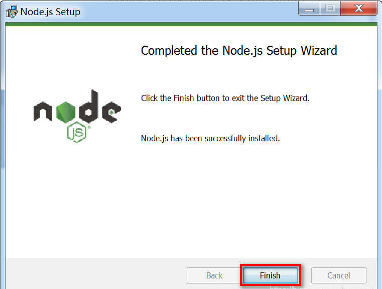


7. 环境验证
Windows+R，输入cmd，然后在cmd中分别输入：
```bat
node -v
npm -v
```
显示如图所示的结果，则说明node.js已经成功安装了。

  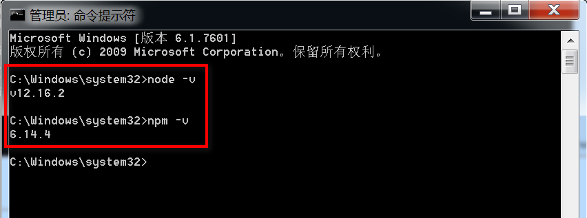

**说明：** 新版的Node.js已自带npm，安装Node.js时会一起安装，npm的作用就是对Node.js依赖的包进行管理，也可以理解为用来安装/卸载Node.js需要装的东西。

### 三、环境配置
> 注意： 环境配置主要配置的是npm安装的全局模块所在的路径，以及缓存cache的路径，之所以要配置，是因为以后在执行类似：npm install express [-g] （后面的可选参数-g，g代表global全局安装的意思）的安装语句时，会将安装的模块安装到【C:\Users\用户名\AppData\Roaming\npm】路径中，占C盘空间。比如，我将全模块所在路径和缓存路径放在我node.js安装的文件夹中，则在我安装的文件夹【C:\Develop\nodejs】下创建两个文件夹【node_global】及【node_cache】如下图：

  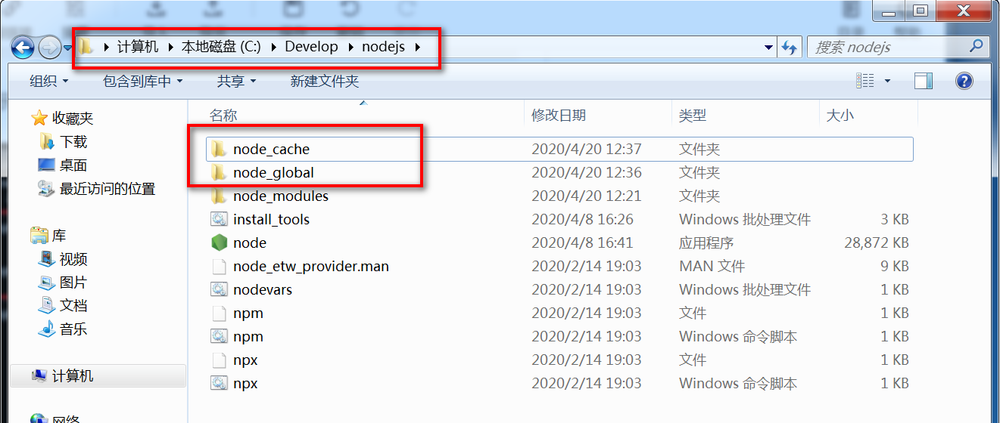

然后打开cmd，输入：
```bat
npm config set prefix "C:\Develop\nodejs\node_global"
npm config set cache "C:\Develop\nodejs\node_cache"
```

  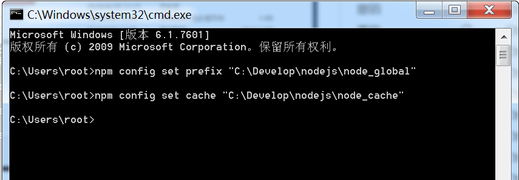

#### 配置环境变量
1. 用户变量 path 中把【C:\Users\root\AppData\Roaming\npm;】改为【C:\Develop\nodejs\node_global】
2. 在系统变量中 新增变量NODE_PATH：【C:\Develop\nodejs\node_global\node_modules】
3. 系统变量path中添加:【C:\Develop\nodejs\node_global\node_modules】

#### 配置淘宝镜像(可选)
前往淘宝镜像官网 http://npm.taobao.org/，可查看安装cnpm包的命令。
在命令行输入：
```bat
npm install -g cnpm --registry=https://registry.npm.taobao.org
```
如图所示，则说明配置成功。

  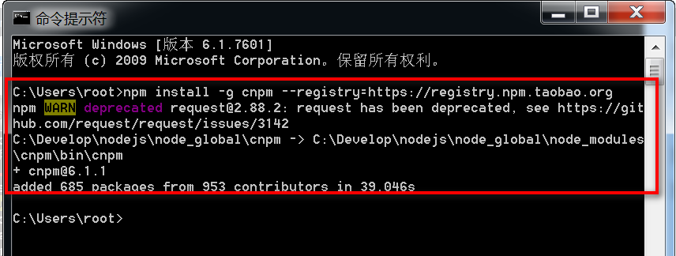

#### 运行前端项目
1. 安装 VSCode （直接百度搜索，默认安装即可）；
2. 从 SVN 上拉取前端项目代地址，用 VSCode 打开；
3. 打开 VSCode 的 TERMINAL，输入 `npm install` 安装项目所需要的node包；
4. 安装完成后，继续执行 `npm run dev`(项目中的 package.json 文件中可查看)命令，运行前端项目；
