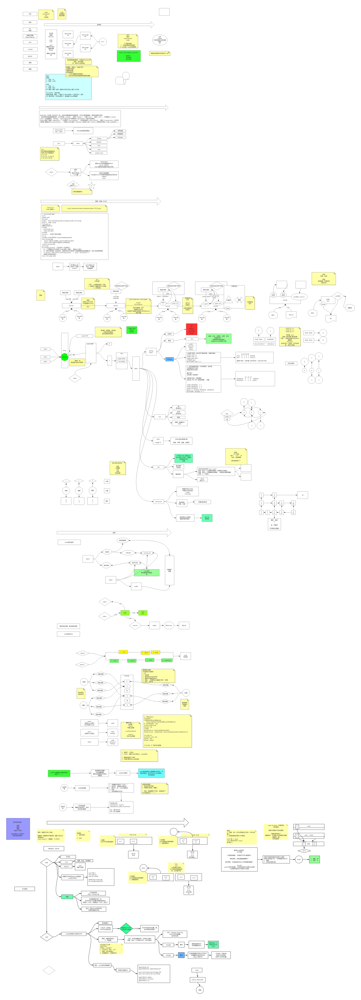

# Redis（一）：Redis介绍及NIO原理介绍



- 常识
  - 磁盘的两个指标：
    - 寻址（ms）
    - 带宽:（G/M）
  - 内存的两个指标：
    - 寻址（ns）
    - 带宽（G/M）
  - 秒>毫秒>微妙>纳秒  磁盘比内存在寻址上慢了10W倍
  - IO buffer：磁盘有磁道和扇区，一扇区有512个byte，当存储空间较小时会给操作系统带来一个成本问题（索引）。因此操作系统在读数据的时候一般都会读 4K。

**一个极端**
- 关系型数据库建表是：必须给出schema（列、列的数据类型）
  - 数据类型：字节宽度
  - 存：倾向于行级存储
  - 数据和索引是存在硬盘中，B+树的树干（区间和偏移）在内存中，B+树所有的页就是4k
  - 数据库表很大，性能下降？
    - 如果表有索引，增删改变慢；
    - 查询：一个或少量查询依然很慢；并发大的时候会受硬盘带宽影响速度；

**另一个极端**
SAP HANA数据库（内存级别的关系型数据库，2T，太贵，整套设备2亿)，数据在磁盘中和内存中的体积会不同。

**两者折中--缓存**
- memcached
- redis

**用缓存的原因是受限于两个基础设施**
- 冯诺依曼体系的硬件
- 以太网、tcp/ip的网络


> 架构师：技术选型、技术对比可参考：https://db-engines.com/en/

> Redis 是一个开源（BSD许可）的，内存中的数据结构存储系统，它可以用作数据库、缓存和消息中间件。 它支持多种类型的数据结构，如 字符串（strings）， 散列（hashes）， 列表（lists）， 集合（sets）， 有序集合（sorted sets） 与范围查询， bitmaps， hyperloglogs 和 地理空间（geospatial） 索引半径查询。 Redis 内置了 复制（replication），LUA脚本（Lua scripting）， LRU驱动事件（LRU eviction），事务（transactions） 和不同级别的 磁盘持久化（persistence）， 并通过 Redis哨兵（Sentinel）和自动 分区（Cluster）提供高可用性（high availability）。

**memcached也是key、value的形式，但是其value没有类型的概念**

**Redis的value值的数据类型**
- String
  - 字符类型
  - 数值类型
  - bitmaps
- hashes
- lists
- sets
- sorted sets

**json可以表示很复杂的数据结构**
- 世界上有3种数据表示方式：

  ```
  1. k=a  k=1
  2. k=[1,2,3]  k=[a,x,f]
  3. k={x,y}  k=[{},{}]
  ```

**Redis与memcached的比较**
- memcached
  - 因为value没有类型的概念，memcached每次都需要返回value所有的数据给client（server、网卡IO）
  - client端要有自己实现的代码去解码json
- redis(计算向数据移动，大数据)
  - 数据类型不是很重，redis的server中对每种类型都有自己的方法（index()/lpop)

## 安装redis

### 步骤
- yum install wget
- cd ~
- mkdir soft
- cd soft
- wget http://download.redis.io/release/redis-5.0.0.tar.gz
- tar xf redis...tar.gz
- cd redis-src
- 看README.md
- make   ....yum install gcc .... make distclean
- make
- cd src  生成了可执行程序
- cd .. 
- make install PREFIX=/opt/lele/redis5   安装到指定路径下
- vi /etc/profile
  - export REDIS_HOME=/opt/lele/redis5
  - export PATH=$PATH:$REDIS_HOME/bin
  - source /etc/profile
- cd utils
- ./install-server.sh（可执行一次或多次）
  - 一个物理机中可以有多个redis实例（进程），通过port区分
  - 可执行程序就一份在目录，但是在内存中未来的多个实例需要各自的配置文件，持久化目录等资源
  - service redis_6379 start/stop/status  >  linux  /etc/init.d/****
  - 脚本还会帮你启动
- ps -fe | grep redis


**redis单进程、单线程、单实例，能并发很多请求**

**redis是如何变得很快的呢？**

**IO**
- BIO:阻塞的
- NIO:非阻塞的
  - 轮询发生在用户空间
  - 同步非阻塞
  - 成本问题：如果有1000fd，代表用户进程轮询调用1000次系统内核（kernel）
    - 解决问题：kernel向前发展，多了一个select（多路复用的NIO）；用户态、内核态
- 多路复用NIO
  - kernel向前发展，多了一个select（多路复用的NIO）