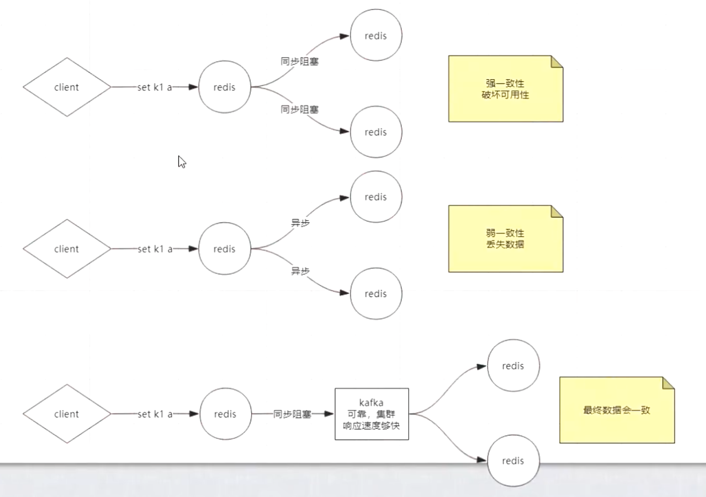

# Redis（六）：主从复制、CAP、PAXOS、cluster分片集群
>缓存、数据库


## 集群方式

**单机、单节点、单实例**
- 存在的问题
  - 单点故障
  - 容量有限
  - 压力

**数据一致性**
- 通过AKF，一变多，会出现数据一致性问题；
- 强一致性（通过同步的方式）：所有节点阻塞，直到数据全部一致。
  - 会出现破坏可用性
  - 解决：容忍数据丢失一部分（通过异步的方式）

  

**主从和主备**
- 主备：客户端只能访问主节点，备机不会参与业务
- 主从复制：客户端既可以访问主节点，也可以访问从节点
  - 相关配置

    ```bash
    #是否要同步完才出数据
    replica-server-staale-data yes

    #备机是否只支持查询，还是需要写入
    replica-read-only yes

    #yes:走网络传输；no:走磁盘传输
    repl-diskless-sync no

    #增量复制（主从复制）时redis中的队列大小
    repl-backlog-size 1mb

    #最小几个可以写成功
    min-replicas-to-write 3

    #
    min-replicas-max-lag 10
    ```

  - 问题：需要人工维护主的问题
- 主：一般会发生读写
  - 主又是一个单点故障，一般会对主做高可用，自动的故障转移（目的是为了代替人）
  - 对主节点做监控，过半监控节点数认为主节点挂了，才认为主节点挂了
    - 全部监控节点都给出主节点挂了：强一致性，卡顿，服务不可用
    - 不够一半数量监控节点认为主节点挂了：统计不准确，不够势力范围；问题：网络分区，脑裂

**哨兵**
- 哨兵之间是通过发布订阅实现通信的
  - 在主上面可以知道新来的从是否追随主去同步数据