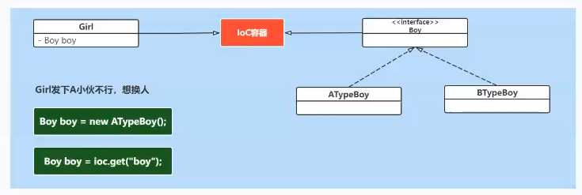

# Spring（一）：IoC

## IoC分析
### Spring的核心
在Spring中非常核心的内容是IOC和AOP。

### IoC是什么？
IoC：Inversion of Control 控制反转，简单理解就是：依赖对象的获得被反转了。

### IoC有什么好处

**IoC带来的好处**
- 代码更加简洁，不需要去 new 要使用的对象了；
- 面向接口编程，使用者与具体类解耦，易扩展、替换实现者；
- 可以方便进行AOP编程；

### IoC容器做了什么工作
IoC容器的工作：负责创建、管理类实例，向使用者提供实例。

### IoC容器是否是工厂模式的实例
IoC容器是工厂模式的实例，IoC容器负责来创建类实例对象，需要从IoC容器中get获取。IoC容器也称为Bean工厂。

那么我们一直说的Bean是什么呢？bean：组件，也就是类对象。

## IoC实现