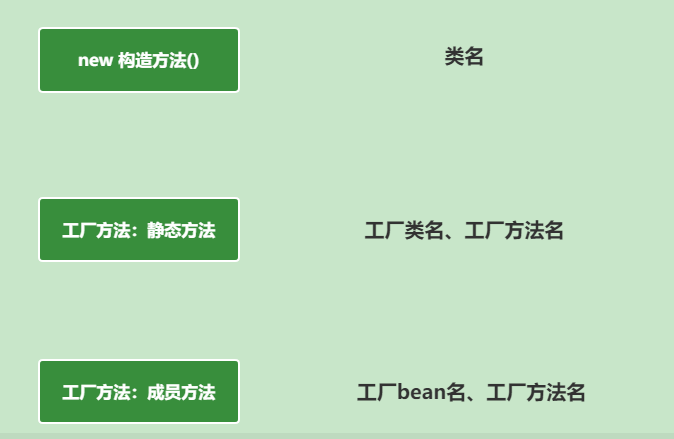
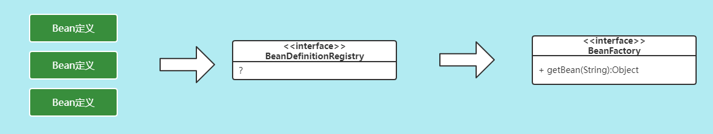

# Spring（一）：手写IoC

## IoC分析
### Spring的核心
在Spring中非常核心的内容是IOC和AOP。

### IoC是什么？
IoC：Inversion of Control 控制反转，简单理解就是：依赖对象的获得被反转了。


### IoC有什么好处

**IoC带来的好处**
- 代码更加简洁，不需要去 new 要使用的对象了；
- 面向接口编程，使用者与具体类解耦，易扩展、替换实现者；
- 可以方便进行AOP编程；


### IoC容器做了什么工作
IoC容器的工作：负责创建、管理类实例，向使用者提供实例。


### IoC容器是否是工厂模式的实例
IoC容器是工厂模式的实例，IoC容器负责来创建类实例对象，需要从IoC容器中get获取。IoC容器也称为Bean工厂。


那么我们一直说的Bean是什么呢？bean：组件，也就是类对象。


## IoC实现
IoC的核心就是Bean工厂，那么Bean工厂应该如何设计实现它呢？

### Bean工厂的作用
首先Bean工厂的作用，上面分析了就是创建、管理Bean，并且需要对外提供Bean的实例。


### Bean工厂的初步设计
基于Bean工厂的基本作用，我们可以分析Bean工厂应该具备的相关行为。

首先Bean工厂应该要对外提供获取bean实例的方法，所以需要定义一个 getBean() 方法，同时工厂需要知道生产的 bean 的类型，所以 getBean() 方法需要接受对应的参数，同时返回类型这块也可能有多个类型，我们就用 Object 来表示，这样 Bean 工厂的定义就出来了。


上面定义了 Bean 工厂对外提供 bean 实例的方法，但是 Bean 工厂如何知道要创建上面对象，怎么创建该对象呢？


所以在这里我们得把 Bean 的定义信息告诉 BeanFactory，然后 BeanFactory 工厂根据 Bean 的定义信息来生成对应的 bean 实例对象。所以在这儿我们需要考虑两个问题：
 - 我们需要定义一个模型来表示该如何创建 Bean 实例的信息，也就是 Bean 定义。
 - Bean 工厂需要提供行为来接收这些 Bean 的定义信息。


 ### Bean的定义
 根据上面的接收，我们就清除了 Bean 的定义的意义了。那么我们来定义 Bean 定义的模型要考虑几个问题。

 #### Bean定义的作用是什么
 作用肯定是告诉 Bean 工厂应该如何来创建某类的 Bean 实例。

 #### 获取实例的方式有哪些

 

#### BeanDeinition中给Bean工厂提供哪些信息



这样一来我们就清楚了 BeanDefinition 应该要具有的基本功能了。


#### 增强功能要求
当然我们可以在现有的基础上增强要求，比如 Bean 工厂创建的是单例对象，具有特定的初始化方法和销毁逻辑的方法。


同时创建 BeanDefinition 的一个通用实现类：GenericBeanDefinition。


具体代码为：

```java
/**
 * bean定义接口
 */
public interface BeanDefinition {

    String SCOPE_SINGLETION = "singleton";

    String SCOPE_PROTOTYPE = "prototype";

    /**
     * 类
     */
    Class<?> getBeanClass();

    /**
     * Scope
     */
    String getScope();

    /**
     * 是否单例
     */
    boolean isSingleton();

    /**
     * 是否原型
     */
    boolean isPrototype();

    /**
     * 工厂bean名
     */
    String getFactoryBeanName();

    /**
     * 工厂方法名
     */
    String getFactoryMethodName();

    /**
     * 初始化方法
     */
    String getInitMethodName();

    /**
     * 销毁方法
     */
    String getDestroyMethodName();

    boolean isPrimary();

    /**
     * 校验bean定义的合法性
     */
    default boolean validate() {
        // 没定义class,工厂bean或工厂方法没指定，则不合法。
        if (this.getBeanClass() == null) {
            if (StringUtils.isBlank(getFactoryBeanName()) || StringUtils.isBlank(getFactoryMethodName())) {
                return false;
            }
        }

        // 定义了类，又定义工厂bean，不合法
        if (this.getBeanClass() != null && StringUtils.isNotBlank(getFactoryBeanName())) {
            return false;
        }
        return true;
    }

}
```

### Bean的注册

Bean的定义清楚后，我们要考虑的就是如何实现BeanDefinition和BeanFactory的关联了。


在这儿我们可以专门定义一个 `BeanDefinitionRegistry` 来实现Bean定义的注册功能。



那么我们需要考虑 BeanDefinitionRegistry 应该具备的功能，其实也简单就两个：
- 注册 BeanDefinition
- 获取 BeanDefinition

同时为了保证能够区分每个BeanDefinition的定义信息，我们得给每一个Bean定义一个唯一的名称。


具体实现代码：

```java
public interface BeanDefinitionRegistry {

	void registerBeanDefinition(String beanName, BeanDefinition beanDefinition) throws BeanDefinitionRegistException;

	BeanDefinition getBeanDefinition(String beanName);

	boolean containsBeanDefinition(String beanName);
}
```

### BeanFactory实现
到现在为止我们来看看已经实现的相关设计功能：


通过上面的分析我们接下来就要考虑 BeanFactory 的功能实现了。
我们先来实现一个最基础的默认的 Bean 工厂：DefaultBeanFactory。
需要 DefaultBeanFactory 实现如下的5个功能:
1. 实现Bean定义信息的注册
2. 实现Bean工厂定义的getBean方法
3. 实现初始化方法的执行
4. 实现单例的要求
5. 实现容器关闭是执行单例的销毁操作


思考：对于单例bean，我们可否提前实例化?


## IoC增强

### Bean别名的增强
Bean 除了标识唯一的名称外，还可以有任意个别名，别名也是唯一的。

别名的特点：
1. 可以有多个别名；
2. 也可以是别名的别名；
3. 别名也是唯一的；


实现的时候需要考虑的问题：
1. 数据结构；
2. 功能点

  


### Type类型的增强
上面实现的是根据 bean的 `name`来获取Bean实例，我们还希望能扩展通过 `Type`来获取实例对象。这时对应的接口为：

  

也就是需要实现根据Type找到Bean对象的功能。正常的实例逻辑为：

  

但是上面的实现方案有点吃性能，我们可以尝试优化下，我们可以提前把Type和Bean的对应关系找出来，然后用Map缓存起来处理。对应的存储方式通过Map来处理。

需要考虑几个问题：
1. Map中存储的数据用什么合适？
2. type和bean是一对一的关系吗？
3. 何时建立该关系呢？

  


  ```java
  private Map<Class<?>, Set<String>> typeMap = new ConcurrentHashMap<>(256);
  ```

具体的实现我们可以在DefaultBeanFactory中添加一个buildTypeMap()方法来处理这个事情。

  

buildTypeMap()方法处理的逻辑如下：

  

然后我们在BeanFactory中添加一个getType方法，封装获取Bean的Type的逻辑，方便buildTypeMap()方法的使用。最后就是getBean(Class<T>) 方法的实现了。因为Class对应的类型可能有多个，这时需要通过Primary来处理了。


IoC容器-核心部分类图

  
