# Spring（七）：Bean的实例化

## Beandefinition

首先我们来看看 BeanDefinition 的存放位置。因为 Bean 对象的实例化肯定是BeanFactory基于对应的 BeanDefinition 的定义来实现的，所以在这个过程中 BeanDefinition 是非常重要的，前面的内容已经完成了 BeanDefinition 的定义，同时根据前面 refresh 方法的讲解，我们知道了 BeanFactory 的具体实现是 `DefaultListableBeanFactory`，所以 BeanDefinition的相关信息式存储在 `DefaultListableBeanFactory` 的相关属性中的。

```java
/** Map of bean definition objects, keyed by bean name. */
private final Map<String, BeanDefinition> beanDefinitionMap = new
ConcurrentHashMap<>(256);

```

## Bean实例的创建过程

然后就是Bean实例的创建过程，这块我们可以通过debug的形式非常直观的看到。

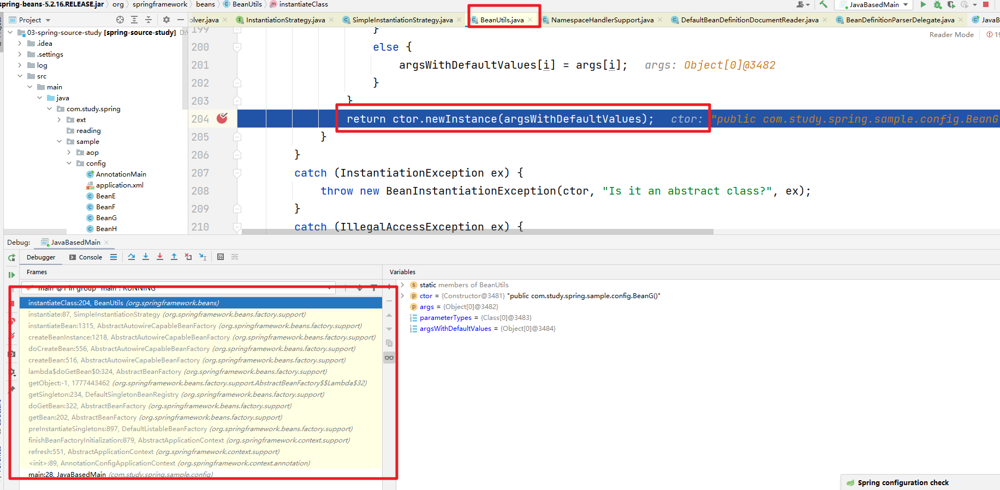


## 单例对象

在创建单例对象的时候是如何保存单例的特性的？这块我们需要注意下面的代码。

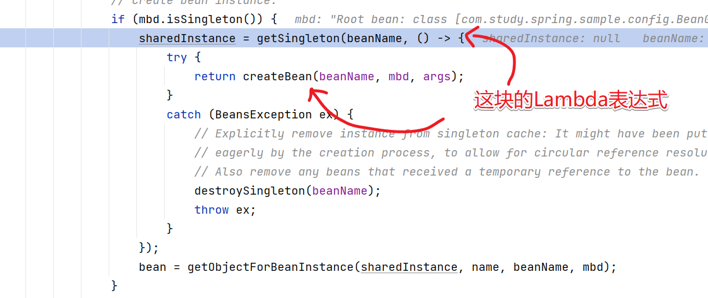

然后进入到 getSingleton 方法中。

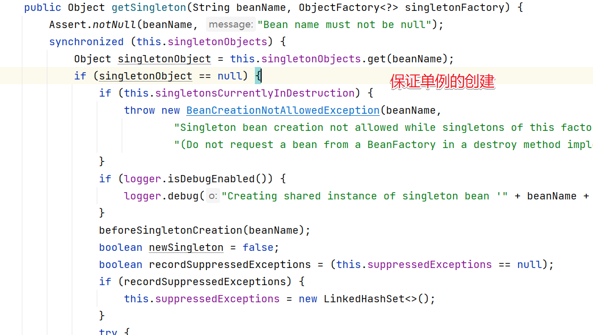

创建成功的单例对象会被缓存起来。在 addSingleton 方法中。

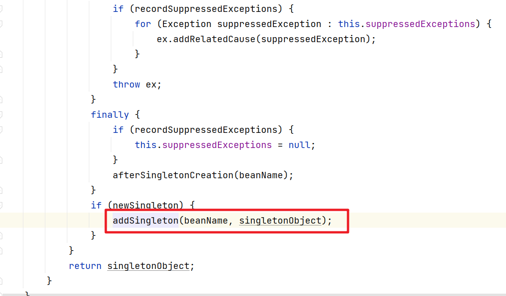

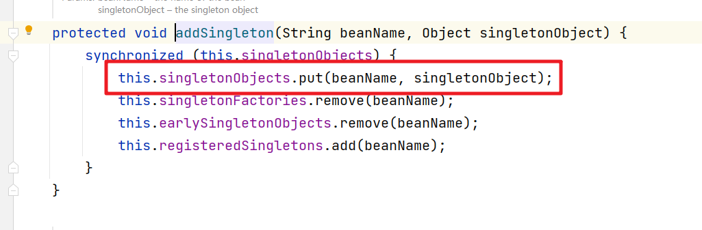

所以singletonObjects是缓存所有Bean实例的容器

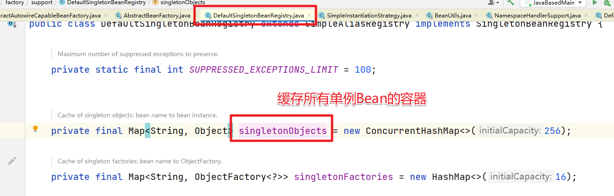

而具体创建单例 Bean 的逻辑会回调前面的Lambda表达式中的 createBean 方法。

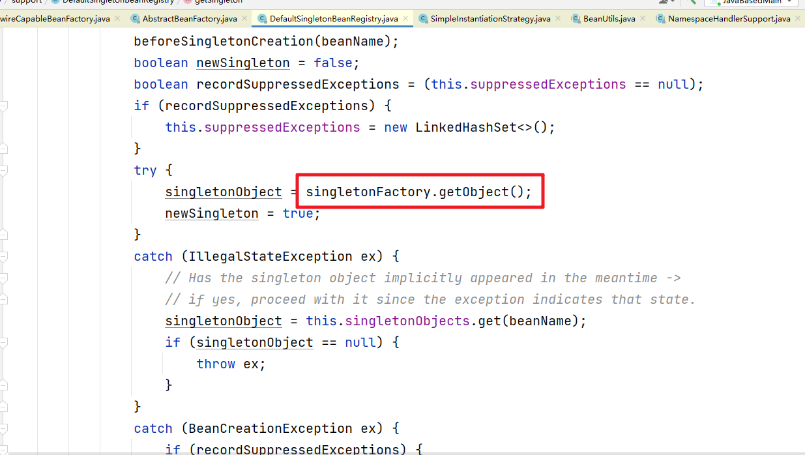

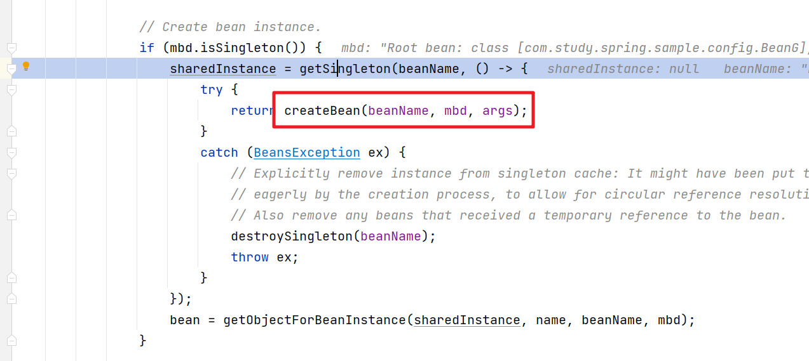


## 单例对象的销毁

然后我们先来看下单例 Bean 对象的销毁过程，定义一个案例。

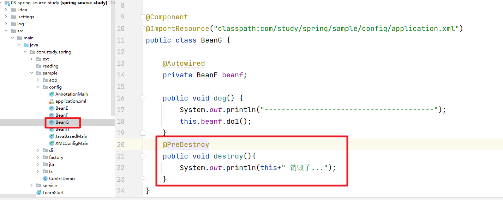

然后我们在测试的案例中显示的调用 `close` 方法。

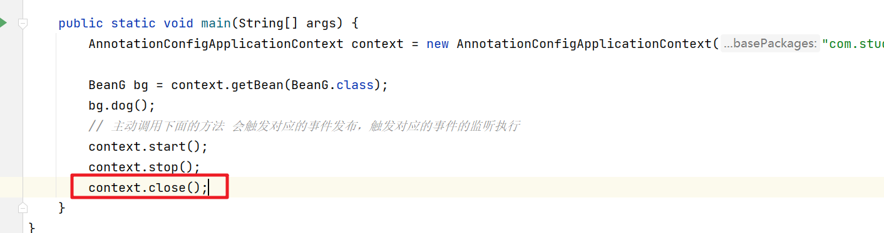

执行的时候可以看到相关的日志执行了。

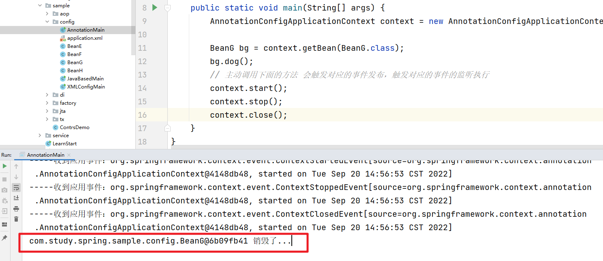

进入到 close 方法中分析，比较核心的有两个位置。在doClose方法中。

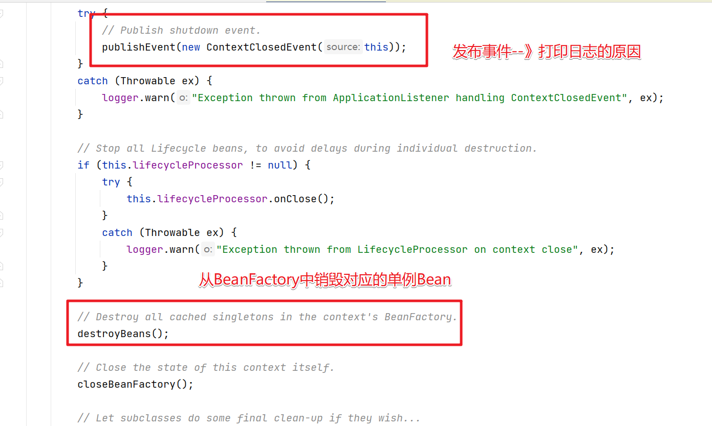

具体销毁的代码进入destroyBeans()中查看即可。

在 doClose 方法中有个提示。registerShutdownHook 方法

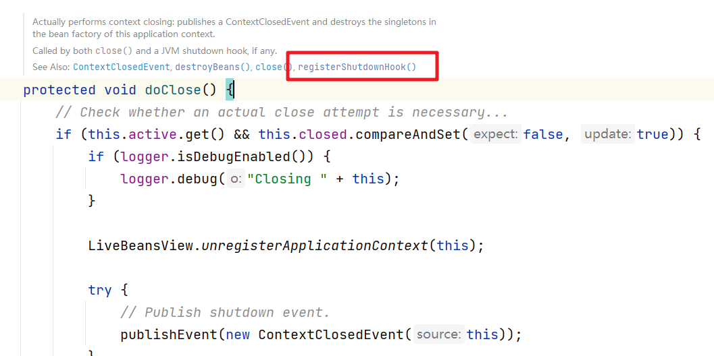

```java
	@Override
	public void registerShutdownHook() {
		if (this.shutdownHook == null) {
			// No shutdown hook registered yet.
			this.shutdownHook = new Thread(SHUTDOWN_HOOK_THREAD_NAME) {
				@Override
				public void run() {
					synchronized (startupShutdownMonitor) {
						doClose();
					}
				}
			};
			Runtime.getRuntime().addShutdownHook(this.shutdownHook);
		}
	}
```

对应的在Web项目中就有对应的调用

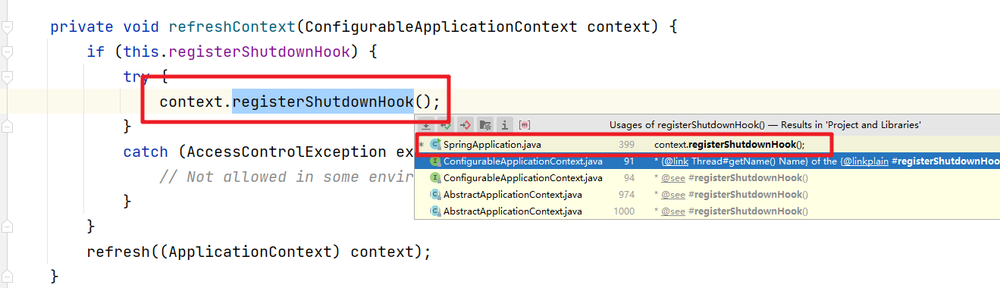
