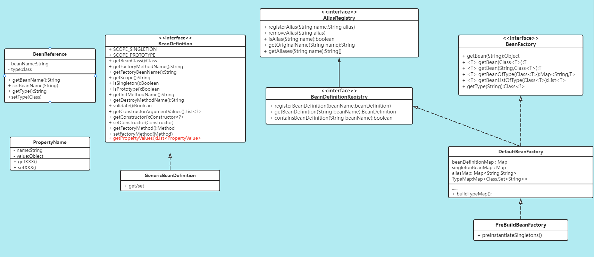
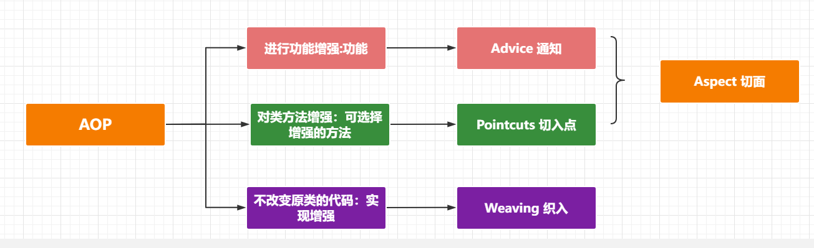
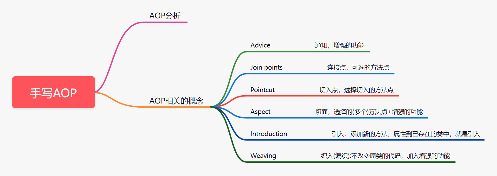
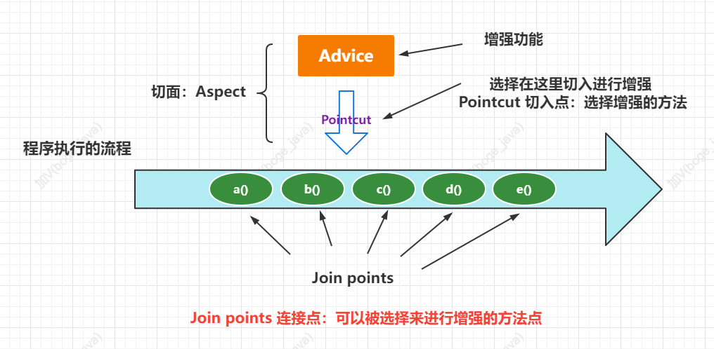
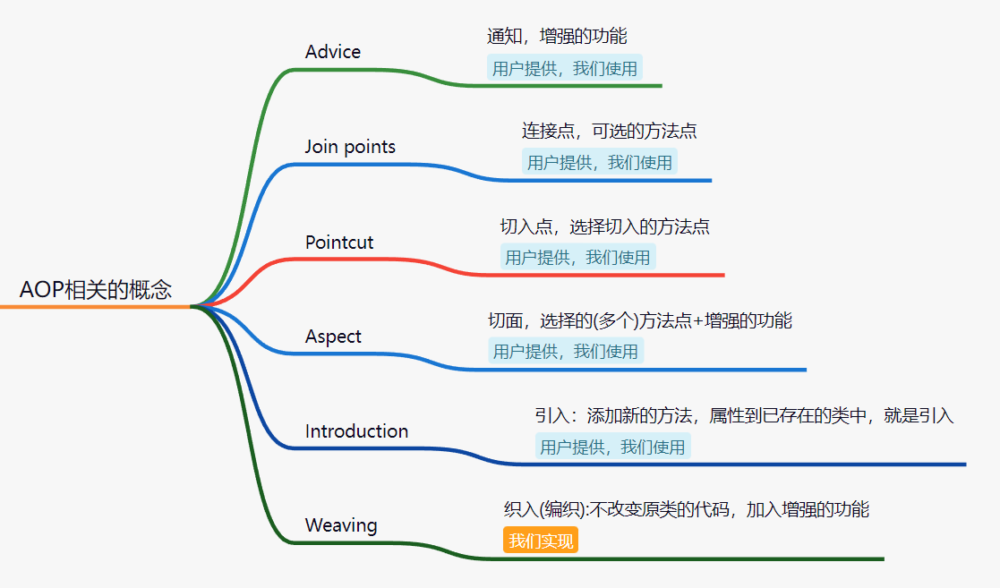
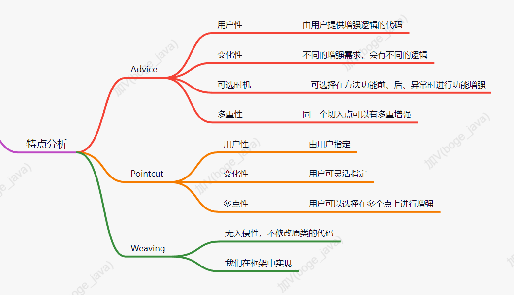
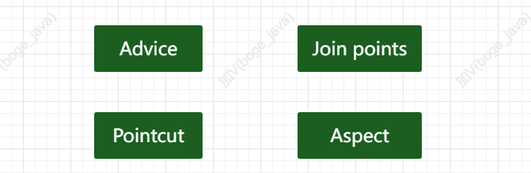
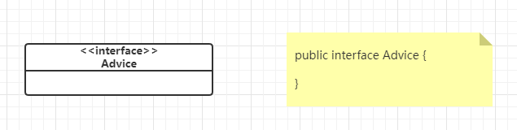
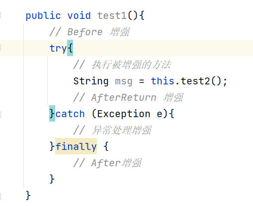
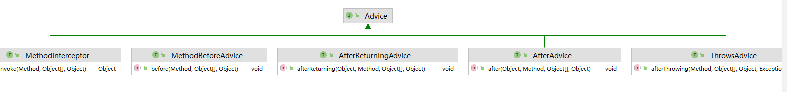

# Spring（三）：手写AOP

手写 IoC 和 DI 后已经实现的类图结构



## AOP分析
### AOP是什么
AOP[Aspect Oriented Programming] 面向切面编程，在不改变类的代码的情况下，对类方法进行功能的增强。

### 我们要做什么
我们需要在前面手写IoC、手写DI的基础上给用户提供AOP功能，让他们可以通过AOP技术实现对类方法功能增强。


### 我们的需求是什么
提供AOP功能，然后呢...没有了。关键还是得从上面的定义来理解




## AOP概念讲解
上面在分析AOP需求的时候，我们介绍了相关的概念，Advice、Pointcuts和weaving等，首先我们来看看在AOP中，我们会接触到的相关概念都有哪些。



更加形象的描述



然后对于上面的相关概念，我们就要考虑哪些是用户需要提供的，哪些是框架要写好的？



思考：Advice、Pointcuts和Weaving各自的特点



## 切面实现

通过上面的分析，我们要设计实现AOP功能，其实就是要设计实现上面分析的相关概念对应的组件。




### Advice

#### 面向接口编程
Advice：通知，是由用户提供的，我们来使用，主要是用户提供就突出了`多变性`。针对这块我们应该怎么设计？这里有两个问题：
1. 我们如何能够识别用户提供的东西呢？用户在我们写好框架后使用我们的框架；
2. 如何让我们的代码隔绝用户提供的多变性呢？

针对这种情况我们定义一套标准的接口，用户实现接口类提供他们不同的逻辑。是否可行？

这里有个重要的设计原则大家要注意：如何应对变化，通过面向接口编程来搞定！！！

我们先定义一个空的接口，可以先思考下我们为什么定义一个空的接口呢？



#### Advice的特点分析

Advice的特点：可选时机，可选择在方法执行前、后、异常时进行功能的增强。




结合上面的情况我们可以分析出Advice通知的几种情况
- 前置增强-Before
- 后置增强-AfterReturn
- 环绕增强-Around
- 最终通知-After
- 异常通知-Throwing

有这么多的情况我们应该要怎么来实现呢？我们可以定义标准的接口方法，让用户来实现它，提供各种具体的增强内容。那么这四种增强相关的方法定义是怎样的呢？我们一一来分析下。

#### 各种通知分析

##### 前置增强
定义：在方法执行前进行增强

**它可能需要的参数？**  
目的是对方法进行增强，应该需要的是方法相关的信息，我们使用它的时候能给予它的就是当前要执行方法的相关信息了。

**运行时方法有哪些信息**
1. 方法本身 Method；
2. 方法所属的对象 Object；
3. 方法的参数 Object[];

**前置增强的返回值是什么？**  
在方法执行前进行增强，不需要返回值！

```java
public interface MethodBeforeAdvice extends Advice {

	/**
	 * 实现该方法进行前置增强
	 * 
	 * @param method
	 *            被增强的方法
	 * @param args
	 *            方法的参数
	 * @param target
	 *            被增强的目标对象
	 * @throws Throwable
	 */
	void before(Method method, Object[] args, Object target) throws Throwable;
}
```

##### 最终通知
定义：在方法执行后进行增强

**它可能需要的参数？**
- 方法本身 Method
- 方法所属的对象 Object
- 方法的参数 Object[]
- 方法的返回值 Object 可能没有

**它的返回值是什么？**  
这个就需要看是否允许在After中更改返回的结果，如果规定只可用、不可修改返回值就不需要返回值。

```java
public interface AfterAdvice extends Advice {
	/**
	 * 实现该方法，提供后置增强
	 * 
	 * @param returnValue
	 *            返回值
	 * @param method
	 *            被增强的方法
	 * @param args
	 *            方法的参数
	 * @param target
	 *            方法的所属对象
	 * @throws Throwable
	 */
	void after(Object returnValue, Method method, Object[] args, Object target) throws Throwable;
}
```

##### 后置通知
> 在方法执行后进行增强

**它可能需要的参数？**
- 方法本身 Method
- 方法所属的对象 Object
- 方法的参数 Object[]
- 方法的返回值 Object

**它的返回值是什么？**  
这个就需要看是否允许在After中更改返回的结果，如果规定只可用、不可修改返回值就不需要返回值。

```java
public interface AfterReturningAdvice extends Advice {
	/**
	 * 实现该方法，提供AfterRetun增强
	 * 
	 * @param returnValue
	 *            返回值
	 * @param method
	 *            被增强的方法
	 * @param args
	 *            方法的参数
	 * @param target
	 *            方法的所属对象
	 * @throws Throwable
	 */
	void afterReturning(Object returnValue, Method method, Object[] args, Object target) throws Throwable;
}
```

##### 环绕通知
> 包裹方法进行增强

**它可能需要的参数？**
- 方法本身 Method
- 方法所属的对象 Object
- 方法的参数 Object[]

**它的返回值是什么？**  
方法被它包裹，即方法将由它来执行，它需要返回方法的返回值。

```java
public interface MethodInterceptor extends Advice {
	/**
	 * 对方法进行环绕（前置、后置）增强、异常处理增强，方法实现中需调用目标方法。
	 * 
	 * @param method
	 *            被增强的方法
	 * @param args
	 *            方法的参数
	 * @param target
	 *            方法所属对象
	 * @return Object 返回值
	 * @throws Throwable
	 */
	Object invoke(Method method, Object[] args, Object target) throws Throwable;
}
```

##### 异常通知
> 对方法执行时的异常，进行增强处理。

**它可能需要什么参数?**
- 一定需要Exception
- 可能需要方法本身 Method
- 可能需要方法所属的对象 Object
- 可能需要方法的参数 Object[]

**它的返回值是什么?**  
这个就需要看是否允许在After中更改返回的结果，如果规定只可用、不可修改返回值就不需要返回值。

```java
public interface ThrowsAdvice extends Advice {

    void afterThrowing(Method method, Object[] args, Object target, Exception ex) throws Throwable;
}
```

#### Advice设计
结合上面的分析，我们就可以得出Advice的体系图了




