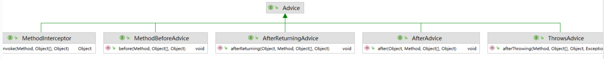
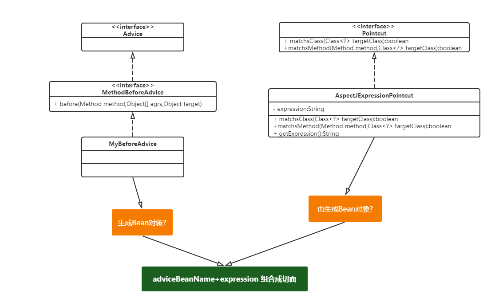
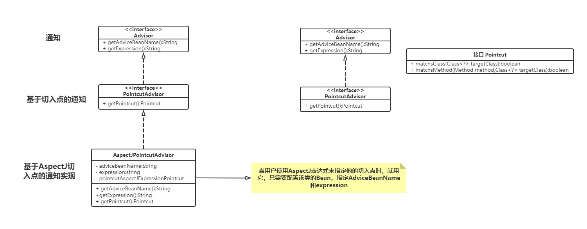
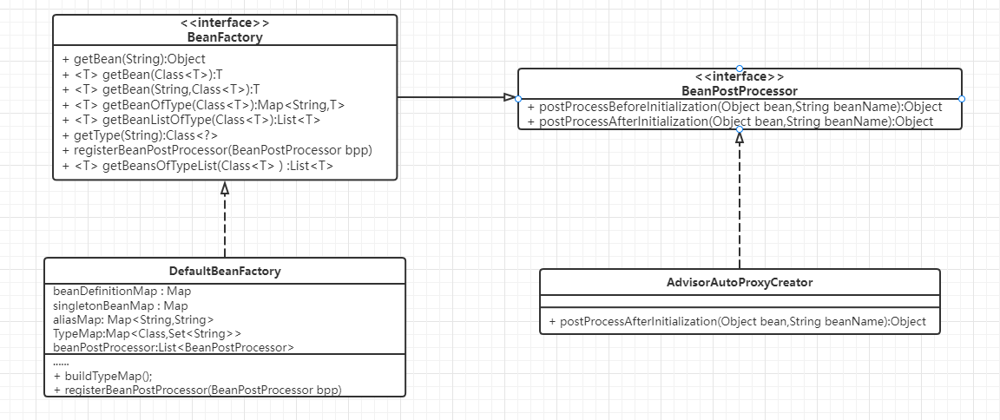
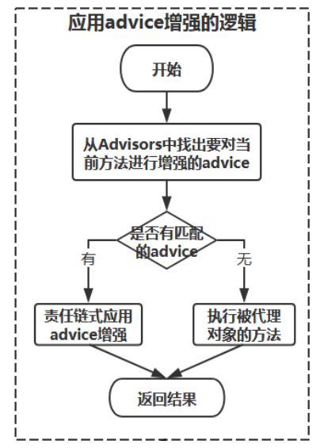
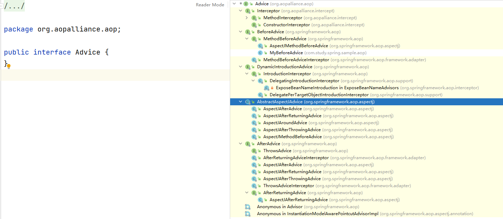

# Spring（九）：AOP分析

## 手写AOP回顾

本文我们开始讲解Spring中的AOP原理和源码，我们前面手写了AOP的实现，了解和自己实现AOP应该要具备的内容。

### 涉及的相关概念

更加形象的描述

### 相关核心的设计

Advice：

Pointcut:

Aspect：

Advisor：

织入：

## AOP 相关概念的类结构

回顾了前面的内容，然后我们来看看Spring中AOP是如何来实现的了。

### Advice类结构

我们先来看看Advice的类机构，Advice-->通知，需要增强的功能。

相关的说明

### Pointcut类结构
