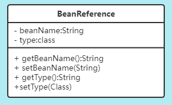
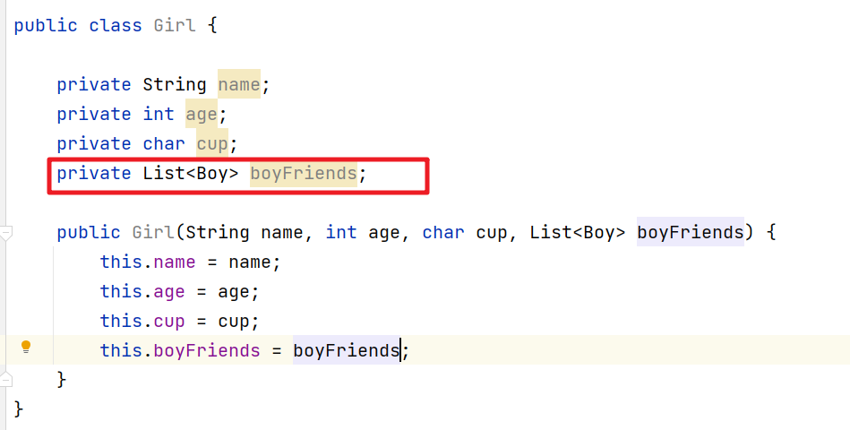

# Spring（二）：手写DI

## DI介绍
DI(Dependency injection)依赖注入。对象之间的依赖由容器在运行期决定，即容器动态的将某个依赖注入到对象之中。说的直白点就是给Bean对象的成员变量赋值。

### 哪些地方会有依赖
- 构造参数依赖
- 属性依赖

### 依赖注入的本质是什么
依赖注入的本质是“赋值"，赋值有两种情况：
1. 给有参构造方法赋值
2. 给属性赋值

### 参数值、属性值有哪些
具体赋值有两种情况：直接值和 Bean 依赖。比如：

```java
public clsss Girl{
     public Girl(String name,int age,char cup,Boy boyfriend){
         ...
     }
}
```

### 直接赋值有哪些
- 基本数据类型：String、int 等
- 数组、集合
- map

## 构造注入

### 构造注入分析
通过构造方法来创建实例，然后对应的构造方法需要传入对应的参数。如果不是通过IoC来处理，我们可以直接通过如下代码实现：

```java
public static void main(String[] args) {
      Boy boy = new Boy();
      Girl girl = new Girl("小丽",20,'C',boy);
}
```

在IoC中，我们需要通过反射的方式处理。那么我们在通过反射操作的时候就需要能获取到对应的构造参数的依赖了，这是我们得分析怎么来存储我们的构造参数的依赖了。构造参数的依赖有两个特点：
- 数量
- 顺序

上面例子中的参数
1. 小丽
2. 20
3. ‘C'
4. boy，是一个依赖 Bean

参数可以有多个，我们完全可以通过 List 集合来存储，而且通过添加数据的顺序来决定构造参数的顺序了。但是这里有一个问题，如何表示 Bean 依赖呢？直接值我们直接添加到集合就可以了，但是 Bean 依赖，我们还没创建对应的对象，这是我们可以维护一个自定义对象，来绑定相关的关系。

### BeanReference

BeanReference就是用来说明bean依赖的：也就是这个属性依赖哪个类型的Bean



可以根据name来依赖，也可以按照Type来依赖。当然我们的程序中还有一点需要考虑，就是如何来区分是直接值还是Bean依赖呢？有了上面的设计其实就很容易判断了。

```java
if ( obj instance BeanReference)
```

当然还有一种比较复杂的情况如下：



直接值是数组或者集合等，同时容器中的元素是Bean依赖，针对这种情况元素值还是需要用BeanReference来处理的。Bean工厂在处理时需要遍历替换。