# Spring（五）：ApplicationContext

> 前面通过手写IoC、DI、AOP和Bean的配置，到最后ApplicationContext的门面处理，对于Spring相关的核心概念应该会比较清楚了，接下来我们就看看在Spring源码中，对于核心组件是如何实现的。

## ApplicationContext

> ApplicationContext到底是什么？字面含义是应用的上下文。这块我们需要看看ApplicationContext的具体的结构。

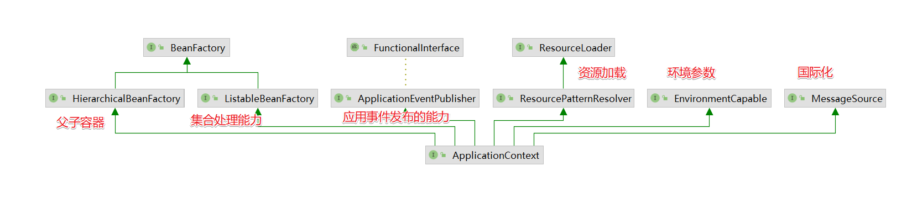

通过ApplicationContext实现的相关接口来分析，ApplicationContext接口在具备BeanFactory的功能的基础上还扩展了 `应用事件发布`、`资源加载`、`环境参数` 和 `国际化` 的能力，然后我们来看看ApplicationContext接口的实现类的情况。

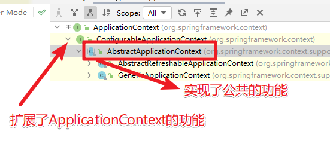

在ApplicationContext的实现类中有两个比较重要的分支，`AbstractRefreshableApplicationContext`和 `GenericApplicationContext`。

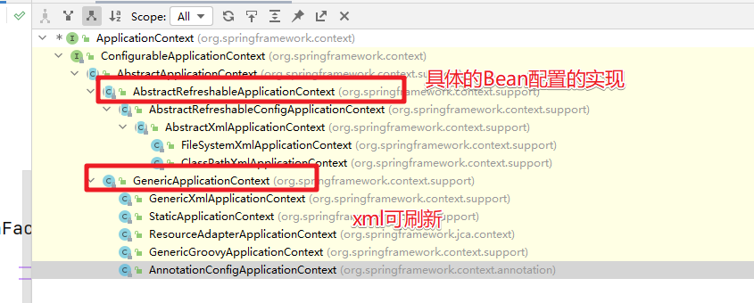


## BeanFactory

上面分析了 `ApplicationContext`接口的结构。然后我们来看看 `BeanFactory`在ApplicationContext中具体的实现是怎么样的

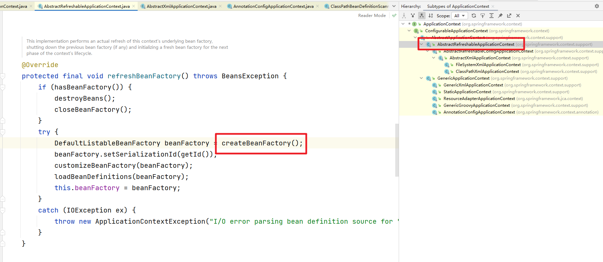

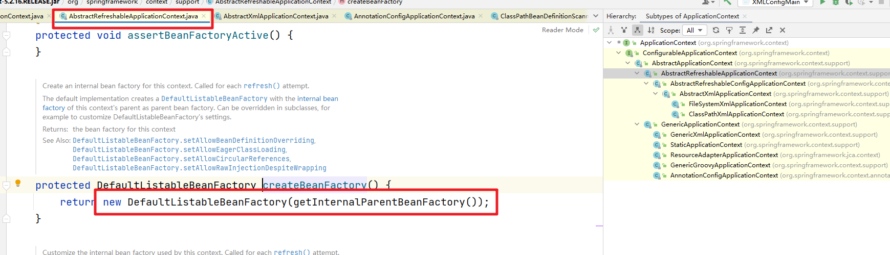

可以看到具体的实现是 DefaultListableBeanFactory，然后我们来看看它的体系结构。

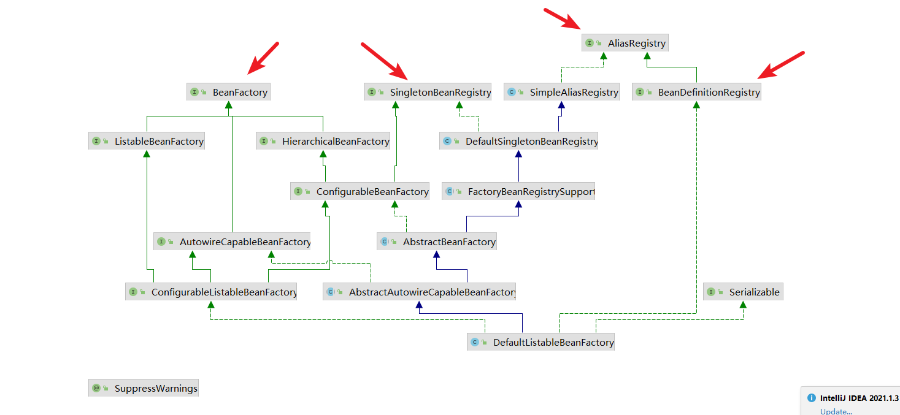

BeanFactory的继承体系

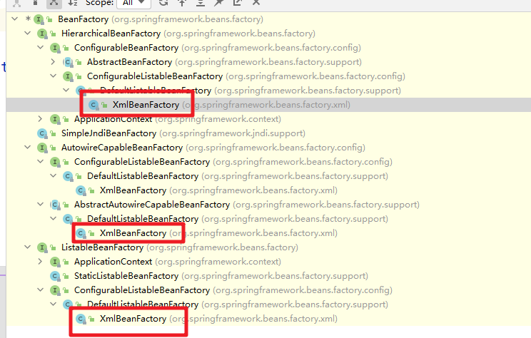


## BeanDefinition

然后我们来了解下ApplicationContext是如何来加载Bean定义的。具体代码我们需要分为XML配置文件和基于注解的两种方式来看。

### 基于XML方式

我们先定义对应的application.xml文件

```xml
<?xml version="1.0" encoding="UTF-8"?>
<beans xmlns="http://www.springframework.org/schema/beans"
    xmlns:xsi="http://www.w3.org/2001/XMLSchema-instance"
    xmlns:context="http://www.springframework.org/schema/context"
    xmlns:aop="http://www.springframework.org/schema/aop"
    xsi:schemaLocation="http://www.springframework.org/schema/beans
        http://www.springframework.org/schema/beans/spring-beans.xsd
        http://www.springframework.org/schema/context
        http://www.springframework.org/schema/context/spring-context.xsd
        http://www.springframework.org/schema/aop
        http://www.springframework.org/schema/aop/spring-aop.xsd">

	<bean id="beanE" class="com.study.spring.sample.config.BeanE" />

	<bean id="beanF" class="com.study.spring.sample.config.BeanF" ></bean>

	<context:annotation-config/>

	<context:component-scan base-package="com.study.spring.sample.config" ></context:component-scan>

</beans>
```

然后我们的测试类代码

```java
public class XMLConfigMain {

	public static void main(String[] args) {
		ApplicationContext context = new GenericXmlApplicationContext(
				"classpath:com/study/spring/sample/config/application.xml");
		BeanF bf = context.getBean(BeanF.class);
		bf.do1();
	}
}
```

处理的过程：解析XML--> BeanDefinition --> BeanDefinitionRegistry --> BeanFactory

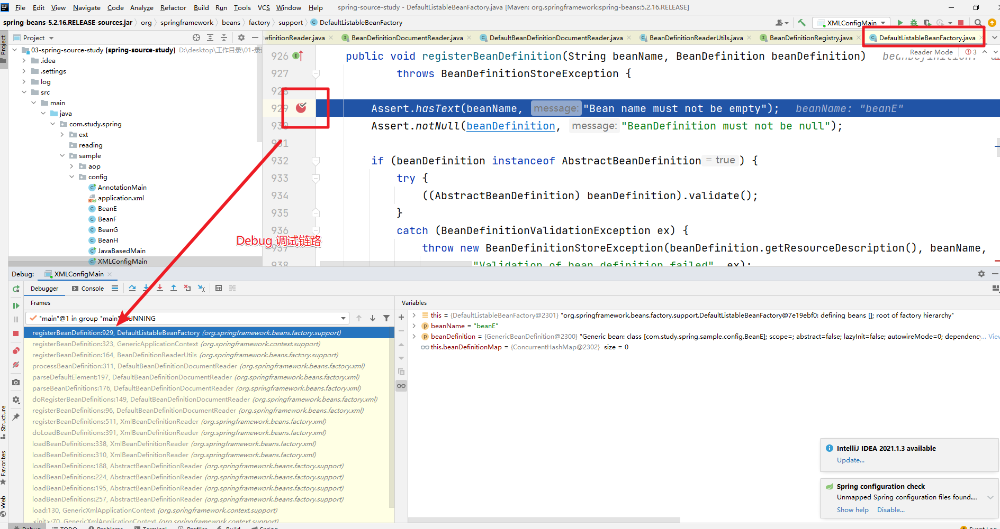


### 基于注解方式

然后来看看基于注解方式的使用情况。首先是我们的配置类。

```java
@Configuration
@ComponentScan("com.study.spring.sample.config")
public class JavaBasedMain {

	@Bean
	public BeanH getBeanH() {
		return new BeanH();
	}

	public static void main(String[] args) {
		ApplicationContext context = new AnnotationConfigApplicationContext(JavaBasedMain.class);

		BeanH bh = context.getBean(BeanH.class);
		bh.doH();
	}
}
```

然后是我们的测试类

```java
public class AnnotationMain {

	public static void main(String[] args) {
		ApplicationContext context = new AnnotationConfigApplicationContext("com.study.spring.sample.config");

		BeanG bg = context.getBean(BeanG.class);
		bg.dog();
	}
}
```

注解使用有两种方法：
1. 配置扫描路径；
2. 配置@Configuration的注解类

#### this构造方法
在this的构造方法中会完成相关的配置处理

```java
	public AnnotationConfigApplicationContext() {
		this.reader = new AnnotatedBeanDefinitionReader(this);
		this.scanner = new ClassPathBeanDefinitionScanner(this);
	}
```

首先是AnnotatedBeanDefinitionReader(this)方法。会完成核心的ConfigurationClassPostProcessor的注入。ConfigurationClassPostProcessor 会完成@Configuration相关的注解的解析

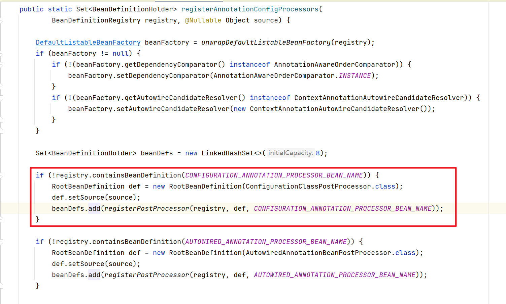

this.scanner其实就是创建了一个对应的扫描器

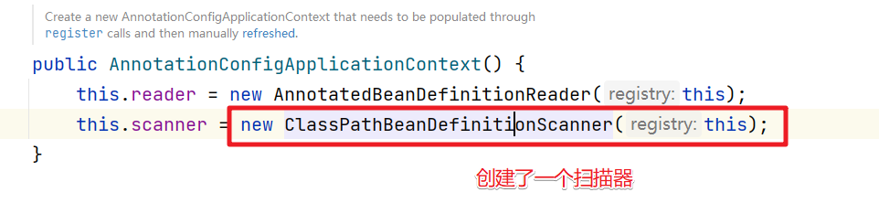

#### 扫描实现

扫描就需要进入到scan方法中。

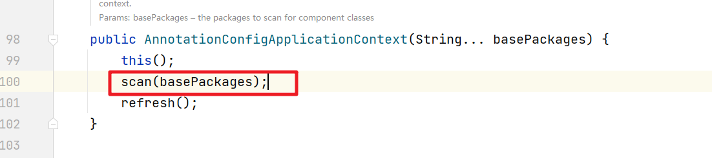

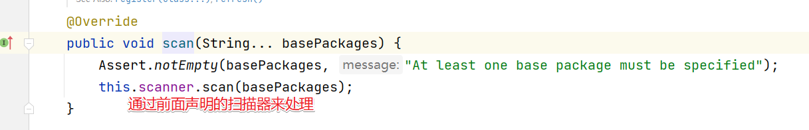

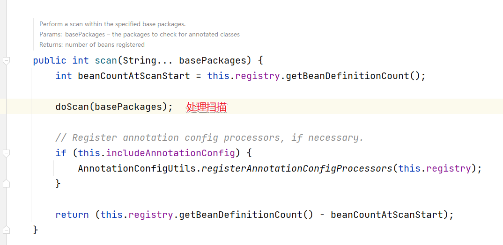

完成相关的注册

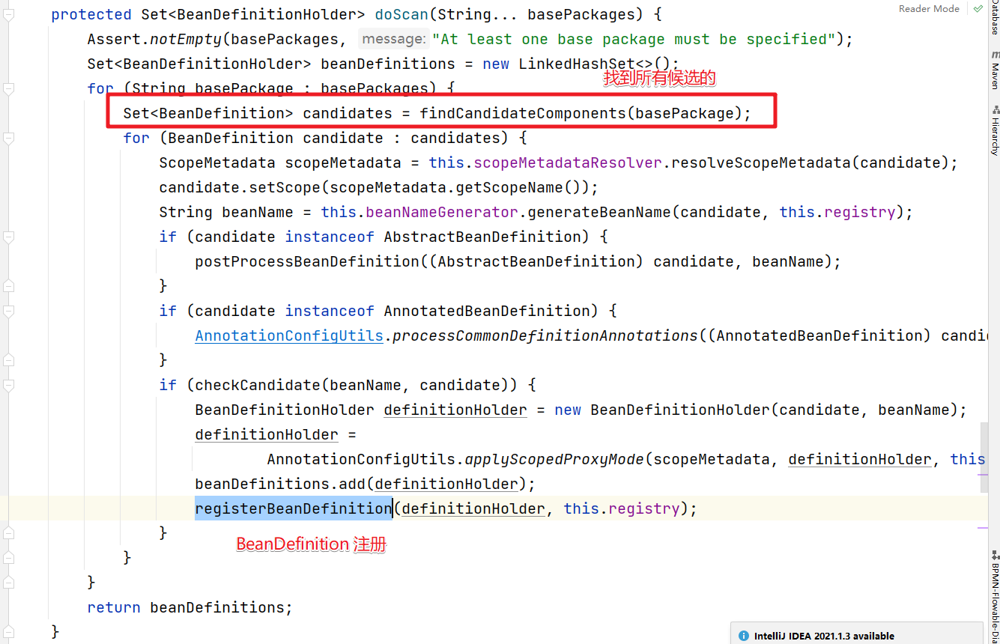


#### @Configuration

@Configuration的解析其实是在refresh方法中来实现的。

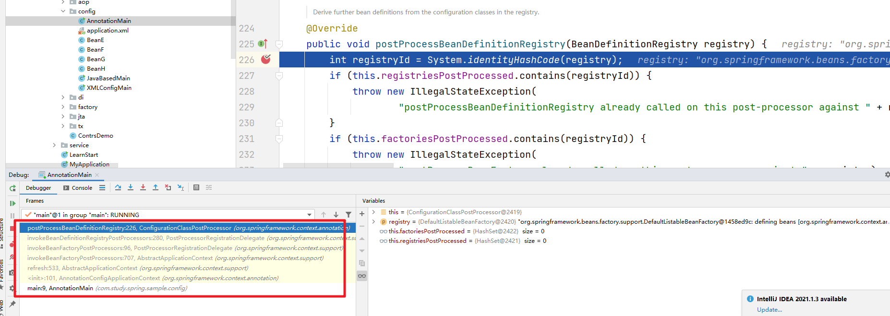


### 小结

通过上面的分析其实我们已经对Bean定义的扫描，解析和注册过程有了一定的了解。归纳为：
1. reader解析XML，完成xml方法配置的bean定义
2. scanner扫描指定包下的类，找出带有@Component注解的类，注册成Bean定义
3. 通过ConfigurationClassPostProcessor对带有@Configuration注解的类进行处理，解析它上面的注解，以及类中带有@Bean 注解，加入这些的Bean的定义。

### BeanDefinition

然后我们来看看BeanDefinition的继承结构

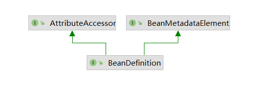

继承属性访问器和元数据接口，增加了Bean定义操作，实现了数据和操作解耦。属性访问器和元数据接口接着往下看。

#### BeanMetadataElement

BeanMetadataElement提供了获取数据源的方式，也就是可以指导Bean是来自哪个类。

```java
public interface BeanMetadataElement {

	/**
	 * Return the configuration source {@code Object} for this metadata element
	 * (may be {@code null}).
	 */
	@Nullable
	default Object getSource() {
		return null;
	}

}
```

#### BeanMetadataAttribute元数据属性

实现了元数据接口，增加了属性的名字和值。

```java

public class BeanMetadataAttribute implements BeanMetadataElement {

	private final String name;

	@Nullable
	private final Object value;

	@Nullable
	private Object source;

}
```

#### AttributeAccessor属性访问器

AttributeAccessor用来给Bean定义了增删改查属性的功能

```java
public interface AttributeAccessor {

	/**
	 * Set the attribute defined by {@code name} to the supplied {@code value}.
	 * If {@code value} is {@code null}, the attribute is {@link #removeAttribute removed}.
	 * <p>In general, users should take care to prevent overlaps with other
	 * metadata attributes by using fully-qualified names, perhaps using
	 * class or package names as prefix.
	 * @param name the unique attribute key
	 * @param value the attribute value to be attached
	 */
	void setAttribute(String name, @Nullable Object value);

	/**
	 * Get the value of the attribute identified by {@code name}.
	 * Return {@code null} if the attribute doesn't exist.
	 * @param name the unique attribute key
	 * @return the current value of the attribute, if any
	 */
	@Nullable
	Object getAttribute(String name);

	/**
	 * Remove the attribute identified by {@code name} and return its value.
	 * Return {@code null} if no attribute under {@code name} is found.
	 * @param name the unique attribute key
	 * @return the last value of the attribute, if any
	 */
	@Nullable
	Object removeAttribute(String name);

	/**
	 * Return {@code true} if the attribute identified by {@code name} exists.
	 * Otherwise return {@code false}.
	 * @param name the unique attribute key
	 */
	boolean hasAttribute(String name);

	/**
	 * Return the names of all attributes.
	 */
	String[] attributeNames();

}
```

#### AttributeAccessorSupport属性访问抽象实现类

内部定义了1个map来存放属性。

```java
public abstract class AttributeAccessorSupport implements AttributeAccessor, Serializable {

	/** Map with String keys and Object values. */
	private final Map<String, Object> attributes = new LinkedHashMap<>();


	@Override
	public void setAttribute(String name, @Nullable Object value) {
		Assert.notNull(name, "Name must not be null");
		if (value != null) {
			this.attributes.put(name, value);
		}
		else {
			removeAttribute(name);
		}
	}
    //  ......
}
```

#### BeanMetadataAttributeAccessor元数据属性访问器

继承AttributeAccessorSupport具备属性访问功能，实现BeanMetadataElement具备获取元数据功能。 **AbstractBeanDefinition就继承于它，使得同时具有属性访问和元数据访问的功能。

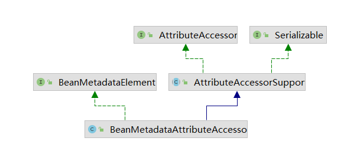

结合AbstractBeanDefinition.来看看他们的类图结构

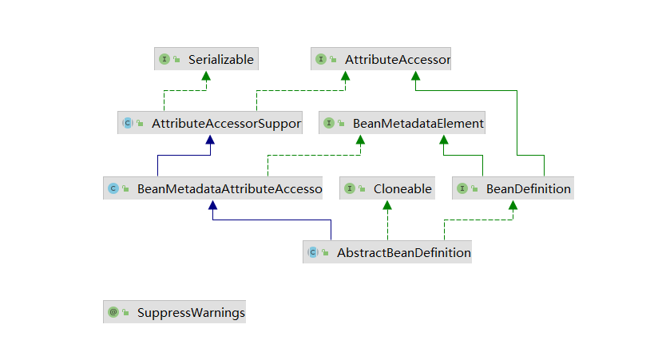

### BeanDefinition继承体系

#### AnnotatedBeanDefinition

增加了2个方法，获取bean所在类的注解元数据和工厂方法元数据，这些数据在进行解析处理的时候需要用到。

```java
public interface AnnotatedBeanDefinition extends BeanDefinition {

	/**
	 * Obtain the annotation metadata (as well as basic class metadata)
	 * for this bean definition's bean class.
	 * @return the annotation metadata object (never {@code null})
	 */
	AnnotationMetadata getMetadata();

	/**
	 * Obtain metadata for this bean definition's factory method, if any.
	 * @return the factory method metadata, or {@code null} if none
	 * @since 4.1.1
	 */
	@Nullable
	MethodMetadata getFactoryMethodMetadata();

}
```

该注解有三个具体的实现：ScannedGenericBeanDefinition、AnnotatedGenericBeanDefinition、ConfigurationClassBeanDefinition。

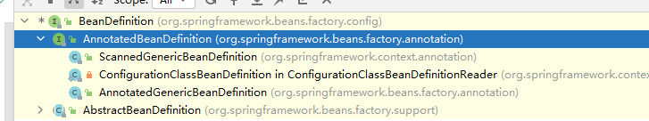


#### AbstractBeanDefinition模板类

AbstractBeanDefinition我们可以称之为BeanDefinition的模板类。结构我们上面其实有梳理

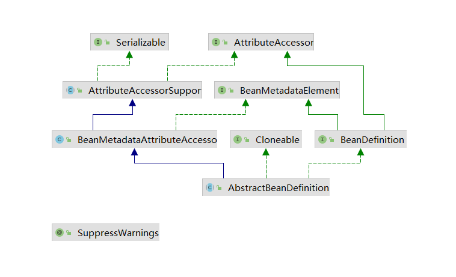

通过上面我们可以看到AbstractBeanDefinition 具备了 Bean元数据的获取和属性相关的操作。同时AbstractBeanDefinition的继承结构。


#### RootBeanDefinition根bean定义

它主要用在spring内部的bean定义、把不同类型的bean定义合并成RootBeanDefinition（getMergedLocalBeanDefinition方法）。没有实现BeanDefinition接口的设置获取父bean定义方法，不支持设置父子beanDefinition。

#### ConfigurationClassBeanDefinition

用作ConfigurationClassPostProcessor解析过程中封装配置类的bean定义。

#### GenericBeanDefinition

GenericBeanDefinition通用Bean的定义。

#### ScannedGenericBeanDefinition

@ComponentScan扫描的bean定义使用。

#### AnnotatedGenericBeanDefinition


