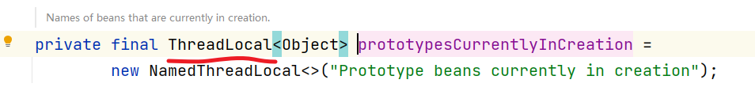

# Spring（八）：DI的过程

接下来我们分析下Spring源码中Bean初始化过程中的DI过程，也就是属性的依赖注入。

## 构造参数依赖

### 如何确定构造方法

在Spring中生成Bean实例的时候默认是调用对应的无参构造方法来处理。

```java
@Component
public class BeanK {

    private BeanE beanE;
    private BeanF beanF;

  
    public BeanK(BeanE beanE) {
        this.beanE = beanE;
    }

    public BeanK(BeanE beanE, BeanF beanF) {
        this.beanE = beanE;
        this.beanF = beanF;
    }
}
```

声明了两个构造方法，但是没有提供无参的构造方法。这时从容器中获取会报错。


这时我们需要在显示使用的构造方法中添加 @Autowired 注解即可。


源码层面的核心

```java
	protected BeanWrapper createBeanInstance(String beanName, RootBeanDefinition mbd, @Nullable Object[] args) {
		// Make sure bean class is actually resolved at this point.
		// 确认需要创建的bean实例的类可以实例化
		Class<?> beanClass = resolveBeanClass(mbd, beanName);

		// 确保class不为空，并且访问权限是public
		if (beanClass != null && !Modifier.isPublic(beanClass.getModifiers()) && !mbd.isNonPublicAccessAllowed()) {
			throw new BeanCreationException(mbd.getResourceDescription(), beanName,
					"Bean class isn't public, and non-public access not allowed: " + beanClass.getName());
		}

		// 判断当前beanDefinition中是否包含实例供应器，此处相当于一个回调方法，利用回调方法来创建bean
		Supplier<?> instanceSupplier = mbd.getInstanceSupplier();
		if (instanceSupplier != null) {
			return obtainFromSupplier(instanceSupplier, beanName);
		}

		// 如果工厂方法不为空则使用工厂方法初始化策略
		if (mbd.getFactoryMethodName() != null) {
			return instantiateUsingFactoryMethod(beanName, mbd, args);
		}

		// 一个类可能有多个构造器，所以Spring得根据参数个数、类型确定需要调用的构造器
		// 在使用构造器创建实例后，Spring会将解析过后确定下来的构造器或工厂方法保存在缓存中，避免再次创建相同bean时再次解析

		// Shortcut when re-creating the same bean...
		// 标记下，防止重复创建同一个bean
		boolean resolved = false;
		// 是否需要自动装配
		boolean autowireNecessary = false;
		// 如果没有参数
		if (args == null) {
			synchronized (mbd.constructorArgumentLock) {
				// 因为一个类可能由多个构造函数，所以需要根据配置文件中配置的参数或传入的参数来确定最终调用的构造函数。
				// 因为判断过程会比较，所以spring会将解析、确定好的构造函数缓存到BeanDefinition中的resolvedConstructorOrFactoryMethod字段中。
				// 在下次创建相同时直接从RootBeanDefinition中的属性resolvedConstructorOrFactoryMethod缓存的值获取，避免再次解析
				if (mbd.resolvedConstructorOrFactoryMethod != null) {
					resolved = true;
					autowireNecessary = mbd.constructorArgumentsResolved;
				}
			}
		}
		// 有构造参数的或者工厂方法
		if (resolved) {
			// 构造器有参数
			if (autowireNecessary) {
				// 构造函数自动注入
				return autowireConstructor(beanName, mbd, null, null);
			}
			else {
				// 使用默认构造函数构造
				return instantiateBean(beanName, mbd);
			}
		}

		// Candidate constructors for autowiring?
		// 从bean后置处理器中为自动装配寻找构造方法, 有且仅有一个有参构造或者有且仅有@Autowired注解构造
		Constructor<?>[] ctors = determineConstructorsFromBeanPostProcessors(beanClass, beanName);
		// 以下情况符合其一即可进入
		// 1、存在可选构造方法
		// 2、自动装配模型为构造函数自动装配
		// 3、给BeanDefinition中设置了构造参数值
		// 4、有参与构造函数参数列表的参数
		if (ctors != null || mbd.getResolvedAutowireMode() == AUTOWIRE_CONSTRUCTOR ||
				mbd.hasConstructorArgumentValues() || !ObjectUtils.isEmpty(args)) {
			return autowireConstructor(beanName, mbd, ctors, args);
		}

		// Preferred constructors for default construction?
		// 找出最合适的默认构造方法
		ctors = mbd.getPreferredConstructors();
		if (ctors != null) {
			// 构造函数自动注入
			return autowireConstructor(beanName, mbd, ctors, null);
		}

		// No special handling: simply use no-arg constructor.
		// 使用默认无参构造函数创建对象，如果没有无参构造且存在多个有参构造且没有@AutoWired注解构造，会报错
		return instantiateBean(beanName, mbd);
	}
```

### 循环依赖

接下来我们看看在构造注入的情况下。对循环依赖的检测是怎么做的。前面我们分析过，在构造注入的情况下，对于循环依赖是没有办法解决的。只能检测，然后抛出对应的异常信息。

```java
@Component
public class BeanL {

    private BeanM beanM;

    @Autowired
    public BeanL(BeanM beanM) {
        this.beanM = beanM;
    }
}

@Component
public class BeanM {
    private BeanL beanL;

    @Autowired
    public BeanM(BeanL beanL) {
        this.beanL = beanL;
    }
}
```

然后启动代码看到循环依赖的报错


然后我们来看看他是如何实现循环检测的。


进入到这个 `beforeSingletonCreation` 方法中。

```java
	protected void beforeSingletonCreation(String beanName) {
		// 如果当前在创建检查中的排除bean名列表中不包含该beanName且将beanName添加到当前正在创建的bean名称列表后，出现
		// beanName已经在当前正在创建的bean名称列表中添加过
		if (!this.inCreationCheckExclusions.contains(beanName) && !this.singletonsCurrentlyInCreation.add(beanName)) {
			// 抛出当前正在创建的Bean异常
			throw new BeanCurrentlyInCreationException(beanName);
		}
	}
```

然后当对象创建完成后。会异常对应的检测


```java
	protected void afterSingletonCreation(String beanName) {
		// 如果当前在创建检查中的排除bean名列表中不包含该beanName且将beanName从当前正在创建的bean名称列表异常后，出现
		// beanName已经没在当前正在创建的bean名称列表中出现过
		if (!this.inCreationCheckExclusions.contains(beanName) && !this.singletonsCurrentlyInCreation.remove(beanName)) {
			// 抛出非法状态异常：单例'beanName'不是当前正在创建的
			throw new IllegalStateException("Singleton '" + beanName + "' isn't currently in creation");
		}
	}
```

当然上面的针对单例的处理，如果是原型的话。我们继续来看。

```java
// 原型模式的bean对象创建
				else if (mbd.isPrototype()) {
					// It's a prototype -> create a new instance.
					// 它是一个原型 -> 创建一个新实例
					// 定义prototype实例
					Object prototypeInstance = null;
					try {
						// 创建Prototype对象前的准备工作，默认实现将beanName添加到prototypesCurrentlyInCreation中
						beforePrototypeCreation(beanName);
						// 为mbd(和参数)创建一个bean实例
						prototypeInstance = createBean(beanName, mbd, args);
					}
					finally {
						// 创建完prototype实例后的回调，默认是将beanName从prototypesCurrentlyInCreation移除
						afterPrototypeCreation(beanName);
					}
					// 从beanInstance中获取公开的Bean对象，主要处理beanInstance是FactoryBean对象的情况，如果不是
					// FactoryBean会直接返回beanInstance实例
					bean = getObjectForBeanInstance(prototypeInstance, name, beanName, mbd);
				}
```


而且我们可以发现在原型对象的检测中使用的是ThreadLocal来存储了。



## 属性依赖

