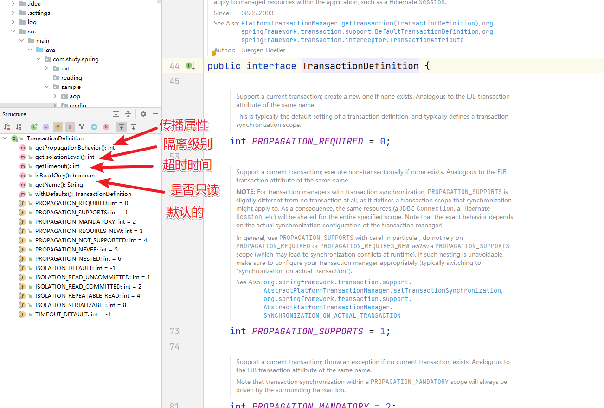
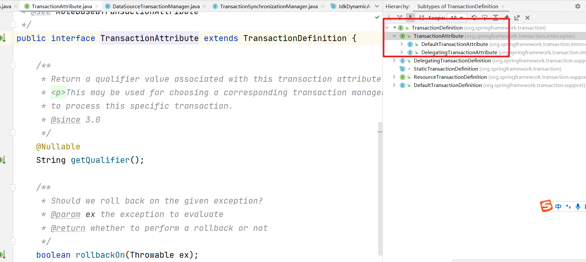
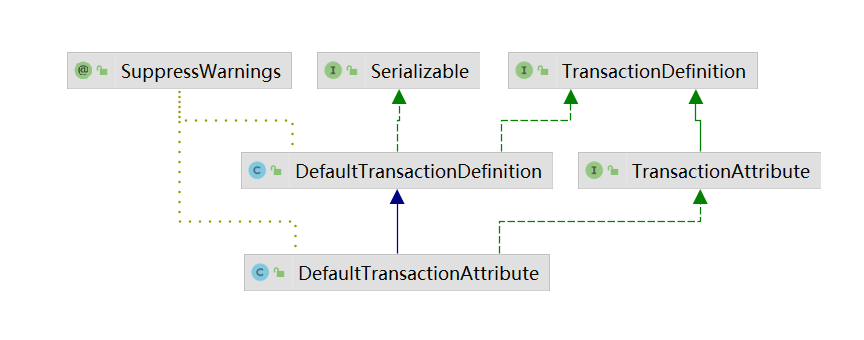

# Spring（十）：事务源码分析

## 事务的本质

### 何为事务管理

**数据库事务**(Database Transaction) ，是指作为单个逻辑工作单元执行的一系列操作，要么完全地执行，要么完全地不执行。

事务处理可以确保除非事务性单元内的所有操作都成功完成，否则不会永久更新面向数据的资源。通过将一组相关操作组合为一个要么全部成功要么全部失败的单元，可以简化错误恢复并使应用程序更加可靠。

一个逻辑工作单元要成为事务，必须满足所谓的 `ACID`（原子性、一致性、隔离性和持久性）属性。事务是数据库运行中的逻辑工作单位，由DBMS中的事务管理子系统负责事务的处理。


### JDBC中的事务管理

事务的本质我们还是要先来看下JDBC中对事务的处理。首先准备如下两张表[案例讲解以MYSQL为主]

```sql
-- MYSQL
CREATE TABLE t_user (
  id varchar(30) NOT NULL,
  user_name varchar(60) NOT NULL,
  PRIMARY KEY (id)
);

CREATE TABLE t_log (
  id varchar(32) DEFAULT NULL,
  log varchar(20) DEFAULT NULL
);
```

然后创建对应的实体对象

```java
/**
 * 用户
 */
public class User implements Serializable {

	private static final long serialVersionUID = -5575893900970589345L;

	private String id;

	private String userName;

	public String getId() {
		return id;
	}

	public void setId(String id) {
		this.id = id;
	}

	public String getUserName() {
		return userName;
	}

	public void setUserName(String userName) {
		this.userName = userName;
	}
}

/**
 * 日志
 */
public class Log implements Serializable {

	private static final long serialVersionUID = -5575893900970589345L;

	private String id;

	private String log;

	public Log() {
	}

	public Log(String id, String log) {
		super();
		this.id = id;
		this.log = log;
	}

	public String getId() {
		return id;
	}

	public void setId(String id) {
		this.id = id;
	}

	public String getLog() {
		return log;
	}

	public void setLog(String log) {
		this.log = log;
	}

}
```

然后我们通过JDBC操作来同时完成添加用户和添加日志的操作。

```java
    public static void main(String[] args) {
        Connection conn = null;
        Statement stmt = null;
        try {
            // 注册 JDBC 驱动
            // Class.forName("com.mysql.cj.jdbc.Driver");
            // 打开连接
            conn = DriverManager.getConnection("jdbc:mysql://localhost:3306/test?characterEncoding=utf-8&serverTimezone=UTC", "root", "123456");
            // 执行查询
            stmt = conn.createStatement();
            conn.setAutoCommit(false); // 关闭自动提交
            // 添加用户信息
            String sql = "INSERT INTO T_USER(id,user_name)values(1,'管理员')";
            stmt.executeUpdate(sql);
            // 添加日志问题
            sql = "INSET INTO t_log(id,log)values(1,'添加了用户:管理员')";
            stmt.executeUpdate(sql);
            conn.commit(); // 上面两个操作都没有问题就提交
        } catch (Exception e) {
            e.printStackTrace();
            // 出现问题就回滚
            try {
                conn.rollback();
            } catch (SQLException throwables) {
                throwables.printStackTrace();
            }
        } finally {
            try {
                if (stmt != null) stmt.close();
            } catch (SQLException se2) {
            }
            try {
                if (conn != null) conn.close();
            } catch (SQLException se) {
                se.printStackTrace();
            }
        }
    }
```

通过上面的代码我们发下关键的操作有这三个：


### Spring中的事务管理

实际工作中我们更多的是结合Spring来做项目的这时我们要满足的情况是这种。


从上图可以看出我们在Service中是可能调用多个Dao的方法来操作数据库中的数据的，我们要做的就是要保证UserService中的 `addUser()`方法中的相关操作满足事务的要求。在Spring中支持两种事务的使用方式

第一种基于配置文件的方式：

```xml
<beans xmlns="http://www.springframework.org/schema/beans"
	xmlns:xsi="http://www.w3.org/2001/XMLSchema-instance"
	xmlns:p="http://www.springframework.org/schema/p"
	xmlns:context="http://www.springframework.org/schema/context"
	xmlns:aop="http://www.springframework.org/schema/aop"
	xmlns:tx="http://www.springframework.org/schema/tx"
	xsi:schemaLocation="http://www.springframework.org/schema/beans http://www.springframework.org/schema/beans/spring-beans.xsd
		http://www.springframework.org/schema/context http://www.springframework.org/schema/context/spring-context-4.3.xsd
		http://www.springframework.org/schema/aop http://www.springframework.org/schema/aop/spring-aop-4.3.xsd
		http://www.springframework.org/schema/tx http://www.springframework.org/schema/tx/spring-tx-4.1.xsd">
	<!-- 开启扫描 -->
	<context:component-scan base-package="com.dpb.*"></context:component-scan>

	<!-- 配置数据源 -->
	<bean class="org.springframework.jdbc.datasource.DriverManagerDataSource" id="dataSource">
		<property name="url" value="jdbc:oracle:thin:@localhost:1521:orcl"/>
		<property name="driverClassName" value="oracle.jdbc.driver.OracleDriver"/>
		<property name="username" value="pms"/>
		<property name="password" value="pms"/>
	</bean>

	<!-- 配置JdbcTemplate -->
	<bean class="org.springframework.jdbc.core.JdbcTemplate" >
		<constructor-arg name="dataSource" ref="dataSource"/>
	</bean>

	<!-- 
	Spring中，使用XML配置事务三大步骤：  
		1. 创建事务管理器  
		2. 配置事务方法  
		3. 配置AOP
	 -->
	 <bean class="org.springframework.jdbc.datasource.DataSourceTransactionManager" id="transactionManager">
	 	<property name="dataSource" ref="dataSource"/>
	 </bean>
	 <tx:advice id="advice" transaction-manager="transactionManager">
	 	<tx:attributes>
	 		<tx:method name="fun*" propagation="REQUIRED"/>
	 	</tx:attributes>
	 </tx:advice>
	 <!-- aop配置 -->
	 <aop:config>
		 <aop:pointcut expression="execution(* *..service.*.*(..))" id="tx"/>
	 	 <aop:advisor advice-ref="advice" pointcut-ref="tx"/>
	 </aop:config>
</beans>

```

第二种基于注解的使用方式：


但是我们需要先开启事务注解的方式。然后在对应的方法头部可以添加 `@Transactional`

```java
	@Transactional
	public void insertUser(User u) {
		this.userDao.insert(u);
		Log log = new Log(System.currentTimeMillis() + "", System.currentTimeMillis() + "-" + u.getUserName());
		this.logDao.insert(log);
	}
```

当然上面的操作中涉及到了两个概念 `事务的传播属性`和 `事务的隔离级别`。参考这两篇文章

传播属性：https://blog.csdn.net/qq_38526573/article/details/87898161

隔离级别：https://blog.csdn.net/qq_38526573/article/details/87898730


## Spring事务原理

然后我们来分析下Spring中事务这块的源码实现。


### Spring事务的源码设计

#### 事务管理器

我们来看看事务管理器(PlatformTransactionManager).


TransactionManager:是顶级接口，里面是空的。

```java
public interface TransactionManager {

}
```

PlatformTransactionManager:平台事务管理器

ReactiveTransactionManager：响应式编程的事务管理器

我们关注的重点是PlatformTransactionManager：

```java
public interface PlatformTransactionManager extends TransactionManager {

	/**
            获取事务
	*/
	TransactionStatus getTransaction(@Nullable TransactionDefinition definition)
			throws TransactionException;

	/**
	  提交数据
	 */
	void commit(TransactionStatus status) throws TransactionException;

	/**
	    回滚数据
	 */
	void rollback(TransactionStatus status) throws TransactionException;

}
```

PlatformTransactionManager也是个接口，在他下面的实现有两个比较重要实现


JtaTransactionManager：支持分布式事务【本身服务中的多数据源】

DataSourceTransactionManager：数据源事务管理器。在但数据源中的事务管理，这个是我们分析的重点。


#### 事务定义

然后我们在上面的 `PlatformTransactoinManager`中看到了 `TransactionDefinition` 这个对象，通过字面含义是 `事务定义`。我们来看看结构。



也就是 `TransactionDefinition`中定义了事务的 `传播属性`和 `隔离级别`，然后来看看具体的体系结构





DefaultTransactionDefinition：是事务定义的默认实现

DefaultTransactionAttribute：扩展了TransactionAttribute中的属性的实现

@Transactional:该组件就会被解析加载为对应的 `TransactionDefinition`对象。


