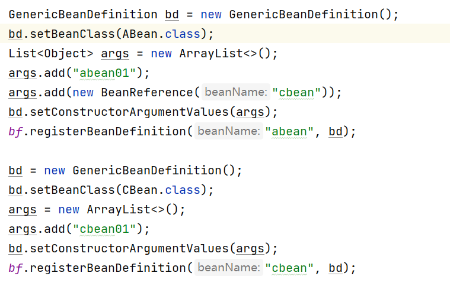
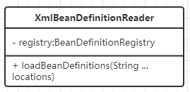
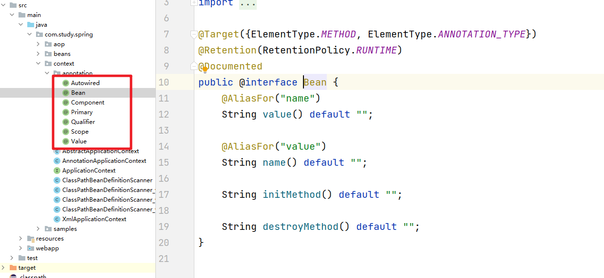
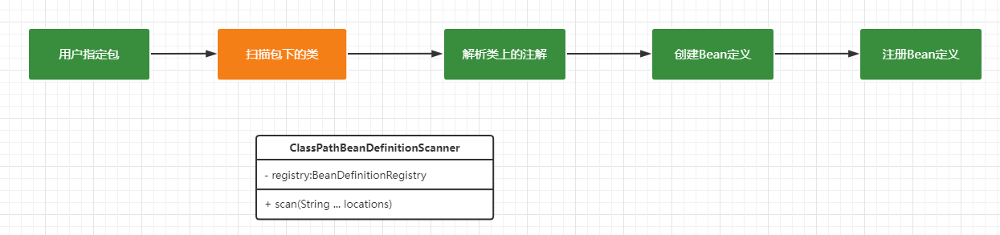
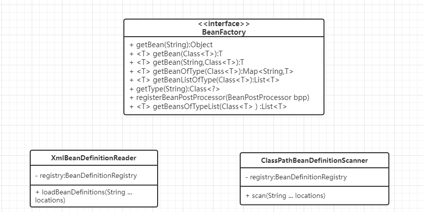
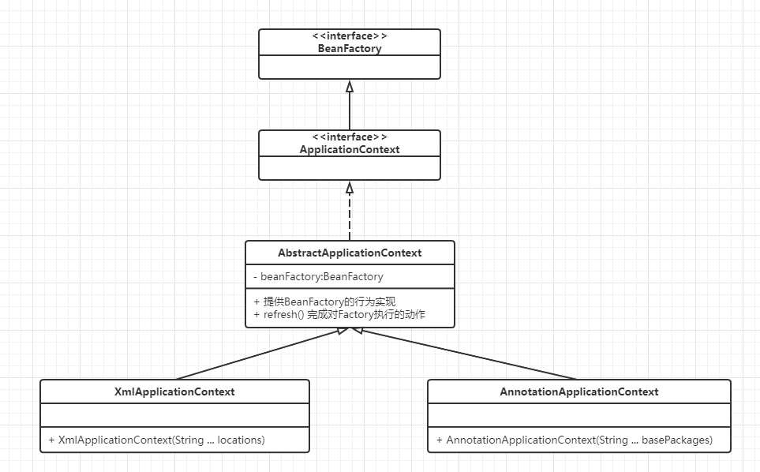

# Spring（四）：手写Bean配置

## Bean定义配置分析
我们前面实现了手写IoC和AOP的功能，但是我们在使用的时候发现我们的调用代码还是非常的繁琐，会给应用者很不好的体验。



上面的代码很直观的看到重复代码很多，要用户设置的内容也很多，低效而且容易出错，这时我们可以看看在Spring中是怎么处理的呢？

**一种是通过XML的配置文件方式**

```xml
<?xml version="1.0" encoding="UTF-8"?>
<beans>
    <bean id="abean" class="com.study.spring.samples.ABean">
        <constructor-arg type="String" value="abean01" />
        <constructor-arg ref="cbean" />
    </bean>

    <bean id="cbean" class="com.study.spring.samples.CBean">
        <constructor-arg type="String" value="cbean01" />
    </bean>
</beans>
```


**一种是通过注解的方式来处理**

```java
@Component
public class AController{

    @Autowired
    private Acc ac;
}
```

### XML方式实现

基于XML方式实现我们需要什么操作呢？
- 定义XML规范
- 要写代码来解析XML，完成Bean定义的注册

### 注解方式实现

基于注解方式实现，我们需要做什么操作呢？
- 定义一套注解
- 要写代码来扫描、解析注解、完成Bean定义注册


## Bean定义配置实现

### XML方式设计

xml方式的流程如下：


我们可以自己写一个解析器，专门来解析对应的xml文件




### 注解方式设计

#### 定义相关的注解
然后我们看看需要定义的注解有哪些？
* 类要不要配置为Bean       @Component
* BeanName Scope和Primary   @Scope  @Primary
* 工厂方法  工厂Bean  @Bean
* 初始化方法、销毁方法 @PostConstruct @PreDestory
* 构造参数依赖 @Autowired @Value
* 属性依赖  @Qualifier




#### 臊面解析注册操作
我们定义了相关注解后，谁来实现扫描注解、解析注解并完成Bean定义注册呢


先来看如何实现扫描操作



实现的逻辑应该是递归找出包目录下的所有的.class文件。

```java
public void scan(String... basePackages) throws Throwable {
    if (basePackages != null && basePackages.length > 0) {
        for (String p : basePackages) {
    /*
      1 递归扫描包目录下的.class文件
      2 组合包路径+class文件名 得到全限定类名
      3 ClassLoad.load("类名") 得到 Class 对象
      4 解析Class上的注解，获得Bean定义信息，注册Bean定义
      */

            //1 递归扫描包目录下的.class文件
            Set<File> classFiles = this.doScan(p);
            //2 得到Class对象，并解析注解、注册Bean定义
            this.readAndRegisterBeanDefintion(classFiles);
        }
    }
}
```

然后看看如何来解析类注解


```java
private void readAndRegisterBeanDefintion(Set<File> classFiles) throws BeanDefinitionRegistException {
    for (File classFile : classFiles) {
        String className = getClassNameFromFile(classFile);
        try {
            //加载类
            Class<?> clazz = this.getClass().getClassLoader().loadClass(className);
            Component component = clazz.getAnnotation(Component.class);
            if (component != null) {// 标注了@Component注解
                String beanName = component.value();
                if (StringUtils.isBlank(beanName)) {
                    beanName = this.generateBeanName(clazz);
                }
                GenericBeanDefinition bd = new GenericBeanDefinition();
                bd.setBeanClass(clazz);

                //处理Scope
                Scope scope = clazz.getAnnotation(Scope.class);
                if (scope != null) {
                    bd.setScope(scope.value());
                }
                //处理primary
                Primary primary = clazz.getAnnotation(Primary.class);
                if (primary != null) {
                    bd.setPrimary(true);
                }

                // 处理构造方法，在构造方法上找@Autowired注解，如有，将这个构造方法set到bd;
                this.handleConstructor(clazz, bd);

                //处理方法上的注解（找出初始化、销毁、工厂方法）
                this.handleMethod(clazz, bd, beanName);

                // 处理属性依赖
                this.handlePropertyDi(clazz, bd);

                // 注册bean定义
                this.registry.registerBeanDefinition(beanName, bd);
            }
        } catch (ClassNotFoundException e) {
            e.printStackTrace();
        }
    }
}
```

### ApplicationContext
通过上面的设计，我们可以实现注解的方式来定义，但是给用户的整体体验还是不是很好，这时我们可以通过外观模式，为框架定义一个更简单的统一使用界面。



组合为：




