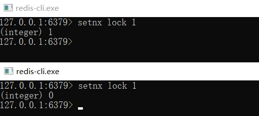
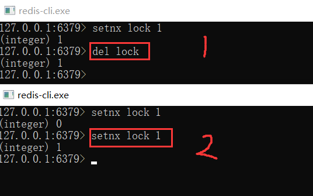
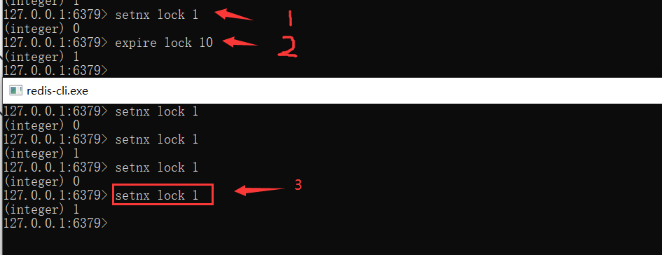
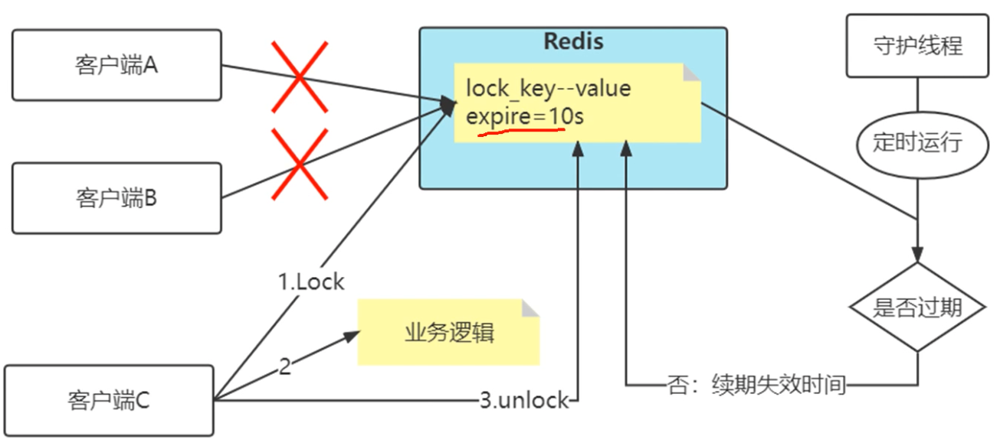
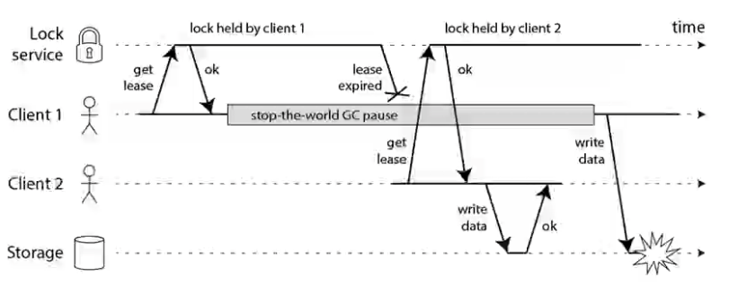
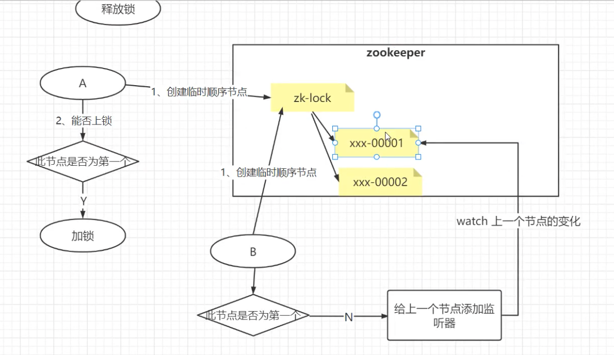

# 分布式锁

## 锁的业务场景

**为什么要加锁**

> 多线程操作共享资源时，会出现不安全的情况。


**单机锁的类型**


**分布式场景中该如何解决**

## 分布式锁的类型
- MySQL 加锁的语句实现
- Redis 实现分布式锁
- Zookeeper 实现分布式锁

### MySQL中实现分布式锁

- 利用MySQL的排它锁

  ```sql
  select * from table where id = xxx for update
  ```

耦合性较高，会导致系统业务一定时间不可用


### Redis分布式锁的实现

在分布式系统中，当有多个客户端需要获取锁时，就需要分布式锁。

#### 最简单的实现

想要实现分布式锁，必须要求 Redis 有「互斥」的能力，我们可以使用 SETNX 命令，这个命令表示SET if Not Exists，即如果 key 不存在，才会设置它的值，否则什么也不做。

两个客户端进程可以执行这个命令，达到互斥，就可以实现一个分布式锁。

客户端 1 申请加锁，加锁成功：

客户端 2 申请加锁，因为它后到达，加锁失败：



此时，加锁成功的客户端，就可以去操作「共享资源」，例如，修改 MySQL 的某一行数据，或者调用一个 API 请求。

操作完成后，还要及时释放锁，给后来者让出操作共享资源的机会。如何释放锁呢？

也很简单，直接使用 DEL 命令删除这个 key 即可，这个逻辑非常简单。



但是，它存在一个很大的问题，当客户端 1 拿到锁后，如果发生下面的场景，就会造成「死锁」：
- 程序处理业务逻辑异常，没及时释放锁
- 进程挂了，没机会释放锁

这时，这个客户端就会一直占用这个锁，而其它客户端就「永远」拿不到这把锁了。怎么解决这个问题呢？

#### 如何避免死锁问题

我们很容易想到的方案是，在申请锁时，给这把锁设置一个「租期」。

在 Redis 中实现时，就是给这个 key 设置一个「过期时间」。这里我们假设，操作共享资源的时间不会超过 10s，那么在加锁时，给这个 key 设置 10s 过期即可：

```
SETNX lock 1    // 加锁
EXPIRE lock 10  // 10s后自动过期
```



这样一来，无论客户端是否异常，这个锁都可以在 10s 后被「自动释放」，其它客户端依旧可以拿到锁。

但现在还是有问题：

现在的操作，加锁、设置过期是 2 条命令，有没有可能只执行了第一条，第二条却「来不及」执行的情况发生呢？例如：

* SETNX 执行成功，执行EXPIRE  时由于网络问题，执行失败
* SETNX 执行成功，Redis 异常宕机，EXPIRE 没有机会执行
* SETNX 执行成功，客户端异常崩溃，EXPIRE也没有机会执行

总之，这两条命令不能保证是原子操作（一起成功），就有潜在的风险导致过期时间设置失败，依旧发生「死锁」问题。

在 Redis 2.6.12 之后，Redis 扩展了 SET 命令的参数，用这一条命令就可以了：

```
SET lock 1 EX 10 NX
```


#### 锁被别人释放了怎么办
上面的命令执行时，每个客户端在释放锁时，都是「无脑」操作，并没有检查这把锁是否还「归自己持有」，所以就会发生释放别人锁的风险，这样的解锁流程，很不「严谨」！如何解决这个问题呢？

解决办法是：客户端在加锁时，设置一个只有自己知道的「唯一标识」进去。

例如，可以是自己的线程 ID，也可以是一个 UUID（随机且唯一），这里我们以UUID 举例：

```
SET lock $uuid EX 20 NX
```

之后，在释放锁时，要先判断这把锁是否还归自己持有，伪代码可以这么写：

```
if redis.get("lock") == $uuid:
    redis.del("lock")
```

这里释放锁使用的是 GET + DEL 两条命令，这时，又会遇到我们前面讲的原子性问题了。这里可以使用lua脚本来解决。

安全释放锁的 Lua 脚本如下：

```
if redis.call("GET",KEYS[1]) == ARGV[1]
then
    return redis.call("DEL",KEYS[1])
else
    return 0
end
```

好了，这样一路优化，整个的加锁、解锁的流程就更「严谨」了。

这里我们先小结一下，基于 Redis 实现的分布式锁，一个严谨的的流程如下：
1. 加锁

  ```
  SET lock_key $unique_id EX $expire_time NX
  ```

2. 操作共享资源›

3. 释放锁：Lua 脚本，先 GET 判断锁是否归属自己，再DEL 释放锁


##### Spring Boot中实现Redis分布式锁

- pom.xml

```xml
<dependency>
    <groupId>redis.clients</groupId>
    <artifactId>jedis</artifactId>
    <version>3.6.3</version>
</dependency>

<!--引入Redis-->
<dependency>
    <groupId>org.springframework.boot</groupId>
    <artifactId>spring-boot-starter-redis</artifactId>
    <version>1.4.2.RELEASE</version>
</dependency>
```

- application.properties

```
# Redis服务器地址
redis.host=127.0.0.1
# Redis服务器连接端口
redis.port=6379
# Redis服务器连接密码（默认为空）
redis.password=null
redis.timeout=30000
# 连接池最大连接数（使用负值表示没有限制）
redis.maxTotal=30
# 连接池中的最大空闲连接
redis.maxIdle=10
redis.numTestsPerEvictionRun=1024
redis.timeBetweenEvictionRunsMillis=30000
redis.minEvictableIdleTimeMillis=1800000
redis.softMinEvictableIdleTimeMillis=10000
# 连接池最大阻塞等待时间（使用负值表示没有限制）
redis.maxWaitMillis=1500
redis.testOnBorrow=true
redis.testWhileIdle=true
redis.blockWhenExhausted=false
redis.JmxEnabled=true
```

- RedisConfig

```java
import org.springframework.beans.factory.annotation.Value;
import org.springframework.context.annotation.Bean;
import org.springframework.context.annotation.Configuration;
import org.springframework.context.annotation.PropertySource;
import redis.clients.jedis.JedisPool;
import redis.clients.jedis.JedisPoolConfig;

@Configuration
@PropertySource("classpath:application.properties")
public class RedisConfig {
    @Value("${redis.host}")
    private String host;

    @Value("${redis.port}")
    private int port;

    @Value("${redis.timeout}")
    private int timeout;

    @Value("${redis.maxIdle}")
    private int maxIdle;

    @Value("${redis.maxWaitMillis}")
    private int maxWaitMillis;

    @Value("${redis.blockWhenExhausted}")
    private Boolean blockWhenExhausted;

    @Value("${redis.JmxEnabled}")
    private Boolean JmxEnabled;

    @Bean
    public JedisPool jedisPoolFactory() {
        JedisPoolConfig jedisPoolConfig = new JedisPoolConfig();
        jedisPoolConfig.setMaxIdle(maxIdle);
        jedisPoolConfig.setMaxWaitMillis(maxWaitMillis);
        // 连接耗尽时是否阻塞, false报异常,true阻塞直到超时, 默认true
        jedisPoolConfig.setBlockWhenExhausted(blockWhenExhausted);
        // 是否启用pool的jmx管理功能, 默认true
        jedisPoolConfig.setJmxEnabled(JmxEnabled);
        JedisPool jedisPool = new JedisPool(jedisPoolConfig, host, port, timeout);
        return jedisPool;
    }
}
```

- RedisDistLock

```java
import org.springframework.beans.factory.annotation.Autowired;
import org.springframework.stereotype.Component;
import redis.clients.jedis.Jedis;
import redis.clients.jedis.JedisPool;
import redis.clients.jedis.params.SetParams;

import java.util.Arrays;
import java.util.UUID;
import java.util.concurrent.TimeUnit;
import java.util.concurrent.locks.Condition;
import java.util.concurrent.locks.Lock;

/**
 * 分布式锁的实现
 */
@Component
public class RedisDistLock implements Lock {

    @Autowired
    private JedisPool jedisPool;

    private final static int LOCK_TIME = 5*1000;  // 失效时间
    private final static String RS_DISTLOCK_NS = "tdln:";  // 加锁的key的前缀
    /*
     if redis.call('get',KEYS[1])==ARGV[1] then
        return redis.call('del', KEYS[1])
    else return 0 end
     */
    // 释放锁的时候，确保原子性，lua脚本；确保 释放锁的线程就是加锁的线程，不能被线程的线程无脑调用释放
    private final static String RELEASE_LOCK_LUA =
            "if redis.call('get',KEYS[1])==ARGV[1] then\n" +
                    "        return redis.call('del', KEYS[1])\n" +
                    "    else return 0 end";
    /*保存每个线程的独有的ID值*/
    private ThreadLocal<String> lockerId = new ThreadLocal<>();

    /*解决锁的重入*/
    private Thread ownerThread;
    private String lockName = "lock";

    public String getLockName() {
        return lockName;
    }

    public void setLockName(String lockName) {
        this.lockName = lockName;
    }

    public Thread getOwnerThread() {
        return ownerThread;
    }

    public void setOwnerThread(Thread ownerThread) { // 加锁成功，就会把抢到锁的线程进行保存
        this.ownerThread = ownerThread;
    }

    @Override
    public void lock() { // redis的分布式锁
        while(!tryLock()){
            try {
                Thread.sleep(100);  // 每隔100ms 都会尝试加锁
            } catch (InterruptedException e) {
                e.printStackTrace();
            }
        }
    }

    @Override
    public void lockInterruptibly() throws InterruptedException {
        throw new UnsupportedOperationException("不支持可中断获取锁！");
    }

    @Override
    public boolean tryLock() {
        Thread t = Thread.currentThread();
        if(ownerThread==t){/*说明本线程持有锁*/
            return true;
        }else if(ownerThread!=null){/*本进程里有其他线程持有分布式锁*/
            return false;
        }
        // Jedis jedis = null;
        Jedis jedis = jedisPool.getResource();
        try {
            String id = UUID.randomUUID().toString();
            SetParams params = new SetParams();
            params.px(LOCK_TIME);
            params.nx();
            synchronized (this){/*线程们，本地抢锁*/
                if((ownerThread==null)&&
                "OK".equals(jedis.set(RS_DISTLOCK_NS+lockName,id,params))){
                    lockerId.set(id);
                    setOwnerThread(t);
                    return true;
                }else{
                    return false;
                }
            }
        } catch (Exception e) {
            throw new RuntimeException("分布式锁尝试加锁失败！");
        } finally {
            jedis.close();
        }
    }

    @Override
    public boolean tryLock(long time, TimeUnit unit) throws InterruptedException {
        throw new UnsupportedOperationException("不支持等待尝试获取锁！");
    }

    @Override
    public void unlock() {
        if(ownerThread!=Thread.currentThread()) {
            throw new RuntimeException("试图释放无所有权的锁！");
        }
        Jedis jedis = null;
        try {
            jedis = jedisPool.getResource();
            Long result = (Long)jedis.eval(RELEASE_LOCK_LUA,
                    Arrays.asList(RS_DISTLOCK_NS+lockName),
                    Arrays.asList(lockerId.get()));
            if(result.longValue()!=0L){
                System.out.println("Redis上的锁已释放！");
            }else{
                System.out.println("Redis上的锁释放失败！");
            }
        } catch (Exception e) {
            throw new RuntimeException("释放锁失败！",e);
        } finally {
            if(jedis!=null) jedis.close();
            lockerId.remove();
            setOwnerThread(null);
            System.out.println("本地锁所有权已释放！");
        }
    }

    @Override
    public Condition newCondition() {
        throw new UnsupportedOperationException("不支持等待通知操作！");
    }
}
```
 

#### 锁的过期时间不好评估怎么办

解决方案：分布式锁加入看门狗



说明：加锁设置过期时间之后会开启一个守护线程（客户端C与之一起启动，客户端C挂，守护线程也会挂；），守护线程会定时检查分布式锁的时间是否过期，若没有过期，则续期失效时间。

##### 看门狗具体实现代码

- RedisDistLockWithDog

```java
import org.springframework.beans.factory.annotation.Autowired;
import org.springframework.stereotype.Component;
import redis.clients.jedis.Jedis;
import redis.clients.jedis.JedisPool;
import redis.clients.jedis.params.SetParams;

import javax.annotation.PreDestroy;
import java.util.Arrays;
import java.util.UUID;
import java.util.concurrent.DelayQueue;
import java.util.concurrent.TimeUnit;
import java.util.concurrent.locks.Condition;
import java.util.concurrent.locks.Lock;

/**
 * 分布式锁，附带看门狗线程的实现:加锁，保持锁1秒
 */
@Component
public class RedisDistLockWithDog implements Lock {

    private final static int LOCK_TIME = 1*1000;
    private final static String LOCK_TIME_STR = String.valueOf(LOCK_TIME);
    private final static String RS_DISTLOCK_NS = "tdln2:";
    /*
     if redis.call('get',KEYS[1])==ARGV[1] then
        return redis.call('del', KEYS[1])
    else return 0 end
     */
    private final static String RELEASE_LOCK_LUA =
            "if redis.call('get',KEYS[1])==ARGV[1] then\n" +
                    "        return redis.call('del', KEYS[1])\n" +
                    "    else return 0 end";
    /*还有并发问题，考虑ThreadLocal*/
    private ThreadLocal<String> lockerId = new ThreadLocal<>();

    private Thread ownerThread;
    private String lockName = "lock";

    @Autowired
    private JedisPool jedisPool;

    public String getLockName() {
        return lockName;
    }

    public void setLockName(String lockName) {
        this.lockName = lockName;
    }

    public Thread getOwnerThread() {
        return ownerThread;
    }

    public void setOwnerThread(Thread ownerThread) {
        this.ownerThread = ownerThread;
    }

    @Override
    public void lock() {
        while(!tryLock()){
            try {
                Thread.sleep(100);
            } catch (InterruptedException e) {
                e.printStackTrace();
            }
        }
    }

    @Override
    public void lockInterruptibly() throws InterruptedException {
        throw new UnsupportedOperationException("不支持可中断获取锁！");
    }

    @Override
    public boolean tryLock() {
        Thread t=Thread.currentThread();
        /*说明本线程正在持有锁*/
        if(ownerThread==t) {
            return true;
        }else if(ownerThread!=null){/*说明本进程中有别的线程正在持有分布式锁*/
            return false;
        }
        Jedis jedis = null;
        try {
            jedis = jedisPool.getResource();
            /*每一个锁的持有人都分配一个唯一的id，也可采用snowflake算法*/
            String id = UUID.randomUUID().toString();

            SetParams params = new SetParams();
            params.px(LOCK_TIME); //加锁时间1s
            params.nx();
            synchronized (this){
                if ((ownerThread==null)&&
                        "OK".equals(jedis.set(RS_DISTLOCK_NS+lockName,id,params))) {
                    lockerId.set(id);
                    setOwnerThread(t);
                    if(expireThread == null){//看门狗线程启动
                        expireThread = new Thread(new ExpireTask(),"expireThread");
                        expireThread.setDaemon(true);
                        expireThread.start();
                    }
                    //往延迟阻塞队列中加入元素（让看门口可以在过期之前一点点的时间去做锁的续期）
                    delayDog.add(new ItemVo<>((int)LOCK_TIME,new LockItem(lockName,id)));
                    System.out.println(Thread.currentThread().getName()+"已获得锁----");
                    return true;
                }else{
                    System.out.println(Thread.currentThread().getName()+"无法获得锁----");
                    return false;
                }
            }
        } catch (Exception e) {
            throw new RuntimeException("分布式锁尝试加锁失败！",e);
        } finally {
            jedis.close();
        }
    }

    @Override
    public boolean tryLock(long time, TimeUnit unit) throws InterruptedException {
        throw new UnsupportedOperationException("不支持等待尝试获取锁！");
    }

    @Override
    public void unlock() {
        if(ownerThread!=Thread.currentThread()) {
            throw new RuntimeException("试图释放无所有权的锁！");
        }
        Jedis jedis = null;
        try {
            jedis = jedisPool.getResource();
            Long result = (Long)jedis.eval(RELEASE_LOCK_LUA,
                    Arrays.asList(RS_DISTLOCK_NS+lockName),
                    Arrays.asList(lockerId.get()));
            System.out.println(result);
            if(result.longValue()!=0L){
                System.out.println("Redis上的锁已释放！");
            }else{
                System.out.println("Redis上的锁释放失败！");
            }
        } catch (Exception e) {
            throw new RuntimeException("释放锁失败！",e);
        } finally {
            if(jedis!=null) jedis.close();
            lockerId.remove();
            setOwnerThread(null);
        }
    }

    @Override
    public Condition newCondition() {
        throw new UnsupportedOperationException("不支持等待通知操作！");
    }

    /*看门狗线程*/
    private Thread expireThread;
    //通过delayDog 避免无谓的轮询，减少看门狗线程的轮序次数   阻塞延迟队列   刷1  没有刷2
    private static DelayQueue<ItemVo<LockItem>> delayDog = new DelayQueue<>();
    //续锁逻辑：判断是持有锁的线程才能续锁
    private final static String DELAY_LOCK_LUA =
            "if redis.call('get',KEYS[1])==ARGV[1] then\n" +
                    "        return redis.call('pexpire', KEYS[1],ARGV[2])\n" +
                    "    else return 0 end";
    private class ExpireTask implements Runnable{

        @Override
        public void run() {
            System.out.println("看门狗线程已启动......");
            while(!Thread.currentThread().isInterrupted()) {
                try {
                    LockItem lockItem = delayDog.take().getData();//只有元素快到期了才能take到  0.9s
                    Jedis jedis = null;
                    try {
                        jedis = jedisPool.getResource();
                        Long result = (Long)jedis.eval(DELAY_LOCK_LUA,
                                Arrays.asList(RS_DISTLOCK_NS+lockItem.getKey ()),
                                Arrays.asList(lockItem.getValue(),LOCK_TIME_STR));
                        if(result.longValue()==0L){
                            System.out.println("Redis上的锁已释放，无需续期！");
                        }else{
                            delayDog.add(new ItemVo<>((int)LOCK_TIME,
                                    new LockItem(lockItem.getKey(),lockItem.getValue())));
                            System.out.println("Redis上的锁已续期:"+LOCK_TIME);
                        }
                    } catch (Exception e) {
                        throw new RuntimeException("锁续期失败！",e);
                    } finally {
                        if(jedis!=null) jedis.close();
                    }
                } catch (InterruptedException e) {
                    System.out.println("看门狗线程被中断");
                    break;
                }
            }
            System.out.println("看门狗线程准备关闭......");
        }
    }

//    @PostConstruct
//    public void initExpireThread(){
//
//    }

    @PreDestroy
    public void closeExpireThread(){
        if(null!=expireThread){
            expireThread.interrupt();
        }
    }
}
```

- ItemVo

```java
import java.util.concurrent.Delayed;
import java.util.concurrent.TimeUnit;

/**
 *
 *类说明：存放到延迟队列的元素，比标准的delay的实现要提前一点时间
 */
public class ItemVo<T> implements Delayed{

    /*到期时刻  20:00:35,234*/
    private long activeTime;
    /*业务数据，泛型*/
    private T data;

	/*传入的数值代表过期的时长，单位毫秒，需要乘1000转换为毫秒和到期时间
	* 同时提前100毫秒续期,具体的时间可以自己决定*/
	public ItemVo(long expirationTime, T data) {
		super();
		this.activeTime = expirationTime+System.currentTimeMillis()-100;
		this.data = data;
	}

	public long getActiveTime() {
		return activeTime;
	}

	public T getData() {
		return data;
	}
	
	/**
	 * 返回元素到激活时刻的剩余时长
	 */
	public long getDelay(TimeUnit unit) {
		long d = unit.convert(this.activeTime
						- System.currentTimeMillis(),unit);
		return d;
	}

	/**按剩余时长排序*/
	public int compareTo(Delayed o) {
        long d = (getDelay(TimeUnit.MILLISECONDS)
				-o.getDelay(TimeUnit.MILLISECONDS));
        if (d==0){
        	return 0;
		}else{
        	if (d<0){
        		return -1;
			}else{
        		return  1;
			}
		}
	}
}
```

- LockItem

```java
/**
 *
 *类说明：Redis的key-value结构
 */
public class LockItem {
    private final String key;
    private final String value;

    public LockItem(String key, String value) {
        this.key = key;
        this.value = value;
    }

    public String getKey() {
        return key;
    }

    public String getValue() {
        return value;
    }
}
```


##### redisson实现带看门狗的分布式锁

- pom.xml

```xml
<dependency>
    <groupId>org.redisson</groupId>
    <artifactId>redisson</artifactId>
    <version>3.12.3</version>
</dependency>
```

- MyRedissionConfig

```java
import org.redisson.Redisson;
import org.redisson.api.RedissonClient;
import org.redisson.config.Config;
import org.springframework.context.annotation.Bean;
import org.springframework.context.annotation.Configuration;

@Configuration
public class MyRedissionConfig {
    @Bean(destroyMethod = "shutdown")
    public RedissonClient redisson(){
        //1、创建配置
        Config config = new Config();
        config.useSingleServer().setAddress("redis://127.0.0.1:6379");
        //2、根据config配置创建出RedissonClient的实例
        RedissonClient redissonClient= Redisson.create(config);
        return redissonClient;
    }
}
```

- 业务中使用

```java
@Autowired
private RedissonClient redissonClient;


....
RLock lock = redissonClient.getLock("RD-LOCK");
try {
  lock.lock(1, TimeUnit.SECONDS);

  ...
} finally {
  lock.unlock();
}
```

以上描述的是单个Redis中实现分布式锁，会存在单点故障问题；

解决方法：
1. 主从+哨兵 的方式部署redis（主从切换会丢失锁，概率小）
2. 多个redis，类似集群的方案解决

#### 多个Redis集群下的分布式锁

##### 红锁RedLock
- 部署时只部署主库，主库部署多个（最好5个，这5个彼此之间是没有任何关系的）

**RedLock实现的整体流程**
1. 客户端先获取（当前时间戳T1）
2. 客户端依次向这5台Redis实例（非集群）发起加锁请求
3. 如果 >=3个（大多数）成功，（当前时间戳T2 - T1） < 锁的过期时间则加锁成功
4. 加锁成功，去操作共享资源
5. 加锁失败/释放锁，向5台Redis发起释放锁请求

说明：
- （>=3个）是为了提高容错率；
- 计算累计耗时是为了确保在锁过期之前能够成功加锁，过期了加锁就没有意义了；

**RedLock的NPC问题**
- N：Network Delay，网络延迟；
- P：Proess Pause，进程暂停（GC）；
- C：Clock Drift，时钟漂移；




说明：
- N和P的问题通过时间戳可以解决；
- 时钟漂移很难解决；
- RedLock性能问题（尽量不要用RedLock


### Zookeeper中实现分布式锁
Zookeeper中依靠节点类型当中的临时序号来实现分布式锁的。


#### Zookeeper实现分布式锁的原理分析

**Zookeeper实现分布式锁**
1. 争抢锁，只有一个人获得锁（文件系统决定）；
2. 获得锁的线程出问题（死锁）：临时节点处理；
3. 获得锁的线程-> 释放锁；
4. 锁释放了，删除，别人怎么知道？
   - 主动轮询：弊端--延迟，Zk压力大；
   - watch机制：解决延迟问题；应用太多时也会有压力；
   - 序号节点->最小的获得锁；watch前一个，成本相对最低




**实现**

- pom.xml

```xml
<!--Curator-->
<dependency>
    <groupId>org.apache.curator</groupId>
    <artifactId>curator-framework</artifactId>
    <version>5.2.1</version>
</dependency>
<dependency>
    <groupId>org.apache.curator</groupId>
    <artifactId>curator-recipes</artifactId>
    <version>5.2.1</version>
</dependency>
<!--Zookeeper-->
<dependency>
    <groupId>org.apache.zookeeper</groupId>
    <artifactId>zookeeper</artifactId>
    <version>3.8.0</version>
</dependency>
```

- CuratorConfig

```java
import org.apache.curator.RetryPolicy;
import org.apache.curator.framework.CuratorFramework;
import org.apache.curator.framework.CuratorFrameworkFactory;
import org.apache.curator.retry.ExponentialBackoffRetry;
import org.springframework.beans.factory.annotation.Autowired;
import org.springframework.context.annotation.Bean;
import org.springframework.context.annotation.Configuration;

@Configuration
public class CuratorConfig {
    @Autowired
    WrapperZK wrapperZK;
    //这里返回一个zk的客户端的bean
    @Bean
    public CuratorFramework curatorFramework(){
        RetryPolicy retryPolicy = new ExponentialBackoffRetry(wrapperZK.getElapsedTimeMs(), wrapperZK.getRetryCount());
        CuratorFramework client= CuratorFrameworkFactory.newClient(wrapperZK.getConnectString(),
                wrapperZK.getSessionTimeoutMs(),
                wrapperZK.getConnectionTimeoutMs(),
                retryPolicy);
        client.start();
        return client;
    }
}
```

- WrapperZK

```java
import lombok.Data;
import org.springframework.boot.context.properties.ConfigurationProperties;
import org.springframework.stereotype.Component;

@Data
@Component
@ConfigurationProperties(prefix = "curator")
public class WrapperZK {
    private int retryCount; // 重试次数
    private int elapsedTimeMs; // 重试间隔时间
    private String connectString; // 连接字符串
    private int sessionTimeoutMs; // 会话超时时间
    private int connectionTimeoutMs; // 连接超时时间
}
```

- application.properties

```
# Zookeeper配置信息
#服务器信息
curator.connectString=127.0.0.1:2181
#重试retryCount次，当会话超时出现后，curator会每间隔elapsedTimeMs毫秒时间重试一次，共重试retryCount次。
curator.retryCount=5
curator.elapsedTimeMs=5000
#会话超时时间设置
curator.sessionTimeoutMs=60000
#连接超时时间
curator.connectionTimeoutMs=5000
```

- 业务中使用

```java
...

@AutoWired
private CuratorFramework curatorFramework;
static InterProcessLock lock;

...
synchronized(this) {
  if(lock == null) {// 多线程安全问题
    lock = new InterProcessMutex(curatorFramework, "/locks2");
  } 
}

...

try {
  // zookeeper实现的分布式锁（临时、序号节点，包括监听机制）
  if(lock.acquire(5, TimeUnit.SECONDS)) {

    ...

  } else {
    // 没拿到分布式锁
  }
} catch () {

} finally {
  try{
    lock.release();// 释放锁
  } catch (Exception e) {
    e.printStackTrace();
  }
  
}
```
