## 多线程与高并发（一）：基础概念

===========================基础部分=============================
### 1. 线程基本内容
#### 1.1 程序、进程与线程
- 程序：Program，是一个指令的集合；
- 进程：Process，（正在执行中的程序）是一个静态的概念；
  - 进程是程序的一次静态执行过程，占用特定的地址空间；
  - 每个进程都是独立的，由3部分组成：cpu、data、code；
  - 缺点：内存的浪费、CPU的负担；
- 线程：是进程中一个“单一的连续控制流程”（a single sThread, equential flow of control）/执行路径
  - 线程又被称为轻量级进程（lightweight process）
  - Threads run at the same time, independently of one another
  - 一个进程可拥有多个并行的（concurrent）线程；
  - 一个进程中的线程共享相同的内存单元/内存地址空间 -> 可以访问相同的变量和对象，而且它们从同一堆中分配对象 -> 通信、数据交换、同步操作；
  - 由于线程间的通信是在同一地址空间上进行的，所以不需要额外的通信机制，这就使得通信更简便而且信息传递的速度也更快；

  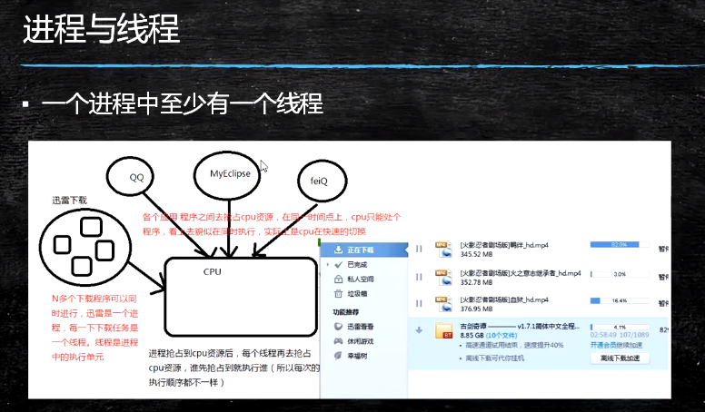

**Javac与Java**
- Java虚拟机启动的时候会有一个进程java.exe，该进程中至少有一个线程，在负责java程序的执行。而这个线程运行的代码存在于main方法中，该线程称之为主线程。
- 一个线程的线程共享代码和数据空间；
- 线程结束，进程未必结束，但进程结束，线程一定结束；
- 进程中包含线程，线程是进程的一部分；

**线程与进程的区别**

区别 | 进程 | 线程
---|---|---
根本区别 | 作为资源分配的单位 | 调度和执行的单位
开销 | 每个进程都有独立的代码和数据空间（进程上下文），进程间的切换会有较大的开销； | 线程可以看成是轻量级的进程，同一类线程共享代码和数据空间，每个线程有独立的运行栈和程序计数器（PC），线程切换的开销小。
所处环境 | 在操作系统中能同时运行多个任务（程序） | 在同一应用程序中有多个顺序流同时执行
分配内存 | 系统在运行的时候会为每个进程分配不同的内存区域 | 除了CPU之外，不会为线程分配内存（线程所使用的资源是他所属的进程的资源），线程组只能共享资源。
包含关系 | 没有线程的进程是可以被看作单线程的，如果一个进程内拥有多个线程，则执行过程不是一条线的，而是多条线（线程）共同完成的。 | 线程是进程的一部分，所以线程有的时候被称为是轻权进程或者轻量级进程

#### 1.2 线程的创建和启动

**Java中实现多线程（一）**
- 在Java中负责线程的这个功能的是Java.lang.Thread这个类；
- 可以通过创建Thread的实例来创建新的线程；
- 每个线程都是通过某个特定Thread对象所对应的方法run()来完成其操作的，方法run()称为线程体；
- 通过调用Thread类的start()方法来启动一个线程；


**创建线程的方式**
- 继承Thread类
  - 步骤：
    - 继承Thread类、重写run方法、创建对象，调用start()方法启用线程；

      ```java
      package com.lele.multithread;

      /**
       * @author: lele
       * @date: 2021/6/23 6:49
       * @description:
       *
       * 实现多线程的时候：
       *      1.需要继承Thread类；
       *      2.必须重写run方法，指的是核心执行的逻辑；
       *      3.线程在启动的时候不要直接调用run方法，而是要通过start()方法来进行调用；
       *      4.每次运行相同的代码，出来的结果可能不一样，原因在于多线程谁先抢占资源，无法进行认为控制；
       */
      public class ThreadDemo01 extends Thread {
          public static void main(String[] args) {
              // 创建对象，就创建好一个线程
              ThreadDemo01 d = new ThreadDemo01();
              //启动线程使用start方法
              d.start();
              for (int i = 0; i < 5; i++) {
                  System.out.println(Thread.currentThread().getName()+"==========="+i);
              }
          }

          public void run() {
              for (int i = 0; i < 10; i++) {
                  System.out.println(Thread.currentThread().getName()+"--------"+i);
              }
          }
      }
      ```

- 实现Runnable接口
  - 步骤：
    - 实现Runnable接口、重写run方法、创建对象，调用start()方法；

    ```java
    package com.lele.multithread;

    /**
     * @author: lele
     * @date: 2021/6/23 7:17
     * @description:
     *
     * 第二种实现方式：使用了代理设计模式
     *      1.实现Runnable接口
     *      2.重写run方法
     *      3.创建Thread对象，将刚刚创建好的runnable的子类实现作为thread的构造参数；
     *      4.通过thread.start()进行启动；
     * 推荐使用第二种方式：
            1.java是单继承，将继承关系留给最需要的类
            2.使用Runnable接口之后不需要给共享变量添加static关键字，每次创建一个对象，作为共享对象即可；
     */
    public class RunnableDemo01 implements Runnable {

        @Override
        public void run() {
            for (int i = 0; i < 10; i++) {
                System.out.println(Thread.currentThread().getName()+"---------"+i);
            }
        }

        public static void main(String[] args) {

            RunnableDemo01 runnableDemo01 = new RunnableDemo01();
            Thread thread = new Thread(runnableDemo01);
            thread.start();

            for (int i = 0; i < 5; i++) {
                System.out.println(Thread.currentThread().getName()+"=========="+i);
            }

        }
    }

    ```

**Java中实现多线程（二）**
- 继承Thread类的方式的缺点：如果我们的类已经从一个类继承（如小程序必须继承自Applet类），则无法再继承Thread类；
- 通过Runnable接口实现多线程的优点：
  - 可以同时实现继承。实现Runnable接口方式要通用一些；
  - 避免单继承
  - 方便共享资源 同一份资源 多个代理访问

**线程的代理设计模式**

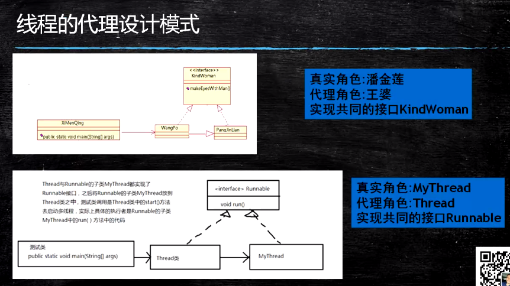

- 案例

  ```java
  package com.lele.proxy;

  /**
   * @author: lele
   * @date: 2021/6/28 6:56
   * @description:
   */
  public interface KindWomen {

      // 抛媚眼
      public void makeEyesWithMen();

      public void playWithMen();
  }
  ```

  ```java
  package com.lele.proxy;

  /**
   * @author: lele
   * @date: 2021/6/28 6:57
   * @description: 代理人
   */
  public class WangPo implements KindWomen {

      private KindWomen kindWomen;

      public WangPo() {
          this.kindWomen = new PanJinLian();
      }

      public WangPo(KindWomen kindWomen) {
          this.kindWomen = kindWomen;
      }

      @Override
      public void makeEyesWithMen() {
          this.kindWomen.makeEyesWithMen();
      }

      @Override
      public void playWithMen() {
          this.kindWomen.playWithMen();
      }
  }

  ```

  ```java
  package com.lele.proxy;

  import java.nio.file.WatchEvent;

  /**
   * @author: lele
   * @date: 2021/6/28 7:01
   * @description: 被代理人
   */
  public class PanJinLian implements KindWomen {

      @Override
      public void makeEyesWithMen() {
          System.out.println("潘金莲在抛媚眼");
      }

      @Override
      public void playWithMen() {
          System.out.println("潘金莲。。。");
      }
  }
  ```

  ```java
  package com.lele.proxy;

  /**
   * @author: lele
   * @date: 2021/6/28 7:06
   * @description:
   */
  public class JiaShi implements KindWomen {

      @Override
      public void makeEyesWithMen() {
          System.out.println("贾氏在抛媚眼");
      }

      @Override
      public void playWithMen() {
          System.out.println("贾氏。。。");
      }
  }
  ```

  ```java
  package com.lele.proxy;

  /**
   * @author: lele
   * @date: 2021/6/28 7:03
   * @description:
   */
  public class XiMenQing {

      public static void main(String[] args) {

  //        WangPo wangPo = new WangPo();
  //        wangPo.playWithMen();
  //        wangPo.makeEyesWithMen();

          JiaShi jiashi = new JiaShi();
          WangPo wangPo = new WangPo(jiashi);
          wangPo.makeEyesWithMen();
          wangPo.playWithMen();
      }
  }
  ```


#### 1.3 线程的生命周期

**线程状态**
- 创建（新生状态）：当创建好当前线程对象之后，没有启动之前（调用start方法之前）；
  - 用new关键字建立一个线程后，该线程对象就处于新生状态；
  - 处于新生状态的线程有自己的内存空间，通过调用start()方法进入就绪状态；
- 就绪状态：准备开始执行，并没有执行，表示调用start方法之后；
  - 当对应的线程创建完成且调用start方法之后，所有线程会添加到一个就绪队列中，所有的线程同时去抢占CPU的资源；
  - 处于就绪状态的线程具备了运行条件，但还没分配到CPU，处于线程就绪队列，等待系统为其分配CPU；
  - 当系统选定一个等待执行的线程后，它就会从就绪状态进入执行状态，该动作称为“CPU调度”。
- 运行状态：当当前进程获取到cpu资源之后，就绪队列中的所有线程会去抢占cpu的资源，谁先抢占到谁先执行，在执行的过程中就叫做运行状态；
  - 抢占到cpu资源，执行代码逻辑开始；
  - 在运行状态的线程执行自己的run方法中代码，直到 等待某资源而阻塞 或 完成任何而死亡；
  - 如果在给定的时间片内没有执行结束，就会被系统给换下来回到等待执行状态；
- 阻塞状态：在程序运行过程中，发生某些异常情况，导致当前线程无法再顺利执行下去，此时会进入阻塞状态，进入阻塞状态的原因消除之后，所有的阻塞队列会再次进入到就绪状态中，随机抢占cpu的资源，等待执行；
  - 处于运行状态的线程在某些情况下，如执行了sleep方法，或等待I/O设备等资源，将让出CPU并暂时停止自己运行，进入阻塞状态。
  - 在阻塞状态的线程不能进入就绪队列，只有当引起阻塞的原因消除时，如睡眠时间已到，或等待的I/O设备空闲下来，线程便转入就绪状态，重新到就绪队列中排队等待，被系统选中后从原来停止的位置开始继续执行。
- 死亡状态：当运行中的线程正常执行完所有的代码逻辑或者因为异常情况导致程序结束叫做死亡状态；
  - 死亡状态是线程生命周期中的最后一个阶段。线程死亡的原因有三个，一个是正常运行的线程完成了它的全部工作；另外一个是线程被强制性停止，如通过stop方法来终止一个线程【不推荐使用】；三是线程抛出来未捕获的异常。

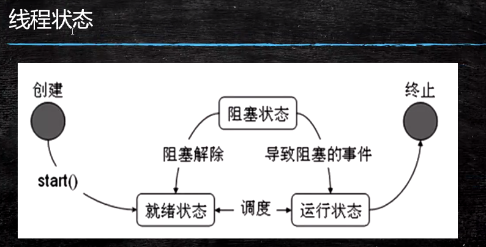

**线程操作的相关方法**

序号 | 方法名称 | 描述
---|---|---
1 | public static Thread currentThread() | 返回目前正在执行的线程
2 | public final String getName() | 返回线程的名称
3 | public final int getPriority() | 返回线程的优先级
4 | public final void setPriority(String name) | 设定线程名称
5 | public final boolean isAlive() | 判断线程是否在活动，如果是，返回true，否则返回false
6 | public final void join() | 调用该方法的线程强制执行，其他线程处于阻塞状态，该线程执行完毕后，其他线程再执行
7 | public static void sleep(long mills) | 使用当前正在执行的线程休眠mills秒，线程处于阻塞状态
8 | public static void yield() | 当前正在执行的线程暂停一次，允许其他线程执行，不阻塞，线程进入就绪状态；如果没有其他等待执行的线程，这个时候当前线程就会马上恢复执行。
9 | public final void stop() | 强迫线程停止执行，已过时。不推荐使用

```java
package com.lele.multithread;

/**
 * @author: lele
 * @date: 2021/6/29 6:57
 * @description:
 *
 * 介绍线程类的Api方法
 */
public class ThreadApiDemo implements Runnable {

    public static void main(String[] args) {
        // 获取当前线程类的对象
        Thread thread = Thread.currentThread();
        // 获取当前线程的名称
        System.out.println(thread.getName());
        // 获取线程的id
        System.out.println(thread.getId());
        // 获取线程的优先级,在一般系统中范围是0-10的值，如果没有经过设置的话，就是默认值5，有些系统是0-100
        System.out.println(thread.getPriority());
        // 设置线程池的优先级
        /**
         * 优先级越高(数值大）一定越先执行嘛？不是，只是优先执行的概率比较大而已
         */
        thread.setPriority(10);
        System.out.println(thread.getPriority());

        ThreadApiDemo threadApiDemo = new ThreadApiDemo();
        Thread t1 = new Thread(threadApiDemo);
        System.out.println(t1.isAlive());
        t1.start();
        System.out.println(t1.isAlive());
        System.out.println(t1.getPriority());
        System.out.println(t1.isAlive());

//        for(int i = 0; i < 5; i++) {
//            System.out.println(Thread.currentThread().getName() + "--------" +i);
//        }
    }

    @Override
    public void run() {
//        for(int i = 0; i < 5; i++) {
//            System.out.println(Thread.currentThread().getName() + "--------" +i);
//        }
    }
}
```

- 注意：
  - 在多线程的时候，可以实现唤醒和等待的过程，但是唤醒和等待操作对应的不是thread，而是我们设置的共享对象或者共享变量；

**阻塞状态（sleep/yield/join方法）**
- 有三种方法可以暂停Thread执行
  - sleep:不会释放锁，Sleep时别的线程也不可以访问锁定对象；
  - yield：让出CPU的使用权，从运行态直接进入就绪态。让CPU重新挑选哪一个线程进入运行状态。
  - join：当某个线程等待另一个线程执行结束后，才继续执行时，使调用该方法的线程在此之前执行完毕，也就是等待调用该方法的线程执行完毕后再往下继续执行。

### 2. 线程同步

  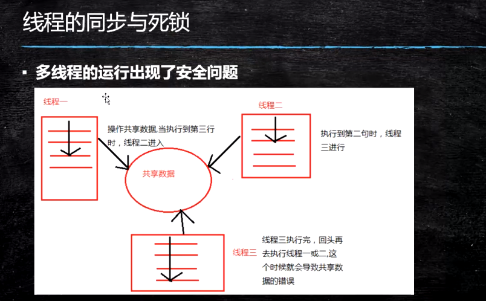

**使用同步解决线程的安全性问题**
- 同步的前提：
  - 必须有两个或两个以上的线程；
  - 必须是多个线程使用同一资源；
  - 必须保证同步中只能有一个线程在运行；

**解决多线程安全性问题的方法**
- 同步代码块

```java
package com.lele.multithread.ticket;

/**
 * @author: lele
 * @date: 2021/7/3 7:13
 * @description:
 *
 * 多线程并发访问的时候会出现数据安全问题：
 *      解决方式：
 *          1、同步代码块
 *              synchronize（共享资源、共享对象，需要是Object的子类）{具体执行的代码块}
 */
public class TicketRunnable2 implements Runnable {

    private int ticket = 5;

    @Override
    public void run() {
        for (int i = 0; i < 100; i++) {
            try {
                Thread.sleep(200);
            } catch (InterruptedException e) {
                e.printStackTrace();
            }

            synchronized (this) {
                if (ticket > 0) {
                    System.out.println(Thread.currentThread().getName()+"正在出售第"+(ticket--)+"张票");
                }
            }
        }
    }

    public static void main(String[] args) {
        TicketRunnable2 ticket = new TicketRunnable2();
        Thread t1 = new Thread(ticket, "A");
        Thread t2 = new Thread(ticket, "B");
        Thread t3 = new Thread(ticket, "C");
        Thread t4 = new Thread(ticket, "D");

        t1.start();
        t2.start();
        t3.start();
        t4.start();
    }
}
```

- 同步方法

```java
package com.lele.multithread.ticket;

/**
 * @author: lele
 * @date: 2021/7/3 7:13
 * @description:
 *
 * 多线程并发访问的时候会出现数据安全问题：
 *      解决方式：
 *          1、同步代码块
 *              synchronize（共享资源、共享对象，需要是Object的子类）{具体执行的代码块}
 *          2、同步方法
 *              将核心的代码逻辑定义成一个方法，使用synchronize关键字进行修饰，此时不需要指定共享对象
 *
 */
public class TicketRunnable3 implements Runnable {

    private int ticket = 5;

    public static void main(String[] args) {
        TicketRunnable3 ticket = new TicketRunnable3();
        Thread t1 = new Thread(ticket, "A");
        Thread t2 = new Thread(ticket, "B");
        Thread t3 = new Thread(ticket, "C");
        Thread t4 = new Thread(ticket, "D");

        t1.start();
        t2.start();
        t3.start();
        t4.start();

    }

    @Override
    public void run() {
        for (int i = 0; i < 100; i++) {
            try {
                Thread.sleep(200);
            } catch (InterruptedException e) {
                e.printStackTrace();
            }
            this.sale();
        }
    }

    /**
     * 使用同步方法解决多线程数据安全的问题
     */
    public synchronized void sale() {

//        synchronized (this) {
            if (ticket > 0) {
                System.out.println(Thread.currentThread().getName()+"正在出售第"+(ticket--)+"张票");
            }
//        }
    }
}
```

**线程同步小结**
- 同步监视器
  - synchronized(obj){}中的obj称为同步监视器；
  - 同步代码块中同步监视器可以是任何对象，但是推荐使用共享资源作为同步监视器；
  - 同步方法中无需指定同步监视器，因为同步方法的监视器是this，也就是对象本身；
- 同步监视器的执行过程
  - 第一个线程访问，锁定同步监视器，执行其中代码；
  - 第二个线程访问，发现同步监视器被锁定，无法访问；
  - 第一个线程访问完毕，解锁同步监视器；
  - 第二个线程访问，发现同步监视器未锁，锁定并访问；

#### 2.1 死锁

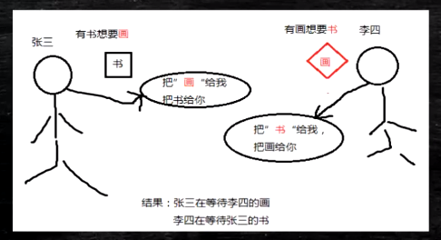

- 同步可以保证资源共享操作的正确性，但是过多同步也会产生死锁；
- 死锁一般情况下表示互相等待，是程序运行时出现的一种问题；

**线程的生产者与消费者**


- Goods
  ```java
  package com.lele.pc4;

  /**
   * @author: lele
   * @date: 2021/7/6 7:10
   * @description:
   */
  public class Goods {

      private String brand;
      private String name;

      public Goods(String brand, String name) {
          this.brand = brand;
          this.name = name;
      }

      public String getBrand() {
          return brand;
      }

      public void setBrand(String brand) {
          this.brand = brand;
      }

      public String getName() {
          return name;
      }

      public void setName(String name) {
          this.name = name;
      }

  }
  ```

- ProducerQueue

  ```java
  package com.lele.pc4;

  import java.util.concurrent.BlockingQueue;

  /**
   * @author: lele
   * @date: 2021/7/9 6:55
   * @description:
   */
  public class ProducerQueue implements Runnable {

      private BlockingQueue<Goods> blockingQueue;

      public ProducerQueue (BlockingQueue blockingQueue) {
          this.blockingQueue = blockingQueue;
      }

      @Override
      public void run() {
          for (int i = 0; i < 10; i++) {
              Goods goods = null;
              if (i%2 == 0) {
                  goods = new Goods("哇哈哈", "矿泉水");
              } else {
                  goods = new Goods("旺仔", "小馒头");
              }
              System.out.println("生产者开始生产商品:"+goods.getBrand()+"--"+goods.getName());
              try {
                  blockingQueue.put(goods);
              } catch (InterruptedException e) {
                  e.printStackTrace();
              }
          }
      }
  }
  ```

- ConsumerQueue

  ```java
  package com.lele.pc4;

  import java.util.concurrent.BlockingQueue;

  /**
   * @author: lele
   * @date: 2021/7/9 6:57
   * @description:
   */
  public class ConsumerQueue implements Runnable {

      private BlockingQueue<Goods> blockingQueue;

      public ConsumerQueue(BlockingQueue blockingQueue) {
          this.blockingQueue = blockingQueue;
      }

      @Override
      public void run() {
          for (int i = 0; i < 10; i++) {
              try {
                  Goods goods = blockingQueue.take();
                  System.out.println("消费者消费的商品是："+goods.getBrand()+"--"+goods.getName());
              } catch (InterruptedException e) {
                  e.printStackTrace();
              }
          }
      }
  }
  ```

- Test

  ```java
  package com.lele.pc4;

  import java.util.concurrent.ArrayBlockingQueue;
  import java.util.concurrent.BlockingQueue;

  /**
   * @author: lele
   * @date: 2021/7/9 7:00
   * @description:
   */
  public class Test {

      public static void main(String[] args) {
          BlockingQueue<Goods> queue = new ArrayBlockingQueue<Goods>(5);
          ProducerQueue producerQueue = new ProducerQueue(queue);
          ConsumerQueue consumerQueue = new ConsumerQueue(queue);
          new Thread(producerQueue).start();
          new Thread(consumerQueue).start();
      }
  }
  ```

### 3. 线程池

#### 3.1 为什么要用线程池
- 在实际使用中，线程是很占用系统资源的，如果对线程管理不善很容易导致系统问题。因此，在大多数并发框架中都会使用线程池来管理线程，使用线程池管理线程主要有如下好处：
  - 使用线程池可以重复利用已有的线程继续执行任务，避免线程在创建和销毁时造成的消耗；
  - 由于没有线程创建和销毁时的消耗，可以提高系统响应速度；
  - 通过线程池可以对线程进行合理的管理，根据系统的承受能力调整可运行线程数量的大小等；

#### 3.2 工作原理

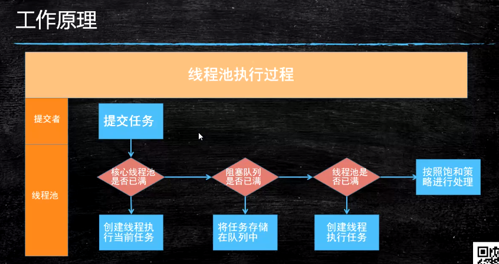

- 线程池执行所提交的任务过程：
  - 先判断线程池中核心线程池所有的线程是否都在执行任务。如果不是，则新创建一个线程执行刚提交的任务，否则，若核心线程池中所有的线程都在执行任务，则进入下一步；
  - 判断当前阻塞队列是否已满，如果未满，则将提交的任务放置在阻塞队列中；否则进入下一步；
  - 判断线程池中所有的线程是否都在执行任务，如果没有，则创建一个新的线程来执行任务，否则，则交给饱和策略进行处理；

**线程池的分类**

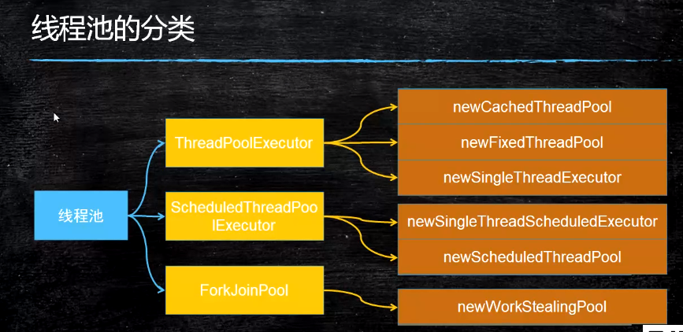

- ThreadPoolExecutor:
  - newCachedThreadPool
    - 创建一个可根据需要创建新线程的线程池，但是在以前构造的线程可用时将重用它们，并在需要时使用提供的ThreadFactory创建新线程；
    - 特征
      - 线程池中数量没有固定，可达到最大值（Integer.MAX_VALUE)；
      - 线程池中的线程可进行缓存重复利用和回收（回收默认时间为1分钟）；
      - 当线程池中，没有可用线程，会重新创建一个线程；

      ```java
      package com.lele.threadpool.demo;

      /**
       * @author: lele
       * @date: 2021/7/10 18:29
       * @description:
       */
      public class Task implements Runnable {

          @Override
          public void run() {
              try {
                  Thread.sleep(1000);
              } catch (InterruptedException e) {
                  e.printStackTrace();
              }
              System.out.println(Thread.currentThread().getName()+" running");
          }
      }
      ```

      ```java
      package com.lele.threadpool.demo;

      import java.util.concurrent.ExecutorService;
      import java.util.concurrent.Executors;

      /**
       * @author: lele
       * @date: 2021/7/10 18:27
       * @description:
       */
      public class CacheThreadPoolDemo {

          public static void main(String[] args) {
              ExecutorService executorService = Executors.newCachedThreadPool();
              for (int i = 0; i < 20; i++) {
                  executorService.execute(new Task());
              }
              executorService.shutdown();
          }
      }
      ```

  - newFixedThreadPool
    - 创建一个可重用固定线程数的线程池，以共享的无界队列方式来运行这些线程，在任意点，在大多数 nThreads 线程会处于处理任务的活动状态，如果在所有线程处于活动状态时提交附加任务，则在有可用线程之前，附加任务将在队列中等待。如果在关闭前的执行期间由于失败而导致任何线程终止，那么一个新线程将代替他执行后续的任务（如果需要）。在某个线程被显示地关闭之前，池中的线程将一直存在。
    - 特征
      - 线程池中的线程处于一定的量，可以很好的控制线程的并发量；
      - 线程可以重复被使用，在显示关闭之前，都将一直存在；
      - 超出一定量的线程被提交的时候需在队列中等待；

      ```java
      package com.lele.threadpool.demo;

      import java.util.concurrent.ExecutorService;
      import java.util.concurrent.Executors;

      /**
       * @author: lele
       * @date: 2021/7/11 10:56
       * @description:
       */
      public class FixedThreadPoolDemo {

          public static void main(String[] args) {
              ExecutorService executorService = Executors.newFixedThreadPool(5);
              for (int i = 0; i < 20; i++) {
                  executorService.execute(new Task());
              }

              executorService.shutdown();
          }
      }
      ```

  - newSingleThreadExecutor
    - 创建一个使用单个 worker 线程的 Executor，以无界队列方式来运行该线程。（注意，如果因为在关闭前的执行期间出现失败而终止了此单个线程，那么如果需要，一个新线程将代替它执行后续的任务）。可保证顺序地执行各个任务，并且在任意给定的时间不会有多个线程是活动的。与其他等效的 newFixedThreadPool(1) 不同，可保证无需重新配置此方法所返回的执行程序即可使用其他的线程。
    - 特征
      - 线程池中最多执行一个线程，之后提交的线程活动将会排在队列中依次执行；

      ```java
      package com.lele.threadpool.demo;

      import java.util.concurrent.ExecutorService;
      import java.util.concurrent.Executors;

      /**
       * @author: lele
       * @date: 2021/7/11 18:58
       * @description:
       */
      public class SingleThreadPoolDemo {

          public static void main(String[] args) {
              ExecutorService executorService = Executors.newSingleThreadExecutor();

              for (int i = 0;i < 20; i++) {
                  executorService.execute(new Task());
              }

              executorService.shutdown();
          }
      }
      ```

- ScheduledThreadPoolExecutor
  - newSingleThreadScheduledExecutor
    - 创建一个单线程执行程序，它可安排在给定延迟后运行命令或者定期执行；
    - 特征
      - 线程池中最多执行1个线程，之后提交的线程活动将会排在队列中依次执行；
      - 可定时或者延迟执行线程活动；
  - newScheduledThreadPool
    - 创建一个线程池，它可安排在给定延迟后运行命令或者定期执行；
    - 特征
      - 线程池中具有指定数量的线程，即便是空线程也将保留；
      - 可定时或者延迟执行线程活动；

      ```java
      package com.lele.threadpool.demo;

      import java.util.concurrent.Executors;
      import java.util.concurrent.ScheduledExecutorService;
      import java.util.concurrent.TimeUnit;

      /**
       * @author: lele
       * @date: 2021/7/11 19:05
       * @description:
       */
      public class ScheduledThreadPoolDemo {

          public static void main(String[] args) {
              ScheduledExecutorService scheduledExecutorService = Executors.newScheduledThreadPool(3);

              System.out.println(System.currentTimeMillis());

              scheduledExecutorService.schedule(new Runnable() {
                  @Override
                  public void run() {
                      System.out.println("延迟三秒执行");
                      System.out.println(System.currentTimeMillis());
                  }
              },3, TimeUnit.SECONDS);
              scheduledExecutorService.shutdown();

          }
      }
      ```

      ```java
      package com.lele.threadpool.demo;

      import java.util.concurrent.Executors;
      import java.util.concurrent.ScheduledExecutorService;
      import java.util.concurrent.TimeUnit;

      /**
       * @author: lele
       * @date: 2021/7/11 19:05
       * @description:
       */
      public class ScheduledThreadPoolDemo2 {

          public static void main(String[] args) {
              ScheduledExecutorService scheduledExecutorService = Executors.newScheduledThreadPool(3);

              System.out.println(System.currentTimeMillis());

              scheduledExecutorService.scheduleAtFixedRate(new Runnable() {
                  @Override
                  public void run() {
                      System.out.println("1------延迟一秒执行，每三秒执行一次");
                      System.out.println(System.currentTimeMillis());
                  }
              },1, 3, TimeUnit.SECONDS);

              scheduledExecutorService.scheduleAtFixedRate(new Runnable() {
                  @Override
                  public void run() {
                      System.out.println("2------延迟一秒执行，每三秒执行一次");
                      System.out.println(System.currentTimeMillis());
                  }
              },1, 3, TimeUnit.SECONDS);

              scheduledExecutorService.scheduleAtFixedRate(new Runnable() {
                  @Override
                  public void run() {
                      System.out.println("3------延迟一秒执行，每三秒执行一次");
                      System.out.println(System.currentTimeMillis());
                  }
              },1, 3, TimeUnit.SECONDS);

              scheduledExecutorService.scheduleAtFixedRate(new Runnable() {
                  @Override
                  public void run() {
                      System.out.println("4------延迟一秒执行，每三秒执行一次");
                      System.out.println(System.currentTimeMillis());
                  }
              },1, 3, TimeUnit.SECONDS);
          }
      }
      ```

- ForkJoinPool
  - newWorkStealingPool
    - 创建一个带并行级别的线程池，并行级别决定了同一时刻最多有多少个线程在执行，并不传如并行级别参数，将默认为当前系统的CPU个数；

    ```java
    package com.lele.threadpool.forkjoin;

    import java.util.concurrent.ForkJoinPool;
    import java.util.concurrent.TimeUnit;

    /**
     * @author: lele
     * @date: 2021/7/12 7:00
     * @description:
     */
    public class ForkJoinPoolAction {

        public static void main(String[] args) throws Exception {
            PrintTask task = new PrintTask(0, 300);

            //创建实例，并执行分割任务
            ForkJoinPool pool = new ForkJoinPool();
            pool.submit(task);
            //线程阻塞，等待所有任务完成
            pool.awaitTermination(2, TimeUnit.SECONDS);

            pool.shutdown();
        }
    }
    ```

    ```java
    package com.lele.threadpool.forkjoin;

    import java.util.Random;
    import java.util.concurrent.ForkJoinPool;
    import java.util.concurrent.Future;

    /**
     * @author: lele
     * @date: 2021/7/11 22:06
     * @description:
     */
    public class ForkJoinPoolTask {

        public static void main(String[] args) throws Exception {
            int[] arr = new int[100];
            Random random = new Random();
            int total =0;
            //初始化100个数组元素
            for(int i=0,len = arr.length;i<len;i++){
                int temp = random.nextInt(20);
                //对数组元素赋值，并将数组元素的值添加到sum总和中
                total += (arr[i]=temp);
            }
            System.out.println("初始化数组总和："+total);
            SumTask task = new SumTask(arr, 0, arr.length);
    //        创建一个通用池，这个是jdk1.8提供的功能
            ForkJoinPool pool = ForkJoinPool.commonPool();
            Future<Integer> future = pool.submit(task); //提交分解的SumTask 任务
            System.out.println("多线程执行结果："+future.get());
            pool.shutdown(); //关闭线程池

        }

    }
    ```

    ```java
    package com.lele.threadpool.forkjoin;

    import java.util.Date;
    import java.util.concurrent.ExecutorService;
    import java.util.concurrent.Executors;

    /**
     * @author: lele
     * @date: 2021/7/12 7:13
     * @description:
     */
    public class newWorkStealingPoolTest {
        public static void main(String[] args) throws Exception {

            // 设置并行级别为2，即默认每时每刻只有2个线程同时执行
            ExecutorService m = Executors.newWorkStealingPool(2);

            for (int i = 1; i <= 10; i++) {
                final int count=i;
                m.submit(new Runnable() {
                    @Override
                    public void run() {
                        Date now=new Date();
                        System.out.println("线程" + Thread.currentThread() + "完成任务："
                                + count+"   时间为："+	now.getSeconds());
                        try {
                            Thread.sleep(1000);//此任务耗时1s
                        } catch (InterruptedException e) {
                            e.printStackTrace();
                        }
                    }

                });

            }
            while(true){
                //主线程陷入死循环，来观察结果，否则是看不到结果的
            }
        }
    }
    ```

    ```java
    package com.lele.threadpool.forkjoin;

    import java.util.concurrent.RecursiveAction;

    /**
     * @author: lele
     * @date: 2021/7/11 22:09
     * @description:
     */
    public class PrintTask extends RecursiveAction {

        private static final int THRESHOLD = 50; //最多只能打印50个数
        private int start;
        private int end;

        public PrintTask(int start, int end) {
            super();
            this.start = start;
            this.end = end;
        }

        @Override
        protected void compute() {

            if (end - start < THRESHOLD) {
                for (int i = start; i < end; i++) {
                    System.out.println(Thread.currentThread().getName() + "的i值：" + i);
                }
            } else {
                int middle = (start + end) / 2;
                PrintTask left = new PrintTask(start, middle);
                PrintTask right = new PrintTask(middle, end);
                //并行执行两个“小任务”
                left.fork();
                right.fork();
            }
        }
    }
    ```

    ```java
    package com.lele.threadpool.forkjoin;

    import java.util.concurrent.RecursiveTask;

    /**
     * @author: lele
     * @date: 2021/7/11 22:12
     * @description:
     */
    public class SumTask extends RecursiveTask<Integer> {

        private static final int THRESHOLD = 20; //每个小任务 最多只累加20个数
        private int arry[];
        private int start;
        private int end;

        /**
         * Creates a new instance of SumTask.
         * 累加从start到end的arry数组
         * @param arry
         * @param start
         * @param end
         */
        public SumTask(int[] arry, int start, int end) {
            super();
            this.arry = arry;
            this.start = start;
            this.end = end;
        }

        @Override
        protected Integer compute() {
            int sum =0;
            //当end与start之间的差小于threshold时，开始进行实际的累加
            if(end - start <THRESHOLD){
                for(int i= start;i<end;i++){
                    System.out.println(Thread.currentThread().getName()+"的i值："+arry[i]);
                    sum += arry[i];
                }
                return sum;
            }else {//当end与start之间的差大于threshold，即要累加的数超过20个时候，将大任务分解成小任务
                int middle = (start+ end)/2;
                SumTask left = new SumTask(arry, start, middle);
                SumTask right = new SumTask(arry, middle, end);
                //并行执行两个 小任务
                left.fork();
                right.fork();
                //把两个小任务累加的结果合并起来
                return left.join()+right.join();
            }
        }
    }
    ```

**线程池的生命周期**

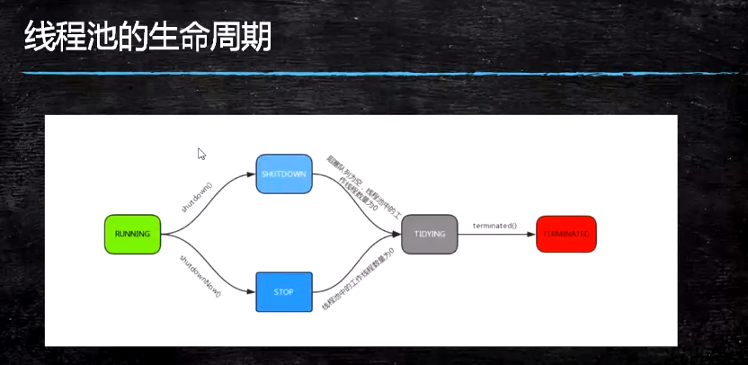

- RUNNING：能接受新提交的任务，并且也能处理阻塞队列中的任务；
- SHUTDOWN：关闭状态，不再接受新提交的任务，但却可以继续处理阻塞队列中已保存的任务；
- STOP：不能接受新任务，也不处理队列中的任务，会中断正在处理任务的线程；
- TIDYING：如果所有的任务都已经终止了，workerCount（有效线程数）为0，线程池进入该状态后会调用 terminated() 方法进入TERMINATED状态；
- TERMINATED：在 terminated()方法执行完后进入该状态，默认terminated()中什么也没有做；

#### 3.2 线程池的创建

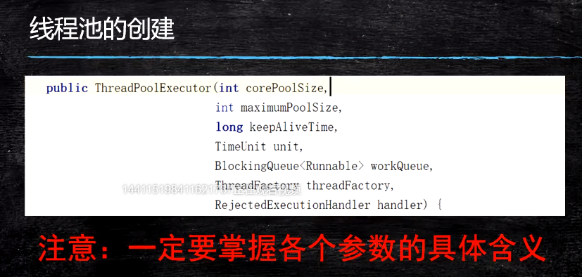

- corePoolSize：核心线程池的大小（公交车上的座位个数）；
- maxmumPoolSize：线程池能创建线程的最大个数（高峰期公交车实际载人数，当线程数在两者之间时，可以创建新的线程）；
- keepAliveTime：空闲线程存活时间（撤掉公交车上临时新增加的座位所需要的时间）；
- TimeUnit unit：时间单位，为keepAliveTime指定时间单位；
- BlockingQueue<Runnable> workQueue：阻塞队列，用于保存任务的阻塞队列；
  - ArrayBlockingQueue
    - 基于数组的阻塞队列实现，在ArrayBlockingQueue内部，维护了一个定长数组，以便缓存队列中的数据对象，这是一个常用的阻塞队列，除了一个定长数组外，ArrayBlockingQueue内部还保留着两个整形变量，分别标识着队列的头部和尾部在数组中的位置；
    - ArrayBlockingQueue在生产者放入数据和消费者获取数据，都是共用同一个锁对象，由此也意味着两者无法真正并行运行，这点尤其不同于LinkedBlockingQueue；按照实现原理分析，ArrayBlockingQueue完全可以采用分离锁，从而实现生产者和消费者操作的完全并行运行，Doug Lea之所以没这样做，也许是因为ArrayBlockingQueue的数据写入和获取操作已经足够轻巧，以至于引入独立的锁机制，除了给代码带来额外的复杂性外，其在性能上完全占不到任何便宜。ArrayBlockingQueue和LinkedBlockingQueue间还有一个明显的不同之处在于，前者再插入或删除元素时不会产生或销毁任何额外的对象实例，而后者则会生成一个额外的Node对象，这在长时间内需要高效并发地处理大批量数据的系统中，其对于GC的影响还是存在一定的区别，而在创建 ArrayBlockingQueue 时，我们还可以控制对象的内部锁是否采用公平锁，默认采用非公平锁；
  - LinkedBlockingQueue
    - 基于链表的阻塞队列，同ArrayListBlockingQueue类似，其内部也维持着一个数据缓冲队列（该对列由一个链表构成），当生产者往队列中放入一个数据时，队列会从生产者手中获取数据，并缓存在队列内部，而生产者立即返回；只有当队列缓冲区达到最大值缓存容量时（LinkedBlockingQueue可以通过构造函数指定该值），才会阻塞生产者队列，直到消费者从队列中消费掉一份数据，生产者线程会被唤醒，反之对于消费者这端的处理也基于同样的原理。而 LinkedBlockingQueue 之所以能够高效的处理并发数据，还因为其对于生产者端和消费者端分别采用了独立的锁来控制数据同步，这也意味着在高并发的情况下生产者和消费者可以并行地操作队列中的数据，以此来提高整个队列的并发性能；
  - DelayQueue
    - DelayQueue 中的元素只有当其指定的延迟时间到了，才能够从队列中获取到该元素。DelayQueue是一个没有大小限制的队列，因此往队列中插入数据的操作（生产者）永远不会被阻塞，而只有获取数据的操作（消费者）才会被阻塞。
    - 使用场景：
      - DelayQueue 使用场景较少，但都相当巧妙，常见的例子比如使用一个 DelayQueue 来管理一个超时未响应的连接队列。
  - PriorityBlockingQueue
    - 基于优先级的阻塞队列（优先级的判断通过构造函数传入的Compator对象来决定），但需要注意的是 PriorityBlockingQueue 并不会阻塞数据生产者，而只会在没有可消费的数据时，阻塞数据的消费者。因此使用的时候要特别注意，生产者生产数据的速度绝对不能快于消费者消费数据的速度，否则时间一长，会最终耗尽所有的可用堆内存空间。在实现 PriorityBlockingQueue 时，内部控制线程同步的锁采用的是公平锁。
  - SynchronousQueue
    - 一种无缓冲的等待队列，类似于无中介的直接交易，有点像原始社会中的生产者和消费者，生产者拿着产品去集市销售给产品的最终消费者，而消费者必须亲自去集市找到所要商品的直接生产者，如果一方没有找到合适的目标，那么对不起，大家都在集市等待，相对于有缓冲的 BlockingQueue 来说，少了一个中间经销商的环节（缓冲区），如果有经销商，生产者直接把产品批发给经销商，而无需在意经销商最终会将这些产品卖给哪些消费者，由于经销商可以库存一部分商品，因此相对于直接交易模式，总体来说采用中间经销商的模式会吞吐量高一些（可以批量买卖），但另一方面，又因为经销商的引入，使得产品从生产者到消费者中间增加了额外的交易环节，单个产品的及时响应性能可能会降低。
    - 声明一个SynchronousQueue有两种不同的方式，它们之间有着不太一样的行为，公平模式和非公平模式的区别：
      - 公平模式：SynchronousQueue会采用公平锁，并配合一个FIFO队列来阻塞多余的生产者和消费者，从而体现整体的公平策略；
      - 非公平模式（SynchronousQueue默认）：SynchronousQueue采用非公平锁，同时配合一个LIFO队列来管理多余的生产者和消费者，而后一种模式，如果生产者和消费者的处理速度有差距，则很容易出现饥渴的情况，即可能有某些生产者或者是消费者的数据永远都得不到处理。
- ThreadFactory threadFactory：创建线程的工程类；
- RejectedExecutionHandler handler：饱和策略（拒绝策略）；
  - ThreadPoolExecutor.AbortPolicy：丢弃任务并抛出 RejectExecutionException 异常；
  - ThreadPoolExecutor.DiscardPolicy：也是丢弃任务，但是不抛出异常；
  - ThreadPoolExecutor.DiscardOldestPolicy：丢弃队列最前面的任务，然后重新尝试执行任务（重复此过程）；
  - ThreadPoolExecutor.CallerRunsPolicy：由调用线程处理该任务；

> 代码案例

- ArrayBlockingQueue
  - Producer

  ```java
  package com.lele.blockingqueue.arrayblockingqueue;

  import java.util.concurrent.BlockingQueue;

  /**
   * @author: lele
   * @date: 2021/7/18 9:53
   * @description:
   */
  public class Producer implements Runnable {

      private BlockingQueue<Integer> blockingQueue;
      private static int element = 0;

      public Producer(BlockingQueue<Integer> blockingQueue) {
          this.blockingQueue = blockingQueue;
      }

      @Override
      public void run() {

          try {
              while (element < 20) {
                  System.out.println("将要放进去的元素是：" + element);
                  blockingQueue.put(element++);
              }
          } catch (InterruptedException e) {
              System.out.println("生产者在等待空闲的时候被打断了！");
              e.printStackTrace();
          }
          System.out.println("生产者已经终止了生产过程！");
      }
  }
  ```

  - Consumer

  ```java
  package com.lele.blockingqueue.arrayblockingqueue;

  import java.util.concurrent.BlockingQueue;

  /**
   * @author: lele
   * @date: 2021/7/18 9:56
   * @description:
   */
  public class Consumer implements Runnable {

      private BlockingQueue<Integer> blockingQueue;

      public Consumer(BlockingQueue<Integer> blockingQueue) {
          this.blockingQueue = blockingQueue;
      }

      @Override
      public void run() {
          try {
              while (true) {
                  System.out.println("取出来的元素是：" + blockingQueue.take());
              }
          } catch (InterruptedException e) {
              System.out.println("消费者在等待新产品的时候被打断了！");
              e.printStackTrace();
          }
      }
  }
  ```

  - MainClass

  ```java
  package com.lele.blockingqueue.arrayblockingqueue;

  import java.util.concurrent.ArrayBlockingQueue;
  import java.util.concurrent.BlockingQueue;

  /**
   * @author: lele
   * @date: 2021/7/18 12:06
   * @description:
   */
  public class MainClass {

      public static void main(String[] args) {

          BlockingQueue<Integer> blockingQueue = new ArrayBlockingQueue<Integer>(3,true);
          Producer producer = new Producer(blockingQueue);
          Consumer consumer = new Consumer(blockingQueue);

          new Thread(producer).start();
          new Thread(consumer).start();
      }
  }
  ```

- DelayQueue
  - DelayQueueTest

  ```java
  package com.lele.blockingqueue.delayqueue;

  import java.util.concurrent.DelayQueue;
  import java.util.concurrent.Delayed;
  import java.util.concurrent.TimeUnit;

  /**
   * @author: lele
   * @date: 2021/7/18 12:43
   * @description:
   */
  public class DelayQueueTest {

      public static void main(String[] args) {
          DelayQueue<DelayTask> delayQueue = new DelayQueue();
          delayQueue.add(new DelayTask("1", 1000L, TimeUnit.MILLISECONDS));
          delayQueue.add(new DelayTask("2", 2000L, TimeUnit.MILLISECONDS));
          delayQueue.add(new DelayTask("3", 3000L, TimeUnit.MILLISECONDS));

          System.out.println("queue put done");

          while (!delayQueue.isEmpty()) {
              try {
                  DelayTask task = delayQueue.take();
                  System.out.print(task.name + ":" + System.currentTimeMillis());
              } catch (InterruptedException e) {
                  e.printStackTrace();
              }
              System.out.println();
          }
      }
  }

  class DelayTask implements Delayed {

      public String name;
      public Long delayTime;
      public TimeUnit delayTimeUnit;
      public Long executeTime; //ms

      public DelayTask(String name, Long delayTime, TimeUnit delayTimeUnit) {
          this.name = name;
          this.delayTime = delayTime;
          this.delayTimeUnit = delayTimeUnit;
          this.executeTime = System.currentTimeMillis() + delayTimeUnit.toMillis(delayTime);
      }

      @Override
      public long getDelay(TimeUnit unit) {
          return unit.convert(executeTime - System.currentTimeMillis(), TimeUnit.MILLISECONDS);
      }

      @Override
      public int compareTo(Delayed o) {
          if (this.getDelay(TimeUnit.MILLISECONDS) > o.getDelay(TimeUnit.MILLISECONDS)) {
              return 1;
          } else if (this.getDelay(TimeUnit.MILLISECONDS) < o.getDelay(TimeUnit.MILLISECONDS)) {
              return -1;
          }
          return 0;
      }
  }
  ```

- PriorityBlockingQueue
  - Task

  ```java
  package com.lele.blockingqueue.priorityqueue;

  /**
   * @author: lele
   * @date: 2021/7/21 7:03
   * @description:
   */
  public class Task implements Comparable<Task> {

      private int id;
      private String name;

      public int getId() {
          return id;
      }

      public void setId(int id) {
          this.id = id;
      }

      public String getName() {
          return name;
      }

      public void setName(String name) {
          this.name = name;
      }

      @Override
      public String toString() {
          return this.id + "," + this.name;
      }

      @Override
      public int compareTo(Task o) {
          return 0;
      }
  }
  ```

- UsePriorityBlockingQueue

  ```java
  package com.lele.blockingqueue.priorityqueue;

  import java.util.concurrent.PriorityBlockingQueue;

  /**
   * @author: lele
   * @date: 2021/7/21 7:07
   * @description:
   */
  public class UsePriorityBlockingQueue {

      public static void main(String[] args) throws Exception {
          PriorityBlockingQueue<Task> q = new PriorityBlockingQueue<>();

          Task t1 = new Task();
          t1.setId(3);
          t1.setName("id为3");

          Task t2 = new Task();
          t2.setId(4);
          t2.setName("id为4");

          Task t3 = new Task();
          t3.setId(1);
          t3.setName("id为1");

          q.add(t1);
          q.add(t2);
          q.add(t3);

          System.out.println("容器：" + q);
          System.out.println(q.take().getId());
          System.out.println("容器：" + q);
      }
  }
  ```


- SynchronousQueue

  ---
  ```java
  package com.lele.blockingqueue.synchronousqueue;

  import java.util.Random;
  import java.util.UUID;
  import java.util.concurrent.BlockingQueue;
  import java.util.concurrent.SynchronousQueue;

  /**
   * @author: lele
   * @date: 2021/7/21 7:20
   * @description:
   */
  public class SynchronousQueueExample {
      static class SynchronousQueueProducer implements Runnable {
          protected BlockingQueue<String> blockingQueue;
          final Random random = new Random();
          public SynchronousQueueProducer(BlockingQueue<String> queue) {
              this.blockingQueue = queue;
          }
          @Override
          public void run() {
              while (true) {
                  try {
                      String data = UUID.randomUUID().toString();
                      System.out.println("Put: " + data);
                      blockingQueue.put(data);
                      Thread.sleep(1000);
                  } catch (InterruptedException e) {
                      e.printStackTrace();
                  }
              }
          }
      }
      static class SynchronousQueueConsumer implements Runnable {
          protected BlockingQueue<String> blockingQueue;
          public SynchronousQueueConsumer(BlockingQueue<String> queue) {
              this.blockingQueue = queue;
          }
          @Override
          public void run() {
              while (true) {
                  try {
                      String data = blockingQueue.take();
                      System.out.println(Thread.currentThread().getName()
                              + " take(): " + data);
                      Thread.sleep(2000);
                  } catch (InterruptedException e) {
                      e.printStackTrace();
                  }
              }
          }

      }
      public static void main(String[] args) {
          final BlockingQueue<String> synchronousQueue = new SynchronousQueue<String>();

          SynchronousQueueProducer queueProducer = new SynchronousQueueProducer(
                  synchronousQueue);
          new Thread(queueProducer).start();

          SynchronousQueueConsumer queueConsumer1 = new SynchronousQueueConsumer(
                  synchronousQueue);
          new Thread(queueConsumer1).start();

          SynchronousQueueConsumer queueConsumer2 = new SynchronousQueueConsumer(
                  synchronousQueue);
          new Thread(queueConsumer2).start();
      }
  }
  ```
  ---

**ArrayBlockingQueue和LinkedBlockingQueue的区别**
- 队列中锁的实现不同
  - ArrayBlockingQueue实现的队列中的锁是没有分离的，即生产和消费用的是同一个锁；
  - LinkedBlockingQueue实现的队列中的锁是分离的，即生产用的是putlock，消费是takelock；
- 队列大小初始化方式不同
  - ArrayBlockingQueue实现的队列中必须指定队列大小；
  - LinkedBlockingQueue实现的队列中可以不指定队列的大小，但是默认是 Integer.MAX_VALUE；

**execute方法执行逻辑**

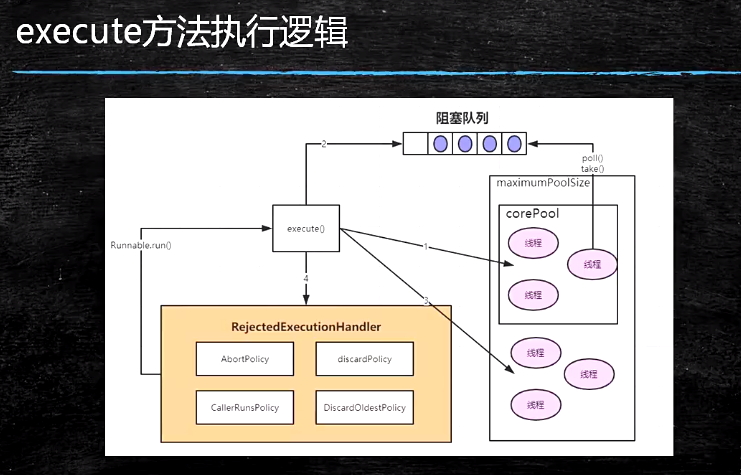

- 如果当前运行的线程少于corePoolSize，则会创建新的线程来执行新的任务；
- 如果运行的线程个数等于或者大于corePoolSize，则会将提交的任务存放到阻塞队列workQueue中；
- 如果当前workQueue队列已满的话，则会创建新的线程来执行任务；
- 如果线程个数已经超过了maximumPoolSize，则会使用饱和策略RejectedExecutionHandler来进行处理；

**Executor和Submit**
- submit是基方法Executor.execute(Runnable)的延伸，通过创建并返回一个Future类对象可用于取消执行和/或等待完成；

  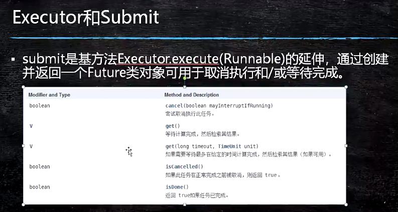

**线程池的关闭**
- 关闭线程池，可以通过shutdown和shutdownNow两个方法；
- 原理：遍历线程池中的所有线程，然后依次中断；
- shutdownNow首先将线程池的状态设置为STOP，然后尝试停止所有的正在执行和未执行任务的线程，并返回等待执行任务的列表；
- shutdown只是将线程池的状态设置为SHUTDOWN状态，然后中断所有没有正在执行任务的线程；

===========================基础部分=============================
