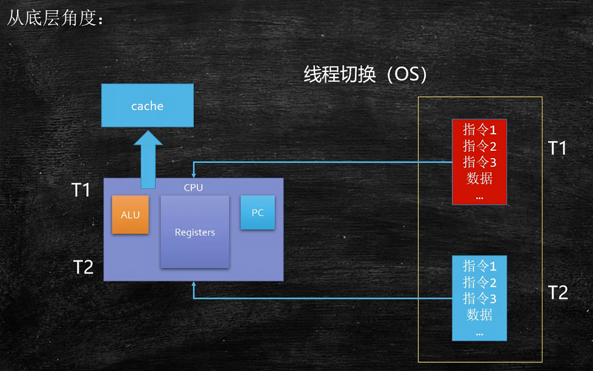
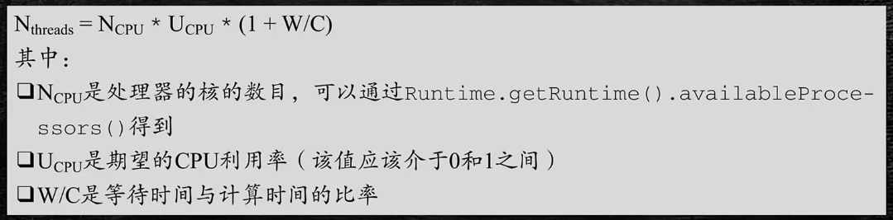

## 多线程与高并发（一）：线程基础知识

### 1. 线程的历史——一部对于CPU性能压榨的历史

#### 1.1 单进程人工切换
- 纸带机

#### 1.2 多进程批处理
- 多任务批量执行

#### 1.3 多进程并行处理
- 把程序写在不同的内存位置上来回切换

#### 1.4 多线程
- 一个程序内部不同任务的来回切换
- selector - epoll

#### 1.5 纤程/协程
- 绿色线程，用户管理的（而不是OS管理的）线程


### 2. 什么是进程、线程、纤程/协程？

#### 2.1 什么是进程？

  

- 进程：资源分配的基本单位；

#### 2.2 什么是线程？
- 线程：调度执行的基本单位；
  - 通俗的角度理解
    - 一个程序的里面的不同的执行路径即为一个线程；
    - 单线程（主线程）：程序中没有同时运行的路径；
    - 多线程：程序中有多个不同的执行路径；

#### 2.3 线程切换

  

- 1.单核CPU设定多线程是否有意义？
  - 有意义，可以充分利用CPU资源；
  - CPU密集型线程：线程大量时间在做计算；
  - IO密集型：线程大量时间在等待输入输出内容；
- 2.工作线程数是不是设置的越大越好？
  - 不是，线程切换是需要消耗资源；

  ```java
  package com.lele.juc.c_000_threadbasic;

  import java.text.DecimalFormat;
  import java.util.Random;
  import java.util.concurrent.CountDownLatch;

  /**
   * @author: lele
   * @date: 2021/11/14 9:44
   * @description:
   */
  public class T01_MultiVSSingle_ContextSwitch {

      private static double[] nums = new double[1_0000_0000];
      private static Random r = new Random();
      private static DecimalFormat df = new DecimalFormat("0.00");
      static {
          for (int i = 0; i < nums.length; i++) {
              nums[i] = r.nextDouble();
          }
      }

      /**
       * 单线程
       */
      private static void m1() {
          long start = System.currentTimeMillis();

          double result = 0.0;
          for (int i = 0; i < nums.length; i++) {
                result += nums[i];
          }

          long end = System.currentTimeMillis();

          System.out.println("m1: " + (end - start) +" result = " + df.format(result));
      }


      /**
       * 双线程
       */
      static double result1 = 0.0, result2 = 0.0, result = 0.0;

      private static void m2() throws Exception {

          Thread t1 = new Thread(() -> {
              for (int i = 0; i < nums.length / 2; i++) {
                  result1 += nums[i];
              }
          });

          Thread t2 = new Thread(() -> {
              for (int i = nums.length / 2; i < nums.length; i++) {
                  result2 += nums[i];
              }
          });

          long start = System.currentTimeMillis();
          t1.start();
          t2.start();
          t1.join();
          t2.join();

          result = result1 + result2;

          long end = System.currentTimeMillis();

          System.out.println("m2: " + (end - start) + " result = " + df.format(result));
      }


      /**
       * 多线程
       * @throws Exception
       */
      private static void m3() throws Exception {
          final int threadCount = 16;
          Thread[] threads = new Thread[threadCount];
          double[] results = new double[threadCount];
          final int segmentCount = nums.length / threadCount;
          CountDownLatch latch = new CountDownLatch(threadCount);

          for (int i = 0; i < threadCount; i++) {
              int m = i;

              threads[i] = new Thread(() -> {
                  for (int j = m * segmentCount;j < (m+1) * segmentCount && j < nums.length; j++) {
                      results[m] += nums[j];
                  }
              });

              latch.countDown();
          }

          double resultM3 = 0.0;

          long start = System.currentTimeMillis();
          for (Thread t : threads) {
              t.start();
          }

          latch.await();
          for (int i = 0; i < results.length; i++) {
              resultM3 += results[i];
          }

          long end = System.currentTimeMillis();

          System.out.println("m3 " + (end - start) + " result = " + df.format(result));
      }

      public static void main(String[] args) throws Exception {
          m1();
          m2();
          m3();
      }
  }
  ```

- 3.工作线程数（线程池中线程数量）设多少合适？
  - 根据CPU的核数来设置线程数；
  - 考虑其他资源也会占用CPU核数（OS等）；
  - 处于安全的角度，需给CPU资源留有余量，共其他线程利用；

  

    - 图中公式中的 W/C 可用分析工具获得；
      - Profiler（性能分析工具）：开发测试用；
      - arthas：生产环境
